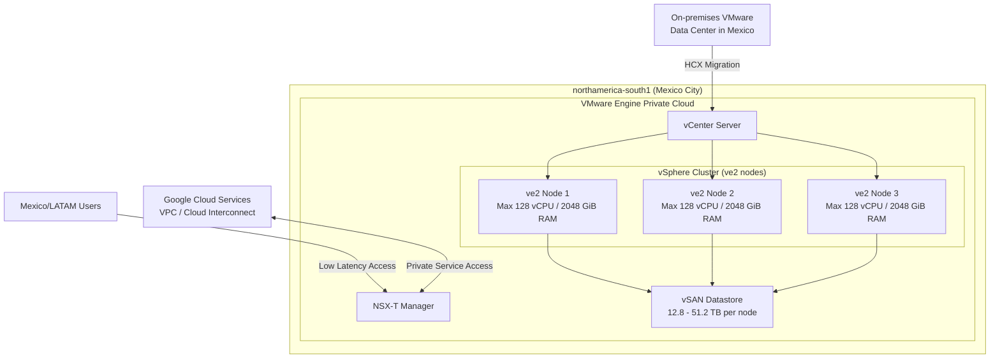

# Google Cloud VMware Engine: ve2 ノードタイプが northamerica-south1 (メキシコシティ) リージョンで利用可能に

**リリース日**: 2026-06-11

**サービス**: Google Cloud VMware Engine

**機能**: ve2 ノードタイプのメキシコシティリージョン (northamerica-south1) への展開

**ステータス**: Announcement (リージョン拡大)

📊 [このアップデートのインフォグラフィックを見る](https://takech9203.github.io/google-cloud-news-summary/20260611-vmware-engine-ve2-northamerica-south1.html)

## 概要

Google Cloud VMware Engine の第2世代ノードタイプである ve2 が、メキシコシティ (northamerica-south1) リージョンで新たに利用可能になりました。これにより、ラテンアメリカおよび北米南部のユーザーは、より低レイテンシで VMware ワークロードを実行できるようになります。

ve2 ノードタイプは、従来の ve1 と比較して大幅に強化されたコンピュート・メモリ・ストレージリソースを提供します。最大 128 vCPU、2048 GiB メモリ、51.2 TB ストレージを備えたノードにより、大規模な VMware ワークロードの移行と実行が可能です。

今回のリージョン拡大は、Google Cloud VMware Engine のグローバル展開戦略の一環であり、メキシコおよびラテンアメリカ北部地域の企業が、データレジデンシー要件を満たしながら VMware 環境をクラウドに移行するニーズに応えるものです。

**アップデート前の課題**

- メキシコおよびラテンアメリカ北部のユーザーは、VMware Engine ve2 ノードを利用するために米国リージョン (us-central1, us-east4, us-south1) やカナダリージョン (northamerica-northeast1, northamerica-northeast2) を使用する必要があった
- メキシコ国内のデータレジデンシー要件がある企業は、VMware Engine ve2 ノードをクラウドで利用することが困難だった
- メキシコのエンドユーザーに対するレイテンシが、米国リージョンを使用することで高くなる傾向があった

**アップデート後の改善**

- メキシコシティリージョン (northamerica-south1) で ve2 ノードタイプが直接利用可能になり、メキシコ国内でのデータ処理が実現
- Standard プライベートクラウドおよび Single-Node プライベートクラウドの構成に対応
- メキシコおよびラテンアメリカ北部地域のユーザーに対する低レイテンシアクセスが可能に

## アーキテクチャ図



この図は、northamerica-south1 リージョンにおける VMware Engine プライベートクラウドの構成を示しています。ve2 ノードで構成される vSphere クラスタが vSAN データストアと連携し、オンプレミス環境からの HCX マイグレーションや Google Cloud サービスとの接続が可能です。

## サービスアップデートの詳細

### 主要機能

1. **ve2 ノードタイプの全バリエーション対応**
   - HCI (ハイパーコンバージドインフラストラクチャ) ノードタイプ: ve2-small, ve2-standard, ve2-large, ve2-mega
   - Storage-only ノードタイプ: ve2-small-so, ve2-standard-so, ve2-large-so, ve2-mega-so
   - vCPU 構成の柔軟性: 64, 80, 96, 112, 128 vCPU から選択可能

2. **Standard および Single-Node プライベートクラウド対応**
   - Standard プライベートクラウド: 最小 3 ノード、最大 96 ノード
   - Single-Node プライベートクラウド: 開発・テスト用途に最適
   - 1 クラスタあたり最大 32 ノードまでスケール可能

3. **vCPU カスタマイズ機能**
   - ノードあたりの vCPU 数を 64, 80, 96, 112, 128 から選択
   - ライセンスコストの最適化が可能
   - ワークロード要件に合わせた柔軟な構成

## 技術仕様

### ve2 ノードタイプ一覧

| ノードタイプ | vCPU/ノード | メモリ/ノード (GiB) | ストレージ/ノード (TB) |
|------|------|------|------|
| ve2-mega | 64-128 | 2048 | 51.2 |
| ve2-large | 64-128 | 2048 | 38.4 |
| ve2-standard | 64-128 | 2048 | 25.5 |
| ve2-small | 64-128 | 2048 | 12.8 |
| ve2-mega-so | - | - | 51.2 |
| ve2-large-so | - | - | 38.4 |
| ve2-standard-so | - | - | 25.5 |
| ve2-small-so | - | - | 12.8 |

### northamerica-south1 リージョン仕様

| 項目 | 詳細 |
|------|------|
| リージョン名 | northamerica-south1 |
| ロケーション | メキシコシティ、メキシコ |
| 利用可能ゾーン | northamerica-south1-a |
| 対応ノードタイプ | ve2 |
| プライベートクラウドタイプ | Standard, Single-Node |
| Stretched クラスタ | 非対応 (単一ゾーン) |

## 設定方法

### 前提条件

1. Google Cloud プロジェクトで VMware Engine API が有効化されていること
2. 適切な IAM ロール (`roles/vmwareengine.vmwareengineAdmin`) が付与されていること
3. VMware Engine のクォータがプロジェクトに割り当てられていること

### 手順

#### ステップ 1: プライベートクラウドの作成

```bash
# gcloud CLI を使用してプライベートクラウドを作成
gcloud vmware private-clouds create my-private-cloud \
    --location=northamerica-south1-a \
    --cluster=my-cluster \
    --node-type-config=type=ve2-standard-128,count=3 \
    --management-range=192.168.0.0/22 \
    --vmware-engine-network=my-ven
```

プライベートクラウドの作成には数時間かかる場合があります。

#### ステップ 2: クラスタの確認

```bash
# クラスタの状態を確認
gcloud vmware private-clouds clusters list \
    --private-cloud=my-private-cloud \
    --location=northamerica-south1-a
```

作成が完了すると、vCenter と NSX-T Manager にアクセス可能になります。

#### ステップ 3: REST API を使用する場合

```bash
# REST API でプライベートクラウドを作成
curl -X POST \
  "https://vmwareengine.googleapis.com/v1/projects/PROJECT_ID/locations/northamerica-south1-a/privateClouds?privateCloudId=my-private-cloud" \
  -H "Authorization: Bearer $(gcloud auth print-access-token)" \
  -H "Content-Type: application/json" \
  -d '{
    "networkConfig": {
      "managementCidr": "192.168.0.0/22",
      "vmwareEngineNetwork": "projects/PROJECT_ID/locations/northamerica-south1/vmwareEngineNetworks/my-ven"
    },
    "managementCluster": {
      "clusterId": "my-cluster",
      "nodeTypeConfigs": {
        "ve2-standard-128": {
          "nodeCount": 3
        }
      }
    }
  }'
```

## メリット

### ビジネス面

- **データレジデンシーの遵守**: メキシコ国内のデータ保護規制 (LFPDPPP) に準拠した形で VMware ワークロードをクラウド化可能
- **ラテンアメリカ市場へのアクセス**: メキシコを拠点とするビジネスがクラウドネイティブなインフラを活用し、ラテンアメリカ市場全体にサービスを展開可能
- **コスト最適化**: オンプレミス VMware インフラの維持管理コストを削減し、従量課金モデルへ移行可能

### 技術面

- **低レイテンシ**: メキシコおよびラテンアメリカ北部のユーザーに対して、米国リージョンと比較して大幅にレイテンシを削減
- **高いリソース容量**: ve2 ノードにより最大 128 vCPU、2 TiB メモリ、51.2 TB ストレージを使用可能で、大規模ワークロードに対応
- **vCPU カスタマイズ**: ノードあたりの vCPU 数を調整でき、VMware ライセンスコストの最適化が可能

## デメリット・制約事項

### 制限事項

- Stretched クラスタ (マルチゾーン HA) は northamerica-south1 では非対応 (単一ゾーンのみ)
- ve1 ノードタイプは northamerica-south1 では利用不可 (ve2 のみ)
- ve1 と ve2 の混在プライベートクラウドは非対応 (メキシコシティリージョン)
- 単一ゾーン構成のため、ゾーン障害時の自動フェイルオーバーには別リージョンでの DR 構成が必要

### 考慮すべき点

- ve1 から ve2 への移行を検討している場合、HCX を使用したワークロードマイグレーションが必要
- 3年間 CUD の終了日は 2028年10月15日に設定されているため、長期契約の計画に注意が必要 (2026年5月31日以降に購入した CUD に適用)
- Single-Node プライベートクラウドは SLA 対象外であり、本番ワークロードには Standard 構成 (最小 3 ノード) を推奨

## ユースケース

### ユースケース 1: メキシコ国内のオンプレミス VMware 移行

**シナリオ**: メキシコ国内に VMware vSphere 環境を持つ企業が、ハードウェア更改のタイミングでクラウド移行を検討している。データレジデンシー要件により、データはメキシコ国内に保持する必要がある。

**実装例**:
```bash
# Step 1: VMware Engine ネットワークの作成
gcloud vmware networks create mexico-ven \
    --location=northamerica-south1 \
    --type=STANDARD

# Step 2: プライベートクラウドの作成 (ve2-standard-96 x 3 nodes)
gcloud vmware private-clouds create mexico-pc \
    --location=northamerica-south1-a \
    --cluster=prod-cluster \
    --node-type-config=type=ve2-standard-96,count=3 \
    --management-range=192.168.0.0/22 \
    --vmware-engine-network=mexico-ven
```

**効果**: メキシコ国内でのデータレジデンシー要件を満たしつつ、オンプレミス VMware 環境からのシームレスな移行を実現。ハードウェア維持管理からの解放と、オンデマンドなスケーリングが可能に。

### ユースケース 2: ラテンアメリカ向けディザスタリカバリ (DR)

**シナリオ**: 米国にプライマリの VMware Engine 環境を持つ企業が、ラテンアメリカ市場向けのアプリケーションに対して DR サイトをメキシコシティに構築したい。

**効果**: メキシコシティリージョンを DR サイトとして活用することで、米国リージョン障害時にもラテンアメリカのユーザーに対して低レイテンシでのサービス継続が可能。VMware SRM (Site Recovery Manager) との連携により、RPO/RTO の最小化を実現。

### ユースケース 3: 開発・テスト環境の分離

**シナリオ**: ラテンアメリカ地域に開発チームを持つ企業が、本番環境とは別に開発・テスト用の VMware 環境をメキシコに配置したい。

**効果**: Single-Node プライベートクラウドを活用することで、低コストで開発・テスト環境を構築。開発者に対する低レイテンシアクセスを確保しつつ、本番環境との分離を実現。

## 料金

VMware Engine の料金は、ノードタイプと利用形態 (オンデマンド / CUD) によって異なります。

### 料金モデル

| 利用形態 | 説明 |
|--------|-----------------|
| オンデマンド | 時間単位の従量課金。コミットメントなし |
| 1年間 CUD (前払い) | 1年間のコミットメントで割引適用 |
| 1年間 CUD (後払い) | 1年間のコミットメントで割引適用 (月払い) |
| 3年間 CUD (後払い) | 3年間のコミットメントで最大割引 (2028年10月15日終了) |

**注意**: 2026年5月31日以降に購入した3年間 CUD は、実際の期間に関わらず2028年10月15日に終了します。3年間前払い CUD は現在利用不可です。

具体的な料金は Google Cloud の料金計算ツールまたは営業担当にお問い合わせください。

## 利用可能リージョン

northamerica-south1 は VMware Engine ve2 が利用可能な28番目のリージョンです。北米・南米地域の対応状況は以下の通りです:

| リージョン | ゾーン | ノードタイプ | 備考 |
|------|------|------|------|
| northamerica-northeast1 (Montreal) | northamerica-northeast1-a | ve1, ve2 | 混在対応 |
| northamerica-northeast2 (Toronto) | northamerica-northeast2-a | ve1, ve2 | - |
| **northamerica-south1 (Mexico City)** | **northamerica-south1-a** | **ve2** | **今回追加** |
| us-central1 (Iowa) | us-central1-a | ve1, ve2 | 混在対応 |
| us-east4 (North Virginia) | us-east4-a, us-east4-b | ve1, ve2 | 混在対応 |
| us-south1 (Dallas) | us-south1-b | ve1, ve2 | 混在対応 |
| us-west2 (Los Angeles) | us-west2-a, us-west2-b | ve1, ve2 | - |
| southamerica-east1 (Sao Paulo) | southamerica-east1-a, southamerica-east1-c | ve1, ve2 | 混在対応、Stretched |
| southamerica-west1 (Santiago) | southamerica-west1-a, southamerica-west1-b | ve1, ve2 | 混在対応、Stretched |

## 関連サービス・機能

- **VMware HCX**: オンプレミスからクラウドへの VMware ワークロードのライブマイグレーションを提供。northamerica-south1 へのワークロード移行に使用
- **Cloud Interconnect**: オンプレミスネットワークと VMware Engine プライベートクラウド間の専用接続を提供
- **VPC Service Controls**: VMware Engine のデータ流出防止と不正アクセス防止のための追加セキュリティレイヤー
- **Committed Use Discounts (CUD)**: 長期利用によるコスト削減。1年間または3年間のコミットメントで割引を適用
- **VMware Engine External NFS Datastores**: Filestore や NetApp Volumes を使用した外部ストレージのマウントによるストレージの独立スケーリング

## 参考リンク

- 📊 [インフォグラフィック](https://takech9203.github.io/google-cloud-news-summary/20260611-vmware-engine-ve2-northamerica-south1.html)
- [公式リリースノート](https://docs.cloud.google.com/release-notes#June_11_2026)
- [VMware Engine ノードタイプ ドキュメント](https://docs.cloud.google.com/vmware-engine/docs/concepts/node-types)
- [VMware Engine リリースノート](https://docs.cloud.google.com/vmware-engine/docs/release-notes)
- [VMware Engine 料金](https://cloud.google.com/vmware-engine/pricing)
- [VMware Engine リージョンとゾーン](https://cloud.google.com/vmware-engine/docs/overview/regions-zones)

## まとめ

Google Cloud VMware Engine ve2 ノードタイプのメキシコシティ (northamerica-south1) リージョンへの展開は、ラテンアメリカ地域における VMware クラウド移行の選択肢を大きく広げるアップデートです。メキシコ国内のデータレジデンシー要件を持つ企業や、ラテンアメリカ市場向けのワークロードを低レイテンシで実行したい企業にとって、重要な選択肢となります。メキシコ国内でオンプレミス VMware 環境を運用している企業は、HCX を活用したクラウド移行の計画を開始することを推奨します。

---

**タグ**: #VMwareEngine #ve2 #northamerica-south1 #MexicoCity #RegionExpansion #Migration #HybridCloud #LATAM
