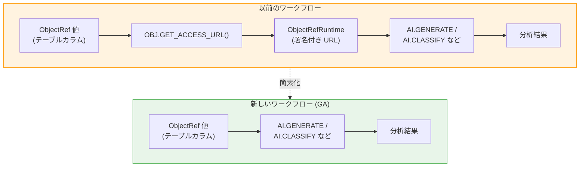

# BigQuery: AI 関数が ObjectRef 値を直接入力として受け付け可能に

**リリース日**: 2026-06-12

**サービス**: BigQuery

**機能**: AI 関数が ObjectRef 値を直接入力として使用可能 (OBJ.GET_ACCESS_URL 関数の呼び出しが不要に)

**ステータス**: Generally Available (GA)

[このアップデートのインフォグラフィックを見る](https://takech9203.github.io/google-cloud-news-summary/20260612-bigquery-ai-functions-objectref.html)

## 概要

BigQuery の AI 関数 (AI.GENERATE、AI.CLASSIFY、AI.IF、AI.SCORE など) が、ObjectRef 値を直接入力として受け付けるようになりました。これまでは Cloud Storage に保存された画像や動画などの非構造化データを AI 関数で分析する際、まず `OBJ.GET_ACCESS_URL` 関数を呼び出して ObjectRefRuntime 値 (署名付き URL を含む) に変換する必要がありましたが、今回の GA リリースにより、ObjectRef 値をそのまま AI 関数の STRUCT プロンプトに渡せるようになりました。

この改善により、マルチモーダルデータ分析のクエリが簡素化され、特に大量の画像や文書を一括処理するユースケースで開発生産性が向上します。ObjectRef は Cloud Storage オブジェクトへの参照情報 (URI、バージョン、authorizer、メタデータ) を格納する STRUCT 型の値であり、BigQuery の標準テーブルに非構造化データの参照を構造化データと共に保存する仕組みです。

**アップデート前の課題**

- AI 関数でマルチモーダルデータを処理するには、ObjectRef 値に対して `OBJ.GET_ACCESS_URL` を呼び出し、ObjectRefRuntime 値に変換する中間ステップが必要だった
- ObjectRefRuntime 値は署名付き URL を含むため、最大 6 時間で有効期限が切れる制約があり、永続化には不向きだった
- クエリの記述が冗長になり、特にネストした関数呼び出し (`OBJ.GET_ACCESS_URL(OBJ.MAKE_REF(...), 'r')`) がコードの可読性を低下させていた
- 署名付き URL の生成処理がクエリの実行オーバーヘッドを増加させていた

**アップデート後の改善**

- ObjectRef 値を AI 関数の STRUCT プロンプトに直接渡せるようになり、`OBJ.GET_ACCESS_URL` の呼び出しが不要になった
- クエリの記述がシンプルになり、可読性とメンテナンス性が向上した
- 署名付き URL 生成の中間ステップが省略されることで、クエリ実行の効率が改善された
- ObjectRef カラムを持つテーブルから、最小限の変換でマルチモーダル AI 分析が可能になった

## アーキテクチャ図



新しいワークフローでは、ObjectRef 値から AI 関数への入力が直接行われ、中間の URL 生成ステップが不要になりました。

## サービスアップデートの詳細

### 主要機能

1. **ObjectRef 値の直接入力サポート**
   - AI 関数の STRUCT プロンプト内で ObjectRef 値または ARRAY<ObjectRef> を直接指定可能
   - BigQuery が内部的にオブジェクトアクセスを処理し、ユーザーは署名付き URL の管理が不要
   - Direct Access (ユーザー自身の認証情報) と Delegated Access (Cloud Resource Connection 経由) の両方に対応

2. **対応する AI 関数**
   - AI.GENERATE: テキスト・構造化データ生成
   - AI.GENERATE_TEXT: テーブル値関数版テキスト生成
   - AI.GENERATE_TABLE: カスタム出力スキーマ対応
   - AI.CLASSIFY: カテゴリ分類
   - AI.IF: 自然言語条件によるフィルタリング
   - AI.SCORE: スコアリング・ランキング
   - AI.GENERATE_BOOL / AI.GENERATE_DOUBLE / AI.GENERATE_INT: スカラー値生成
   - AI.EMBED / AI.GENERATE_EMBEDDING: エンベディング生成

3. **後方互換性**
   - 従来の `OBJ.GET_ACCESS_URL` を使用したクエリも引き続き動作
   - 既存のクエリを段階的に移行可能

## 技術仕様

### ObjectRef スキーマ

| フィールド | 型 | モード | 説明 |
|-----------|-----|--------|------|
| uri | STRING | REQUIRED | Cloud Storage オブジェクトの URI (例: `gs://bucket/image.jpg`) |
| version | STRING | NULLABLE | オブジェクトのジェネレーション |
| authorizer | STRING | NULLABLE | Delegated Access 用の BigQuery Connection ID (NULL の場合は Direct Access) |
| details | JSON | NULLABLE | オブジェクトメタデータ (content_type, md5_hash, size, updated) |

### クエリ構文の比較

```sql
-- 以前の構文 (OBJ.GET_ACCESS_URL が必要)
SELECT AI.GENERATE(
  ("Describe this image:",
   OBJ.GET_ACCESS_URL(OBJ.MAKE_REF("gs://my-bucket/image.jpg", "us.connection1"), 'r')),
  connection_id => "us.connection2"
);

-- 新しい構文 (ObjectRef を直接入力)
SELECT AI.GENERATE(
  ("Describe this image:",
   OBJ.MAKE_REF("gs://my-bucket/image.jpg", "us.connection1")),
  connection_id => "us.connection2"
);

-- テーブルカラムの ObjectRef を直接使用
SELECT AI.GENERATE(
  ("Describe this image:", image_ref),
  connection_id => "us.connection2"
)
FROM my_dataset.products;
```

### アクセス制御

| アクセス方式 | authorizer | 必要な権限 |
|-------------|-----------|-----------|
| Direct Access | NULL (未設定) | ユーザーが Cloud Storage オブジェクトに直接アクセス可能であること |
| Delegated Access | Connection ID を指定 | `bigquery.objectRefs.read` 権限 + Connection の SA に `storage.objects.get` |

## メリット

### ビジネス面

- **開発効率の向上**: クエリ記述が簡素化され、マルチモーダル AI 分析のプロトタイピングと本番実装が高速化
- **学習コストの削減**: ObjectRefRuntime や署名付き URL の概念を理解しなくても、マルチモーダル分析を開始可能
- **運用負荷の軽減**: 署名付き URL の有効期限管理が不要になり、長時間バッチ処理の信頼性が向上

### 技術面

- **クエリの簡素化**: 関数のネストが減少し、コードの可読性とメンテナンス性が向上
- **実行効率**: 署名付き URL 生成の中間ステップが省略されるため、クエリ実行のオーバーヘッドが削減
- **一貫したデータモデル**: ObjectRef 値をテーブルに保存したまま AI 分析に直接利用でき、データパイプラインが簡素化

## デメリット・制約事項

### 制限事項

- 1 つのプロジェクト・リージョンで使用できる Cloud Resource Connection は最大 20 個
- ObjectRef 値から参照できるプロジェクトは、クエリ実行プロジェクト以外に最大 5 プロジェクト
- 動画オブジェクトは入力に最大 1 つまで
- サポートされるファイル形式は Gemini API の mimeType パラメータに準拠

### 考慮すべき点

- Direct Access の場合、クエリ実行プロジェクトと同じプロジェクトの Cloud Storage バケットのみアクセス可能
- 従来の `OBJ.GET_ACCESS_URL` が有用なケース (外部システムへの署名付き URL 共有など) は引き続き存在
- AI 関数の呼び出しごとに Gemini Enterprise Agent Platform の課金が発生する点は変更なし

## ユースケース

### ユースケース 1: 商品画像の一括分類

**シナリオ**: EC サイトの商品テーブルに ObjectRef カラムとして保存されている商品画像を、カテゴリに自動分類する

**実装例**:
```sql
-- ObjectRef カラムを直接 AI.CLASSIFY に渡す
SELECT
  product_id,
  product_name,
  AI.CLASSIFY(
    image_ref,
    ['Electronics', 'Clothing', 'Food', 'Furniture', 'Sports']
  ) AS category
FROM my_dataset.products;
```

**効果**: `OBJ.GET_ACCESS_URL` の呼び出しが不要になり、数千件の商品画像を簡潔なクエリで分類可能

### ユースケース 2: ドキュメント画像からの情報抽出

**シナリオ**: スキャンした請求書画像から構造化データ (金額、日付、取引先) を抽出する

**実装例**:
```sql
SELECT
  invoice_id,
  AI.GENERATE(
    ("Extract the total amount, date, and vendor from this invoice:", invoice_image_ref),
    connection_id => "us.my_connection",
    output_schema => STRUCT<total_amount FLOAT64, invoice_date DATE, vendor STRING>()
  ) AS extracted_data
FROM my_dataset.invoices;
```

**効果**: ドキュメント処理パイプラインの構築が簡素化され、ETL ステップの削減が可能

### ユースケース 3: マルチモーダルコンテンツのスコアリング

**シナリオ**: ユーザー投稿画像の品質やポリシー準拠度をスコアリングして、モデレーションに活用する

**実装例**:
```sql
SELECT
  post_id,
  AI.SCORE(
    ("Rate how appropriate this image is for a family-friendly platform:", image_ref)
  ) AS appropriateness_score
FROM my_dataset.user_posts
ORDER BY appropriateness_score ASC
LIMIT 100;
```

**効果**: コンテンツモデレーションの効率化と、問題のあるコンテンツの優先的なレビューが可能

## 料金

BigQuery AI 関数の使用に関する料金は以下のコンポーネントで構成されます:

| 料金項目 | 説明 |
|---------|------|
| BigQuery コンピュート | クエリ実行に対する標準的な BigQuery 料金 |
| Gemini Enterprise Agent Platform | AI 関数が Gemini モデルを呼び出すたびに発生するトークンベースの課金 |
| Cloud Storage | ObjectRef で参照されるオブジェクトの保存料金 |

今回のアップデートによる追加の料金変更はありません。`OBJ.GET_ACCESS_URL` を省略することで、署名付き URL 生成に伴う処理コストが軽減される可能性があります。

詳細は以下を参照:
- [BigQuery pricing](https://cloud.google.com/bigquery/pricing)
- [Agent Platform pricing](https://cloud.google.com/vertex-ai/generative-ai/pricing)

## 利用可能リージョン

AI 関数は Gemini モデルをサポートする全リージョン、および US / EU マルチリージョンで利用可能です。詳細は [Gemini モデルのロケーション](https://cloud.google.com/vertex-ai/generative-ai/docs/learn/locations#google_model_endpoint_locations) を参照してください。

## 関連サービス・機能

- **Cloud Storage**: ObjectRef 値が参照する非構造化データの保存先
- **Vertex AI (Gemini Enterprise Agent Platform)**: AI 関数が内部的に呼び出す LLM サービス
- **BigQuery Cloud Resource Connection**: Delegated Access で使用される接続リソース
- **Object Tables**: 既存のオブジェクトテーブルには ObjectRef 値を含む `ref` カラムが自動的に作成される
- **Storage Insights**: BigQuery にリンクされたデータセットの `ref` カラムも ObjectRef 値を含む
- **BigQuery DataFrames**: Python からマルチモーダルデータを操作する際の GeminiTextGenerator クラスとの連携

## 参考リンク

- [インフォグラフィック](https://takech9203.github.io/google-cloud-news-summary/20260612-bigquery-ai-functions-objectref.html)
- [公式リリースノート](https://docs.cloud.google.com/release-notes#June_12_2026)
- [ObjectRef の操作方法](https://docs.cloud.google.com/bigquery/docs/work-with-objectref)
- [BigQuery マルチモーダルデータ分析](https://docs.cloud.google.com/bigquery/docs/analyze-multimodal-data)
- [Generative AI 関数の概要](https://docs.cloud.google.com/bigquery/docs/generative-ai-overview)
- [ObjectRef 関数リファレンス](https://docs.cloud.google.com/bigquery/docs/reference/standard-sql/objectref_functions)
- [AI.GENERATE 関数リファレンス](https://docs.cloud.google.com/bigquery/docs/reference/standard-sql/bigqueryml-syntax-ai-generate)
- [BigQuery 料金](https://cloud.google.com/bigquery/pricing)

## まとめ

今回の GA リリースにより、BigQuery でのマルチモーダル AI 分析が大幅に簡素化されます。Cloud Storage に保存された画像・動画・ドキュメントなどの非構造化データを、中間の URL 生成ステップなしに直接 AI 関数で処理できるようになったことで、開発者の生産性と分析パイプラインの効率が向上します。既に ObjectRef カラムを持つテーブルを運用しているユーザーは、クエリから `OBJ.GET_ACCESS_URL` の呼び出しを削除するだけで、よりシンプルな構文に移行できます。

---

**タグ**: #BigQuery #AI関数 #ObjectRef #マルチモーダル #GenerativeAI #GA
