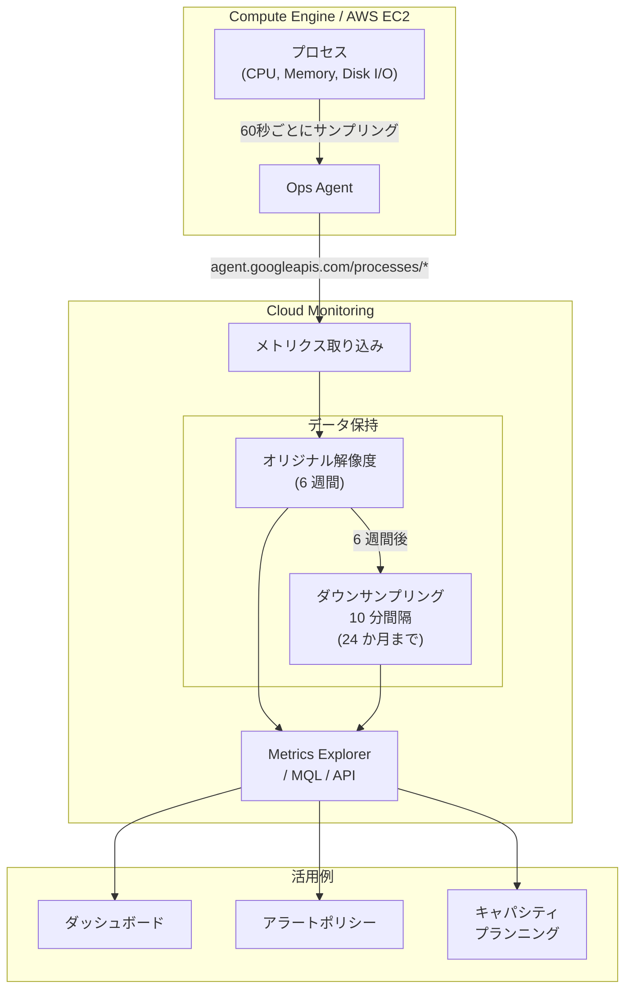

# Cloud Monitoring: プロセスメトリクスのデータ保持期間が 24 か月に統一

**リリース日**: 2026-06-12

**サービス**: Cloud Monitoring

**機能**: agent.googleapis.com/processes メトリクスのデータ保持期間の明確化

**ステータス**: Change (変更)

[このアップデートのインフォグラフィックを見る](https://takech9203.github.io/google-cloud-news-summary/20260612-cloud-monitoring-process-metrics-retention.html)

## 概要

Google Cloud の Cloud Monitoring において、すべての `agent.googleapis.com/processes` メトリクスのデータ保持期間が 24 か月であることが公式に明記された。これは Ops Agent (および旧 Monitoring Agent) が収集するプロセスレベルのメトリクス (CPU 使用時間、メモリ使用量、ディスク I/O、プロセス数など) に適用される。

このアップデートにより、プロセスメトリクスの長期保持が保証されることが明確になった。キャパシティプランニング、長期的なパフォーマンストレンド分析、コンプライアンス対応のために過去のプロセスデータを参照する必要がある組織にとって、運用計画の立案が容易になる。

**アップデート前の課題**

- プロセスメトリクスの保持期間に関するドキュメントが不明確で、エージェントメトリクス全般の保持ポリシーに基づいて推測する必要があった
- 長期的なプロセスデータの利用可能性が保証されていなかったため、外部ストレージへのエクスポートを検討する組織もあった
- キャパシティプランニングや年次レポートに必要な過去データの保持期間について確証が持てなかった

**アップデート後の改善**

- すべての `agent.googleapis.com/processes` メトリクスが 24 か月間保持されることが公式に明記された
- 長期的なプロセスレベルのトレンド分析が追加設定なしで可能であることが保証された
- データ保持ポリシーが明確化されたことで、コンプライアンス要件への対応計画が立てやすくなった

## アーキテクチャ図



Ops Agent がプロセスメトリクスを 60 秒間隔で収集し、Cloud Monitoring に送信する。データは最初の 6 週間はオリジナルの解像度で保持され、その後 10 分間隔にダウンサンプリングされて最大 24 か月間保持される。

## サービスアップデートの詳細

### 主要機能

1. **24 か月間のデータ保持**
   - すべての `agent.googleapis.com/processes` プレフィックスを持つメトリクスに適用
   - 追加設定や追加料金なしで自動的に保持
   - カスタムメトリクスやその他のエージェントメトリクスと同じ保持期間ポリシーに準拠

2. **段階的なデータ解像度**
   - 最初の 6 週間: オリジナルのサンプリング間隔 (60 秒) でデータを保持
   - 6 週間以降: 10 分間隔にダウンサンプリングして保持
   - 24 か月経過後: データポイントが自動削除される

3. **対象プロセスメトリクス**
   - `processes/cpu_time`: プロセス CPU 使用時間
   - `processes/rss_usage`: プロセス常駐メモリ使用量
   - `processes/vm_usage`: プロセス仮想メモリ使用量
   - `processes/disk/read_bytes_count`: プロセスディスク読み取り I/O
   - `processes/disk/write_bytes_count`: プロセスディスク書き込み I/O
   - `processes/count_by_state`: 状態別プロセス数
   - `processes/fork_count`: フォーク回数

## 技術仕様

### データ保持ポリシーの全体像

| メトリクスカテゴリ | プレフィックス | 保持期間 |
|------|------|------|
| エージェントメトリクス (プロセス含む) | `agent.googleapis.com` | 24 か月 |
| カスタムメトリクス | `custom.googleapis.com` | 24 か月 |
| Prometheus メトリクス | `prometheus.googleapis.com` | 24 か月 |
| 外部メトリクス | `external.googleapis.com` | 24 か月 |
| 主要 GCP サービスメトリクス | `compute.googleapis.com` 等 | 24 か月 |
| その他の GCP メトリクス | 上記以外 | 6 週間 |

### プロセスメトリクスのラベル

各プロセスメトリクスには以下のラベルが付与される:

| ラベル | 説明 |
|------|------|
| `process` | プロセス名 |
| `command` | プロセスコマンド |
| `command_line` | プロセスコマンドライン (最大 1024 文字) |
| `owner` | プロセスオーナー |
| `pid` | プロセス ID |

## ユースケース

### ユースケース 1: 長期キャパシティプランニング

**シナリオ**: インフラストラクチャチームが年間のリソース使用量トレンドを分析し、次年度のインフラ投資計画を策定する。

**実装例**:
```
# MQL で過去 12 か月のプロセスメモリ使用量のトレンドを確認
fetch gce_instance
| metric 'agent.googleapis.com/processes/rss_usage'
| filter metric.process == 'java'
| group_by [resource.instance_id], [value_rss_usage_mean: mean(value.rss_usage)]
| every 1d
| within 12mo
```

**効果**: 24 か月分のデータを活用して、アプリケーションのメモリ使用量の成長率を正確に把握し、スケールアップのタイミングを予測できる。

### ユースケース 2: 障害の根本原因分析

**シナリオ**: 本番環境で発生した間欠的な障害について、過去のプロセスレベルメトリクスから異常パターンを特定する。

**効果**: 24 か月の履歴データにより、季節的なパターンや長期的な性能劣化を特定でき、再発防止策の策定に活用できる。

### ユースケース 3: コンプライアンス監査対応

**シナリオ**: セキュリティ監査で過去 1 年間のプロセス実行履歴の提示を求められた場合に、Cloud Monitoring のデータで対応する。

**効果**: 外部ストレージへのエクスポートなしで、24 か月分のプロセス実行データを監査レポートとして提供可能。

## 料金

プロセスメトリクス (`agent.googleapis.com/processes/*`) は Cloud Monitoring の課金対象メトリクスであるが、通常のエージェントメトリクスと比較して大幅な割引が適用される。

### 料金体系

| 項目 | 詳細 |
|--------|-----------------|
| 課金モデル | バイト取り込み量ベース |
| 割引率 | 通常メトリクスの 5% のレートで課金 |
| 無料枠 | 毎月 150 MiB まで無料 (全エージェントメトリクス合算) |
| 超過分 | $0.258/MiB (ただしプロセスメトリクスは実効 $0.0129/MiB 相当) |
| サンプリング間隔 | 60 秒ごと (1 データポイント = 8 バイト) |

### 料金例

| 規模 | 月額料金 (概算) |
|--------|-----------------|
| 10 VM (プロセスメトリクスのみ) | 無料枠内 |
| 100 VM (プロセスメトリクスのみ) | 少額 (5% 割引適用) |
| 1000 VM (全エージェントメトリクス) | プロセスメトリクス分は通常コストの 5% |

**注**: データの保持自体に追加料金は発生しない。課金はメトリクスの取り込み (ingestion) 時点で行われる。

## 関連サービス・機能

- **Ops Agent**: プロセスメトリクスを収集してCloud Monitoring に送信するエージェント。デフォルト構成でプロセスメトリクスの収集が有効になっている
- **Metrics Explorer**: 保持されたプロセスメトリクスをインタラクティブに可視化・分析するためのツール
- **Monitoring Query Language (MQL)**: 長期プロセスデータに対する高度なクエリ・集計を実行する言語
- **Cloud Alerting**: プロセスメトリクスに基づくアラートポリシーを設定し、異常を検知するサービス
- **Metrics Management**: プロセスメトリクスの取り込み量と課金状況を確認するための管理画面

## 参考リンク

- [インフォグラフィック](https://takech9203.github.io/google-cloud-news-summary/20260612-cloud-monitoring-process-metrics-retention.html)
- [公式リリースノート](https://docs.cloud.google.com/release-notes#June_12_2026)
- [データ保持ポリシー ドキュメント](https://docs.cloud.google.com/monitoring/quotas#data_retention_policy)
- [プロセスメトリクス一覧](https://docs.cloud.google.com/monitoring/api/metrics_opsagent)
- [Cloud Monitoring 料金](https://cloud.google.com/products/observability/pricing)
- [Metrics Management](https://docs.cloud.google.com/monitoring/docs/metrics-management)

## まとめ

今回のアップデートにより、Cloud Monitoring の `agent.googleapis.com/processes` メトリクスが 24 か月間保持されることが公式に明記された。これにより、ユーザーはプロセスレベルの長期トレンド分析、キャパシティプランニング、コンプライアンス対応を Cloud Monitoring のネイティブ機能のみで実現できることが保証される。既に Ops Agent を利用してプロセスメトリクスを収集している組織は、追加設定なしでこの保持ポリシーの恩恵を受けることができる。

---

**タグ**: #CloudMonitoring #OpsAgent #メトリクス保持 #データリテンション #プロセスメトリクス #Observability
