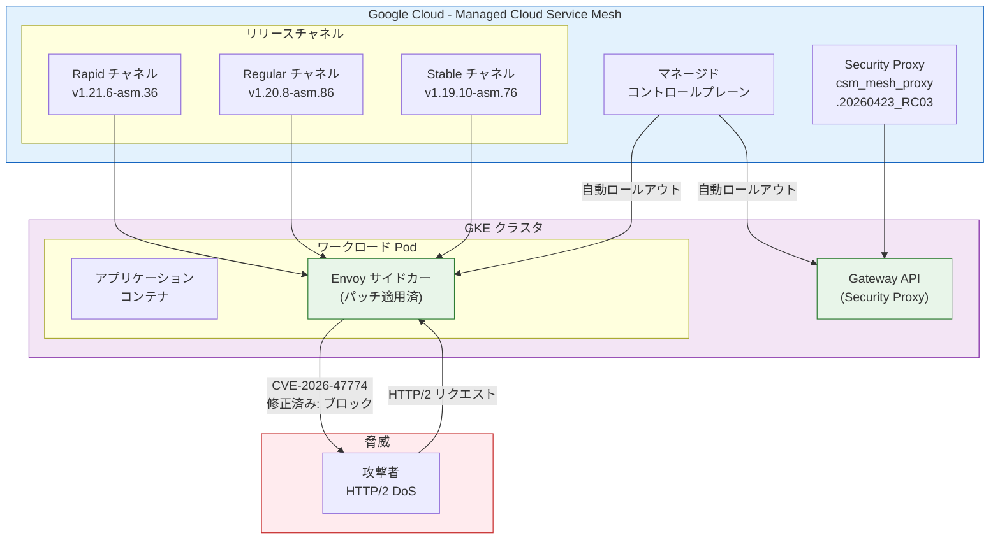

# Cloud Service Mesh: サイドカーおよびセキュリティプロキシのバージョンロールアウト (GCP-2026-035)

**リリース日**: 2026-06-12

**サービス**: Cloud Service Mesh

**機能**: Managed Cloud Service Mesh のサイドカーおよび Security Proxy のセキュリティパッチロールアウト

**ステータス**: ロールアウト中

[このアップデートのインフォグラフィックを見る](https://takech9203.github.io/google-cloud-news-summary/20260612-cloud-service-mesh-security-patch-gcp-2026-035.html)

## 概要

2026年6月12日、Google Cloud は Managed Cloud Service Mesh の全リリースチャネルに対して、セキュリティパッチを含む新しいサイドカープロキシバージョンのロールアウトを開始しました。このロールアウトは、2026年6月8日に公開されたセキュリティ脆弱性 GCP-2026-035 (CVE-2026-47774) への修正を含むものです。

CVE-2026-47774 は、Envoy の HTTP/2 ダウンストリームリクエスト処理における脆弱性で、認証されていないリモートクライアントが過剰なメモリ消費を引き起こし、Envoy プロセスの OOM (Out of Memory) 終了とサービス拒否 (DoS) を発生させる可能性があるものです。深刻度は「高 (High)」と評価されています。

今回のロールアウトは、2026年6月3日に事前告知されたロールアウトを置き換える (preempt) ものであり、セキュリティ修正を最優先で適用するための緊急対応です。また、GKE クラスタ上の Gateway API 向けの Security Proxy バージョンも同時に更新されます。

**アップデート前の課題**

- CVE-2026-47774 により、HTTP/2 リクエストを介した DoS 攻撃のリスクが全バージョンの Cloud Service Mesh に存在していた
- 認証されていないリモートクライアントが Envoy プロセスの過剰なメモリ消費を引き起こし、サービス停止に繋がる可能性があった
- 6月3日に予定されていた通常のロールアウトでは、この脆弱性の修正が含まれていなかった

**アップデート後の改善**

- CVE-2026-47774 の脆弱性が修正され、HTTP/2 経由の DoS 攻撃リスクが解消される
- Managed Cloud Service Mesh ユーザーは自動的にパッチが適用され、手動対応が不要
- 全リリースチャネル (Rapid / Regular / Stable) に対して同時にロールアウトされ、迅速な修正展開が実現
- Gateway API 向け Security Proxy も最新バージョンに更新される

## アーキテクチャ図



## サービスアップデートの詳細

### 主要機能

| 項目 | 内容 |
|------|------|
| セキュリティ脆弱性 | GCP-2026-035 / CVE-2026-47774 |
| 深刻度 | 高 (High) |
| 脆弱性の種類 | Envoy HTTP/2 ダウンストリームリクエスト処理におけるメモリ消費 DoS |
| 影響範囲 | 全バージョンの Cloud Service Mesh |
| 修正方法 (マネージド) | 自動ロールアウト (対応不要) |
| 修正方法 (インクラスタ) | 手動アップグレード (v1.28.7-asm.4 / v1.27.9-asm.5 / v1.26.8-asm.11) |

### ロールアウトされるバージョン

| リリースチャネル | サイドカーバージョン | 対象 |
|----------------|---------------------|------|
| Rapid | 1.21.6-asm.36 | 最新機能を利用するテスト環境向け |
| Regular | 1.20.8-asm.86 | バランスの取れた本番環境向け (推奨) |
| Stable | 1.19.10-asm.76 | 安定性を優先する本番環境向け |

### Security Proxy (Gateway API 向け)

| 項目 | 内容 |
|------|------|
| バージョン | csm_mesh_proxy.20260423_RC03 |
| 対象 | GKE クラスタ上の Gateway API |
| ロールアウト期間 | 約1週間で全チャネルに展開 |

## 技術仕様

### CVE-2026-47774 の詳細

- **攻撃ベクトル**: ネットワーク経由 (認証不要)
- **影響**: Envoy プロセスの OOM 終了によるサービス拒否
- **プロトコル**: HTTP/2 ダウンストリームリクエスト
- **根本原因**: Envoy の HTTP/2 リクエスト処理における不適切なメモリ管理

### リリースチャネルとクラスタの対応

| GKE クラスタチャネル | Cloud Service Mesh チャネル |
|---------------------|---------------------------|
| Rapid | Rapid |
| Regular | Regular |
| Stable | Stable |
| チャネル未設定 | Regular |

## 設定方法

### Managed Cloud Service Mesh (自動適用)

Managed Cloud Service Mesh を利用している場合、パッチは自動的にロールアウトされるため、ユーザー側での操作は不要です。

```bash
# 現在のサイドカーバージョンを確認
kubectl get pods -n <NAMESPACE> -o jsonpath='{.items[*].spec.containers[?(@.name=="istio-proxy")].image}'

# 名前空間のリリースチャネルを確認
kubectl get namespace <NAMESPACE> -o jsonpath='{.metadata.labels.istio\.io/rev}'
```

### In-cluster Cloud Service Mesh (手動アップグレード)

インクラスタ版を利用している場合は、手動でのアップグレードが必要です。

```bash
# パッチ済みバージョンへのアップグレード
# v1.28 系の場合
# 公式ドキュメントのアップグレード手順に従い 1.28.7-asm.4 へ更新

# v1.27 系の場合
# 公式ドキュメントのアップグレード手順に従い 1.27.9-asm.5 へ更新

# v1.26 系の場合
# 公式ドキュメントのアップグレード手順に従い 1.26.8-asm.11 へ更新
```

### ロールアウト状況の確認

```bash
# Pod のサイドカーバージョンを確認
kubectl get pods -n <NAMESPACE> -o json | \
  jq '.items[] | {name: .metadata.name, proxy: (.spec.containers[] | select(.name=="istio-proxy") | .image)}'

# ロールアウトの進行状況を確認 (Pod の再起動状態)
kubectl get pods -n <NAMESPACE> -w
```

## メリット

### ビジネス面

- セキュリティ脆弱性への迅速な対応により、サービス停止リスクを最小化
- Managed Cloud Service Mesh では自動パッチ適用により、運用チームの負荷を軽減
- コンプライアンス要件への対応 (既知の脆弱性の速やかな修正)

### 技術面

- HTTP/2 DoS 攻撃に対する耐性が向上
- Envoy プロセスの OOM 終了リスクが排除される
- 全リリースチャネルへの同時展開により、環境間のセキュリティレベルの格差を解消
- Gateway API 向け Security Proxy も同時に更新され、包括的な保護を実現

## デメリット・制約事項

- ロールアウト中は Pod の再起動が発生するため、一時的な接続断が発生する可能性がある
- In-cluster Cloud Service Mesh (v1.25 以前) は EOL のため CVE 修正がバックポートされず、v1.26 以降へのアップグレードが必須
- ロールアウトは段階的に行われるため、全クラスタへの適用完了まで数日を要する場合がある
- 6月3日に告知されていた通常のロールアウトが今回のセキュリティパッチに置き換えられるため、通常パッチの内容は次回のロールアウトに含まれる

## ユースケース

### 即座に対応が必要なケース

- **公開 HTTP/2 エンドポイントを持つサービス**: 攻撃者が直接リクエストを送信できるため、最優先でパッチ適用を確認すべき
- **マルチテナント環境**: テナント間でのリソース枯渇攻撃を防止

### Managed Cloud Service Mesh を利用中のケース

- **対応不要**: 自動ロールアウトにより、段階的にパッチが適用される
- **確認推奨**: ロールアウト完了後にサイドカーバージョンを確認し、パッチ適用を検証

### In-cluster Cloud Service Mesh を利用中のケース

- **手動アップグレード必須**: 対象バージョン (1.28.7-asm.4 / 1.27.9-asm.5 / 1.26.8-asm.11) への更新が必要
- **v1.25 以前**: サポート終了のため、v1.26 以降への移行が必須

## 料金

Cloud Service Mesh のセキュリティパッチ適用に追加料金は発生しません。Cloud Service Mesh は GKE Enterprise のコンポーネントとして提供されており、GKE Enterprise の料金に含まれます。

## 利用可能リージョン

Managed Cloud Service Mesh がサポートされている全リージョンでロールアウトが行われます。ロールアウトは段階的に展開されるため、リージョンによって適用タイミングが異なる場合があります。

## 関連サービス・機能

| サービス/機能 | 関連内容 |
|--------------|----------|
| Google Kubernetes Engine (GKE) | Cloud Service Mesh のホスト環境、リリースチャネルが連動 |
| Gateway API | Security Proxy のロールアウト対象 |
| Envoy Proxy | サイドカーの実体、CVE-2026-47774 の影響を受けるコンポーネント |
| Cloud Service Mesh セキュリティ速報 | GCP-2026-035 が公開されたドキュメント |
| GKE Enterprise | Cloud Service Mesh を含むプラットフォームスイート |

## 参考リンク

- [インフォグラフィック](https://takech9203.github.io/google-cloud-news-summary/20260612-cloud-service-mesh-security-patch-gcp-2026-035.html)
- [公式リリースノート](https://cloud.google.com/release-notes#June_12_2026)
- [Cloud Service Mesh リリースノート](https://cloud.google.com/service-mesh/docs/release-notes)
- [セキュリティ速報 GCP-2026-035](https://cloud.google.com/service-mesh/docs/security-bulletins#gcp-2026-035)
- [Cloud Service Mesh の概要](https://cloud.google.com/service-mesh/docs/overview)
- [リリースチャネルの選択](https://cloud.google.com/service-mesh/docs/managed/select-a-release-channel)
- [Cloud Service Mesh のアップグレード手順](https://cloud.google.com/service-mesh/docs/upgrade/upgrade)

## まとめ

今回のロールアウトは、CVE-2026-47774 (Envoy HTTP/2 DoS 脆弱性、深刻度: 高) に対するセキュリティパッチを全リリースチャネルに展開するものです。Managed Cloud Service Mesh を利用している場合は自動的にパッチが適用されるため、ユーザー側での操作は不要です。In-cluster Cloud Service Mesh を利用している場合は、速やかに対象バージョンへのアップグレードを実施することを推奨します。6月3日に告知されていた通常のロールアウトは今回のセキュリティパッチに置き換えられ、優先的に展開されます。Gateway API 向けの Security Proxy も合わせて更新されるため、メッシュ全体のセキュリティが包括的に強化されます。

---

**タグ**: Cloud Service Mesh, セキュリティパッチ, CVE-2026-47774, GCP-2026-035, Envoy, HTTP/2, DoS, サイドカー, GKE, Gateway API, Managed Service Mesh
