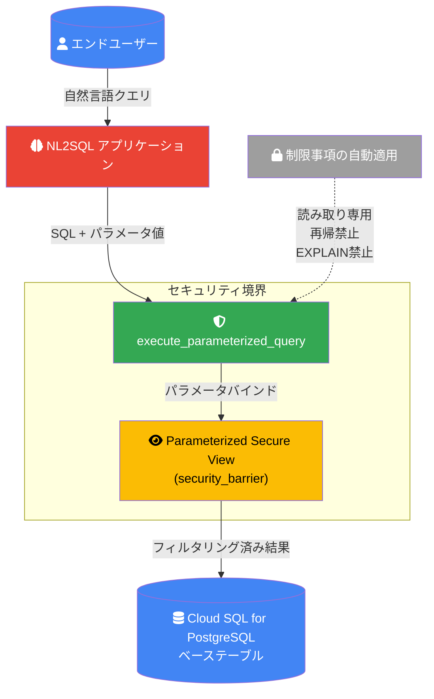

# Cloud SQL for PostgreSQL: Parameterized Secure Views

**リリース日**: 2026-06-12

**サービス**: Cloud SQL for PostgreSQL

**機能**: Parameterized Secure Views

**ステータス**: Preview

📊 [このアップデートのインフォグラフィックを見る](https://takech9203.github.io/google-cloud-news-summary/20260612-cloud-sql-postgresql-parameterized-secure-views.html)

## 概要

Cloud SQL for PostgreSQL に Parameterized Secure Views（パラメータ化セキュアビュー）機能が Preview として追加されました。この機能は、PostgreSQL の標準的なビュー機能を拡張し、アプリケーション固有の名前付きパラメータ（ユーザー ID やリージョンなど）をビュー定義内で使用できるようにするものです。クエリ実行時にアプリケーションがパラメータ値を提供することで、ユーザーごとに異なるデータセットを返すきめ細かなアクセス制御を実現します。

この機能は特に、Natural Language to SQL（NL2SQL）アプリケーションにおけるセキュリティ強化を主要なユースケースとしています。エンドユーザーが自然言語でクエリを発行するアプリケーションでは、プロンプトインジェクション攻撃や、意図しない広範囲なデータアクセスのリスクがあります。Parameterized Secure Views を使用することで、信頼されないクエリがアクセスできるテーブル、カラム、行を厳密に制限できます。

対象ユーザーは、マルチテナントアプリケーションの開発者、AI/ML を活用した自然言語クエリインターフェースを構築するチーム、およびデータベースレベルでの最小権限原則を徹底したいセキュリティ担当者です。

**アップデート前の課題**

- PostgreSQL の `GRANT` 文ではビューへのアクセス権限を制御できるが、クエリを実行するユーザーに基づいてビューが返すデータを動的に制限することができなかった
- NL2SQL アプリケーションでは、モデルが生成する SQL クエリの範囲を適切に制限する仕組みがなく、意図しないデータ露出のリスクがあった
- 行レベルセキュリティ（RLS）は PostgreSQL のデータベースユーザー単位での制御であり、アプリケーションユーザー単位での柔軟な制御には追加の実装が必要だった
- プロンプトインジェクション攻撃に対するデータベースレベルでの防御機構が不足していた

**アップデート後の改善**

- ビュー定義内に `$@parameter_name` 構文で名前付きパラメータを定義し、アプリケーションユーザー単位でのデータアクセス制御が可能になった
- `security_barrier` オプションとの組み合わせにより、悪意のある関数やオペレータによるデータ漏洩を防止
- `execute_parameterized_query` 関数や `EXECUTE ... WITH VIEW PARAMETERS` 文により、パラメータ値を安全に渡すための標準的なインターフェースが提供された
- クエリに対する自動的な制限（読み取り専用、再帰呼び出し禁止、EXPLAIN 禁止など）により、信頼されないクエリからのデータ保護が強化された

## アーキテクチャ図



Parameterized Secure Views は、アプリケーションとデータベースの間にセキュリティ境界を設け、パラメータ化されたクエリのみがベーステーブルのデータにアクセスできるようにします。

## サービスアップデートの詳細

### 主要機能

1. **名前付きビューパラメータ (`$@parameter_name`)**
   - ビュー定義の WHERE 句内で `$@parameter_name` 構文を使用してパラメータを定義
   - パラメータ名は英字またはアンダースコアで始まり、後続文字は英字、アンダースコア、数字が使用可能
   - パラメータは大文字・小文字を区別する（`$@USER_ID` と `$@user_id` は別のパラメータ）

2. **Security Barrier による保護**
   - `WITH (security_barrier)` オプションにより、悪意のある関数やオペレータがビューのフィルタリング前の行データにアクセスすることを防止
   - PostgreSQL の標準的なセキュリティ機構を活用し、行レベルのデータ保護を実現

3. **複数のクエリ実行インターフェース**
   - JSON API: `execute_parameterized_query()` 関数によるワンショット実行。結果は JSON 形式で返却
   - CURSOR API: 大規模クエリや長時間実行クエリ向けのバッチフェッチ対応
   - Prepared Statements: `PREPARE ... AS RESTRICTED` + `EXECUTE ... WITH VIEW PARAMETERS` による再利用可能なクエリプラン

4. **クエリ制限の自動適用**
   - 読み取り専用（SELECT のみ許可、DML/DDL は禁止）
   - 再帰呼び出し禁止（`execute_parameterized_query` のネストを禁止）
   - 特定エクステンション制限（`dblink`、`pg_cron` 等のバックグラウンドセッション開始を禁止）
   - EXPLAIN 文禁止（クエリプランによる情報漏洩を防止）

## 技術仕様

### パラメータ化ビューの構文

| 項目 | 詳細 |
|------|------|
| パラメータ構文 | `$@parameter_name` |
| パラメータ名の制約 | 先頭: 英字 (a-z) またはアンダースコア、後続: 英字・アンダースコア・数字 |
| 大文字小文字 | 区別あり |
| ビューオプション | `WITH (security_barrier)` 必須 |
| 必要なエクステンション | `parameterized_views` |
| 必要なデータベースフラグ | `cloudsql.enable_parameterized_views = on` |

### JSON API の制限パラメータ

| パラメータ | 説明 |
|------|------|
| `parameterized_views.json_results_max_size` | 結果セットの最大サイズ（KB） |
| `parameterized_views.json_results_max_rows` | 結果セットの最大行数 |

### ビュー作成の SQL 例

```sql
-- パラメータ化セキュアビューの作成
CREATE VIEW user_specific_items WITH (security_barrier) AS
SELECT item_id, item_name, description
FROM items t
WHERE owner_id = $@app_user_id;
```

## 設定方法

### 前提条件

1. Cloud SQL for PostgreSQL インスタンスが作成されていること
2. インスタンスの管理者権限を持つユーザーでアクセスできること

### 手順

#### ステップ 1: データベースフラグの有効化

Cloud SQL インスタンスで `cloudsql.enable_parameterized_views` フラグを有効にします。この変更にはデータベースの再起動が必要です。

```bash
gcloud sql instances patch INSTANCE_NAME \
  --database-flags cloudsql.enable_parameterized_views=on
```

#### ステップ 2: エクステンションの作成

パラメータ化ビューを使用するデータベースで `parameterized_views` エクステンションを作成します。

```sql
-- 管理者ユーザーで接続して実行
CREATE EXTENSION parameterized_views;
```

#### ステップ 3: パラメータ化セキュアビューの作成

```sql
-- ビューの作成
CREATE VIEW app_schema.user_items_view WITH (security_barrier) AS
SELECT item_id, item_name, description
FROM app_schema.items
WHERE owner_id = $@current_user_id;
```

#### ステップ 4: アプリケーション用ロールの作成と権限付与

```sql
-- アプリケーション用のデータベースロールを作成
CREATE ROLE psv_user WITH LOGIN PASSWORD 'PASSWORD';

-- ビューとスキーマへのアクセス権を付与
GRANT USAGE ON SCHEMA app_schema TO psv_user;
GRANT SELECT ON app_schema.user_items_view TO psv_user;

-- ベーステーブルへの直接アクセスを拒否
REVOKE ALL PRIVILEGES ON app_schema.items FROM psv_user;
```

#### ステップ 5: パラメータ化ビューのクエリ実行

```sql
-- JSON API を使用したクエリ実行
SELECT * FROM parameterized_views.execute_parameterized_query(
    query => 'SELECT * FROM app_schema.user_items_view',
    param_names => ARRAY ['current_user_id'],
    param_values => ARRAY ['123']
);

-- Prepared Statement を使用したクエリ実行
PREPARE get_items (TEXT) AS RESTRICTED
SELECT item_id, item_name FROM app_schema.user_items_view
WHERE item_name LIKE $1;

EXECUTE get_items ('%Laptop%')
WITH VIEW PARAMETERS (current_user_id := '123');

DEALLOCATE get_items;
```

## メリット

### ビジネス面

- **コンプライアンス強化**: 最小権限原則をデータベースレベルで実現し、監査要件への対応を簡素化
- **AI アプリケーションの安全な展開**: NL2SQL アプリケーションにおけるデータ漏洩リスクを大幅に低減し、AI 機能の本番導入を加速
- **マルチテナント対応の簡素化**: テナントごとのデータ分離をビューレベルで実現し、アプリケーション側の複雑な実装を削減

### 技術面

- **プロンプトインジェクション対策**: データベースレベルでのセキュリティ境界により、アプリケーション層の脆弱性に依存しない保護を実現
- **PostgreSQL エコシステムとの互換性**: 標準的な PostgreSQL ビュー構文を拡張しているため、既存の知識やツールを活用可能
- **自動的なクエリ制限**: 読み取り専用制限や再帰禁止などが自動適用され、追加のセキュリティ実装が不要
- **複数のクエリインターフェース**: ユースケースに応じて JSON API、CURSOR API、Prepared Statements を使い分け可能

## デメリット・制約事項

### 制限事項

- Preview ステータスのため、SLA の対象外であり本番環境での利用は推奨されない（Pre-GA Offerings Terms が適用）
- `cloudsql.enable_parameterized_views` フラグの有効化にはデータベースの再起動が必要
- `parameterized_views` エクステンションをビューを使用する各データベースに個別にインストールする必要がある
- パラメータ化ビューをユーザー定義関数内から参照した場合、エラーが発生する（直接参照のみ対応）
- `dblink` や `pg_cron` などのバックグラウンドセッションを開始するエクステンションは使用不可

### 考慮すべき点

- フラグ有効化に伴うデータベース再起動によるダウンタイムの計画が必要
- 既存のアプリケーションコードをパラメータ化クエリインターフェースに対応させる改修が必要
- JSON API の結果セットサイズ制限があるため、大量データの取得には CURSOR API の利用を検討する必要がある

## ユースケース

### ユースケース 1: NL2SQL アプリケーションのデータセキュリティ

**シナリオ**: 社内データベースに対して自然言語でクエリを発行できるアプリケーションを構築する場合。エンドユーザーが「自分の注文を表示して」と入力すると、そのユーザーの注文のみが返却されるようにしたい。

**実装例**:
```sql
-- 注文ビューの作成
CREATE VIEW orders_view WITH (security_barrier) AS
SELECT order_id, product_name, quantity, order_date
FROM orders
WHERE customer_id = $@authenticated_user_id;

-- アプリケーションからのクエリ実行
SELECT * FROM parameterized_views.execute_parameterized_query(
    query => 'SELECT * FROM orders_view WHERE order_date > ''2026-01-01''',
    param_names => ARRAY ['authenticated_user_id'],
    param_values => ARRAY ['user_12345']
);
```

**効果**: プロンプトインジェクション攻撃が行われても、認証されたユーザーのデータのみが返却され、他のユーザーのデータが露出するリスクを排除。

### ユースケース 2: マルチテナント SaaS アプリケーション

**シナリオ**: 複数の企業が共有データベースを使用する SaaS アプリケーションで、各テナントが自社のデータのみにアクセスできるようにする。

**実装例**:
```sql
-- テナント別ビューの作成
CREATE VIEW tenant_data_view WITH (security_barrier) AS
SELECT record_id, data_field, created_at
FROM shared_table
WHERE tenant_id = $@current_tenant_id AND region = $@user_region;
```

**効果**: データベースレベルでのテナント分離により、アプリケーションロジックの不具合によるクロステナントデータアクセスを防止。

## 料金

Parameterized Secure Views 機能自体に追加料金は発生しません。Cloud SQL for PostgreSQL の標準料金が適用されます。

| エディション | vCPU 単価 | メモリ単価 |
|--------|-----------------|----------------|
| Cloud SQL Enterprise | $0.0413/vCPU/時間〜 | $0.007/GB/時間〜 |
| Cloud SQL Enterprise Plus | $0.05369/vCPU/時間〜 | $0.0091/GB/時間〜 |

詳細は [Cloud SQL 料金ページ](https://cloud.google.com/sql/pricing) を参照してください。

## 利用可能リージョン

Cloud SQL for PostgreSQL が利用可能なすべてのリージョンで利用できます。詳細は [Cloud SQL のロケーション](https://cloud.google.com/sql/docs/postgres/locations) を参照してください。

## 関連サービス・機能

- **Cloud SQL 行レベルセキュリティ (RLS)**: PostgreSQL 標準の RLS はデータベースユーザー単位での制御。Parameterized Secure Views はアプリケーションユーザー単位での制御を実現し、RLS を補完
- **Cloud SQL カラムレベルセキュリティ**: テーブルの特定カラムへのアクセスを制御。Parameterized Secure Views と組み合わせて多層的なデータ保護を実現
- **Cloud SQL IAM 認証**: インスタンスレベルのアクセス制御を提供。Parameterized Secure Views はデータレベルでのより細かい制御を追加
- **BigQuery 行レベルセキュリティ**: BigQuery での行アクセスポリシーによるデータ保護。Cloud SQL での同様のニーズに Parameterized Secure Views が対応
- **Vertex AI / Gemini**: NL2SQL アプリケーション構築において、Parameterized Secure Views がデータセキュリティレイヤーとして機能

## 参考リンク

- 📊 [インフォグラフィック](https://takech9203.github.io/google-cloud-news-summary/20260612-cloud-sql-postgresql-parameterized-secure-views.html)
- [公式リリースノート](https://cloud.google.com/release-notes#June_12_2026)
- [Parameterized Secure Views 概要](https://docs.cloud.google.com/sql/docs/postgres/parameterized-secure-views)
- [Parameterized Secure Views の使用方法](https://docs.cloud.google.com/sql/docs/postgres/use-parameterized-secure-views)
- [チュートリアル: Parameterized Secure Views によるアプリケーションデータの保護](https://docs.cloud.google.com/sql/docs/postgres/secure-app-data-parameterized-secure-views)
- [Cloud SQL for PostgreSQL データプライバシー戦略](https://docs.cloud.google.com/sql/docs/postgres/data-privacy-strategies)
- [料金ページ](https://cloud.google.com/sql/pricing)

## まとめ

Cloud SQL for PostgreSQL の Parameterized Secure Views は、特に AI/NL2SQL アプリケーションにおけるデータセキュリティの課題を解決する重要な機能です。データベースレベルで最小権限原則を実現し、プロンプトインジェクション攻撃への防御を提供します。現在 Preview 段階ですが、マルチテナントアプリケーションや自然言語クエリインターフェースの構築を検討しているチームは、開発・テスト環境での評価を開始することを推奨します。

---

**タグ**: #CloudSQL #PostgreSQL #Security #ParameterizedSecureViews #RowLevelSecurity #NL2SQL #DataPrivacy #Preview #Database
