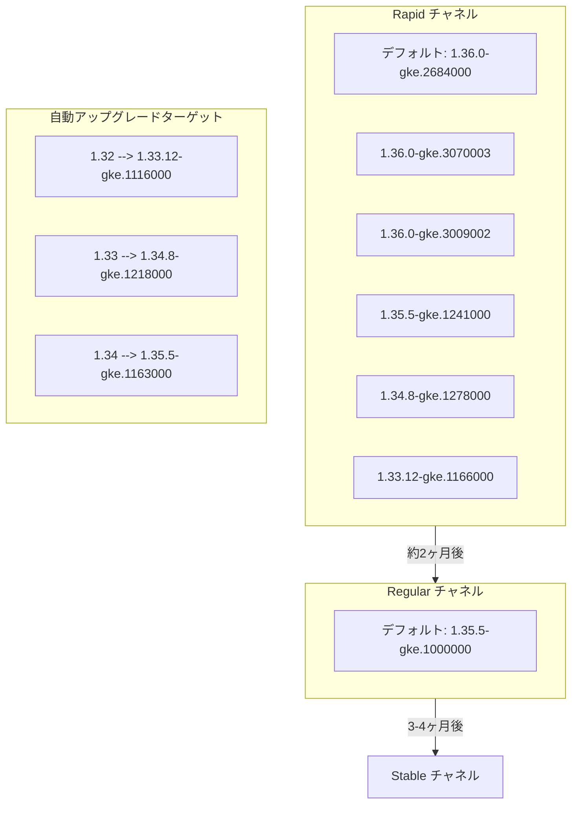

# Google Kubernetes Engine: クラスターバージョンアップデート (2026-R23)

**リリース日**: 2026-06-12

**サービス**: Google Kubernetes Engine (GKE)

**機能**: クラスターバージョンアップデート 2026-R23

**ステータス**: GA (一般提供)

📊 [このアップデートのインフォグラフィックを見る](https://takech9203.github.io/google-cloud-news-summary/20260612-gke-cluster-version-updates-2026-r23.html)

## 概要

Google Kubernetes Engine (GKE) のクラスターバージョンが 2026-R23 として更新された。今回のアップデートでは、Rapid チャネルと Regular チャネルの新しいデフォルトバージョンが設定され、複数の新しいパッチバージョンが利用可能になった。また、既存クラスターの自動アップグレードターゲットも更新されている。

Rapid チャネルのデフォルトバージョンは 1.36.0-gke.2684000 に、Regular チャネルのデフォルトバージョンは 1.35.5-gke.1000000 に更新された。これにより、新規クラスター作成時にこれらのバージョンが自動的に使用される。Rapid チャネルでは Kubernetes 1.36 系の最新パッチが複数追加され、早期導入環境でのテストが可能になっている。

自動アップグレードターゲットも更新され、1.32 から 1.33 系へ、1.33 から 1.34 系へ、1.34 から 1.35 系への段階的なアップグレードパスが明確に定義された。これにより、リリースチャネルに登録されたクラスターは、メンテナンスウィンドウに従って自動的に新しいバージョンにアップグレードされる。

**アップデート前の課題**

- 以前のデフォルトバージョンでは、最新の Kubernetes セキュリティパッチや機能改善が含まれていなかった
- 旧バージョンでは、Kubernetes 1.36 系の新機能 (最新の API、パフォーマンス改善) を利用できなかった
- 自動アップグレードターゲットが古く、サポート終了に近いバージョンを使用し続けるリスクがあった

**アップデート後の改善**

- Rapid チャネルで Kubernetes 1.36.0 の最新パッチ (gke.3070003) まで利用可能になり、最新機能のテストが可能
- Regular チャネルのデフォルトが 1.35.5 に更新され、安定性と新機能のバランスが取れたバージョンが提供される
- 自動アップグレードターゲットの更新により、クラスターが段階的かつ安全に最新バージョンへ移行可能

## アーキテクチャ図



GKE のリリースチャネル間のバージョン伝播と、今回更新されたデフォルトバージョンおよび自動アップグレードターゲットを示す。

## サービスアップデートの詳細

### 主要機能

1. **新しいデフォルトバージョンの設定**
   - Rapid チャネル: 1.36.0-gke.2684000
   - Regular チャネル: 1.35.5-gke.1000000
   - 新規クラスター作成時にこれらのバージョンが自動選択される

2. **Rapid チャネルの新規利用可能バージョン**
   - 1.36.0-gke.3070003 (最新)
   - 1.36.0-gke.3009002
   - 1.35.5-gke.1241000
   - 1.34.8-gke.1278000
   - 1.33.12-gke.1166000

3. **自動アップグレードターゲットの更新**
   - 1.32 系クラスター → 1.33.12-gke.1116000
   - 1.33 系クラスター → 1.34.8-gke.1218000
   - 1.34 系クラスター → 1.35.5-gke.1163000

## 技術仕様

### バージョン情報一覧

| チャネル | 種別 | バージョン |
|---------|------|-----------|
| Rapid | デフォルト | 1.36.0-gke.2684000 |
| Rapid | 利用可能 | 1.36.0-gke.3070003 |
| Rapid | 利用可能 | 1.36.0-gke.3009002 |
| Rapid | 利用可能 | 1.35.5-gke.1241000 |
| Rapid | 利用可能 | 1.34.8-gke.1278000 |
| Rapid | 利用可能 | 1.33.12-gke.1166000 |
| Regular | デフォルト | 1.35.5-gke.1000000 |

### バージョンスキューポリシー

| 項目 | 詳細 |
|------|------|
| コントロールプレーンとノード間の最大スキュー | 2 マイナーバージョン |
| マイナーバージョンのスキップ (コントロールプレーン) | 不可 (1 バージョンずつアップグレード) |
| マイナーバージョンのスキップ (ワーカーノード) | 可能 |
| パッチバージョンのスキップ | 可能 |

### リリースチャネルの特性

| チャネル | マイナーバージョン利用可能時期 | 自動アップグレードターゲット設定時期 | 推奨用途 |
|---------|-------------------------------|-------------------------------------|----------|
| Rapid | OSS GA 後 1-2 週間 | リリース後 1-2 ヶ月 | プレプロダクション環境 |
| Regular | Rapid リリース後 約2ヶ月 | Regular リリース後 約3ヶ月 | 大半のワークロード (推奨) |
| Stable | Regular リリース後 3-4ヶ月 | Stable リリース後 約2ヶ月 | 安定性重視のプロダクション |
| Extended | Regular に準拠 | Regular に準拠 | 長期サポートが必要な環境 |

## 設定方法

### 前提条件

1. Google Cloud プロジェクトが作成済みであること
2. GKE API が有効化されていること
3. gcloud CLI がインストール・認証済みであること

### 手順

#### ステップ 1: 利用可能なバージョンの確認

```bash
# Rapid チャネルのデフォルトバージョンを確認
gcloud container get-server-config \
  --flatten="channels" \
  --filter="channels.channel=RAPID" \
  --format="yaml(channels.channel,channels.defaultVersion)" \
  --location=us-central1

# Regular チャネルの利用可能バージョンを確認
gcloud container get-server-config \
  --flatten="channels" \
  --filter="channels.channel=REGULAR" \
  --format="yaml(channels.channel,channels.validVersions)" \
  --location=us-central1
```

#### ステップ 2: クラスターのアップグレード (手動)

```bash
# コントロールプレーンを特定バージョンにアップグレード
gcloud container clusters upgrade CLUSTER_NAME \
  --master \
  --cluster-version=1.35.5-gke.1241000 \
  --location=COMPUTE_LOCATION

# ノードプールのアップグレード
gcloud container clusters upgrade CLUSTER_NAME \
  --node-pool=NODE_POOL_NAME \
  --cluster-version=1.35.5-gke.1241000 \
  --location=COMPUTE_LOCATION
```

#### ステップ 3: リリースチャネルの変更 (必要に応じて)

```bash
# クラスターを Rapid チャネルに登録
gcloud container clusters update CLUSTER_NAME \
  --release-channel=rapid \
  --location=COMPUTE_LOCATION
```

#### ステップ 4: メンテナンスウィンドウの設定

```bash
# 自動アップグレードの時間帯を制御
gcloud container clusters update CLUSTER_NAME \
  --maintenance-window-start=2026-06-13T02:00:00Z \
  --maintenance-window-end=2026-06-13T06:00:00Z \
  --maintenance-window-recurrence="FREQ=WEEKLY;BYDAY=SA,SU" \
  --location=COMPUTE_LOCATION
```

## メリット

### ビジネス面

- **セキュリティ強化**: 最新パッチにより既知の脆弱性に対する修正が適用され、コンプライアンス要件を満たしやすくなる
- **運用負荷の軽減**: 自動アップグレードターゲットの設定により、手動でのバージョン管理が不要
- **サポート継続性**: 最新バージョンを使用することで、サポート終了によるリスクを回避

### 技術面

- **Kubernetes 1.36 の新機能**: Rapid チャネルで最新の Kubernetes API やパフォーマンス改善を利用可能
- **段階的アップグレード**: チャネル間の伝播により、十分な検証期間を経たバージョンがプロダクションに到達
- **バージョン互換性の維持**: バージョンスキューポリシーに基づいた安全なアップグレードパスの提供

## デメリット・制約事項

### 制限事項

- コントロールプレーンのマイナーバージョンスキップは不可 (1 バージョンずつアップグレードが必要)
- 自動アップグレードはメンテナンスウィンドウ内でのみ実行されるため、ウィンドウの設定によっては遅延する可能性がある
- Rapid チャネルのバージョンは GKE SLA の対象外

### 考慮すべき点

- アップグレード前に、使用中の Kubernetes API が新バージョンで非推奨または削除されていないか確認が必要
- ノードプールのアップグレード中にワークロードの再スケジューリングが発生する
- カスタムアドミッションコントローラーやウェブフックが新バージョンと互換性があることを事前に検証すべき
- 自動アップグレードを一時的に停止したい場合は、メンテナンス除外を設定する必要がある

## ユースケース

### ユースケース 1: プレプロダクション環境での Kubernetes 1.36 検証

**シナリオ**: 開発チームが Kubernetes 1.36 の新しい API や機能をプロダクション導入前にテストしたい

**実装例**:
```bash
# Rapid チャネルでテストクラスターを作成
gcloud container clusters create test-cluster \
  --release-channel=rapid \
  --cluster-version=1.36.0-gke.3070003 \
  --location=us-central1 \
  --num-nodes=3
```

**効果**: プロダクションに影響を与えることなく、最新の Kubernetes 機能を検証可能。Regular チャネルに到達する前に互換性問題を発見できる。

### ユースケース 2: 段階的な本番環境アップグレード

**シナリオ**: 1.33 系で運用中の本番クラスターを、自動アップグレードにより安全に 1.34 系に移行したい

**実装例**:
```bash
# メンテナンスウィンドウを設定して自動アップグレードのタイミングを制御
gcloud container clusters update production-cluster \
  --maintenance-window-start=2026-06-15T03:00:00Z \
  --maintenance-window-end=2026-06-15T07:00:00Z \
  --maintenance-window-recurrence="FREQ=WEEKLY;BYDAY=SU" \
  --location=asia-northeast1
```

**効果**: 自動アップグレードターゲット (1.34.8-gke.1218000) に基づいて、週末の低トラフィック時間帯に安全にアップグレードが実行される。

### ユースケース 3: 特定バージョンの固定とテスト

**シナリオ**: 規制要件により、アップグレード前に社内テストの完了が必要な場合

**実装例**:
```bash
# メンテナンス除外を設定して自動アップグレードを一時停止
gcloud container clusters update regulated-cluster \
  --add-maintenance-exclusion-name=pre-upgrade-testing \
  --add-maintenance-exclusion-start=2026-06-12T00:00:00Z \
  --add-maintenance-exclusion-end=2026-07-12T00:00:00Z \
  --add-maintenance-exclusion-scope=no_upgrades \
  --location=us-east1
```

**効果**: テストが完了するまでクラスターバージョンを固定し、準備完了後に手動アップグレードを実行できる。

## 料金

GKE のバージョンアップデート自体に追加料金は発生しない。GKE の標準料金体系が適用される。

| 項目 | 料金 |
|------|------|
| クラスター管理料金 | $0.10 / クラスター / 時間 |
| GKE Free Tier | $74.40 / 月 (請求アカウントあたり、ゾーン・Autopilot クラスターに適用) |
| コンピュートリソース | Compute Engine の料金に準拠 |

詳細は [GKE 料金ページ](https://cloud.google.com/kubernetes-engine/pricing) を参照。

## 利用可能リージョン

GKE バージョンアップデートはすべての GKE 利用可能リージョンに段階的にロールアウトされる。バージョンのロールアウトはゾーンごとに増分的に実施されるため、特定のゾーンで新バージョンが利用可能になるタイミングには差がある場合がある。

利用可能なバージョンはロケーションごとに `gcloud container get-server-config --location=LOCATION` で確認可能。

## 関連サービス・機能

- **Cloud Monitoring**: クラスターのアップグレード進捗やヘルスチェックの監視
- **Cloud Logging**: アップグレードイベントのログ記録と監査
- **Binary Authorization**: 新バージョンのコンテナイメージに対するデプロイポリシーの適用
- **GKE Upgrade Notifications**: クラスターアップグレード通知の受信設定
- **Maintenance Windows and Exclusions**: 自動アップグレードのタイミング制御
- **GKE Release Schedule**: 各チャネルのバージョンリリーススケジュール確認

## 参考リンク

- 📊 [インフォグラフィック](https://takech9203.github.io/google-cloud-news-summary/20260612-gke-cluster-version-updates-2026-r23.html)
- [公式リリースノート](https://cloud.google.com/release-notes#June_12_2026)
- [GKE リリースチャネルの概要](https://cloud.google.com/kubernetes-engine/docs/concepts/release-channels)
- [GKE バージョニングとサポート](https://cloud.google.com/kubernetes-engine/versioning)
- [GKE リリーススケジュール](https://cloud.google.com/kubernetes-engine/docs/release-schedule)
- [クラスターのアップグレード方法](https://cloud.google.com/kubernetes-engine/docs/how-to/upgrading-a-cluster)
- [メンテナンスウィンドウと除外](https://cloud.google.com/kubernetes-engine/docs/concepts/maintenance-windows-and-exclusions)
- [料金ページ](https://cloud.google.com/kubernetes-engine/pricing)

## まとめ

GKE 2026-R23 バージョンアップデートにより、Rapid チャネルで Kubernetes 1.36 系の最新パッチが利用可能になり、Regular チャネルのデフォルトが 1.35.5 に更新された。自動アップグレードターゲットも更新されているため、リリースチャネルに登録済みのクラスターは設定されたメンテナンスウィンドウ内で自動的にアップグレードされる。アップグレード前に API 互換性の確認やメンテナンスウィンドウの設定を見直し、ワークロードへの影響を最小限に抑えることを推奨する。

---

**タグ**: #GKE #Kubernetes #VersionUpdate #ReleaseChannel #AutoUpgrade #ClusterManagement #2026-R23
