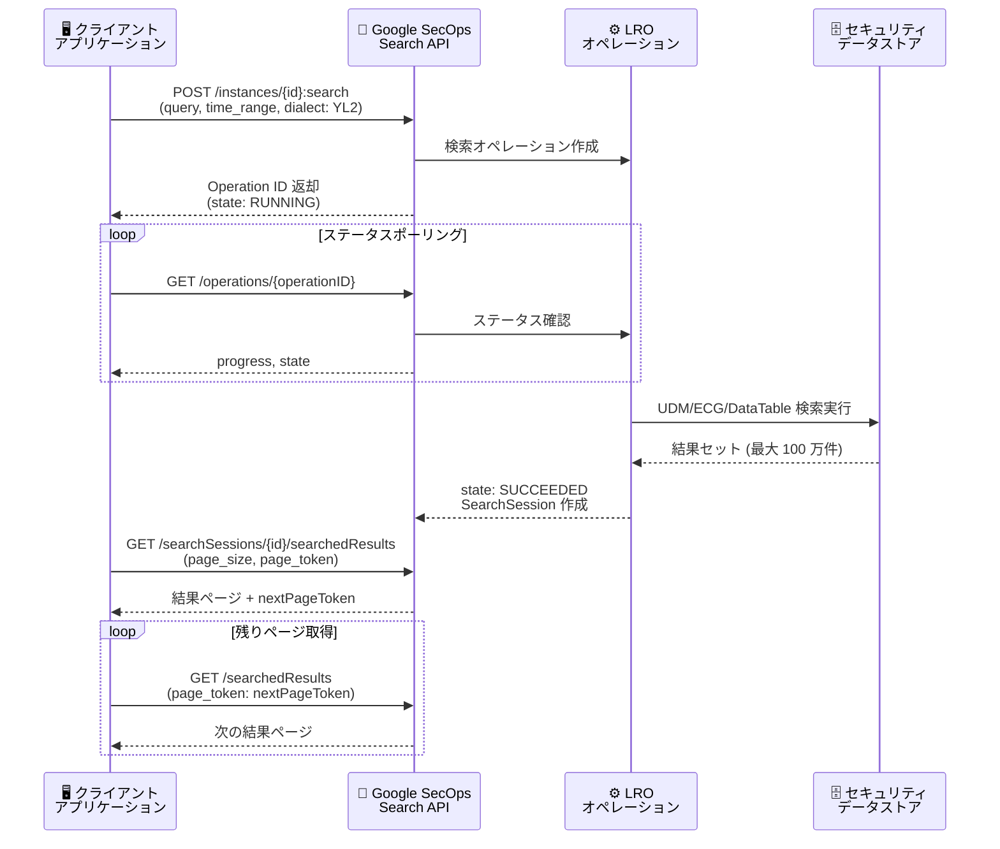

# Google SecOps SIEM: Asynchronous Search APIs

**リリース日**: 2026-06-12

**サービス**: Google SecOps SIEM

**機能**: Asynchronous Search APIs (非同期検索 API)

**ステータス**: Announcement

📊 [このアップデートのインフォグラフィックを見る](https://takech9203.github.io/google-cloud-news-summary/20260612-google-secops-async-search-apis.html)

## 概要

Google Security Operations (SecOps) SIEM プラットフォームに、大規模データセット向けの非同期検索 API (Asynchronous Search APIs) が発表された。この API は Long-Running Operation (LRO) パターンを採用しており、最大 100 万件の結果を返す長時間実行クエリを、アプリケーションをブロックすることなく実行できる。

従来の同期型検索 API ではクエリのタイムアウト制限 (API 経由で 10 分) があり、大規模なデータセットに対する包括的な検索が困難だった。新しい非同期検索 API では、クエリを送信するとオペレーション ID が即座に返され、バックグラウンドで検索が実行される。クライアントはオペレーションのステータスをポーリングし、完了後にページネーション付きで結果を取得できる。

対象データソースは UDM (Unified Data Model) イベント、検知 (Detections)、データテーブル、および Entity Context Graph (ECG) であり、セキュリティアナリストや自動化システムが大規模なセキュリティデータを効率的に処理するためのプログラマティックアクセスを提供する。

**アップデート前の課題**

- 同期型 API ではクエリタイムアウトが 10 分に制限されており、大規模データセットの検索が完了しないことがあった
- 大量の結果を一度に取得しようとするとアプリケーションがブロックされ、ユーザー体験が低下していた
- API 経由での検索結果取得量に実質的な制約があり、包括的なセキュリティ調査の自動化が困難だった

**アップデート後の改善**

- LRO パターンにより、長時間実行クエリがアプリケーションをブロックしなくなった
- 最大 100 万件の結果を取得可能 (UDM イベント、ECG、データテーブル、UDM ジョインなど)
- ページネーションにより、大量の結果を管理可能な単位で効率的に取得できるようになった
- オペレーション ID によるステータス追跡で、非同期ワークフローの構築が容易になった

## アーキテクチャ図



非同期検索 API のフローを示すシーケンス図。クライアントはクエリを送信してオペレーション ID を受け取り、ステータスをポーリングして完了を確認した後、ページネーションで結果を取得する。

## サービスアップデートの詳細

### 主要機能

1. **非ブロッキングクエリ実行**
   - クエリ送信時に即座にオペレーション ID が返される
   - バックグラウンドで検索が実行され、アプリケーションは他の処理を継続可能
   - `google.longrunning.Operation` オブジェクトとして管理される

2. **大規模結果セットの処理**
   - 最大 100 万件の結果を取得可能 (`result_limit` パラメータ、デフォルト 10,000)
   - UDM イベント、データテーブル、Entity Context Graph (ECG) からの検索に対応
   - UDM-UDM ジョイン、UDM-ECG ジョイン、UDM-データテーブルジョインにも対応

3. **ページネーション付き結果取得**
   - `page_size` パラメータで 1 ページあたりの結果数を指定 (デフォルト 100、最大 10,000)
   - `page_token` による次ページの取得
   - `order_by` による結果のソート (データソースごとに異なるフィールドをサポート)
   - `skip` パラメータによる結果のオフセット

4. **オペレーション管理**
   - `GetOperation` メソッドによるステータス確認 (`RUNNING` / `SUCCEEDED` / エラー)
   - `ListOperations` メソッドによる過去 24 時間のオペレーション一覧取得
   - `progress` フィールドによる進捗率の確認
   - `expireTime` フィールドによるオペレーションの有効期限確認

## 技術仕様

### API エンドポイント

| ステップ | メソッド | エンドポイント |
|----------|----------|----------------|
| 検索開始 | POST | `/{version}/projects/{project}/locations/{location}/instances/{instance}:search` |
| ステータス確認 | GET | `/{version}/projects/{project}/locations/{location}/instances/{instance}/operations/{operationID}` |
| 結果取得 | GET | `/{version}/{parent=projects/*/locations/*/instances/*/searchSessions/*}/searchedResults` |
| オペレーション一覧 | GET | `/{version}/projects/{project}/locations/{location}/instances/{instance}` |

### データソース別結果上限

| データソース | 最大結果数 |
|-------------|-----------|
| UDM search | 1,000,000 |
| ECG search | 1,000,000 |
| Data table search | 1,000,000 |
| UDM to UDM join | 1,000,000 |
| UDM to ECG join | 1,000,000 |
| UDM to Data table join | 1,000,000 |
| Stats | 100,000 |
| Detections | 100,000 |

### SearchRequest パラメータ

```json
{
  "parent": "projects/PROJECT_NUMBER/locations/LOCATION/instances/INSTANCE_ID",
  "query": "metadata.event_type = \"USER_LOGIN\"",
  "time_range": {},
  "start_time": "2026-03-16T14:40:13Z",
  "endTime": "2026-03-16T15:40:13Z",
  "dialect": "YL2",
  "result_limit": 1000000
}
```

### 必要な IAM 権限

| アクション | 必要な権限 |
|-----------|-----------|
| 検索の開始 | `chronicle.searchSessions.search` |
| 結果の取得 | `chronicle.searchedResults.list` (SearchSession リソース) |

対応するロール: Chronicle API Viewer、Chronicle API Editor、Chronicle API Admin

## 設定方法

### 前提条件

1. Google SecOps インスタンスが有効化されていること
2. 呼び出し元のプリンシパルに適切な IAM 権限が付与されていること
3. API 認証用の Google Developer Service Account Credential が設定されていること

### 手順

#### ステップ 1: 検索の開始

```bash
# POST リクエストで検索を開始
curl -X POST \
  -H "Authorization: Bearer $(gcloud auth print-access-token)" \
  -H "Content-Type: application/json" \
  -d '{
    "query": "metadata.event_type = \"USER_LOGIN\"",
    "time_range": {},
    "start_time": "2026-06-01T00:00:00Z",
    "endTime": "2026-06-12T00:00:00Z",
    "dialect": "YL2",
    "result_limit": 1000000
  }' \
  "https://chronicle.googleapis.com/v1alpha/projects/PROJECT/locations/LOCATION/instances/INSTANCE:search"
```

レスポンスからオペレーション ID を取得する。`state: RUNNING` は検索が進行中であることを示す。

#### ステップ 2: オペレーションのモニタリング

```bash
# GetOperation でステータスを確認
curl -X GET \
  -H "Authorization: Bearer $(gcloud auth print-access-token)" \
  "https://chronicle.googleapis.com/v1alpha/projects/PROJECT/locations/LOCATION/instances/INSTANCE/operations/OPERATION_ID"
```

`done: true` かつ `state: SUCCEEDED` が返されるまでポーリングする。レスポンスに含まれる `SearchSession` リソース名を次のステップで使用する。

#### ステップ 3: 結果の取得 (ページネーション)

```bash
# ListSearchedResults で結果をページ単位で取得
curl -X GET \
  -H "Authorization: Bearer $(gcloud auth print-access-token)" \
  "https://chronicle.googleapis.com/v1alpha/projects/PROJECT/locations/LOCATION/instances/INSTANCE/searchSessions/SESSION_ID/searchedResults?page_size=1000"
```

`nextPageToken` が空になるまでリクエストを繰り返し、全結果を取得する。

## メリット

### ビジネス面

- **セキュリティ調査の効率化**: 大規模なデータセットに対する包括的な検索が可能になり、脅威ハンティングやインシデント対応の質が向上する
- **自動化ワークフローの構築**: ノンブロッキングな API により、SOAR プラットフォームやカスタムツールとの統合が容易になる
- **コンプライアンス対応**: 大量のセキュリティイベントに対する監査やレポート生成を効率的に実行できる

### 技術面

- **スケーラビリティ**: 最大 100 万件の結果を処理でき、従来の同期型 API の制約を超える
- **リソース効率**: 非同期実行によりクライアント側のリソース消費を最小化
- **柔軟な結果処理**: ページネーション、ソート、スキップにより、大量データの効率的な処理が可能

## デメリット・制約事項

### 制限事項

- LRO API は統計 (statistics) と集計 (aggregations) をサポートしていない
- Stats の結果上限は 100,000 件に制限される
- Detections の結果上限は 100,000 件に制限される
- API の検索クエリレート制限 (QPH: 2,000、同時実行: 180) は引き続き適用される

### 考慮すべき点

- ポーリング間隔の設計が必要 (過剰なポーリングはレート制限に抵触する可能性がある)
- オペレーション結果には有効期限 (`expireTime`) があり、期限内に結果を取得する必要がある
- 大規模クエリの場合、完了までに時間がかかるため、適切なタイムアウト設計が必要

## ユースケース

### ユースケース 1: 大規模なセキュリティ監査

**シナリオ**: コンプライアンス要件により、過去 30 日間の全ユーザーログインイベントを監査レポートとしてエクスポートする必要がある。

**実装例**:
```json
{
  "query": "metadata.event_type = \"USER_LOGIN\"",
  "start_time": "2026-05-12T00:00:00Z",
  "endTime": "2026-06-12T00:00:00Z",
  "dialect": "YL2",
  "result_limit": 1000000
}
```

**効果**: 従来は時間範囲を細かく分割して複数回のクエリが必要だったが、非同期 API により単一のクエリで最大 100 万件のイベントを取得でき、監査プロセスが大幅に簡素化される。

### ユースケース 2: SOAR プレイブックとの統合

**シナリオ**: セキュリティインシデント発生時に、SOAR プレイブックが自動的に関連する全イベントを収集し、インシデントのタイムラインを構築する。

**効果**: 非同期 API によりプレイブックの実行がブロックされないため、並行して他のアクション (通知、隔離など) を実行しながらデータ収集を進められる。

### ユースケース 3: Entity Context Graph を活用した脅威ハンティング

**シナリオ**: 特定の不審なドメインに関連する全エンティティ (IP アドレス、ユーザー、アセット) を ECG から包括的に検索し、攻撃の影響範囲を特定する。

**効果**: ECG の豊富なコンテキストデータ (prevalence、first-seen/last-seen、Google Threat Intelligence 連携) を活用した大規模な脅威ハンティングが、タイムアウトを心配せずに実行可能になる。

## 料金

Google Security Operations は パッケージベースのインジェスション課金モデルを採用している。非同期検索 API は Google SecOps プラットフォームの一部として提供され、追加料金なしで利用可能。

| パッケージ | 主な特徴 |
|-----------|---------|
| Standard | 基本的な SIEM/SOAR 機能、12 か月のホットデータ保持、1,000 シングルイベントルール |
| Enterprise | UEBA、Google キュレーション検知、Gemini in Security Operations |
| Enterprise Plus | Applied Threat Intelligence、拡張検知ルール (3,500)、BigQuery UDM ストレージ |

詳細な料金については [Google Security Operations 料金ページ](https://cloud.google.com/security/products/security-information-event-management) を参照。

## 関連サービス・機能

- **Google SecOps SOAR**: 非同期検索 API と連携し、自動化されたインシデント対応ワークフローを構築
- **Entity Context Graph (ECG)**: UDM イベントからエンティティの関係性を構築し、非同期検索で横断的に照会可能
- **Google Threat Intelligence (GTI)**: Mandiant、VirusTotal、Google 脅威インテリジェンスとの統合により、検索結果にコンテキストを付加
- **BigQuery**: UDM データの BigQuery エクスポートと組み合わせて、さらに高度な分析やカスタムレポートを生成
- **Data Tables**: YARA-L クエリ結果をデータテーブルに書き出し、後続の検索やルールで参照リストとして活用

## 参考リンク

- 📊 [インフォグラフィック](https://takech9203.github.io/google-cloud-news-summary/20260612-google-secops-async-search-apis.html)
- [公式リリースノート](https://docs.google.com/release-notes#June_12_2026)
- [Asynchronous Search APIs ドキュメント](https://docs.cloud.google.com/chronicle/docs/investigation/search-lro-api)
- [Google SecOps Search API リファレンス](https://docs.cloud.google.com/chronicle/docs/reference/search-api)
- [UDM Search ドキュメント](https://docs.cloud.google.com/chronicle/docs/investigation/udm-search)
- [Entity Context Graph (ECG) ドキュメント](https://docs.cloud.google.com/chronicle/docs/event-processing/entity-graph)
- [Data Tables ドキュメント](https://docs.cloud.google.com/chronicle/docs/investigation/data-tables)
- [料金ページ](https://cloud.google.com/security/products/security-information-event-management)
- [Google SecOps REST API Reference v1alpha](https://docs.cloud.google.com/chronicle/docs/reference/rest/v1alpha)

## まとめ

Google SecOps SIEM の Asynchronous Search APIs は、大規模なセキュリティデータセットに対するプログラマティックなアクセスを根本的に改善するアップデートである。LRO パターンの採用により最大 100 万件の結果をノンブロッキングで取得でき、セキュリティオペレーションの自動化と大規模なインシデント調査のワークフロー構築が大幅に容易になる。特に SOAR 連携や自動脅威ハンティングを行っている組織は、既存の同期型検索を非同期 API に移行することで、より包括的かつ効率的なセキュリティ運用が実現できる。

---

**タグ**: #GoogleSecOps #SIEM #AsyncAPI #LRO #UDM #ECG #ThreatHunting #SecurityOperations #SearchAPI
