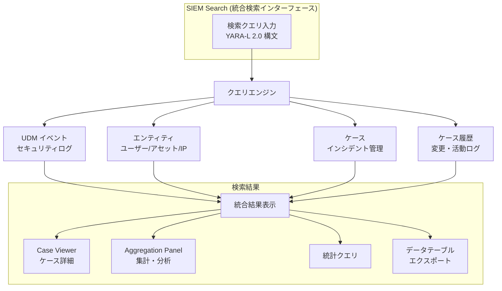

# Google SecOps: SIEM Search でのケース検索機能

**リリース日**: 2026-06-12

**サービス**: Google SecOps

**機能**: SIEM Search でのケースおよびケース履歴の検索 (Spotlight Feature)

**ステータス**: Feature (GA)

[このアップデートのインフォグラフィックを見る](https://takech9203.github.io/google-cloud-news-summary/20260612-google-secops-siem-search-cases.html)

## 概要

Google SecOps の SIEM Search に、ケースおよびケース履歴の検索機能が正式に追加されました。これにより、セキュリティアナリストは単一の SIEM Search インターフェースから UDM イベント、エンティティ、ケース、ケース履歴を横断的に検索できるようになります。

この機能は、SIEM（Security Information and Event Management）と SOAR（Security Orchestration, Automation, and Response）のデータを統合的に検索・相関分析することを目的としています。セキュリティアナリストがインシデント対応において、複数のインターフェース間を行き来する必要がなくなり、ワークフローが大幅に効率化されます。

対象ユーザーは、日常的にセキュリティテレメトリの分析やインシデント対応に携わるセキュリティアナリスト、SOC（Security Operations Center）チームメンバーです。

**アップデート前の課題**

従来、Google SecOps ではケース情報の検索と UDM イベントの検索が異なるインターフェースで行われていました。

- SIEM Search は UDM イベントとアラートの検索に限定されており、ケースデータへのアクセスには SOAR Search や別のケース管理画面への切り替えが必要だった
- セキュリティイベントとケース情報を相関分析する際に、複数のツール間でコンテキストスイッチが頻繁に発生し、調査効率が低下していた
- インシデントの全体像を把握するために、異なるインターフェースからの情報を手動で突き合わせる作業が発生していた

**アップデート後の改善**

- 単一の SIEM Search インターフェースから UDM イベント、エンティティ、ケース、ケース履歴を統合的に検索可能になった
- ケースの詳細情報とセキュリティデータを直接相関させることで、コンテキストスイッチが削減され、インシデント対応が加速された
- YARA-L 2.0 構文を使用したケースおよびケース履歴への高度なクエリが可能になり、統計分析やデータテーブルへのエクスポートにも対応した

## アーキテクチャ図



SIEM Search が統合検索ハブとして機能し、UDM イベント、エンティティ、ケース、ケース履歴の4つのデータソースに対して単一のクエリインターフェースからアクセスできるアーキテクチャを示しています。

## サービスアップデートの詳細

### 主要機能

1. **統合検索エクスペリエンス**
   - 単一の SIEM Search インターフェースから UDM イベント、エンティティ、ケース、ケース履歴を横断検索
   - YARA-L 2.0 構文を使用した高度なクエリ構築が可能
   - 検索結果は最大 1,000,000 件まで対応

2. **SIEM-SOAR データ相関分析**
   - ケースの詳細情報とセキュリティテレメトリを直接リンク
   - アラートに関連するケースの状況や履歴を即座に確認可能
   - インシデントタイムラインの包括的な構築を支援

3. **Case Viewer によるケース詳細表示**
   - 検索結果から直接ケースの詳細ビューを開くことが可能
   - Column Manager によるカスタマイズ可能な結果表示
   - Aggregation Panel による検索結果のフィールド値の集約・分布表示

4. **統計分析とデータエクスポート**
   - ケースデータに対する統計クエリ（count 等）の実行
   - 検索結果のデータテーブルへのエクスポート機能
   - さらなる分析のためのデータ活用が可能

## 技術仕様

### 検索クエリの仕様

| 項目 | 詳細 |
|------|------|
| クエリ構文 | YARA-L 2.0 |
| ケース検索結果上限 | 1,000,000 件 |
| ケースフィールドプレフィックス | `case.` |
| ケース履歴フィールドプレフィックス | `case_history.` |
| API サポート | 非同期検索 API 対応 |

### クエリ例

```
# オープン中のケースを検索
case.status = "OPENED"

# 特定のアクティビティタイプを含むケースを検索
case.wall_activities.activity_type = "CASE_ALERT_DATA"

# アラートとエンティティが関連付けられたケースを検索
case.alerts.metadata.id != "" AND case.alerts.entities.name != ""

# ケース履歴で優先度変更を検索
case_history.case_activity = "PRIORITY_CHANGE" AND case_history.assignee.name != ""

# ケース履歴で情報優先度のエントリを検索
case_history.priority = "PRIORITY_INFO"
```

### 制限事項

| 制限項目 | 詳細 |
|----------|------|
| アラート・壁アクティビティ・タスク | ケース検索結果からケースページへピボット後のみ表示可能 |
| ケース管理操作 | Search インターフェース内での編集・変更は不可（読み取り専用） |
| クロスリソース結合 | ケースとケース履歴間、または同一リソースタイプ内の結合は非対応 |
| 活動ヒートマップ | ケースおよびケース履歴検索では利用不可 |
| カスタムフィールド | ケースおよびケース履歴検索では非対応 |

## 設定方法

### 前提条件

1. Google SecOps のアクティブなサブスクリプション
2. SIEM Search へのアクセス権限を持つユーザーアカウント

### 手順

#### ステップ 1: SIEM Search へのアクセス

Google SecOps コンソールのナビゲーションバーから **Investigation > Search** を選択して SIEM Search ページにアクセスします。

#### ステップ 2: ケース検索クエリの実行

```
# 例: 全てのオープンケースを検索
case.status = "OPENED"
```

検索フィールドに `case.` プレフィックスを使用してケースフィールドを指定し、**Run search** をクリックして実行します。

#### ステップ 3: ケース履歴の検索

```
# 例: 特定期間の優先度変更履歴を検索
case_history.case_activity = "PRIORITY_CHANGE"
```

`case_history.` プレフィックスを使用してケース履歴フィールドを指定します。

#### ステップ 4: 統計分析の実行

```
# ケース数のカウント
# クエリ: case.display_name != ""
# アウトカム: $case_count = count(case.display_name)
```

統計クエリを使用して、ケースデータの集計分析を行います。

## メリット

### ビジネス面

- **インシデント対応時間の短縮**: 単一インターフェースでの統合検索により、コンテキストスイッチが削減され、MTTR（平均復旧時間）の改善が期待できる
- **SOC 運用効率の向上**: アナリストが複数のツールを行き来する必要がなくなり、チーム全体の生産性が向上する
- **意思決定の質の向上**: セキュリティデータとケース情報の即時相関により、より正確で迅速な判断が可能になる

### 技術面

- **統一クエリ言語**: YARA-L 2.0 構文によるケース検索で、既存の UDM 検索スキルをそのまま活用可能
- **プログラマティック API 対応**: 非同期検索 API を通じた自動化やインテグレーションが可能
- **大規模データ対応**: 最大 100 万件のケース・ケース履歴レコードに対する検索をサポート

## デメリット・制約事項

### 制限事項

- ケースデータは SIEM Search 内では読み取り専用であり、ケースの作成・編集はケースモジュールで行う必要がある
- アラート、壁アクティビティ、タスクは検索結果ビューでは直接表示されず、ケースページへのピボットが必要
- クロスリソース結合（例: ケースとケース履歴の結合）は現在サポートされていない

### 考慮すべき点

- カスタムフィールドがケース検索では利用できないため、カスタムフィールドに依存したワークフローには影響がある
- 直接的なケースルックアップ機能は提供されないため、ケース ID で直接アクセスする場合は従来の方法を併用する必要がある
- Prevalence（普及率）や活動ヒートマップはケース検索結果では利用できない

## ユースケース

### ユースケース 1: トリアージとケース優先度付け

**シナリオ**: SOC チームが大量のオープンケースの中から、重要度の高いインシデントを迅速に特定し、対応優先順位を決定する必要がある場合。

**実装例**:
```
# 特定のアラートとエンティティが関連付けられたオープンケースを検索
case.status = "OPENED" AND case.alerts.metadata.id != "" AND case.alerts.entities.name != ""
```

**効果**: ステータス、アクティビティ、関連アラートに基づいてケースを効率的に特定・優先付けし、最も重要なインシデントに即座にフォーカスできる。

### ユースケース 2: エンティティのタイムライン調査

**シナリオ**: 特定のユーザーアカウントに関連する不審なアクティビティが検出された際に、そのエンティティに関連するケース履歴とセキュリティイベントを時系列で追跡し、包括的なインシデントタイムラインを構築する。

**実装例**:
```
# 特定のアサイニーに関連するケース履歴の優先度変更を追跡
case_history.case_activity = "PRIORITY_CHANGE" AND case_history.assignee.name != ""
```

**効果**: ケースデータと UDM イベント・エンティティなどのセキュリティテレメトリを相関させることで、インシデントの包括的なタイムラインを構築し、より深い洞察に基づいた判断が可能になる。

### ユースケース 3: ケースデータの統計分析とレポーティング

**シナリオ**: セキュリティマネージャーが特定期間のケース傾向を分析し、SOC チームのパフォーマンス指標やインシデント傾向レポートを作成する。

**実装例**:
```
# ケース数のカウント
# クエリ: case.display_name != ""
# アウトカム: $case_count = count(case.display_name)

# データテーブルへのエクスポート
# クエリ: case.name != ""
# アウトカム & エクスポート: 
# outcome: $x = case.name 
# export: %new_case_table.write_row( testing: $x )
```

**効果**: ケースデータの統計分析とデータテーブルへのエクスポートにより、SOC の運用レポートやトレンド分析を自動化できる。

## 料金

Google SecOps の料金体系に包含されます。SIEM Search でのケース検索機能は Google SecOps サブスクリプションの一部として提供され、追加料金は発生しません。具体的な料金については Google Cloud の営業担当にお問い合わせください。

## 関連サービス・機能

- **Google SecOps SOAR Search**: 従来のケース・エンティティ検索機能。フリーテキスト検索やフィールドベースの検索に対応し、SIEM Search とは異なるアプローチでケースにアクセス可能
- **Google SecOps UDM Search**: UDM イベントとアラートの検索基盤。今回のケース検索はこの既存機能を拡張する形で提供
- **Google SecOps Detection Engine (YARA-L)**: 検出ルールエンジン。ケース検索と同じ YARA-L 2.0 構文を使用
- **Google SecOps Data Tables**: 検索結果のエクスポート先として連携し、さらなるデータ分析を可能にする
- **Entity Context Graph (ECG)**: エンティティのコンテキスト情報を提供し、ケース情報と組み合わせた包括的な調査を支援

## 参考リンク

- [インフォグラフィック](https://takech9203.github.io/google-cloud-news-summary/20260612-google-secops-siem-search-cases.html)
- [公式リリースノート](https://docs.google.com/release-notes#June_12_2026)
- [ドキュメント: Search cases and case history](https://docs.cloud.google.com/chronicle/docs/investigation/search-and-search-case-history)
- [ドキュメント: Search for events and alerts](https://docs.cloud.google.com/chronicle/docs/investigation/udm-search)
- [ドキュメント: Use SOAR Search](https://docs.cloud.google.com/chronicle/docs/soar/investigate/search/working-with-search-screen)
- [Search API ドキュメント](https://docs.cloud.google.com/chronicle/docs/reference/search-api)

## まとめ

Google SecOps の SIEM Search にケースおよびケース履歴の検索機能が追加されたことで、セキュリティアナリストは単一のインターフェースから SIEM データと SOAR データを統合的に検索・分析できるようになりました。これはインシデント対応の効率化と調査品質の向上に直接貢献する重要なアップデートです。既に Google SecOps を利用中の組織は、この統合検索機能を活用してワークフローの最適化を検討することを推奨します。

---

**タグ**: #GoogleSecOps #SIEM #SOAR #SecurityOperations #CaseManagement #UDM #IncidentResponse #ThreatInvestigation #GA
