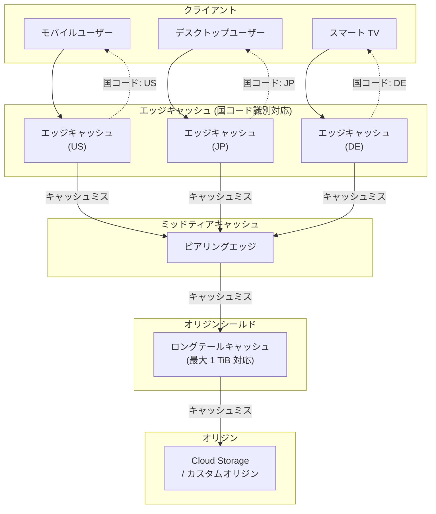

# Media CDN: キャッシュ可能オブジェクトサイズ上限拡大 (最大 1 TiB) およびエッジキャッシュ国コード識別

**リリース日**: 2026-06-12

**サービス**: Media CDN

**機能**: キャッシュ可能オブジェクトサイズの上限拡大 (最大 1 TiB) / エッジキャッシュの国コード識別

**ステータス**: GA (一般提供)

[このアップデートのインフォグラフィックを見る](https://takech9203.github.io/google-cloud-news-summary/20260612-media-cdn-cacheable-size-country-codes.html)

## 概要

Google Cloud の Media CDN に 2 つの重要な機能強化が GA として提供開始された。1 つ目は、キャッシュ可能なオブジェクトの最大サイズを従来の 100 GiB から最大 1 TiB まで拡大できるようになった点である。2 つ目は、クライアントリクエストを処理するエッジキャッシュの国コードを識別できるようになった点である。

これらの機能強化により、大容量メディアファイル (4K/8K 動画、ゲームパッケージ、ソフトウェア配布など) のキャッシュ配信が可能になるとともに、コンテンツ配信のジオロケーション分析やコンプライアンス対応が容易になる。メディア配信、ゲーム配信、ソフトウェアアップデート配信などの大規模コンテンツ配信を行う組織に特に有用なアップデートである。

**アップデート前の課題**

- キャッシュ可能なオブジェクトの最大サイズが 100 GiB に制限されており、それを超えるファイルはキャッシュ不可 (uncacheable) として扱われていた
- 100 GiB を超える大容量ファイルのリクエストはすべてオリジンサーバーに転送され、オリジン負荷とレイテンシが増大していた
- エッジキャッシュがどの国に配置されているかを識別する手段がなく、コンテンツがどの地域から配信されているかの可視性が不足していた
- データレジデンシーやコンプライアンス要件に対応するためにエッジキャッシュの地理的な配信状況を把握することが困難だった

**アップデート後の改善**

- キャッシュ可能なオブジェクトの最大サイズが最大 1 TiB まで拡大可能になり、超大容量ファイルもエッジキャッシュから配信できるようになった
- オリジンサーバーへの負荷が大幅に軽減され、大容量コンテンツ配信時のレイテンシが改善された
- エッジキャッシュの国コードを識別できるようになり、コンテンツ配信の地理的分布を把握・制御可能になった
- カスタムヘッダー機能と組み合わせることで、地域別のコンテンツ配信ポリシーの実装やコンプライアンス対応が容易になった

## アーキテクチャ図



Media CDN の多層キャッシュアーキテクチャにおいて、エッジキャッシュが最大 1 TiB のオブジェクトをキャッシュ可能になり、各エッジキャッシュの国コードがカスタムヘッダーを通じて識別可能になった。

## サービスアップデートの詳細

### 主要機能

1. **キャッシュ可能オブジェクトサイズの上限拡大 (最大 1 TiB)**
   - 従来の 100 GiB 上限から最大 1 TiB (1,024 GiB) まで拡大可能
   - 上限引き上げには Google サポートへの連絡が必要 (デフォルトは 100 GiB のまま)
   - バイトレンジリクエストによるチャンク取得メカニズムとの連携で効率的なキャッシュ充填を実現
   - オリジンはバイトレンジリクエストをサポートする必要がある (1 MiB を超えるオブジェクトの場合)

2. **エッジキャッシュの国コード識別**
   - クライアントリクエストを処理しているエッジキャッシュの国コードを識別可能
   - カスタムヘッダー機能を通じてレスポンスヘッダーに国コード情報を含めることが可能
   - コンテンツ配信の地理的分布を可視化し、コンプライアンス要件に対応可能
   - 既存の `{client_region}` (クライアントの国コード) とは異なり、配信元エッジキャッシュの所在国を示す

## 技術仕様

### キャッシュ可能オブジェクトサイズ

| 項目 | 従来の値 | 新しい値 |
|------|----------|----------|
| 最大キャッシュ可能オブジェクトサイズ (デフォルト) | 100 GiB | 100 GiB |
| 最大キャッシュ可能オブジェクトサイズ (上限引き上げ後) | - | 1 TiB (1,024 GiB) |
| 最大キャッシュ不可レスポンスサイズ | 10,239 MiB | 10,239 MiB |
| Livestream expansion 有効時の最大キャッシュサイズ | 25 MiB | 25 MiB |

### カスタムヘッダー変数 (地理情報関連)

| 変数 | 説明 | リクエストヘッダー | キャッシュキー | レスポンスヘッダー |
|------|------|:--:|:--:|:--:|
| `client_region` | クライアント IP に関連付けられた国/地域コード (ISO-3166-1 alpha-2) | 対応 | 対応 | 対応 |
| `client_region_subdivision` | クライアント IP に関連付けられた行政区分 (ISO-3166-2) | 対応 | 対応 | 対応 |
| `client_city` | リクエスト元の都市名 | 対応 | - | 対応 |
| `cdn_cache_status` | キャッシュノードの場所 (IATA コード) とステータス | - | - | 対応 |

### オリジン要件 (大容量ファイルキャッシュ)

1 MiB を超えるオブジェクトをキャッシュするには、オリジンが以下を返す必要がある:

```yaml
# オリジンレスポンスに必要なヘッダー
Last-Modified: <timestamp>  # または ETag
Date: <valid HTTP date>
Content-Length: <object size>
Content-Range: bytes x-y/z   # Range GET リクエストへのレスポンス
```

## 設定方法

### 前提条件

1. Media CDN が有効化された Google Cloud プロジェクト
2. EdgeCacheService リソースが構成済み
3. キャッシュサイズ上限拡大には Google サポートへの連絡が必要

### 手順

#### ステップ 1: キャッシュ可能オブジェクトサイズの上限引き上げリクエスト

キャッシュ可能オブジェクトサイズの上限を 1 TiB に引き上げるには、Google Cloud サポートに連絡する。

```bash
# 現在の Media CDN クォータと制限を確認
gcloud edge-cache services describe SERVICE_NAME \
    --project=PROJECT_ID
```

#### ステップ 2: エッジキャッシュ国コードのカスタムヘッダー設定

```yaml
# EdgeCacheService のルーティング設定例
routeRules:
  - priority: 1
    description: "video routes with edge cache country code"
    matchRules:
      - prefixMatch: "/video/"
    headerAction:
      responseHeadersToAdd:
        # クライアントの国コードをレスポンスヘッダーに追加
        - headerName: "x-client-region"
          headerValue: "{client_region}"
          replace: true
        # キャッシュステータスとロケーション情報を追加
        - headerName: "x-cdn-cache-status"
          headerValue: "{cdn_cache_status}"
          replace: true
```

#### ステップ 3: Terraform による設定例

```hcl
resource "google_network_services_edge_cache_service" "default" {
  name = "media-cdn-service"

  routing {
    path_matcher {
      name = "routes"
      route_rule {
        description = "large file delivery with geo headers"
        priority    = 1
        match_rule {
          prefix_match = "/downloads/"
        }
        origin = google_network_services_edge_cache_origin.default.name
        header_action {
          response_header_to_add {
            header_name  = "x-client-region"
            header_value = "{client_region}"
            replace      = true
          }
          response_header_to_add {
            header_name  = "x-cdn-cache-status"
            header_value = "{cdn_cache_status}"
            replace      = true
          }
        }
      }
    }
  }
}
```

## メリット

### ビジネス面

- **大容量コンテンツのグローバル配信コスト削減**: 最大 1 TiB のファイルをエッジキャッシュから配信できるため、オリジンへのリクエスト数とオリジン帯域幅コストが大幅に削減される
- **コンプライアンス対応の容易化**: エッジキャッシュの国コード識別により、データがどの地域から配信されているかを把握でき、規制要件への対応が容易になる
- **ユーザー体験の向上**: 大容量ファイルもエッジから配信されることで、エンドユーザーのダウンロード速度とレイテンシが改善される

### 技術面

- **オリジン負荷の大幅軽減**: 100 GiB を超えるオブジェクトもキャッシュ対象になることで、オリジンサーバーへのトラフィックが削減される
- **バイトレンジリクエストとの連携**: Media CDN は 2 MiB 単位のバイトレンジリクエストでオブジェクトを取得するため、大容量ファイルでも効率的にキャッシュを充填できる
- **地理的可視性の向上**: エッジキャッシュの国コード情報を活用して、配信パフォーマンスの地域別分析やトラフィックルーティングの最適化が可能

## デメリット・制約事項

### 制限事項

- キャッシュサイズ上限の引き上げはデフォルトでは有効化されず、Google サポートへの連絡が必要
- Livestream expansion 有効時は最大キャッシュサイズが 25 MiB に制限されたままである
- 1 MiB を超えるオブジェクトのキャッシュにはオリジンがバイトレンジリクエストをサポートする必要がある
- キャッシュ不可レスポンスの最大サイズは 10,239 MiB (約 10 GiB) のままである

### 考慮すべき点

- 上限引き上げ後も、キャッシュ対象のオブジェクトはオリジン要件 (ETag/Last-Modified、Content-Length、Content-Range) を満たす必要がある
- エッジキャッシュの容量は有限であるため、非常に大きなオブジェクトはエビクション (追い出し) されやすい可能性がある
- 国コード識別はエッジキャッシュの物理的な配置国を示すものであり、データレジデンシー保証とは異なる

## ユースケース

### ユースケース 1: 大規模ゲーム配信

**シナリオ**: ゲーム開発会社が 200 GiB を超えるゲームクライアントや大容量パッチファイルをグローバルに配信する場合。従来は 100 GiB の上限によりオリジンから直接配信する必要があった。

**実装例**:
```yaml
# EdgeCacheOrigin 設定
originAddress: "storage.googleapis.com/game-distribution-bucket"
protocol: HTTP2
timeout:
  connectTimeout: 5s
  responseTimeout: 60s
  readTimeout: 30s
```

**効果**: 大容量ゲームファイルがエッジキャッシュから配信されることで、ダウンロード速度が向上し、オリジンサーバーへの負荷が軽減される。グローバルリリース時のトラフィックスパイクにも対応可能。

### ユースケース 2: 地域別コンテンツ配信分析とコンプライアンス

**シナリオ**: メディア企業がコンテンツライセンスの地域制限に対応するため、コンテンツがどの国のエッジキャッシュから配信されているかを追跡する必要がある場合。

**実装例**:
```yaml
headerAction:
  responseHeadersToAdd:
    - headerName: "x-served-from-region"
      headerValue: "{client_region}"
      replace: true
    - headerName: "x-cache-location"
      headerValue: "{cdn_cache_status}"
      replace: true
```

**効果**: レスポンスヘッダーを通じて配信元の地理情報を取得でき、ログ分析やモニタリングダッシュボードで地域別の配信状況を可視化できる。

### ユースケース 3: OS / ソフトウェアアップデート配信

**シナリオ**: ソフトウェアベンダーが数百 GiB のアップデートパッケージをグローバルに配布する場合。

**効果**: 1 TiB までのアップデートファイルがエッジにキャッシュされることで、大規模アップデートのロールアウト時にもオリジンの帯域幅を節約しながら高速配信を実現できる。

## 料金

Media CDN の料金は個別見積もりベースで提供される。Cloud CDN とは異なる料金体系を採用しており、詳細については Google Cloud セールスチームへの問い合わせが必要である。

参考として Cloud CDN の公開料金体系:

| カテゴリ | 料金 (USD) |
|----------|-----------|
| Cache Egress (10 TiB 未満) | $0.08/GiB/月〜 |
| Cache Egress (10-150 TiB) | $0.055/GiB/月〜 |
| Cache Egress (150-500 TiB) | $0.03/GiB/月〜 |
| Cache Fill (北米/欧州内) | $0.01/GiB |
| Cache Fill (アジア太平洋/南米/中東/アフリカ内) | $0.02/GiB |
| ルックアップリクエスト | $0.0075/10,000 リクエスト |

Media CDN の料金については [Google Cloud セールスに問い合わせ](https://cloud.google.com/contact) が必要。

## 利用可能リージョン

Media CDN はグローバルサービスであり、世界中のエッジロケーションで利用可能。主要な配信拠点:

- **北米**: アトランタ、シカゴ、ダラス、デンバー、ロサンゼルス、マイアミ、モントリオール、ニューヨーク、フェニックス、サンフランシスコ、シアトル、トロント、ワシントン DC 他
- **欧州**: アムステルダム、フランクフルト、ロンドン、パリ、マドリード、ミラノ、ストックホルム、ワルシャワ、チューリッヒ 他
- **アジア太平洋**: 東京、大阪、シンガポール、香港、ムンバイ、バンコク、ジャカルタ 他
- **南米**: サンパウロ、ブエノスアイレス、サンティアゴ 他
- **中東・アフリカ**: ヨハネスブルグ、テルアビブ、フジャイラ 他

## 関連サービス・機能

- **Cloud CDN**: Google Cloud のウェブアクセラレーション CDN。Media CDN はメディア配信に特化しており、補完関係にある
- **Cloud Storage**: Media CDN のオリジンとして最もよく使用されるストレージサービス。バイトレンジリクエストを完全にサポート
- **Cloud Monitoring / Cloud Logging**: Media CDN のメトリクスとログを収集・分析。エッジキャッシュの国コード情報をログで確認可能
- **CDN Interconnect**: サードパーティ CDN との接続で、Media CDN をマルチ CDN アーキテクチャの一部として活用可能
- **Cloud Armor**: DDoS 保護とセキュリティポリシーを Media CDN と組み合わせて使用可能

## 参考リンク

- [インフォグラフィック](https://takech9203.github.io/google-cloud-news-summary/20260612-media-cdn-cacheable-size-country-codes.html)
- [公式リリースノート](https://docs.cloud.google.com/release-notes#June_12_2026)
- [Media CDN クォータと制限](https://docs.cloud.google.com/media-cdn/quotas)
- [Media CDN カスタムヘッダー](https://docs.cloud.google.com/media-cdn/docs/custom-headers)
- [Media CDN キャッシュの概要](https://docs.cloud.google.com/media-cdn/docs/caching)
- [Media CDN エッジロケーション](https://docs.cloud.google.com/media-cdn/docs/locations)
- [Media CDN 概要](https://docs.cloud.google.com/media-cdn/docs/overview)

## まとめ

今回の Media CDN アップデートにより、キャッシュ可能なオブジェクトサイズが最大 1 TiB まで拡大可能になり、大容量メディア配信のパフォーマンスとコスト効率が大幅に向上する。また、エッジキャッシュの国コード識別機能により、グローバルなコンテンツ配信の可視性とコンプライアンス対応力が強化される。大容量コンテンツを配信する組織は、Google サポートに連絡して上限引き上げを申請することを推奨する。

---

**タグ**: #MediaCDN #CDN #キャッシュ #コンテンツ配信 #大容量ファイル #エッジキャッシュ #ジオロケーション #GA
