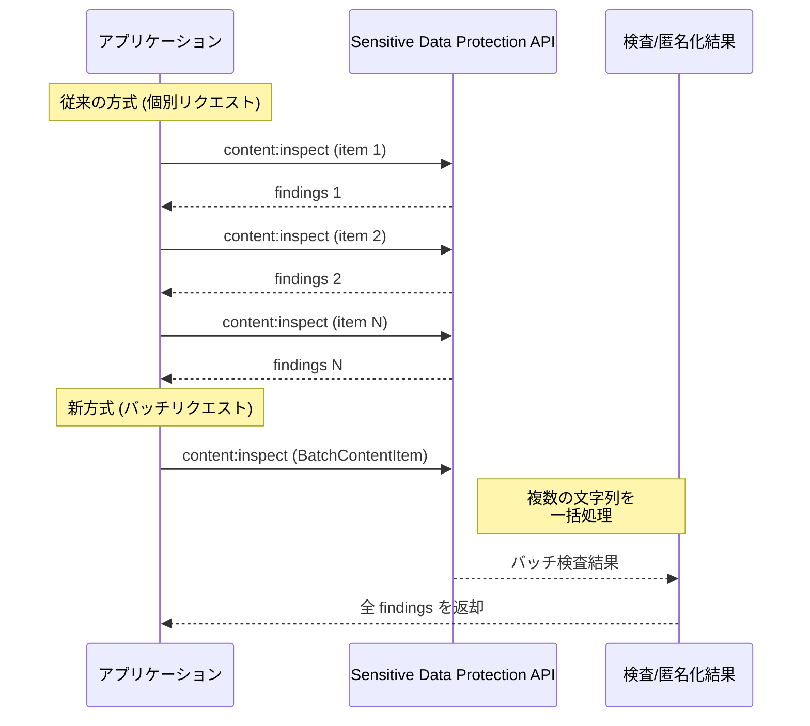

# Sensitive Data Protection: バッチコンテンツの検査・匿名化サポート

**リリース日**: 2026-06-12

**サービス**: Sensitive Data Protection

**機能**: BatchContentItem によるバッチコンテンツの検査・匿名化

**ステータス**: GA (一般提供)

[このアップデートのインフォグラフィックを見る](https://takech9203.github.io/google-cloud-news-summary/20260612-sensitive-data-protection-batched-content.html)

## 概要

Google Cloud の Sensitive Data Protection (旧 Cloud DLP) に、バッチコンテンツの検査 (inspect) および匿名化 (de-identify) をサポートする新機能が追加されました。新たに導入された `BatchContentItem` を `ContentItem` リクエストに含めることで、複数の文字列データを単一の API リクエストで一括処理できるようになります。

この機能は、大量のテキストデータを効率的に処理する必要があるアプリケーションやパイプラインにとって重要なアップデートです。従来は個別の API リクエストで各コンテンツを処理する必要がありましたが、バッチ処理により API 呼び出しのオーバーヘッドが大幅に削減されます。

対象ユーザーは、リアルタイムまたはニアリアルタイムでコンテンツ検査・匿名化を行うアプリケーション開発者、データパイプラインエンジニア、セキュリティ・コンプライアンス担当者です。

**アップデート前の課題**

- 複数のテキストデータを検査・匿名化する際、各コンテンツごとに個別の API リクエストを送信する必要があった
- 大量のコンテンツを処理する場合、API 呼び出し回数が増加し、レイテンシとオーバーヘッドが大きかった
- リクエスト数に応じた API クォータの消費が早く、スロットリングの原因となっていた

**アップデート後の改善**

- `BatchContentItem` を使用して、複数の文字列データを 1 回の API リクエストで一括検査・匿名化が可能になった
- API 呼び出し回数の削減により、ネットワークオーバーヘッドとレイテンシが大幅に低減された
- パイプラインの実装がシンプルになり、エラーハンドリングやリトライロジックの複雑さが軽減された

## アーキテクチャ図



従来は N 個のコンテンツに対して N 回の API 呼び出しが必要でしたが、`BatchContentItem` を使用することで 1 回のリクエストで複数コンテンツを処理できるようになりました。

## サービスアップデートの詳細

### 主要機能

1. **BatchContentItem**
   - `ContentItem` の `data_item` ユニオンフィールドに新たに追加されたオプション
   - 複数のコンテンツアイテムをバッチとして表現し、単一リクエストで送信可能
   - `stringValueBatch` フィールドで文字列データのバッチを指定

2. **StringValueBatch**
   - バッチ内の文字列値のコレクションを表現するオブジェクト
   - `values[]` フィールドに検査・匿名化対象の複数の文字列を配列として格納
   - `content:inspect` および `content:deidentify` の両方のメソッドで使用可能

3. **ContentMetadata との連携**
   - `ContentItem` の `contentMetadata` フィールドを使用して、バッチコンテンツにメタデータを付与可能
   - `KeyValueMetadataProperty` によるキーバリューペアでコンテキスト情報を追加

## 技術仕様

### ContentItem スキーマ

| 項目 | 詳細 |
|------|------|
| フィールド名 | `batchContentItem` |
| 親オブジェクト | `ContentItem.data_item` (union field) |
| 型 | `BatchContentItem` |
| バッチ形式 | `StringValueBatch` (string 配列) |
| 対応メソッド | `content:inspect`, `content:deidentify`, `content:reidentify` |

### ContentItem の data_item ユニオンフィールド

| データ形式 | 説明 |
|------------|------|
| `value` | 単一の文字列データ |
| `table` | テーブル構造データ (最大 50,000 Value) |
| `byteItem` | バイト配列データ |
| `conversation` | 会話データ (最大 50,000 メッセージ) |
| `batchContentItem` | バッチコンテンツ (新規追加) |

### API リクエスト例

```json
{
  "item": {
    "batchContentItem": {
      "stringValueBatch": {
        "values": [
          "お客様のメールアドレスは user@example.com です",
          "クレジットカード番号: 4111-1111-1111-1111",
          "電話番号は 03-1234-5678 です"
        ]
      }
    }
  },
  "inspectConfig": {
    "infoTypes": [
      {"name": "EMAIL_ADDRESS"},
      {"name": "CREDIT_CARD_NUMBER"},
      {"name": "PHONE_NUMBER"}
    ]
  }
}
```

## 設定方法

### 前提条件

1. Google Cloud プロジェクトで Sensitive Data Protection API (DLP API) が有効化されていること
2. 適切な IAM 権限 (`roles/dlp.user` 以上) が付与されていること
3. 認証情報 (サービスアカウントキーまたは ADC) が設定されていること

### 手順

#### ステップ 1: API の有効化

```bash
gcloud services enable dlp.googleapis.com
```

プロジェクトで DLP API を有効化します。

#### ステップ 2: バッチ検査リクエストの送信

```bash
curl -X POST \
  -H "Authorization: Bearer $(gcloud auth print-access-token)" \
  -H "Content-Type: application/json" \
  "https://dlp.googleapis.com/v2/projects/${PROJECT_ID}/content:inspect" \
  -d '{
    "item": {
      "batchContentItem": {
        "stringValueBatch": {
          "values": [
            "My email is test@example.com",
            "Call me at 090-1234-5678"
          ]
        }
      }
    },
    "inspectConfig": {
      "infoTypes": [
        {"name": "EMAIL_ADDRESS"},
        {"name": "PHONE_NUMBER"}
      ]
    }
  }'
```

複数の文字列を含むバッチリクエストを送信し、一括で機密データを検査します。

#### ステップ 3: バッチ匿名化リクエストの送信

```bash
curl -X POST \
  -H "Authorization: Bearer $(gcloud auth print-access-token)" \
  -H "Content-Type: application/json" \
  "https://dlp.googleapis.com/v2/projects/${PROJECT_ID}/content:deidentify" \
  -d '{
    "item": {
      "batchContentItem": {
        "stringValueBatch": {
          "values": [
            "My email is test@example.com",
            "Call me at 090-1234-5678"
          ]
        }
      }
    },
    "deidentifyConfig": {
      "infoTypeTransformations": {
        "transformations": [
          {
            "primitiveTransformation": {
              "replaceWithInfoTypeConfig": {}
            }
          }
        ]
      }
    },
    "inspectConfig": {
      "infoTypes": [
        {"name": "EMAIL_ADDRESS"},
        {"name": "PHONE_NUMBER"}
      ]
    }
  }'
```

バッチ内の全文字列に対して匿名化変換を適用します。

## メリット

### ビジネス面

- **コスト効率の向上**: API 呼び出し回数の削減により、ネットワークコストとレイテンシが低減される
- **スループットの改善**: 大量のデータを処理するパイプラインで、処理速度が向上する
- **運用の簡素化**: バッチ処理により、エラーハンドリングやリトライロジックの実装が単純化される

### 技術面

- **API 呼び出しの効率化**: 複数コンテンツを 1 リクエストにまとめることで、HTTP コネクション確立やTLS ハンドシェイクのオーバーヘッドを削減
- **クォータ管理の改善**: リクエスト数ベースのクォータ消費を抑制し、スロットリングを回避しやすくなる
- **実装のシンプル化**: クライアント側でのリクエスト管理ロジック (キューイング、並行制御等) が不要になる

## デメリット・制約事項

### 制限事項

- 現時点では `StringValueBatch` のみがサポートされており、バイトデータやテーブルデータのバッチ処理は未対応
- バッチ内の個別アイテムに対して異なる検査設定 (InspectConfig) を適用することはできない
- 1 リクエストあたりのペイロードサイズ制限は従来と同様に適用される

### 考慮すべき点

- バッチ内の 1 つのアイテムでエラーが発生した場合のエラーハンドリング戦略を検討する必要がある
- バッチサイズが大きすぎると、レスポンスタイムが長くなる可能性があるため、適切なサイズ設定が重要
- 既存の個別リクエスト方式からの移行には、クライアントコードの変更が必要

## ユースケース

### ユースケース 1: チャットログのリアルタイム検査

**シナリオ**: カスタマーサポートシステムで、複数のチャットメッセージを受信するたびにバッチで機密データを検査する

**実装例**:
```json
{
  "item": {
    "batchContentItem": {
      "stringValueBatch": {
        "values": [
          "お問い合わせありがとうございます。山田太郎様",
          "ご登録のメールアドレス taro.yamada@example.com を確認しました",
          "カード番号下4桁 1234 で照会いたします"
        ]
      }
    }
  },
  "inspectConfig": {
    "infoTypes": [
      {"name": "PERSON_NAME"},
      {"name": "EMAIL_ADDRESS"},
      {"name": "CREDIT_CARD_NUMBER"}
    ]
  }
}
```

**効果**: 個別のメッセージごとに API を呼び出す必要がなくなり、レスポンスタイムが短縮される。カスタマーサポートの品質を維持しながら、PII の漏洩リスクを低減。

### ユースケース 2: ETL パイプラインでのデータ匿名化

**シナリオ**: データウェアハウスへのデータ投入前に、CSV ファイルから抽出した複数のレコードをバッチで匿名化する

**効果**: ETL パイプラインのスループットが向上し、大量データの処理にかかる時間が短縮される。API クォータの効率的な利用が可能。

### ユースケース 3: マイクロサービスでのリクエスト集約

**シナリオ**: 複数のマイクロサービスからのログや入力データを集約し、バッチで機密データ検査を行う

**効果**: 分散システムにおける DLP API 呼び出しを集約することで、API コストの最適化とシステム全体のレイテンシ低減を実現。

## 料金

Sensitive Data Protection のインライン検査・匿名化の料金体系は以下の通りです（バッチ処理も同様の料金体系が適用されます）。

| カテゴリ | 料金 |
|----------|------|
| 1 GB まで | 無料 |
| インラインコンテンツ検査 | $3/GB から（ボリュームディスカウントあり） |
| インラインコンテンツ匿名化 | $2/GB から（ボリュームディスカウントあり） |

バッチ処理では API 呼び出し回数が削減されますが、課金は処理されたバイト数に基づくため、バッチ化による直接的な料金削減はありません。ただし、ネットワークオーバーヘッドの削減により、全体的なインフラコストが低減する可能性があります。

## 関連サービス・機能

- **Cloud Storage の匿名化**: ストレージ内のファイルに対する非同期の匿名化処理。大規模データセット向け
- **Hybrid Inspection**: Google Cloud 外のデータソースに対する検査機能。オンプレミスや他クラウドのデータにも対応
- **Discovery (データプロファイリング)**: BigQuery や Cloud Storage 内のデータを自動的にスキャン・分類
- **Security Command Center**: 検査結果を Security Command Center に統合し、セキュリティ態勢を一元管理

## 参考リンク

- [インフォグラフィック](https://takech9203.github.io/google-cloud-news-summary/20260612-sensitive-data-protection-batched-content.html)
- [公式リリースノート](https://docs.cloud.google.com/release-notes#June_12_2026)
- [ContentItem API リファレンス](https://cloud.google.com/sensitive-data-protection/docs/reference/rest/v2/ContentItem)
- [BatchContentItem リファレンス](https://cloud.google.com/sensitive-data-protection/docs/reference/rest/v2/ContentItem#BatchContentItem)
- [匿名化ガイド](https://cloud.google.com/sensitive-data-protection/docs/deidentify-sensitive-data)
- [料金ページ](https://cloud.google.com/sensitive-data-protection/pricing)

## まとめ

Sensitive Data Protection の `BatchContentItem` サポートにより、複数のテキストコンテンツを単一の API リクエストで効率的に検査・匿名化できるようになりました。特に大量のテキストデータを処理するリアルタイムパイプラインやマイクロサービスアーキテクチャにおいて、API オーバーヘッドの削減とスループット向上が期待できます。既存の `content:inspect` および `content:deidentify` メソッドを利用しているアプリケーションは、`ContentItem` のペイロードを `batchContentItem` 形式に変更するだけで、この新機能を活用できます。

---

**タグ**: #SensitiveDataProtection #DLP #BatchProcessing #ContentInspection #DeIdentification #SecurityCompliance #DataPrivacy
