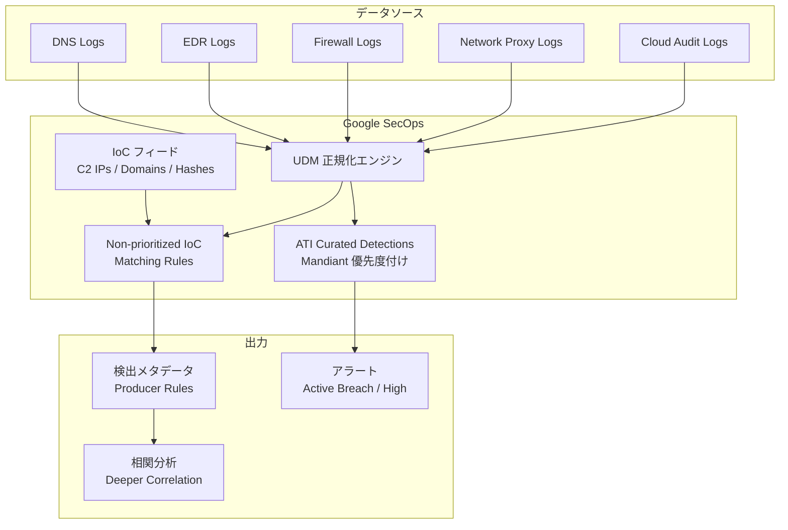

# Google SecOps: Non-prioritized IoC Matching rules Category

**リリース日**: 2026-06-13

**サービス**: Google SecOps

**機能**: Non-prioritized IoC Matching rules Category (Curated Detections)

**ステータス**: GA (Enterprise Plus)

📊 [このアップデートのインフォグラフィックを見る](https://takech9203.github.io/google-cloud-news-summary/20260613-google-secops-non-prioritized-ioc-matching-rules.html)

## 概要

Google SecOps に新しい Curated Detections カテゴリ「Non-prioritized IoC Matching rules」が導入された。この機能は、Google の Indicators of Compromise (IoC) フィードと統合され、キュレートされた脅威インテリジェンスを基盤として、Google SecOps 環境内の悪意あるアクティビティを特定する。特に IP アドレス、ドメイン、ファイルハッシュなどの高信頼性インジケーターを通じて識別可能な脅威に焦点を当てている。

このルールカテゴリは、標準的なマネージドコンテンツでは見逃されがちな脅威に対する包括的なカバレッジを提供する。具体的には、クリプトマイニング、Command and Control (C2) 通信、悪意あるアノニマイゼーションサービスの使用などが対象となる。既存の Applied Threat Intelligence (ATI) カテゴリが Mandiant ベースの優先度付けロジック（Active Breach や High 指定）を使用するのに対し、Non-prioritized IoC Matching カテゴリは Google のフィードから大量のキュレート IoC をマッチングし、特定の脅威アクティビティを識別することに特化している。

本機能は Google SecOps Enterprise Plus パッケージのお客様のみが利用可能であり、アラートモードではなく検出モードでの運用が推奨されている。検出ファネルの識別レイヤーとして機能し、高信頼性のインジケーターを提供することで、より深い相関分析のための基盤データを生成する。

**アップデート前の課題**

- Applied Threat Intelligence (ATI) の Curated Detections は Mandiant ベースの優先度付け（Active Breach / High）に依存しており、優先度が付与されない IoC は検出対象外だった
- クリプトマイニング、C2 通信、悪意あるアノニマイゼーションサービスなど、標準的なマネージドコンテンツではカバーされない脅威カテゴリが存在した
- Google の IoC フィードに含まれる大量のインジケーターを効率的に活用する仕組みがなかった

**アップデート後の改善**

- 優先度付けされない IoC についても、専用のルールカテゴリで体系的に検出可能になった
- クリプトマイニング、C2、Tor Exit Node、悪意あるプロキシ/VPN など、従来カバーされていなかった脅威に対する包括的な検出が可能になった
- Producer ルールとしてメタデータを生成し、より深い相関分析の基盤として活用できるようになった

## アーキテクチャ図

Non-prioritized IoC Matching rules は各種ログソースを UDM に正規化した後、Google の IoC フィードと直接マッチングを行い、検出メタデータを生成する。ATI の優先度付けとは独立して動作し、相関分析の基盤データを提供する。

## サービスアップデートの詳細

### 主要機能

1. **Singleton Identification（シングルトン識別）**
   - IoC フィードに対する直接ヒットを検出する非アラートロジック
   - Producer ルールとして機能し、深い相関分析のためのメタデータを生成
   - 検出ファネルの識別レイヤーとして高信頼性インジケーターを提供

2. **ネットワークインフラストラクチャ検出**
   - C2 IP アドレス、C2 Egress IP の検出
   - 悪意あるプロキシ/VPN IP の識別
   - Tor Exit Node の検出
   - 対応ログ: Cloud Audit Logs、Network Proxy Logs、Firewall Logs

3. **ホスト/エンドポイントインジケーター検出**
   - 悪意ある Linux バイナリの検出
   - クリプトマイニング関連ハッシュの識別
   - RMM (Remote Monitoring and Management) ツールサンプルの検出
   - 対応ログ: EDR Logs、Process Launch Events

4. **ドメインインジケーター検出**
   - C2 ドメインの検出
   - クリプトマイニング関連ドメインの識別
   - 対応ログ: DNS Logs、Web Proxy Logs

## 技術仕様

### 対応インジケーターとログタイプ

| インジケーターカテゴリ | フィード例 | 対応ログタイプ |
|------------------------|-----------|---------------|
| Network Infrastructure | C2 IPs, C2 Egress IPs, Malicious Proxy/VPN IPs, Tor Exit Nodes | Cloud Audit Logs, Network Proxy Logs, Firewall Logs |
| Host/Endpoint Indicators | Malicious Linux Binaries, Crypto mining Hashes, RMM Tool Samples | EDR Logs, Process Launch Events |
| Domain Indicators | C2 Domains, Crypto mining Domains | DNS Logs, Web Proxy Logs |

### ルールモード

| モード | 説明 | 推奨設定 |
|--------|------|----------|
| Broad | すべての潜在的な悪意あるフィードヒットを検出。最大の可視性を提供するが、VPN/Proxy IP などで検出量が増加する可能性あり | Status: Enabled, Alerting: Off |
| Precise | 最も信頼性の高い行動クラスターに焦点を当て、ノイズを最小化 | Status: Enabled, Alerting: Off |

### ATI との比較

| 項目 | Non-prioritized IoC Matching | Applied Threat Intelligence (ATI) |
|------|------------------------------|-----------------------------------|
| インテリジェンスソース | Google IoC フィード | Mandiant Threat Intelligence |
| 優先度付け | なし（非優先） | Active Breach / High / Medium |
| アラート推奨 | Off（非アラート） | On（アラート対象） |
| 用途 | 識別レイヤー、メタデータ生成 | 直接アラート、インシデント対応 |
| カバレッジ | クリプトマイニング、C2、匿名化サービス | 幅広い脅威（Mandiant IR 由来） |

## 設定方法

### 前提条件

1. Google SecOps Enterprise Plus パッケージの契約
2. Google SecOps コンソールへの管理者アクセス
3. 対象ログソース（Cloud Audit Logs、Network Proxy Logs、Firewall Logs、EDR Logs、DNS Logs）の取り込み設定が完了していること

### 手順

#### ステップ 1: Curated Detections ページを開く

Google SecOps コンソールのメインメニューから「Rules」を選択し、「Curated Detections」をクリックしてルールセットビューを開く。

#### ステップ 2: Non-prioritized IoC Matching カテゴリを有効化

1. ルールセット一覧から「Non-prioritized IoC Matching」カテゴリを探す
2. メニューアイコン（more_vert）をクリックし、「View and edit rule settings」を選択
3. Status を「Enabled」に設定（Precise または Broad、あるいは両方）
4. **Alerting は「Off」に設定することを推奨**（Google の公式推奨）

#### ステップ 3: ルール容量の確認

ルールセットを有効化する前に、Google SecOps Rules Capacity を確認する。「Rules & Detections > Rules Dashboard」から「Rules Capacity」ボタン（右上）をクリックし、合計容量が上限 150 を超えないことを確認する。

## メリット

### ビジネス面

- **脅威カバレッジの拡大**: 標準コンテンツでは検出されないクリプトマイニングや C2 通信を識別し、セキュリティ態勢を強化
- **運用負荷の軽減**: Google が管理するキュレートルールにより、自前でのルール作成・メンテナンスが不要
- **コスト削減**: クリプトマイニングの早期検出により、不正なリソース消費を抑止

### 技術面

- **検出ファネルの階層化**: Producer ルールとしてメタデータを生成し、相関分析の精度を向上
- **高信頼性マッチング**: IP、ドメイン、ファイルハッシュという高信頼性インジケーターによる確実な検出
- **UDM 統合**: Unified Data Model による正規化済みデータとの直接マッチングで、ログソースに依存しない一貫した検出

## デメリット・制約事項

### 制限事項

- Google SecOps Enterprise Plus パッケージのお客様のみ利用可能（Standard / Enterprise では利用不可）
- アラートモードでの運用は推奨されていない（検出量が大量になる可能性）
- ルールセットの有効化には Rules Capacity の空きが必要（上限 150）

### 考慮すべき点

- Broad ルールを有効化すると、VPN や Proxy IP などの一般的なインジケーターで検出量が増加する可能性がある
- 本カテゴリは識別レイヤーとして設計されており、直接的なインシデント対応には ATI カテゴリとの併用が必要
- 検出結果の活用にはカスタムの相関ルールや追加の分析ワークフローの構築が有効

## ユースケース

### ユースケース 1: クリプトマイニング検出

**シナリオ**: 組織内のサーバーが不正にクリプトマイニングに利用されている疑いがある場合。EDR ログやネットワークログから、既知のクリプトマイニングプールのドメインやマイナーバイナリのハッシュとのマッチングにより、感染端末を特定する。

**効果**: 不正なリソース消費の早期発見と、クラウドコストの異常増加の抑止。従来は手動でのハッシュ確認が必要だったプロセスを自動化。

### ユースケース 2: C2 通信の検出

**シナリオ**: 侵入後のラテラルムーブメントやデータ窃取に使用される C2 インフラへの通信を検出。ファイアウォールログや DNS ログから、既知の C2 IP アドレスやドメインへのアクセスを識別する。

**効果**: 攻撃の早期段階での検出により、データ流出前の対応が可能。ATI の優先度付けでは捕捉されない低優先度の C2 インフラも検出。

### ユースケース 3: 匿名化サービスの利用検出

**シナリオ**: 組織のポリシーに反する Tor Exit Node や悪意あるプロキシ/VPN サービスの利用を検出。ネットワークプロキシログやファイアウォールログから、既知の匿名化サービスの IP アドレスへの接続を識別する。

**効果**: 内部脅威やポリシー違反の検出、および攻撃者が匿名化サービスを介してアクセスする試みの早期発見。

## 料金

Non-prioritized IoC Matching rules は Google SecOps Enterprise Plus パッケージに含まれる機能であり、追加料金は発生しない。Google SecOps の料金はデータ取り込み量ベースで設定されている。

| パッケージ | Non-prioritized IoC Matching | 料金 |
|-----------|------------------------------|------|
| Standard | 利用不可 | 要問い合わせ |
| Enterprise | 利用不可 | 要問い合わせ |
| Enterprise Plus | 利用可能 | 要問い合わせ |

詳細な料金については Google Cloud の営業担当者への問い合わせが必要。

## 利用可能リージョン

Google SecOps はグローバルサービスとして提供されており、Non-prioritized IoC Matching rules は Enterprise Plus パッケージが利用可能なすべてのリージョンで使用可能。詳細は Google SecOps のドキュメントを参照。

## 関連サービス・機能

- **Applied Threat Intelligence (ATI)**: Mandiant ベースの優先度付き IoC 検出。Non-prioritized IoC Matching と相互補完的に機能し、ATI が高優先度脅威のアラートを担当する
- **Google Threat Intelligence (GTI)**: Mandiant、VirusTotal、Google の脅威インテリジェンスを統合したプラットフォーム。IoC フィードの情報源
- **Curated Detections**: GCTI が管理する YARA-L ルールセット群。Cloud Threats、Windows Threats、Linux Threats など複数のカテゴリが存在
- **Unified Data Model (UDM)**: ログソースを正規化するデータモデル。IoC マッチングの基盤として機能
- **Google SecOps SOAR**: 検出されたイベントに対する自動応答プレイブックの実行に活用可能

## 参考リンク

- 📊 [インフォグラフィック](https://takech9203.github.io/google-cloud-news-summary/20260613-google-secops-non-prioritized-ioc-matching-rules.html)
- [公式リリースノート](https://cloud.google.com/release-notes#June_13_2026)
- [Non-prioritized IoC Matching rules category overview](https://docs.cloud.google.com/chronicle/docs/detection/non-prioritized-ioc-matching-threats-category)
- [Applied Threat Intelligence curated detections](https://docs.cloud.google.com/chronicle/docs/detection/ati-curated-detections)
- [Curated Detections の使用方法](https://docs.cloud.google.com/chronicle/docs/detection/curated-detections)
- [Google SecOps パッケージ比較](https://docs.cloud.google.com/chronicle/docs/secops/secops-packages)
- [料金ページ](https://cloud.google.com/security/products/security-operations)

## まとめ

Non-prioritized IoC Matching rules カテゴリの導入により、Google SecOps Enterprise Plus ユーザーは ATI の優先度付け検出では捕捉されない脅威（クリプトマイニング、C2 通信、匿名化サービス）に対する包括的な検出能力を獲得した。本機能は検出ファネルの識別レイヤーとして設計されており、アラートではなくメタデータ生成を通じた相関分析の基盤を提供する。Enterprise Plus をご利用のお客様は、Curated Detections ページから本カテゴリを有効化し、Alerting は Off に設定した上で運用することが推奨される。

---

**タグ**: #GoogleSecOps #CuratedDetections #IoC #ThreatIntelligence #Security #EnterprisePlus #C2Detection #Cryptomining #GCTI
