# Google SecOps SOAR: Release 6.3.88 GA / Release 6.3.89 ロールアウト開始

**リリース日**: 2026-06-14

**サービス**: Google Security Operations (SecOps) SOAR

**機能**: プラットフォームリリース 6.3.88 および 6.3.89

**ステータス**: Release 6.3.88 GA (全リージョン展開完了) / Release 6.3.89 段階的ロールアウト開始

📊 [このアップデートのインフォグラフィックを見る](https://takech9203.github.io/google-cloud-news-summary/20260614-google-secops-soar-release-6-3-88-89.html)

## 概要

Google SecOps SOAR プラットフォームの2つのリリースに関するアナウンスです。2026年6月13日に Release 6.3.88 が全リージョンで利用可能 (General Availability) となり、翌6月14日には次のリリースである Release 6.3.89 が第1フェーズのリージョンへの段階的ロールアウトを開始しました。

Release 6.3.88 は2026年6月7日に第1フェーズのリージョンへのロールアウトが開始され、約1週間の検証期間を経て6月13日に全リージョンへの展開が完了しました。両リリースともに内部バグ修正およびカスタマー報告のバグ修正が含まれています。

Google SecOps SOAR のリリースは2段階の段階的ロールアウトプロセスに従い、通常日曜日にアップデートが展開されます。第2フェーズのリージョンは第1フェーズのリージョンの約1週間後にアップグレードされます。

## アーキテクチャ図

```mermaid
flowchart LR
    subgraph Release["🔄 リリースプロセス"]
        DEV["🛠️ 開発・テスト"]
        BUILD["📦 ビルド"]
    end

    subgraph Phase1["📍 第1フェーズ (日曜日)"]
        JP["🇯🇵 Japan"]
        IN["🇮🇳 India"]
        AU["🇦🇺 Australia"]
        CA["🇨🇦 Canada"]
        DE["🇩🇪 Germany"]
        CH["🇨🇭 Switzerland"]
    end

    subgraph Phase2["📍 第2フェーズ (翌週日曜日)"]
        SG["🇸🇬 Singapore"]
        QA["🇶🇦 Qatar"]
        SA["🇸🇦 Saudi Arabia"]
        IL["🇮🇱 Israel"]
        UK["🇬🇧 UK"]
        IT["🇮🇹 Italy"]
        EU["🇪🇺 EU multi-region"]
        US["🇺🇸 US multi-region"]
    end

    subgraph GA["✅ GA (全リージョン利用可能)"]
        ALL["🌐 全リージョン展開完了"]
    end

    BUILD --> Phase1
    Phase1 -->|約1週間の検証| Phase2
    Phase2 --> ALL
```

Google SecOps SOAR の段階的リリースプロセスを示す図です。新リリースはまず第1フェーズの6リージョンに展開され、検証後に第2フェーズの8リージョンに展開、最終的に全リージョンで利用可能になります。

## サービスアップデートの詳細

### Release 6.3.88 (全リージョン展開完了)

1. **初回ロールアウト**: 2026年6月7日 (第1フェーズリージョン)
2. **全リージョン GA**: 2026年6月13日
3. **内容**: 内部バグ修正およびカスタマー報告のバグ修正

### Release 6.3.89 (段階的ロールアウト開始)

1. **ロールアウト開始**: 2026年6月14日 (第1フェーズリージョン)
2. **予定**: 第2フェーズリージョンへは翌週日曜日にロールアウト予定
3. **内容**: 内部バグ修正およびカスタマー報告のバグ修正

## 技術仕様

### バージョン情報

| 項目 | Release 6.3.88 | Release 6.3.89 |
|------|---------------|---------------|
| バージョン | 6.3.88 | 6.3.89 |
| 第1フェーズ開始日 | 2026-06-07 | 2026-06-14 |
| 全リージョン GA | 2026-06-13 | 未定 (翌週予定) |
| リリース内容 | 内部・カスタマーバグ修正 | 内部・カスタマーバグ修正 |

### 段階的ロールアウトのリージョン構成

| フェーズ | リージョン |
|---------|----------|
| 第1フェーズ | Japan, India, Australia, Canada, Germany, Switzerland |
| 第2フェーズ | Singapore, Qatar, Saudi Arabia, Israel, UK (London), Italy, EU (multi-region), US (multi-region) |

## 設定方法

### アップデートの適用

Google SecOps SOAR のプラットフォームアップデートは **自動的に適用** されます。ユーザー側での手動操作は不要です。

1. リリースは段階的ロールアウトスケジュールに基づき、自動的にリージョンに展開されます
2. ダウンタイムは通常発生しません
3. 自分のリージョンが不明な場合は、Google SecOps の担当者に確認してください

### リリースステータスの確認方法

- [Google SecOps SOAR リリースノート](https://docs.cloud.google.com/chronicle/docs/soar/release-notes) で最新のリリース状況を確認
- [ステータスダッシュボード](https://status.cloud.google.com/security/) で Google SecOps SOAR のサービスステータスを確認

## メリット

### 安定性の向上

- **バグ修正の継続的適用**: 内部バグおよびカスタマー報告のバグが修正され、プラットフォームの安定性が向上
- **段階的ロールアウト**: 第1フェーズリージョンでの検証後に残りのリージョンへ展開することで、リスクを最小化

### 運用面

- **自動適用**: ユーザー側での作業不要で最新のバグ修正が適用される
- **定期的なリリースサイクル**: 週次のリリースサイクルにより、迅速なバグ修正とセキュリティパッチの適用が可能

## デメリット・制約事項

### 制限事項

- 段階的ロールアウトのため、第2フェーズのリージョン (US multi-region, EU multi-region 等) は第1フェーズの約1週間後にアップデートが適用される
- リリースノートに記載されている以上の詳細なバグ修正内容は公開されていない

### 考慮すべき点

- マルチリージョンで運用している場合、リージョン間でバージョンが一時的に異なる期間が発生する
- 過去のリリースではロールアウトが延期されるケースもあるため (例: 2025年3月のリリース延期事例)、予定通りに展開されない可能性もある

## ユースケース

### ユースケース 1: SOC チームのプラットフォーム安定性確保

**シナリオ**: セキュリティオペレーションセンター (SOC) チームが日常的にインシデント対応を行っている環境

**効果**: 既知のバグ修正が自動的に適用されることで、プレイブック実行やケース管理の安定性が向上し、インシデント対応の信頼性が確保される

### ユースケース 2: マルチリージョン展開企業のリリース管理

**シナリオ**: グローバルに展開する企業が複数のリージョンで Google SecOps SOAR を利用している場合

**効果**: 段階的ロールアウトにより、第1フェーズリージョンでの検証結果を基に、自社の残りリージョンへの影響を事前に評価できる

## 料金

Google SecOps SOAR は Google Security Operations のサブスクリプションに含まれています。プラットフォームアップデートに追加料金は発生しません。

Google Security Operations は以下のパッケージで提供されています:

| パッケージ | SOAR 機能 | 料金 |
|-----------|----------|------|
| Standard | 基本 SOAR 機能、300+ インテグレーション、1環境 | 営業担当にお問い合わせ |
| Enterprise | 無制限環境、拡張検出エンジン | 営業担当にお問い合わせ |
| Enterprise Plus | 全機能、高度なデータパイプライン | 営業担当にお問い合わせ |

## 関連サービス・機能

- **Google SecOps SIEM**: ログ取込み・検出機能を提供する統合プラットフォームの SIEM コンポーネント
- **Chronicle API**: 2026年5月28日に統合・アップグレードされた API で SOAR リソースへのプログラマティックアクセスを提供
- **Gemini in Security Operations**: Enterprise パッケージ以上で利用可能な AI アシスタント機能
- **Google Cloud IAM**: SOAR Permission Groups の IAM 移行が GA (2026年3月17日)

## 参考リンク

- 📊 [インフォグラフィック](https://takech9203.github.io/google-cloud-news-summary/20260614-google-secops-soar-release-6-3-88-89.html)
- [Google SecOps SOAR リリースノート](https://docs.cloud.google.com/chronicle/docs/soar/release-notes)
- [段階的リリース計画 (リージョン情報)](https://docs.cloud.google.com/chronicle/docs/soar/overview-and-introduction/soar-gradual-release)
- [Google Security Operations 料金](https://cloud.google.com/security/products/security-operations)
- [Google SecOps ステータスダッシュボード](https://status.cloud.google.com/security/)

## まとめ

Google SecOps SOAR の Release 6.3.88 が全リージョンで利用可能となり、Release 6.3.89 の段階的ロールアウトが開始されました。両リリースとも内部バグ修正とカスタマー報告のバグ修正を含むメンテナンスリリースです。アップデートは自動適用されるため、ユーザー側でのアクションは不要ですが、第2フェーズリージョン (US, EU 等) のユーザーは翌週のロールアウトを待つ必要があります。

---

**タグ**: #GoogleSecOps #SOAR #Chronicle #SecurityOperations #Release #BugFix #GradualRollout
