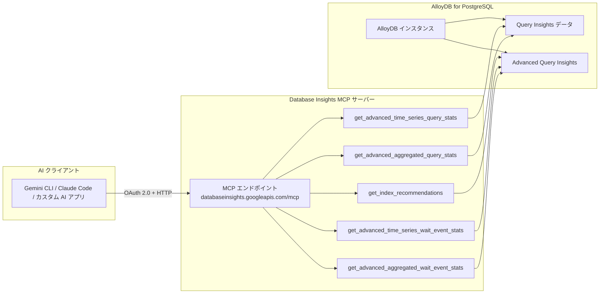

# AlloyDB for PostgreSQL: Database Insights リモート MCP サーバーに高度なクエリインサイトツールが追加

**リリース日**: 2026-06-15

**サービス**: AlloyDB for PostgreSQL

**機能**: Database Insights リモート MCP サーバーの高度なクエリインサイトツール

**ステータス**: GA

[このアップデートのインフォグラフィックを見る](https://takech9203.github.io/google-cloud-news-summary/20260615-alloydb-database-insights-mcp-advanced-tools.html)

## 概要

AlloyDB for PostgreSQL の Database Insights リモート Model Context Protocol (MCP) サーバーに、5 つの高度なクエリインサイトツールが新たに追加された。これにより、AI アプリケーション (Gemini CLI、Gemini Code Assist、Claude Code など) から AlloyDB のクエリパフォーマンスやウェイトイベントの詳細な分析、およびインデックス推奨の取得が MCP プロトコル経由で可能になる。

今回追加されたツールは `get_advanced_aggregated_query_stats`、`get_advanced_aggregated_wait_event_stats`、`get_advanced_time_series_query_stats`、`get_advanced_time_series_wait_event_stats`、`get_index_recommendations` の 5 つで、AI エージェントによるデータベースの高度な可観測性とパフォーマンス最適化を実現する。

**アップデート前の課題**

- Database Insights MCP サーバーでは基本的なクエリメトリクスとシステムメトリクスの取得のみ可能で、高度な集約統計やウェイトイベント分析は MCP 経由で利用できなかった
- インデックス推奨を取得するには Google Cloud コンソールの Query Insights ダッシュボードにアクセスする必要があった
- 時系列データによるクエリパフォーマンスの傾向分析を AI エージェントから直接実行することができなかった

**アップデート後の改善**

- AI エージェントから高度な集約クエリ統計とウェイトイベント統計を直接取得可能になった
- 時系列データとしてクエリ統計やウェイトイベント統計を取得し、パフォーマンスの傾向を AI が分析可能になった
- MCP 経由でインデックス推奨を取得し、AI エージェントがパフォーマンス改善提案を自動生成できるようになった

## アーキテクチャ図



AI クライアントが MCP プロトコル経由で Database Insights リモートサーバーに接続し、高度なクエリインサイトツールを呼び出すことで AlloyDB インスタンスのパフォーマンスデータを取得する構成を示している。

## サービスアップデートの詳細

### 主要機能

1. **get_advanced_aggregated_query_stats**
   - 高度な集約クエリ統計を取得するツール
   - クエリの実行時間、呼び出し回数、リソース使用量などの集約データを AI エージェントから分析可能

2. **get_advanced_aggregated_wait_event_stats**
   - 高度な集約ウェイトイベント統計を取得するツール
   - クエリ処理中に発生する待機イベント (I/O、ロック、CPU など) の集約データを取得

3. **get_advanced_time_series_query_stats**
   - クエリ統計の時系列データを取得するツール
   - パフォーマンスの経時変化やトレンドを AI が分析するためのデータを提供

4. **get_advanced_time_series_wait_event_stats**
   - ウェイトイベント統計の時系列データを取得するツール
   - 待機イベントの発生パターンや傾向の分析が可能

5. **get_index_recommendations**
   - インデックス作成の推奨を取得するツール
   - AI エージェントがクエリパフォーマンス改善のためのインデックス提案を自動的に取得し、最適化アドバイスを提供

## 技術仕様

### MCP サーバー接続情報

| 項目 | 詳細 |
|------|------|
| サーバー名 | Database Insights MCP server |
| エンドポイント URL | `https://databaseinsights.googleapis.com/mcp` |
| トランスポート | HTTP |
| 認証方式 | OAuth 2.0 (API キーは非対応) |
| OAuth スコープ | `https://www.googleapis.com/auth/cloud-platform` |

### 必要な IAM ロール

| ロール | 説明 |
|--------|------|
| `roles/mcp.toolUser` | MCP ツールの呼び出し |
| `roles/monitoring.viewer` | Cloud Monitoring データの閲覧 |
| `roles/databaseinsights.viewer` | Database Insights データの閲覧 |

### 必要な権限

| 権限 | 用途 |
|------|------|
| `mcp.tools.call` | MCP ツールの呼び出し |
| `queryMetrics.fetch` | クエリメトリクスの取得 |
| `systemMetrics.fetch` | システムメトリクスの取得 |
| `monitoring.timeseries.list` | Monitoring メトリクスの閲覧 |

## 設定方法

### 前提条件

1. AlloyDB for PostgreSQL インスタンスが作成済みであること
2. Database Insights が有効化されていること
3. Advanced Query Insights が有効化されていること (ウェイトイベント分析やインデックス推奨のため)
4. 必要な IAM ロールが付与されていること

### 手順

#### ステップ 1: Advanced Query Insights の有効化

```bash
gcloud alpha alloydb instances update INSTANCE \
  --cluster=CLUSTER \
  --project=PROJECT \
  --region=REGION \
  --observability-config-enabled
```

Google Cloud コンソールからは、クラスタページでインスタンスを選択し、「Query insights」から「Enable advanced query insights features for AlloyDB」チェックボックスを有効化する。

#### ステップ 2: MCP クライアントの設定

AI アプリケーションの MCP 設定に以下を追加する。

```json
{
  "mcpServers": {
    "databaseinsights": {
      "url": "https://databaseinsights.googleapis.com/mcp",
      "transport": "http",
      "auth": {
        "type": "oauth2",
        "scope": "https://www.googleapis.com/auth/cloud-platform"
      }
    }
  }
}
```

#### ステップ 3: ツールの利用確認

MCP Inspector または `tools/list` リクエストでツールの利用可否を確認する。

```bash
curl -X POST https://databaseinsights.googleapis.com/mcp \
  -H "Content-Type: application/json" \
  -d '{"jsonrpc": "2.0", "method": "tools/list"}'
```

## メリット

### ビジネス面

- **運用効率の向上**: AI エージェントが自動的にパフォーマンス問題を検出し、インデックス推奨を提供することで、DBA の作業負荷を軽減
- **問題解決の高速化**: AI を活用した自然言語でのデータベースパフォーマンス分析により、問題の特定と解決までの時間を短縮
- **プロアクティブな最適化**: 時系列分析によるトレンド把握で、問題が深刻化する前に対策を実施可能

### 技術面

- **MCP 標準プロトコル対応**: Model Context Protocol に準拠しているため、対応する任意の AI クライアントから利用可能
- **統合的な可観測性**: クエリ統計、ウェイトイベント、インデックス推奨を単一の MCP サーバーから取得可能
- **細粒度のアクセス制御**: IAM ベースの認可と OAuth 2.0 による安全なアクセス管理

## デメリット・制約事項

### 制限事項

- Advanced Query Insights の有効化にはインスタンスの再起動が必要
- API キーによる認証には対応していない (OAuth 2.0 のみ)
- Advanced Query Insights の有効化によりデータ保存量が増加し、追加料金が発生する可能性がある

### 考慮すべき点

- AI エージェント用に個別の ID を作成し、アクセスの制御とモニタリングを行うことが推奨される
- Model Armor を有効にしている場合、MCP トラフィックのスキャン設定がルーティング動作に影響する可能性がある
- クエリ長のデフォルトが Advanced Query Insights 有効化時に 100,000 バイトに増加し、メモリ使用量が増える

## ユースケース

### ユースケース 1: AI 支援によるクエリパフォーマンスのトラブルシューティング

**シナリオ**: 本番環境で特定のクエリのレスポンスタイムが悪化しているが、原因が不明な場合

**実装例**:
```
プロンプト例: 「過去 1 時間で実行時間が最も長いクエリのウェイトイベント統計を取得し、
ボトルネックの原因を分析してください」
```

**効果**: AI エージェントが `get_advanced_aggregated_query_stats` と `get_advanced_aggregated_wait_event_stats` を組み合わせて呼び出し、問題の根本原因を特定して具体的な改善策を提案する。

### ユースケース 2: 定期的なインデックス最適化の自動化

**シナリオ**: 開発チームが定期的にインデックスの最適化レビューを行いたいが、DBA のリソースが限られている場合

**実装例**:
```
プロンプト例: 「AlloyDB インスタンスのインデックス推奨を取得し、
現在不足しているインデックスと期待されるパフォーマンス改善をレポートしてください」
```

**効果**: AI エージェントが `get_index_recommendations` を呼び出し、推奨されるインデックスの一覧とその根拠を提示。開発者は DBA の介在なしにインデックス最適化を検討できる。

### ユースケース 3: パフォーマンストレンドの監視とアラート

**シナリオ**: アプリケーションのリリース前後でクエリパフォーマンスへの影響を評価したい場合

**実装例**:
```
プロンプト例: 「直近 24 時間のクエリ統計の時系列データを取得し、
6 時間前のデプロイ前後でパフォーマンスに変化がないか分析してください」
```

**効果**: AI エージェントが `get_advanced_time_series_query_stats` を使用してデプロイ前後のメトリクスを比較し、パフォーマンスリグレッションの有無を判定する。

## 料金

Database Insights MCP サーバーの利用自体に追加料金は明示されていない。ただし、以下の関連コストに注意が必要である。

- **AlloyDB インスタンス料金**: vCPU は $0.06608/時間から、メモリは $0.0112/GB 時間から
- **Advanced Query Insights**: 有効化によりデータ保存量が増加するため、追加のストレージ料金が発生する可能性がある
- **ストレージ料金**: リージョナルクラスタストレージは $0.0004109/GB 時間から

詳細は [AlloyDB の料金ページ](https://cloud.google.com/alloydb/pricing) を参照。

## 関連サービス・機能

- **AlloyDB Query Insights**: 基本的なクエリインサイト機能。今回の MCP ツールはこの機能の上位版である Advanced Query Insights のデータを活用
- **AlloyDB Advanced Query Insights**: ウェイトイベント分析、アクティブクエリ分析、インデックスアドバイザーなどの高度な可観測性機能
- **Cloud Monitoring**: AlloyDB のシステムメトリクスとクエリメトリクスの基盤となるモニタリングサービス
- **Database Center**: データベースフリート全体の包括的なビューとインテリジェントなパフォーマンス推奨を提供
- **Model Armor**: MCP サーバーとのトラフィックに対するセキュリティスキャンとフィルタリングを提供するオプション機能
- **Google Cloud MCP サーバー**: Google Cloud 全体のリモート MCP サーバー群。Database Insights はその一つ

## 参考リンク

- [このアップデートのインフォグラフィック](https://takech9203.github.io/google-cloud-news-summary/20260615-alloydb-database-insights-mcp-advanced-tools.html)
- [公式リリースノート](https://docs.cloud.google.com/release-notes#June_15_2026)
- [Database Insights MCP サーバーのドキュメント](https://docs.cloud.google.com/alloydb/docs/ai/use-database-insights-mcp)
- [Database Insights MCP リファレンス](https://docs.cloud.google.com/alloydb/docs/reference/mcp/databaseinsights/mcp/index)
- [Advanced Query Insights の使用方法](https://docs.cloud.google.com/alloydb/docs/using-advanced-query-insights)
- [AlloyDB 料金ページ](https://cloud.google.com/alloydb/pricing)
- [Google Cloud MCP サーバー概要](https://docs.cloud.google.com/mcp/overview)

## まとめ

今回のアップデートにより、AlloyDB for PostgreSQL の Database Insights リモート MCP サーバーが大幅に強化され、AI エージェントからの高度なデータベースパフォーマンス分析が可能になった。特にインデックス推奨の MCP 経由取得は、AI 支援によるデータベース最適化のワークフローを実現する重要な機能追加である。AlloyDB を利用中の組織は、Advanced Query Insights を有効化した上で MCP クライアントから新しいツールを活用することで、データベース運用の効率化と問題の早期発見が期待できる。

---

**タグ**: #AlloyDB #PostgreSQL #DatabaseInsights #MCP #ModelContextProtocol #QueryInsights #WaitEvents #IndexRecommendations #AI #Observability #パフォーマンス最適化
