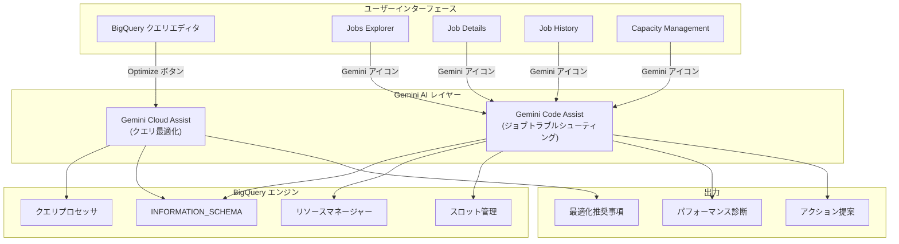

# BigQuery: Gemini Cloud Assist によるクエリ最適化とジョブパフォーマンストラブルシューティング

**リリース日**: 2026-06-15

**サービス**: BigQuery

**機能**: Gemini Cloud Assist クエリ最適化 / Gemini Code Assist ジョブトラブルシューティング

**ステータス**: Preview

[このアップデートのインフォグラフィックを見る](https://takech9203.github.io/google-cloud-news-summary/20260615-bigquery-gemini-cloud-assist-query-optimization.html)

## 概要

Google Cloud は BigQuery における Gemini AI アシスタントの統合を大幅に強化する 2 つの新機能を Preview としてリリースしました。1 つ目は Gemini Cloud Assist を使用して SQL クエリを分析し、パフォーマンス最適化のための推奨事項を受け取る機能です。2 つ目は Gemini Code Assist を BigQuery の Jobs explorer、Job details、Job history、Capacity management ページで直接利用してパフォーマンス問題のトラブルシューティングを行う機能です。

これらの機能により、BigQuery ユーザーはクエリのパフォーマンス改善とシステム全体のキャパシティ管理を AI の支援を受けながら効率的に実施できるようになります。特にデータエンジニアや BigQuery 管理者にとって、クエリチューニングやジョブ監視のワークフローが大幅に簡素化されます。

なお、同日のリリースノートでは、BigQuery 生成 AI 関数の日次トークンクォータ設定機能が一時的に無効化されたことも報告されています。

**アップデート前の課題**

- SQL クエリの最適化には深い BigQuery の知識とクエリ実行計画の分析スキルが必要だった
- ジョブのパフォーマンス問題を特定するには INFORMATION_SCHEMA ビューへの複雑なクエリを手動で記述する必要があった
- キャパシティ管理とリソースボトルネックの特定に時間がかかり、迅速な対応が困難だった
- パフォーマンス低下の原因調査に複数のページやツールを横断する必要があった

**アップデート後の改善**

- Gemini Cloud Assist がクエリ構造を分析し、スロット時間の削減に向けた具体的な最適化提案を自動で提供
- Jobs explorer から直接 Gemini Code Assist を呼び出し、自然言語でジョブのパフォーマンスを分析可能
- キャパシティ管理ページからワンクリックで AI による予約パフォーマンスの分析と改善提案を取得可能
- 性能比較やボトルネック特定がコンテキスト対応のチャットインターフェースで完結

## アーキテクチャ図



この図は、BigQuery の各ユーザーインターフェースから Gemini Cloud Assist と Gemini Code Assist がどのように連携し、BigQuery エンジンの情報を分析して最適化推奨事項やパフォーマンス診断を提供するかを示しています。

## サービスアップデートの詳細

### 主要機能

1. **Gemini Cloud Assist によるクエリ最適化**
   - クエリエディタで SQL を実行後、「Optimize」ボタンをクリックするだけで最適化分析を開始
   - クエリ構造を解析し、スロット時間の削減につながる具体的な改善提案を提示
   - BigQuery editions を利用している顧客が「Optimize」ボタンを使用可能
   - Cloud Assist パネルからも SQL コードを貼り付けて最適化を依頼可能（全顧客利用可）

2. **Gemini Code Assist によるジョブトラブルシューティング**
   - Jobs explorer、Job details、Job history、Capacity management ページに統合
   - ジョブ行にホバーして Gemini アイコンをクリックするだけでコンテキスト対応の分析を開始
   - 自然言語でジョブの遅延原因分析、統計解析、予約パフォーマンス分析が可能
   - Performance Insights レポートによるボトルネックの自動検出

3. **エージェント型パフォーマンストラブルシューティング**
   - 組織レベルや予約レベルのしきい値違反時に自動的に Performance Insights レポートを生成
   - キューイング増加やプロジェクト並列性の急増を検知し、原因と対策を提示
   - Key Metrics Comparison テーブルによる数値ベースの詳細比較
   - アクション可能なハンドオフリンク（予約編集、ジョブパフォーマンス表示、ジョブ比較）を生成

## 技術仕様

### 利用要件

| 項目 | Gemini Cloud Assist クエリ最適化 | Gemini Code Assist ジョブトラブルシューティング |
|------|------|------|
| 対象エディション | BigQuery editions（Optimize ボタン） | 全エディション |
| 必要な API | Gemini Cloud Assist API | Gemini Code Assist API |
| 必要な IAM ロール | Cloud AI Companion User | BigQuery Resource Viewer + Cloud AI Companion User |
| 利用場所 | クエリエディタ / Cloud Assist パネル | Jobs Explorer / Job Details / Job History / Capacity Management |

### 必要な IAM 権限

```
# Gemini Cloud Assist の利用に必要な基本ロール
roles/cloudaicompanion.user

# Jobs Explorer でのジョブ監視に必要なロール
roles/bigquery.resourceViewer

# 組織レベルでのジョブ表示
bigquery.jobs.listAll (組織レベル)

# 予約によるフィルタリング
bigquery.reservations.list (組織レベル)
```

## 設定方法

### 前提条件

1. Gemini in BigQuery がプロジェクトでセットアップ済みであること
2. Gemini Cloud Assist API が有効化されていること
3. 適切な IAM ロールが付与されていること
4. BigQuery editions のいずれかを利用していること（Optimize ボタン利用時）

### 手順

#### ステップ 1: Gemini Cloud Assist の有効化

Google Cloud コンソールで Gemini Cloud Assist を有効化します。詳細は [Set up Gemini Cloud Assist](https://docs.cloud.google.com/cloud-assist/set-up-gemini) を参照してください。

#### ステップ 2: クエリ最適化の利用

```
1. Google Cloud コンソールで BigQuery ページに移動
2. クエリエディタに SQL クエリを入力して実行
3. クエリエディタツールバーの「Optimize」をクリック
4. Cloud Assist パネルに表示される最適化推奨事項を確認
```

#### ステップ 3: ジョブトラブルシューティングの利用

```
1. BigQuery の Jobs Explorer ページに移動
2. 分析したいジョブにホバーし、Gemini アイコンをクリック
3. 自然言語でプロンプトを入力（例: "Why is this job slow?"）
4. 生成されたインサイトとアクション提案を確認
```

## メリット

### ビジネス面

- **コスト削減**: クエリ最適化によりスロット使用量が削減され、容量ベースの課金モデルでの費用が低下
- **運用効率の向上**: パフォーマンス問題の特定と解決に要する時間が大幅に短縮
- **スキルギャップの解消**: BigQuery の深い専門知識がなくても AI の支援でクエリチューニングが可能

### 技術面

- **コンテキスト対応分析**: ジョブの実行統計やシステムメトリクスを自動的にロードし、的確な分析を実施
- **プロアクティブな検知**: しきい値違反時の自動インサイト生成により、問題が深刻化する前に対処可能
- **統合的なトラブルシューティング**: 複数のページやツールを横断せず、チャットインターフェースから一元的に対応

## デメリット・制約事項

### 制限事項

- クエリ最適化の「Optimize」ボタンは BigQuery editions 顧客のみ利用可能（オンデマンド課金モデルでは Cloud Assist パネルからの利用に限定）
- 現在 Preview ステータスのため、SLA の対象外
- 最適化提案が必ずしもコスト削減に直結するとは限らない（最小課金しきい値などの影響）
- 日次トークンクォータの設定機能が一時的に無効化されており、生成 AI 関数の利用コスト管理に影響がある可能性

### 考慮すべき点

- AI による推奨事項は参考情報であり、本番環境への適用前にテスト環境での検証を推奨
- 組織レベルのインサイトを利用するには組織レベルの IAM 権限が必要
- Gemini によるインサイトの品質は、利用可能なメタデータと権限レベルに依存

## ユースケース

### ユースケース 1: 大規模 ETL パイプラインの最適化

**シナリオ**: 毎日実行される ETL ジョブのスロット使用量が増加傾向にあり、処理時間が延びている

**実装例**:
```sql
-- クエリエディタで ETL クエリを実行後、Optimize ボタンをクリック
-- Gemini が以下のような推奨事項を提示:
-- 1. パーティションプルーニングの活用
-- 2. 不要なカラムの除外
-- 3. JOIN 順序の最適化
```

**効果**: スロット使用時間の削減により、同じ予約内で他のワークロードへのリソース確保が改善

### ユースケース 2: 突発的なパフォーマンス低下の原因調査

**シナリオ**: 特定の時間帯に BigQuery ジョブのキューイング時間が急増し、ダッシュボードの更新が遅延

**実装例**:
```
Cloud Assist パネルで以下のプロンプトを入力:
"Analyze my reservation performance for the last 24 hours.
 Show the top projects consuming the most slots."
```

**効果**: 原因となっているプロジェクトやユーザーを即座に特定し、予約サイズの調整やワークロード管理の設定変更を迅速に実施

## 料金

Gemini Cloud Assist および Gemini Code Assist の利用は BigQuery editions のスロット料金に含まれます。追加の直接的な課金は発生しません。

| エディション | スロット時間単価 (USD) | Gemini 機能 |
|------------|----------------------|------------|
| Standard | $0.04/スロット時間 | Cloud Assist パネルからの最適化 |
| Enterprise | $0.06/スロット時間 | 全機能利用可能 |
| Enterprise Plus | $0.10/スロット時間 | 全機能利用可能 |

Jobs Explorer 自体は追加コストなしで利用可能です。

## 既知の問題

BigQuery 生成 AI 関数の日次トークンクォータ設定のサポートが一時的に無効化されています。この機能は、`GenAiInputTokensPerDay` や `GenAiOutputTokensPerDay` などのクォータを通じてプロジェクトやユーザーごとの LLM トークン使用量を制御するものです。Google は可能な限り早急にこの機能の復旧に取り組んでいます。

## 関連サービス・機能

- **Gemini Cloud Assist**: Google Cloud 全体で利用可能な AI アシスタント。BigQuery 以外のサービスでも設定支援やトラブルシューティングを提供
- **BigQuery BI Engine**: インメモリ分析サービスで、頻繁に利用されるデータをキャッシュしクエリを高速化
- **Cloud Monitoring**: BigQuery ジョブのリソース消費をモニタリングするための基盤サービス
- **BigQuery Admin Resource Charts**: 予約の利用率や管理状態を視覚化するダッシュボード

## 参考リンク

- [インフォグラフィック](https://takech9203.github.io/google-cloud-news-summary/20260615-bigquery-gemini-cloud-assist-query-optimization.html)
- [公式リリースノート](https://docs.cloud.google.com/bigquery/docs/release-notes)
- [Gemini Cloud Assist でクエリを最適化](https://docs.cloud.google.com/bigquery/docs/use-cloud-assist#optimize-query)
- [Jobs Explorer でジョブをトラブルシュート](https://docs.cloud.google.com/bigquery/docs/admin-jobs-explorer#troubleshoot-with-ai)
- [BigQuery パフォーマンス最適化ベストプラクティス](https://docs.cloud.google.com/bigquery/docs/best-practices-performance-overview)
- [BigQuery editions の概要](https://docs.cloud.google.com/bigquery/docs/editions-intro)
- [Gemini Cloud Assist のセットアップ](https://docs.cloud.google.com/cloud-assist/set-up-gemini)

## まとめ

今回のアップデートにより、BigQuery での SQL クエリ最適化とジョブパフォーマンスのトラブルシューティングが Gemini AI の支援で大幅に効率化されます。特に BigQuery editions を利用している組織は、クエリエディタの「Optimize」ボタンから即座に最適化提案を受け取れるようになり、データエンジニアリングチームの生産性向上が期待できます。Preview 段階ですが、早期に試用してワークフローへの組み込みを検討することを推奨します。

---

**タグ**: #BigQuery #Gemini #CloudAssist #CodeAssist #QueryOptimization #Performance #Preview #AI
