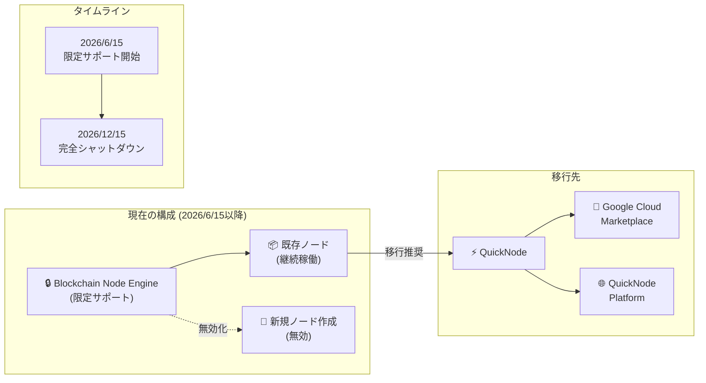

# Blockchain Node Engine: サービス限定サポート移行のお知らせ

**リリース日**: 2026-06-15

**サービス**: Blockchain Node Engine

**機能**: サービス限定サポート期間への移行 (廃止プロセス開始)

**ステータス**: Announcement (Deprecation)

📊 [このアップデートのインフォグラフィックを見る](https://takech9203.github.io/google-cloud-news-summary/20260615-blockchain-node-engine-limited-support.html)

## 概要

2026 年 6 月 15 日より、Google Cloud の Blockchain Node Engine が限定サポート期間に入ることが発表された。これはサービス廃止プロセスの第一段階であり、最終的に 2026 年 12 月 15 日にサービスが完全にシャットダウンされる。Google Cloud は移行先パートナーとして QuickNode を推奨しており、既存ユーザーに対してサービス中断を避けるための早期移行を強く推奨している。

Blockchain Node Engine は 2022 年 11 月にプライベートプレビューとして開始され、2023 年 6 月に GA (一般提供) となった、Web3 開発者向けのフルマネージドブロックチェーンノードホスティングサービスである。Ethereum、Polygon、Solana のノードをサポートし、専用ノードによるトランザクション中継、スマートコントラクトのデプロイ、ブロックチェーンデータの読み書きを提供してきた。

**アップデート前の状態**

- Blockchain Node Engine は完全に運用中で、新規ノード作成や新規 Blockchain RPC エンドポイントのプロビジョニングが可能だった
- フルマネージドサービスとして Google Cloud が積極的にノードを監視・管理していた
- Ethereum Full ノード ($0.69/時)、Archive ノード ($2.74/時) の価格体系で利用可能だった

**アップデート後の変更**

- 新規ノード作成および新規 Blockchain RPC エンドポイントのプロビジョニングが無効化された
- 既存ノードとエンドポイントは引き続き動作し、重要なアップデートを受け取る (最終シャットダウン日まで)
- 2026 年 12 月 15 日に全ノード・エンドポイントが削除される予定
- QuickNode への移行が推奨される

## アーキテクチャ図



Blockchain Node Engine から QuickNode への移行パスと、廃止タイムラインを示す。既存ノードは 2026 年 12 月 15 日まで稼働を継続するが、その日以降は全リソースが削除される。

## サービスアップデートの詳細

### 廃止タイムライン

| 日付 | イベント | 影響 |
|------|---------|------|
| 2026 年 6 月 15 日 | 限定サポート開始 | 新規ノード作成・新規 RPC エンドポイントプロビジョニング無効化 |
| 2026 年 6 月 15 日〜12 月 15 日 | 限定サポート期間 | 既存ノード稼働継続、重要アップデートのみ提供 |
| 2026 年 12 月 15 日 | 完全シャットダウン | 全ノード・エンドポイント削除、サービス終了 |

### 影響範囲

1. **新規利用の制限**
   - 新しいブロックチェーンノードの作成が不可
   - 新規 Blockchain RPC エンドポイントのプロビジョニングが不可
   - 新規プロジェクトでの Blockchain Node Engine の利用開始が不可

2. **既存利用の継続**
   - 既存のノードは 2026 年 12 月 15 日まで通常通り動作
   - 重要なセキュリティアップデートは継続して提供
   - JSON-RPC、WebSocket エンドポイントは引き続き利用可能

3. **最終シャットダウン (2026 年 12 月 15 日)**
   - 全既存ノードとエンドポイントが削除される
   - Blockchain RPC エンドポイントは Google により自動削除される
   - ワークロードが停止し、依存するアプリケーションは障害となる

## 技術仕様

### Blockchain Node Engine のサポート状況

| ブロックチェーン | ノードタイプ | 限定サポート期間中のステータス |
|-----------------|-------------|-------------------------------|
| Ethereum | Full ノード (Geth/Lighthouse) | 既存ノード稼働継続 |
| Ethereum | Archive ノード (Erigon) | 既存ノード稼働継続 |
| Polygon | Full ノード | 既存ノード稼働継続 |
| Solana | Full ノード | 既存ノード稼働継続 |

### 影響を受ける API

| API | ステータス |
|-----|-----------|
| ノード作成 API | 無効化 |
| ノード参照・管理 API | 稼働継続 (12/15 まで) |
| RPC エンドポイント | 稼働継続 (12/15 まで) |
| WebSocket エンドポイント | 稼働継続 (12/15 まで) |

## 設定方法

### 移行手順

QuickNode への移行は以下の手順で実施する。

#### ステップ 1: QuickNode でノード/エンドポイントをプロビジョニング

2 つの方法から選択可能:

**方法 A: Google Cloud Marketplace 経由** (推奨)

Google Cloud Marketplace の [QuickNode Core Node API](https://console.cloud.google.com/marketplace/product/quicknode-public/core-node-api) からプロビジョニングする。Google Cloud のインセンティブが利用可能な場合がある (詳細は営業担当に確認)。

**方法 B: QuickNode プラットフォーム直接**

[QuickNode GCP Node Migration ページ](https://www.quicknode.com/gcp-node-migration) から直接プロビジョニングする。

#### ステップ 2: アプリケーション設定の更新

アプリケーションおよびサービスの RPC エンドポイント設定を、新しい QuickNode エンドポイントに更新する。

```bash
# 例: 環境変数の更新
# 変更前
export ETH_RPC_URL="https://your-bne-endpoint.blockchain.googleapis.com"

# 変更後
export ETH_RPC_URL="https://your-quicknode-endpoint.quiknode.pro/YOUR_API_KEY/"
```

#### ステップ 3: ワークロードの検証

新しいインフラストラクチャ上でワークロードが正常に動作することをテスト・検証する。

#### ステップ 4: レガシーリソースの廃止

移行完了後、Google Cloud コンソールから [既存の Blockchain Node Engine ノードを削除](https://docs.cloud.google.com/blockchain-node-engine/docs/delete-node) する。Blockchain RPC エンドポイントについては、2026 年 12 月 15 日に Google が自動削除する。

## メリット

### QuickNode への移行メリット

- **サービス継続性**: 2026 年 12 月 15 日のシャットダウン後もブロックチェーンノードインフラを継続利用できる
- **Google Cloud との統合**: Google Cloud Marketplace 経由でプロビジョニング可能で、既存の Google Cloud 請求体系を活用できる
- **移行インセンティブ**: Google Cloud を通じた移行インセンティブが利用可能な場合がある
- **幅広いブロックチェーンサポート**: QuickNode は多数のブロックチェーンネットワークをサポートしている

## デメリット・制約事項

### 限定サポート期間中の制限

- 新規ノードの作成ができないため、スケールアウトが不可能
- 障害発生時のノード再作成ができない
- 新機能の追加は行われず、重要なアップデートのみ提供される
- サポートレベルが通常の GA サービスより低下する可能性がある

### 移行に伴う考慮点

- エンドポイント URL の変更に伴い、アプリケーション設定の更新が必要
- QuickNode の料金体系は Blockchain Node Engine と異なる可能性がある (リクエストベースの課金など)
- 移行期間中のデュアルランニングコストが発生する可能性がある
- VPC Service Controls との統合など、Google Cloud 固有の機能が QuickNode では利用できない場合がある

## ユースケース

### ユースケース 1: dApp 開発者・運用者

**シナリオ**: Blockchain Node Engine 上の Ethereum Full ノードを利用して dApp のバックエンドを運用している企業

**推奨アクション**: 即座に QuickNode への移行計画を策定し、テスト環境から移行を開始する。本番環境の移行は十分なテスト後に実施し、2026 年 12 月 15 日のシャットダウンに余裕を持って完了させる。

### ユースケース 2: ブロックチェーンデータ分析

**シナリオ**: Archive ノードを使用してブロックチェーンの履歴データをインデックス化し、BigQuery や Cloud Storage に取り込んでいる分析ワークロード

**推奨アクション**: QuickNode の Archive ノードオプションを確認し、データパイプラインの接続先を更新する。インジェスト処理の互換性テストを優先的に実施する。

### ユースケース 3: トランザクション中継サービス

**シナリオ**: 専用ノードを通じてプライベートなトランザクション送信を行っているウォレットサービス

**推奨アクション**: QuickNode の専用ノードオプションを評価し、トランザクションのプライバシー要件が満たされることを確認した上で移行する。

## 料金

### Blockchain Node Engine の現行料金 (参考)

| ノードタイプ | 時間料金 (USD) | 月額料金概算 (USD) |
|-------------|---------------|-------------------|
| Ethereum Full ノード | $0.69/時 | $503.70/月 |
| Ethereum Archive ノード | $2.74/時 | $2,000.20/月 |

QuickNode の料金体系については、[QuickNode 公式サイト](https://www.quicknode.com/pricing) または Google Cloud Marketplace のリスティングを参照のこと。

## 関連サービス・機能

- **[QuickNode](https://www.quicknode.com/gcp-node-migration)**: Google Cloud 推奨の移行先 RPC インフラストラクチャプロバイダー。Google Cloud Marketplace からも利用可能
- **[Google Cloud Marketplace](https://console.cloud.google.com/marketplace/product/quicknode-public/core-node-api)**: QuickNode Core Node API のプロビジョニングが可能
- **[Cloud Armor](https://cloud.google.com/armor)**: Blockchain Node Engine で使用されていた DDoS 防御サービス (移行後は QuickNode 側のセキュリティ機能に依存)
- **[VPC Service Controls](https://cloud.google.com/vpc-service-controls)**: Blockchain Node Engine と統合されていたアクセス制御 (Preview 段階)

## 参考リンク

- 📊 [インフォグラフィック](https://takech9203.github.io/google-cloud-news-summary/20260615-blockchain-node-engine-limited-support.html)
- [公式リリースノート](https://docs.cloud.google.com/blockchain-node-engine/docs/release-notes)
- [QuickNode 移行ガイド](https://docs.cloud.google.com/blockchain-node-engine/docs/migrate-to-quicknode)
- [QuickNode GCP マイグレーションページ](https://www.quicknode.com/gcp-node-migration)
- [Google Cloud Marketplace - QuickNode](https://console.cloud.google.com/marketplace/product/quicknode-public/core-node-api)
- [Blockchain Node Engine ドキュメント](https://docs.cloud.google.com/blockchain-node-engine/docs/overview)
- [料金ページ](https://cloud.google.com/blockchain-node-engine/pricing)
- [ノード削除手順](https://docs.cloud.google.com/blockchain-node-engine/docs/delete-node)

## まとめ

Blockchain Node Engine は 2026 年 6 月 15 日をもって限定サポート期間に入り、2026 年 12 月 15 日に完全にシャットダウンされる。既存ユーザーは 6 か月間の猶予期間内に QuickNode への移行を完了する必要がある。移行は Google Cloud Marketplace 経由または QuickNode プラットフォーム直接のいずれかで実施可能であり、早期に移行計画を策定し、テスト環境での検証を経て本番移行を進めることを強く推奨する。

---

**タグ**: #BlockchainNodeEngine #Deprecation #QuickNode #Migration #Web3 #Ethereum #GoogleCloud
