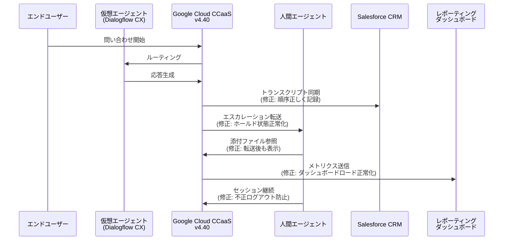

# Google Cloud Contact Center as a Service (CCaaS): CCaaS 4.40 バグ修正リリース

**リリース日**: 2026-06-15

**サービス**: Google Cloud Contact Center as a Service (CCaaS) / CCAI Platform

**機能**: CCaaS 4.40 バグ修正リリース

**ステータス**: GA (一般提供)

[このアップデートのインフォグラフィックを見る](https://takech9203.github.io/google-cloud-news-summary/20260615-ccaas-4-40-bug-fixes.html)

## 概要

Google Cloud CCaaS (Contact Center as a Service) のバージョン 4.40 がリリースされました。本リリースは複数のバグ修正と安定性の改善を含むメジャーバージョンアップデートです。インスタンスへの適用タイミングは、各組織が選択したデプロイメントスケジュール (Rapid / Regular / Critical) に依存します。

本リリースでは、Salesforce 連携における仮想エージェント応答のトランスクリプト表示順序の問題をはじめ、レポーティングダッシュボードのロード障害、チャット転送後の添付ファイル不可視、コールド転送後のホールド不具合、エージェントの不正ログアウトなど、7 件の重要なバグが修正されています。

これらの修正は、コンタクトセンターのオペレーション品質と顧客体験の向上に直結するものであり、特に Salesforce を CRM として利用している環境や、複数チャネルでのエージェント業務を運用している組織にとって重要なアップデートです。

**アップデート前の課題**

- Salesforce 連携時、仮想エージェントの応答がトランスクリプト内で順序通りに表示されず、会話の流れが把握しにくかった
- 高度なレポーティングダッシュボードがロードされない場合があり、管理者がリアルタイムのパフォーマンス指標を確認できなかった
- チャット転送後に PDF や音声添付ファイルがエージェントに表示されず、顧客対応が遅延していた
- コールド転送後にエンドユーザーが誤ってホールド状態に置かれる不具合があった
- MP3 音声ファイルのアップロードができず、エージェントコールデフレクション設定に支障をきたしていた
- アクティブな通話やチャット中であっても、エージェントが非アクティブとして自動ログアウトされる問題があった
- 一括ユーザーアップロード時に空白の電話番号列が既存のダイレクトインバウンド電話番号を解除する問題があった

**アップデート後の改善**

- Salesforce トランスクリプトで仮想エージェントの応答が正しい時系列順序で表示されるようになった
- 高度なレポーティングダッシュボードが正常にロードされるようになった
- チャット転送後も PDF や音声添付ファイルがエージェントに正しく表示されるようになった
- コールド転送後のホールド状態が正しく解除されるようになった
- MP3 音声ファイルのアップロードが正常に機能するようになった
- アクティブセッション中のエージェント自動ログアウトが発生しなくなった
- 一括アップロード時の電話番号処理が正しく動作するようになった

## アーキテクチャ図



本図は CCaaS 4.40 で修正された各コンポーネント間のインタラクションを示しています。エンドユーザーからの問い合わせが仮想エージェントを経由して人間エージェントにエスカレーションされる一連のフローの中で、今回の修正が適用される箇所を示しています。

## サービスアップデートの詳細

### 主要機能 (バグ修正)

1. **Salesforce トランスクリプト順序修正**
   - 仮想エージェントの応答がトランスクリプト内で時系列順に正しく表示されるよう修正
   - CRM 連携の信頼性が向上し、エージェントが会話履歴を正確に把握可能に

2. **レポーティングダッシュボードのロード修正**
   - 高度なレポーティングダッシュボードがロードされない問題を解決
   - 管理者がリアルタイムのコンタクトセンターパフォーマンスを安定的に確認可能に

3. **チャット転送後の添付ファイル表示修正**
   - PDF および音声添付ファイルがチャット転送後もエージェントに正しく表示されるよう修正
   - 転送を跨いだシームレスな情報共有が実現

4. **コールド転送後のホールド状態修正**
   - キューへのコールド転送後にエンドユーザーが誤ってホールド状態に置かれる問題を解決
   - 顧客体験の改善と待機時間の短縮に寄与

5. **MP3 音声ファイルアップロード修正**
   - エージェントコールデフレクション用の MP3 音声ファイルアップロードが正常に動作するよう修正
   - カスタム音声ガイダンスの設定が再び可能に

6. **エージェント不正ログアウト修正**
   - アクティブな通話やチャットに従事中のエージェントが非アクティブとして自動ログアウトされる問題を解決
   - セッション中断による顧客体験の劣化を防止

7. **一括ユーザーアップロード時の電話番号処理修正**
   - 空白の電話番号列を含む一括アップロードで既存のダイレクトインバウンド電話番号が解除される問題を修正
   - 管理者による大量ユーザー管理の安全性が向上

## 技術仕様

### デプロイメントスケジュール

| スケジュール | 適用タイミング | 推奨環境 |
|------|------|------|
| Rapid | 最速で適用 | 開発・テスト環境 |
| Regular | Rapid から最低 2 日後 | ステージング環境 |
| Critical | ピーク時間外、Rapid から約 1 週間後 | 本番環境 |

### バージョン情報

| 項目 | 詳細 |
|------|------|
| リリースバージョン | 4.40 |
| 前バージョン | 4.39 (2026-06-08 リリース) |
| リリースタイプ | メジャーバグ修正リリース |
| 修正件数 | 7 件 |
| セキュリティパッチ | 含まない (バグ修正のみ) |

### デプロイメントスケジュールの確認方法

```
Google Cloud Console > プロジェクトセレクター > CCAI Platform > インスタンス一覧
```

Schedule 列にて現在のデプロイメントスケジュールを確認できます。

## 設定方法

### 前提条件

1. Google Cloud CCaaS (CCAI Platform) インスタンスが作成済みであること
2. Google Cloud Console へのアクセス権限があること
3. デプロイメントスケジュールが適切に設定されていること

### 手順

#### ステップ 1: デプロイメントスケジュールの確認

```
1. Google Cloud Console にログイン
2. 対象プロジェクトを選択
3. ナビゲーションメニューから「CCAI Platform」をクリック
4. インスタンス一覧ページで Schedule 列を確認
```

デプロイメントスケジュールに基づき、自動的にバージョン 4.40 が適用されます。手動でのアップデート操作は不要です。

#### ステップ 2: デプロイメントスケジュールの変更 (必要な場合)

```
1. 対象インスタンスの「More options」メニューをクリック
2. 「Edit」を選択
3. 「Configure deployments」をクリック
4. Deployment schedule フィールドで希望のスケジュールを選択
5. Critical を選択した場合、ピーク時間帯のスケジュールを定義
6. 「Save」をクリック
```

本番環境では Critical スケジュールを推奨します。

#### ステップ 3: アップデート適用後の確認

```
1. エージェントデスクトップにログイン
2. Salesforce 連携のトランスクリプト表示を確認
3. レポーティングダッシュボードの正常ロードを確認
4. チャット転送テストで添付ファイル表示を確認
```

修正が正しく適用されていることを検証してください。

## メリット

### ビジネス面

- **顧客体験の向上**: コールド転送後のホールド問題やエージェント不正ログアウトの修正により、通話中断や不要な待ち時間が解消され、顧客満足度が向上
- **オペレーション効率の改善**: レポーティングダッシュボードの安定化により、管理者がリアルタイムでパフォーマンスを監視し、迅速な意思決定が可能
- **CRM 連携の信頼性向上**: Salesforce トランスクリプトの順序修正により、顧客履歴の正確な把握とフォローアップ品質が改善

### 技術面

- **プラットフォーム安定性の向上**: 7 件のバグ修正により、CCaaS プラットフォーム全体の信頼性と安定性が大幅に向上
- **マルチチャネル対応の強化**: チャット転送時の添付ファイル表示修正により、チャネル間のシームレスな連携が実現
- **管理ツールの信頼性向上**: 一括ユーザーアップロードの安全性向上により、大規模なエージェント管理がより確実に

## デメリット・制約事項

### 制限事項

- 適用タイミングはデプロイメントスケジュールに依存し、即座に全インスタンスに適用されるわけではない
- Critical スケジュールの場合、Rapid 適用から最大 1 週間以上遅延する可能性がある
- セキュリティパッチは含まれないため、セキュリティ関連の修正は別途適用される場合がある

### 考慮すべき点

- アップデート後、Salesforce 連携のトランスクリプト表示が正しく動作することを確認するためのテストが推奨される
- レポーティングダッシュボードのカスタマイズを行っている場合、アップデート後に表示確認が必要
- 一括ユーザーアップロードのワークフローを使用している場合、アップデート後の動作確認を推奨

## ユースケース

### ユースケース 1: Salesforce 連携コンタクトセンター

**シナリオ**: Salesforce をプライマリ CRM として使用し、仮想エージェント (Dialogflow CX) と人間エージェントのハイブリッド対応を行っているコンタクトセンター

**実装例**:
```
顧客問い合わせフロー:
1. エンドユーザーが問い合わせ
2. 仮想エージェントが初期対応
3. 必要に応じて人間エージェントにエスカレーション
4. Salesforce にトランスクリプトが記録 (v4.40で順序修正済み)
5. エージェントが正確な会話履歴を参照してフォローアップ
```

**効果**: 仮想エージェントの応答がトランスクリプト内で正しい順序で表示されるため、人間エージェントへのエスカレーション時にコンテキストが正確に伝わり、顧客対応品質が向上

### ユースケース 2: 大規模マルチチャネルコンタクトセンター

**シナリオ**: 音声とチャットの両方で顧客対応を行い、チーム間でのセッション転送が頻繁に発生する環境

**効果**: チャット転送後の添付ファイル表示修正とコールド転送後のホールド状態修正により、転送を跨いだシームレスな顧客対応が実現。エージェントの不正ログアウト修正により、長時間のセッション中でもサービスの継続性が保証される

### ユースケース 3: エージェント大量管理環境

**シナリオ**: 数百名規模のエージェントを CSV 一括アップロードで管理している組織

**効果**: 空白の電話番号列による既存設定の意図しない解除が防止され、管理者が安心して一括更新を実施できるようになった

## 料金

CCaaS 4.40 はバグ修正リリースであり、追加料金は発生しません。

### 料金体系

| 項目 | 詳細 |
|--------|-----------------|
| バージョンアップ費用 | 無料 (既存契約に含まれる) |
| CCaaS ライセンス | 既存契約の料金体系に準拠 |
| デプロイメントスケジュール変更 | 無料 |

Google Cloud CCaaS の料金は、エージェント数とチャネル構成に基づくサブスクリプションモデルです。詳細は Google Cloud セールスチームにお問い合わせください。

## 利用可能リージョン

Google Cloud CCaaS は複数のリージョンで利用可能です。バージョン 4.40 は全ての既存 CCaaS インスタンスに対して、選択されたデプロイメントスケジュールに基づき順次適用されます。利用可能なロケーションの詳細は CCAI Platform のロケーションページを参照してください。

## 関連サービス・機能

- **Dialogflow CX**: CCaaS の仮想エージェント機能を提供。今回の修正で Salesforce へのトランスクリプト記録が改善
- **Agent Assist**: エージェント支援機能。リアルタイムの応答提案やセッション要約を提供
- **Customer Experience Insights (CCAI Insights)**: コンタクトセンターの分析機能。レポーティングダッシュボード修正との関連
- **Salesforce 連携**: CRM 統合。仮想エージェント応答のトランスクリプト順序修正が直接影響
- **Gemini Enterprise for CX**: CCaaS を含む Google の顧客体験向け AI ソリューション群

## 参考リンク

- [インフォグラフィック](https://takech9203.github.io/google-cloud-news-summary/20260615-ccaas-4-40-bug-fixes.html)
- [公式リリースノート](https://cloud.google.com/release-notes#June_15_2026)
- [CCAI Platform ドキュメント](https://docs.cloud.google.com/contact-center/ccai-platform/docs)
- [デプロイメントスケジュール](https://cloud.google.com/contact-center/ccai-platform/docs/deployment-schedules)
- [CCAI Platform リリースノート](https://docs.cloud.google.com/contact-center/ccai-platform/docs/release-notes)

## まとめ

Google Cloud CCaaS 4.40 は、Salesforce 連携のトランスクリプト順序修正をはじめとする 7 件の重要なバグ修正を含むリリースです。特に CRM 連携の信頼性向上、レポーティング機能の安定化、マルチチャネル対応の強化が図られており、コンタクトセンターの運用品質と顧客体験の向上に寄与します。本番環境では Critical デプロイメントスケジュールの利用を推奨し、適用後は主要機能の動作確認を実施することをお勧めします。

---

**タグ**: #GoogleCloud #CCaaS #CCAI-Platform #ContactCenter #BugFix #Salesforce #v4.40
