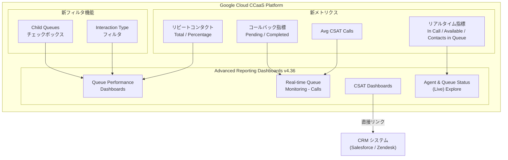

# Google Cloud CCaaS: Advanced Reporting Dashboards バージョン 4.36 リリース

**リリース日**: 2026-06-15

**サービス**: Google Cloud Contact Center as a Service (CCaaS)

**機能**: Advanced Reporting Dashboards v4.36

**ステータス**: Feature / Announcement

[このアップデートのインフォグラフィックを見る](https://takech9203.github.io/google-cloud-news-summary/20260615-ccaas-advanced-reporting-4-36.html)

## 概要

Google Cloud Contact Center as a Service (CCaaS) の Advanced Reporting Dashboards がバージョン 4.36 にアップデートされました。本リリースでは、キュー管理の柔軟性向上、リアルタイムメトリクスの拡充、CRM との連携強化、およびリピートコンタクト分析機能の追加が主な改善点です。

このアップデートは、コンタクトセンターの管理者やスーパーバイザーを主な対象としており、日々のオペレーション監視、エージェントパフォーマンスの把握、および顧客満足度の追跡をより効率的に行えるようになります。キューの階層構造を活用した分析、リアルタイムでのエージェント状態監視、CSAT スコアへの即座のアクセスなど、運用効率を大幅に改善する機能が多数含まれています。

また、複数のバグ修正も含まれており、レポートの正確性と信頼性が向上しています。

**アップデート前の課題**

- 子キューを含めたフィルタリングができず、親キュー配下の全体パフォーマンスを一括で確認するには手動での集計が必要だった
- Agent & Queue Status (Live) Explore でリアルタイムのエージェント通話状態やキュー内待機コンタクト数を確認できなかった
- CSAT ダッシュボードからスコアの詳細を確認するには CRM に別途ログインして検索する必要があった
- Real-time Queue Monitoring - Calls ダッシュボードにコールバック関連メトリクスや CSAT 平均値がなかった
- Queue Performance ダッシュボードでインタラクションタイプ別のフィルタリングやリピートコンタクトの分析ができなかった
- Repeat Contact % が 100% を超えて表示されるバグがあった

**アップデート後の改善**

- Child Queues チェックボックスにより、親キューとその子キューを一括してフィルタリング可能になった
- リアルタイムで通話中エージェント数、待機中エージェント数、キュー内コンタクト数を把握可能になった
- CSAT ダッシュボードから直接 CRM の CSAT スコアにリンクでアクセスできるようになった
- Queue Monitoring ダッシュボードにコールバック指標と CSAT 平均値が追加され、より包括的な監視が可能になった
- Interaction Type フィルタとリピートコンタクトデータにより、より詳細なキュー分析が可能になった
- 各種バグ修正によりレポートの精度と信頼性が向上した

## アーキテクチャ図

この図は、Advanced Reporting Dashboards v4.36 の主要コンポーネントと新機能の関係を示しています。各ダッシュボードに追加された新フィルタ、メトリクス、および CRM との連携が視覚的に整理されています。

## サービスアップデートの詳細

### 主要機能

1. **Child Queues フィルタオプションの追加**
   - Queue Name フィルタを持つ全てのダッシュボードに「Child Queues」チェックボックスが追加された
   - 「Yes」を選択すると、指定したキューの全ての子キューが結果に含まれる
   - Explore で Queue Name フィルタを持つものにも「Child Queues (Yes / No)」フィルタが新規追加

2. **Agent & Queue Status (Live) Explore の新メトリクス**
   - **In Call**: 現在通話中のエージェント数
   - **Available / Waiting**: 次のコンタクトを待機しているエージェント数
   - **Contacts in Queue**: キュー内で待機中のコール数
   - これらのメトリクスによりリアルタイムでのリソース配分判断が容易になる

3. **CSAT ダッシュボードの CRM リンク機能**
   - CSAT - Calls および CSAT - Chats ダッシュボードの CSAT Interactions テーブルに CRM リンクが追加
   - Session ID の横にリンクが表示され、CRM 内の CSAT スコアに直接遷移可能
   - CRM 内での検索操作が不要になり、調査時間を短縮

4. **Real-time Queue Monitoring - Calls ダッシュボードの新タイル**
   - **Total Rolled Over Pending Callbacks**: ロールオーバーされた保留中のコールバック数
   - **Total Rolled Over Completed Callbacks**: ロールオーバーされた完了済みコールバック数
   - **Avg CSAT Calls**: CSAT コールの平均数
   - ダッシュボードはデフォルトで 60 秒ごとに自動更新

5. **Queue Performance ダッシュボードの改善**
   - Interaction Type フィルタの追加 (Calls / Chats 両方)
   - Queue Detailed Table に Interaction Type カラムの追加
   - Queue Performance - Calls に Total Rolled Over Completed Callbacks / Pending Callbacks タイル追加
   - Queue Summary Table に Total Repeat Contacts / Repeat Contact % カラムの追加

6. **バグ修正**
   - Queue Performance - Calls の Queue Summary Table で Repeat Contact % が 100% を超える問題を修正
   - Explores で「is on or after」を絶対日付に設定した際に結果が返らない Date フィルタの問題を修正
   - Agent Availability ダッシュボードから Total Logged in Time メトリクスタイルを削除
   - Advanced Reporting ダッシュボードで言語ラベルが欠落する問題を修正
   - All Interactions - Chats ダッシュボードで Chat ID フィルタ使用時に Virtual Agent Chats テーブルに誤った Chat ID が表示される問題を修正
   - Call Agent Metrics (Historical) ダッシュボードでアウトバウンドコールの disposition code が欠落/空白になる問題を修正

## 技術仕様

### 新規メトリクスの詳細

| メトリクス | ダッシュボード | 説明 |
|------|------|------|
| In Call | Agent & Queue Status (Live) Explore | 現在通話中のエージェント数 |
| Available / Waiting | Agent & Queue Status (Live) Explore | 次のコンタクトを待機しているエージェント数 |
| Contacts in Queue | Agent & Queue Status (Live) Explore | キュー内で待機中のコール数 |
| Total Rolled Over Pending Callbacks | Queue Monitoring - Calls / Queue Performance - Calls | ロールオーバーされた保留中コールバック数 |
| Total Rolled Over Completed Callbacks | Queue Monitoring - Calls / Queue Performance - Calls | ロールオーバーされた完了済みコールバック数 |
| Avg CSAT Calls | Queue Monitoring - Calls | CSAT コールの平均数 |
| Total Repeat Contacts | Queue Performance (Queue Summary Table) | 同一デバイスから設定時間内に同一キューに戻ったコンタクト数 |
| Repeat Contact % | Queue Performance (Queue Summary Table) | リピートコンタクトの割合 |

### 対応リージョン

Advanced Reporting Dashboards は以下のリージョンで利用可能です:

| リージョン | ロケーション |
|------|------|
| us-east1 | サウスカロライナ |
| us-central1 | アイオワ |
| us-west1 | オレゴン |
| europe-west2 | ロンドン |
| asia-northeast1 | 東京 |
| northamerica-northeast1 | モントリオール |
| australia-southeast1 | シドニー |

### 権限設定

| ロール | ダッシュボード閲覧 | ダッシュボード編集 |
|------|------|------|
| Admin | 全て可能 | 全て可能 |
| Manager Admin | 全て可能 | 不可 |
| Manager / Manager Team / Manager Data | 割り当てキューのみ | 不可 |
| Agent | 不可 | 不可 |

## 設定方法

### 前提条件

1. CCAI Platform インスタンスが対応リージョン (上記参照) にデプロイされていること
2. Advanced Reporting 拡張機能が有効化されていること
3. 適切なロール (Admin または Manager 系) が割り当てられていること

### 手順

#### ステップ 1: Advanced Reporting 拡張機能の有効化

1. Google Cloud コンソールでプロジェクトを選択
2. ナビゲーションメニューから「CCAI Platform」をクリック
3. 対象のインスタンスをクリック
4. 「Edit」 > 「Configure extensions」をクリック
5. 「Advanced reporting」チェックボックスを選択して「Save」をクリック

#### ステップ 2: Advanced Reporting Landing Page へのアクセス

1. CCAI Platform ポータルで「Dashboard」 > 「Advanced Reporting」をクリック
2. Advanced Reporting Landing Page が表示される
3. 目的のダッシュボード (Queue Performance / Queue Monitoring / CSAT 等) を選択

#### ステップ 3: 新フィルタの使用

1. Queue Name フィルタで対象のキューを選択
2. 「Child Queues」チェックボックスで「Yes」を選択して子キューを含める
3. 「Interaction Type」フィルタでインタラクションタイプを指定
4. 「Update」または「Reload」をクリックして結果を表示

## メリット

### ビジネス面

- **運用可視性の向上**: リアルタイムメトリクスの拡充により、キューの状態やエージェントの稼働状況を即座に把握し、迅速な意思決定が可能
- **顧客満足度管理の効率化**: CSAT ダッシュボードから CRM への直接リンクにより、低スコアの原因調査にかかる時間を大幅に短縮
- **リピートコンタクト分析**: 初回解決率 (FCR) の改善に向けたデータドリブンな施策立案が可能
- **階層的キュー管理**: 子キューフィルタにより、組織構造に沿ったパフォーマンス分析が容易に

### 技術面

- **リアルタイムモニタリングの強化**: 60 秒間隔の自動更新でコールバック状況と CSAT を含む包括的なキュー監視が可能
- **データ精度の向上**: Repeat Contact % のバグ修正や disposition code の修正により、レポートの信頼性が向上
- **フィルタリングの柔軟性**: Interaction Type フィルタや Child Queues フィルタにより、より精密なデータ分析が可能

## デメリット・制約事項

### 制限事項

- Advanced Reporting は対応リージョン (7 リージョン) でのみ利用可能
- Advanced Reporting を有効にすると、レガシーの CCAI Platform ダッシュボードは利用不可になる
- ダッシュボードの日付フィルタで指定できる最大期間は 45 日間
- Agent ロールのユーザーはダッシュボードにアクセス不可
- CSAT の CRM リンク機能を利用するには、CRM 側で CSAT 投稿設定が有効になっている必要がある

### 考慮すべき点

- Advanced Reporting の有効化/無効化時にカスタムロールの権限設定が影響を受ける可能性がある
- 大規模なクエリのスケジュールエクスポートには行数制限がある場合がある
- リアルタイムダッシュボードは 60 秒間隔で更新されるため、完全なリアルタイムではない

## ユースケース

### ユースケース 1: 階層的キュー構造の一括パフォーマンス分析

**シナリオ**: 大規模コンタクトセンターで、製品カテゴリごとに親キュー配下に複数の子キュー (言語別、スキル別) を設定している場合、親キュー全体のパフォーマンスを一括で確認したい。

**効果**: Child Queues フィルタを「Yes」に設定することで、親キュー配下の全子キューのデータを集約して表示。個別に子キューを選択する手間が不要になり、組織全体のパフォーマンスを素早く把握可能。

### ユースケース 2: リアルタイムでのリソース再配分判断

**シナリオ**: ピーク時間帯にキュー待ち時間が増加している状況で、スーパーバイザーがエージェントの再配分を判断する必要がある。

**効果**: Agent & Queue Status (Live) Explore の新メトリクス (In Call / Available / Waiting / Contacts in Queue) により、どのキューにコンタクトが溜まっているか、どのエージェントが利用可能かをリアルタイムで把握し、即座にルーティング変更やエージェント再配分の判断が可能。

### ユースケース 3: 低 CSAT スコアの迅速な原因調査

**シナリオ**: CSAT スコアが低下しているキューを発見した際、具体的なインタラクションの詳細を CRM で確認して原因を特定したい。

**効果**: CSAT ダッシュボードの Session ID リンクから直接 CRM の該当セッションにジャンプし、会話ログや顧客情報を即座に確認。従来の CRM 検索操作が不要になり、調査時間を大幅に短縮。

### ユースケース 4: リピートコンタクト率の改善

**シナリオ**: 初回解決率 (FCR) を改善するため、リピートコンタクトが多いキューを特定し、原因分析を行いたい。

**効果**: Queue Performance ダッシュボードの Queue Summary Table で Total Repeat Contacts と Repeat Contact % を確認し、リピートが多いキューを特定。Interaction Type フィルタと組み合わせて、どの種類のインタラクションでリピートが発生しているかを分析し、改善施策を立案。

## 関連サービス・機能

- **CCAI Platform (Contact Center AI Platform)**: 本ダッシュボードの基盤となるコンタクトセンタープラットフォーム
- **CRM 連携 (Salesforce / Zendesk)**: CSAT スコアの保存先および直接リンクの遷移先
- **Virtual Agent (Dialogflow CX)**: キュー内待機中のバーチャルエージェント対応メトリクスとの連携
- **Workforce Management (WFM)**: リアルタイムメトリクスを活用したエージェントスケジューリング最適化

## 参考リンク

- [インフォグラフィック](https://takech9203.github.io/google-cloud-news-summary/20260615-ccaas-advanced-reporting-4-36.html)
- [公式リリースノート](https://docs.cloud.google.com/contact-center/ccai-platform/docs/release-notes)
- [Advanced Reporting Dashboards 概要](https://docs.cloud.google.com/contact-center/ccai-platform/docs/dashboards-overview)
- [Queue Performance ダッシュボード](https://docs.cloud.google.com/contact-center/ccai-platform/docs/dashboards-queue-performance)
- [Real-time Queue Monitoring ダッシュボード](https://docs.cloud.google.com/contact-center/ccai-platform/docs/dashboards-real-time-queue-monitor)
- [CSAT ダッシュボード](https://docs.cloud.google.com/contact-center/ccai-platform/docs/dashboards-csat)

## まとめ

Google Cloud CCaaS Advanced Reporting Dashboards v4.36 は、コンタクトセンターの運用可視性を大幅に向上させるアップデートです。特に Child Queues フィルタによる階層的分析、リアルタイムエージェント/キュー状態の把握、CSAT から CRM への直接リンク、リピートコンタクト分析は、日々のオペレーション改善に直結する機能です。CCAI Platform を利用中の組織は、Advanced Reporting が有効化されていることを確認し、新しいフィルタやメトリクスを活用したダッシュボードのカスタマイズを検討することを推奨します。

---

**タグ**: #GoogleCloud #CCaaS #CCAI #ContactCenter #AdvancedReporting #Dashboard #CSAT #QueueManagement #RealTimeMonitoring
