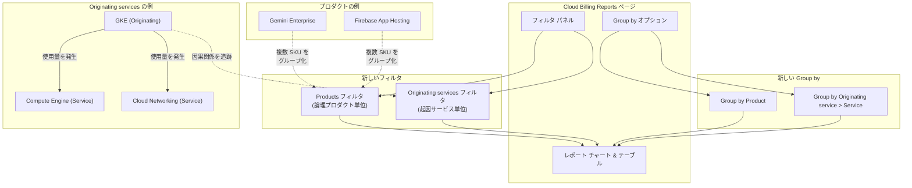

# Cloud Billing: Billing Reports に Products / Originating services フィルタと Group by オプションを追加

**リリース日**: 2026-06-15

**サービス**: Cloud Billing

**機能**: Billing Reports に新しいフィルタ (Products, Originating services) と Group by オプションを追加

**ステータス**: GA (Feature)

[このアップデートのインフォグラフィックを見る](https://takech9203.github.io/google-cloud-news-summary/20260615-cloud-billing-products-originating-services-filters.html)

## 概要

Cloud Billing の Reports ページに、コスト分析をより直感的に行うための 2 つの新しいフィルタ「Products」と「Originating services」が追加されました。これにより、従来の SKU やサービス単位の分析に加え、論理的なプロダクト単位やサービス間の因果関係に基づいたコスト分析が可能になります。

Products フィルタは、複数の SKU やサービスにまたがるが単一のサービスとして販売されている論理的なプロダクトファミリー (例: Gemini Enterprise、Firebase App Hosting) 単位でコストを把握できるようにします。Originating services フィルタは、あるサービスの利用が別のサービスでの使用量を発生させる因果関係 (例: GKE が Compute Engine の使用量を発生させる) を可視化します。

このアップデートは、マルチサービスアーキテクチャを採用している組織やサブスクリプション型プロダクトを利用している企業のコスト管理担当者、FinOps チーム、プロジェクトオーナーにとって特に有用です。

**アップデート前の課題**

- SKU 単位やサービス単位でしかコストを分析できず、Gemini Enterprise のような複数サービスにまたがるプロダクトの総コストを一目で把握できなかった
- GKE が Compute Engine に発生させるコストなど、サービス間の因果関係を Reports ページ上で直接追跡できなかった
- 論理的なプロダクト単位でのコスト配分やチャージバックが困難だった

**アップデート後の改善**

- Products フィルタにより、論理的なプロダクトファミリー単位でコストをフィルタリング・集計できるようになった
- Originating services フィルタにより、コストを発生させた根本原因となるサービスを特定できるようになった
- Group by Product / Originating service > Service により、レポートのチャートとテーブルでこれらの新しい次元でコストを可視化・ドリルダウンできるようになった

## アーキテクチャ図



Cloud Billing Reports における新しいフィルタと Group by オプションのデータフローを示しています。Products フィルタは複数の SKU を論理的なプロダクト単位でグループ化し、Originating services フィルタはサービス間の使用量発生の因果関係を追跡します。

## サービスアップデートの詳細

### 主要機能

1. **Products フィルタ**
   - 複数の SKU (場合によっては複数の Google Cloud サービスにまたがる) を論理的なプロダクトファミリーとしてグループ化
   - サブスクリプションサービスとして販売されるプロダクト (Gemini Enterprise、Firebase App Hosting など) のコストを一括で把握可能
   - 全プロダクトの選択、またはリストからサブセットを選択してフィルタリング
   - 注意: ライセンス料や確約利用割引 (CUD) など、特定のプロダクトに紐づかない料金も存在する

2. **Originating services フィルタ**
   - 他のサービスで使用量を発生させる「起因サービス」を特定・フィルタリング
   - 例: GKE が Compute Engine の使用量を発生させている場合、GKE が「Originating service」として表示される
   - サービス名とサービス ID で識別可能
   - 全 Originating services の選択、またはサブセットを選択してフィルタリング

3. **Group by Product**
   - レポートのチャートとテーブルでコストをプロダクト単位で集計表示
   - 単一次元: Product
   - 複数次元: Date > Product、Month > Product
   - レポートテーブルの各行にプロダクトごとの実コストと節約額を表示

4. **Group by Originating service > Service**
   - レポートのチャートとテーブルでコストを Originating service 単位で集計表示
   - レポートテーブルで各 Originating service の行を展開し、関連する Service ごとのコスト内訳をドリルダウン可能
   - 複数次元: Date > Originating Service > Service、Month > Originating Service > Service

## 技術仕様

### フィルタとグルーピングの対応表

| 機能 | フィルタとして使用 | 単一次元 Group by | 日付ベース Group by | 月ベース Group by |
|------|:--:|:--:|:--:|:--:|
| Products | 可能 | Product | Date > Product | Month > Product |
| Originating services | 可能 | Originating service > Service | Date > Originating Service > Service | Month > Originating Service > Service |

### Products と Services の違い

| 項目 | Products (新規) | Services (既存) |
|------|----------------|-----------------|
| 定義 | 論理的なプロダクトファミリー / サブスクリプションサービス | インフラストラクチャコンポーネント (関連 SKU のグループ) |
| 粒度 | 複数サービスにまたがる可能性あり | Google Cloud コンソールのナビゲーションに対応 |
| 例 | Gemini Enterprise, Firebase App Hosting | Compute Engine, BigQuery |
| 特記事項 | 一部の料金はプロダクトに紐づかない | 各サービスはサービス名とサービス ID で識別 |

### 必要な権限

| ロール | フィルタ利用 | Group by 利用 | Saved Reports |
|--------|:--:|:--:|:--:|
| Billing Account Administrator | 可能 | 可能 | 作成・編集・削除 |
| Billing Account Costs Manager | 可能 | 可能 | 作成・編集・削除 |
| Billing Account Viewer | 可能 | 可能 | 閲覧のみ |
| Project Owner/Editor/Viewer | 制限あり | 制限あり | 不可 |

## 設定方法

### 前提条件

1. Cloud Billing アカウントへの適切なアクセス権限 (Billing Account Viewer 以上)
2. Cloud Billing アカウントにリンクされたプロジェクトでの使用量が存在すること

### 手順

#### ステップ 1: Billing Reports ページにアクセス

Google Cloud コンソールで「お支払い」>「レポート」に移動します。

```
https://console.cloud.google.com/billing/{BILLING_ACCOUNT_ID}/reports
```

#### ステップ 2: Products フィルタを使用

1. フィルタパネルの「Products」タイルをクリック
2. 分析したいプロダクト (例: Gemini Enterprise) を選択
3. 「Apply」をクリックしてレポートを更新

#### ステップ 3: Originating services フィルタを使用

1. フィルタパネルの「Originating services」タイルをクリック
2. 分析したい起因サービス (例: Google Kubernetes Engine) を選択
3. 「Apply」をクリックしてレポートを更新

#### ステップ 4: Group by で集計表示

1. Group by ドロップダウンから「Product」または「Originating service > Service」を選択
2. レポートチャートとテーブルが選択した次元で再集計される
3. Originating service > Service の場合、テーブルの行を展開してドリルダウン可能

## メリット

### ビジネス面

- **正確なコスト配分**: Gemini Enterprise のようなサブスクリプションプロダクトの総コストを一目で把握でき、予算管理や部門間チャージバックが容易に
- **コスト最適化の促進**: Originating services により、間接コストの発生源を特定し、アーキテクチャ最適化の判断材料を得られる
- **FinOps 成熟度の向上**: より高い粒度でのコスト可視化により、組織全体のクラウドコスト管理能力が向上

### 技術面

- **マルチサービスアーキテクチャの可視化**: GKE のような orchestration サービスが引き起こすコストの全体像を把握可能
- **SKU レベルの分析不要**: 個別の SKU を手動で集計する必要がなくなり、プロダクト単位で即座にコストを確認
- **ドリルダウン分析**: Group by Originating service > Service の展開機能により、コストの因果関係を階層的に探索可能

## デメリット・制約事項

### 制限事項

- 一部の料金 (ライセンス料、確約利用割引など) は特定の Product に紐づかないため、「[Charges not specific to a product]」として表示される
- プロジェクト権限のみでアクセスしている場合、一部の Group by オプションが利用できない可能性がある

### 考慮すべき点

- Products の定義は Google Cloud が管理しており、ユーザーがカスタムプロダクトグループを作成することはできない
- Originating services の因果関係は Google Cloud が自動的に判定するため、全てのサービス間依存関係が完全にカバーされているとは限らない
- Time range が 366 日を超える場合、日付ベースの Group by オプションは使用不可 (月ベースの Group by を使用)

## ユースケース

### ユースケース 1: Gemini Enterprise のコスト追跡

**シナリオ**: 組織が Gemini Enterprise を全社導入しており、月次のサブスクリプションコストを正確に把握したい。Gemini Enterprise は複数のサービスにまたがる SKU で構成されているため、従来のサービス単位のレポートでは総コストが分散して表示されていた。

**実装例**:
1. Billing Reports を開く
2. Products フィルタで「Gemini Enterprise」を選択
3. Group by を「Product」に設定
4. Time range を今月に設定

**効果**: Gemini Enterprise に関連する全ての SKU のコストが単一の行に集約され、月額サブスクリプションコストを即座に確認可能。

### ユースケース 2: GKE の真のコスト分析

**シナリオ**: GKE クラスタを運用しているが、GKE 自体のコストだけでなく、GKE が引き起こす Compute Engine、Cloud Networking などの間接コストを含めた真の運用コストを把握したい。

**実装例**:
1. Billing Reports を開く
2. Group by を「Originating service > Service」に設定
3. テーブルで「Google Kubernetes Engine」の行を展開

**効果**: GKE が起因となって発生している Compute Engine、Cloud Networking などの全てのコストを階層的に確認でき、GKE クラスタの真の TCO (Total Cost of Ownership) を把握可能。

### ユースケース 3: コスト配分レポートの作成

**シナリオ**: FinOps チームが各ビジネスユニットへのコスト配分を行う際、プロダクト単位での配分が求められている。

**実装例**:
1. Billing Reports を開く
2. Group by を「Month > Product」に設定
3. 必要に応じてプロジェクトフィルタでビジネスユニットのプロジェクトを選択
4. CSV ダウンロード機能でデータをエクスポート

**効果**: プロダクト単位・月単位のコストレポートを容易に作成でき、チャージバックプロセスが簡素化される。

## 料金

この機能は Cloud Billing Reports の一部として提供され、追加料金は発生しません。Cloud Billing の使用自体に料金はかかりません。

## 関連サービス・機能

- **Cloud Billing Budget & Alerts**: 予算設定とアラート通知で、プロダクト単位のコスト管理と組み合わせて使用
- **BigQuery への Billing Export**: より詳細なカスタム分析が必要な場合、Billing データを BigQuery にエクスポートして独自の分析を実施
- **FinOps Hub**: Cloud Billing のコスト最適化推奨事項と組み合わせて、コスト削減の機会を特定
- **Cloud Billing API**: プログラムからの Billing データアクセスと自動化

## 参考リンク

- [インフォグラフィック](https://takech9203.github.io/google-cloud-news-summary/20260615-cloud-billing-products-originating-services-filters.html)
- [公式リリースノート](https://cloud.google.com/billing/docs/release-notes#June_15_2026)
- [Billing Reports ドキュメント](https://cloud.google.com/billing/docs/how-to/reports)
- [Products フィルタの詳細](https://cloud.google.com/billing/docs/how-to/reports#filter-by-products)
- [Originating services フィルタの詳細](https://cloud.google.com/billing/docs/how-to/reports#filter-by-orig-services)
- [Group by オプションの詳細](https://cloud.google.com/billing/docs/how-to/reports#group-by)
- [Gemini Enterprise コストの表示方法](https://cloud.google.com/billing/docs/how-to/reports/gemini-enterprise-costs)

## まとめ

Cloud Billing Reports に追加された Products フィルタと Originating services フィルタは、マルチサービス環境におけるコスト可視化の大きな改善です。特に、Gemini Enterprise のようなサブスクリプション型プロダクトや GKE のような orchestration サービスを利用している組織にとって、真のコスト構造を理解するための重要なツールとなります。FinOps チームやクラウド管理者は、早期にこれらの新機能を活用してコスト分析ワークフローを更新することを推奨します。

---

**タグ**: #CloudBilling #CostManagement #FinOps #BillingReports #GA
