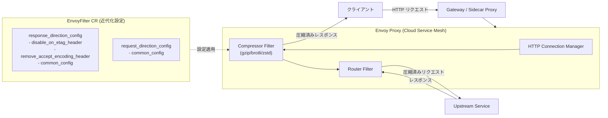

# Cloud Service Mesh: Envoy Compressor Filter が GA (Rapid チャネル)

**リリース日**: 2026-06-15

**サービス**: Cloud Service Mesh

**機能**: Envoy Compressor Filter の GA リリース (Rapid Release Channel)

**ステータス**: GA (Rapid Release Channel)

[このアップデートのインフォグラフィックを見る](https://takech9203.github.io/google-cloud-news-summary/20260615-cloud-service-mesh-envoy-compressor-filter-ga.html)

## 概要

Cloud Service Mesh の Envoy Compressor Filter が Rapid リリースチャネルで一般提供 (GA) となりました。この機能により、HTTP リクエストおよびレスポンスのボディをオンザフライで圧縮・解凍することが可能となり、帯域幅の使用量削減とアプリケーションパフォーマンスの向上が期待できます。

このリリースに合わせて、EnvoyFilter の圧縮設定に関する API サーフェスの近代化が求められています。従来のトップレベルフィールド (content_length、content_type、disable_on_etag_header、remove_accept_encoding_header など) は非推奨となり、新しい `response_direction_config` および `request_direction_config` ブロックに移動する必要があります。

対象ユーザーは、Cloud Service Mesh を TRAFFIC_DIRECTOR コントロールプレーンで使用し、EnvoyFilter API を通じてデータプレーンの拡張を行っているチームです。特に、既存の圧縮設定を持つユーザーは設定の近代化が必要です。

**アップデート前の課題**

- EnvoyFilter の圧縮設定は非推奨のトップレベルフィールドを使用する形式が一般的で、将来のバージョンとの互換性に懸念があった
- レスポンス方向とリクエスト方向の圧縮設定が明確に分離されておらず、設定の可読性が低かった
- Envoy Compressor Filter は Preview 段階であり、本番環境での利用に対する公式サポートが限定的だった

**アップデート後の改善**

- Envoy Compressor Filter が GA となり、本番環境での利用が完全にサポートされるようになった
- `response_direction_config` と `request_direction_config` による明確な設定構造が提供され、設定の可読性と保守性が向上した
- TRAFFIC_DIRECTOR コントロールプレーンによるバリデーションが導入され、非サポートフィールドの使用が検出・警告されるようになった

## アーキテクチャ図



Envoy Proxy 内の HTTP フィルタチェーンにおいて、Compressor Filter がリクエスト/レスポンスの圧縮処理を担当します。EnvoyFilter カスタムリソースを通じて、レスポンス方向とリクエスト方向それぞれの圧縮設定を個別に制御できます。

## サービスアップデートの詳細

### 主要機能

1. **HTTP レスポンスの圧縮**
   - `response_direction_config` を使用してレスポンスボディの圧縮を制御
   - `min_content_length` で圧縮を発動する最小レスポンスサイズを設定
   - `content_type` で圧縮対象の MIME タイプを指定
   - `disable_on_etag_header` で ETag ヘッダーがある場合の圧縮無効化を制御
   - `remove_accept_encoding_header` で Accept-Encoding ヘッダーの削除を制御

2. **HTTP リクエストの圧縮**
   - `request_direction_config` を使用してリクエストボディの圧縮を制御
   - レスポンスと同様に `min_content_length` と `content_type` を設定可能

3. **複数圧縮ライブラリのサポート**
   - gzip、brotli、zstd などの圧縮アルゴリズムを選択可能
   - `compressor_library` フィールドで圧縮ライブラリを指定
   - `choose_first` オプションによる圧縮アルゴリズムの優先制御

### リリースチャネル別サポート状況

| フィールド | Rapid | Regular | Stable |
|------|:------:|:------:|:------:|
| compressor_library | 対応 | 対応 | 対応 |
| choose_first | 対応 | 対応 | 対応 |
| response_direction_config.common_config.min_content_length | 対応 | 対応 | 対応 |
| response_direction_config.common_config.content_type | 対応 | 対応 | 対応 |
| response_direction_config.common_config.enabled | 対応 | 対応 | 対応 |
| response_direction_config.disable_on_etag_header | 対応 | 対応 | 対応 |
| response_direction_config.remove_accept_encoding_header | 対応 | 対応 | 対応 |
| response_direction_config.uncompressible_response_codes | 対応 | 対応 | 対応 |
| request_direction_config.common_config.min_content_length | 対応 | 対応 | 対応 |
| request_direction_config.common_config.content_type | 対応 | 対応 | 対応 |
| request_direction_config.common_config.enabled | 対応 | 対応 | 対応 |

## 技術仕様

### 非推奨フィールドの移行マッピング

| 非推奨フィールドパス | 新しいフィールドパス | 備考 |
|------|------|------|
| `typed_config.min_content_length` | `typed_config.response_direction_config.common_config.min_content_length` | 圧縮発動の最小サイズ |
| `typed_config.content_length` | `typed_config.response_direction_config.common_config.min_content_length` | min_content_length の旧エイリアス |
| `typed_config.content_type` | `typed_config.response_direction_config.common_config.content_type` | 圧縮対象 MIME タイプの配列 |
| `typed_config.disable_on_etag_header` | `typed_config.response_direction_config.disable_on_etag_header` | ETag 存在時の圧縮無効化 |
| `typed_config.remove_accept_encoding_header` | `typed_config.response_direction_config.remove_accept_encoding_header` | Accept-Encoding ヘッダーの削除 |

### バリデーション動作

| デプロイタイプ | バリデーション動作 |
|------|------|
| レガシーデプロイメント (バリデーション有効化前にデプロイ済み) | 警告ステータスが設定され、設定は引き続き適用されるが移行が推奨される |
| 新規デプロイメント (バリデーション有効化後) | 非サポートフィールドの使用が厳密にブロックされ、設定が拒否される |

## 設定方法

### 前提条件

1. Cloud Service Mesh が TRAFFIC_DIRECTOR コントロールプレーンで動作していること
2. GKE クラスタが Rapid リリースチャネルに登録されていること
3. `kubectl` がクラスタに接続できること

### 手順

#### ステップ 1: 既存の EnvoyFilter 設定を確認

```bash
kubectl get envoyfilters --all-namespaces -o yaml
```

出力から `envoy.filters.http.compressor` をパッチしている EnvoyFilter を特定し、非推奨フィールドの使用を確認します。

#### ステップ 2: 近代化された設定を作成

```yaml
apiVersion: networking.istio.io/v1alpha3
kind: EnvoyFilter
metadata:
  name: compressor-filter-update
  namespace: istio-system
spec:
  configPatches:
  - applyTo: HTTP_FILTER
    match:
      context: GATEWAY
      listener:
        filterChain:
          filter:
            name: envoy.filters.network.http_connection_manager
            subFilter:
              name: envoy.filters.http.router
    patch:
      operation: INSERT_BEFORE
      value:
        name: envoy.filters.http.compressor
        typed_config:
          '@type': type.googleapis.com/envoy.extensions.filters.http.compressor.v3.Compressor
          compressor_library:
            name: gzip
            typed_config:
              '@type': type.googleapis.com/envoy.extensions.compression.gzip.compressor.v3.Gzip
          response_direction_config:
            disable_on_etag_header: true
            remove_accept_encoding_header: true
            common_config:
              min_content_length: 1024
              content_type:
              - "application/javascript"
              - "application/json"
              - "text/html"
              - "text/css"
              enabled:
                default_value: true
                runtime_key: "compressor.enabled"
```

#### ステップ 3: 設定を適用して検証

```bash
# 設定を適用
kubectl apply -f compressor-filter.yaml

# EnvoyFilter のステータスを確認 (警告が解消されていることを確認)
kubectl get envoyfilter compressor-filter-update -n istio-system -o yaml

# レスポンスヘッダーで圧縮が有効であることを確認
curl -H "Accept-Encoding: gzip" -I https://your-service.example.com
# Content-Encoding: gzip が返されることを確認
```

## メリット

### ビジネス面

- **帯域幅コスト削減**: HTTP レスポンスの圧縮により、ネットワーク転送量を大幅に削減し、Cloud NAT やロードバランサーの帯域幅コストを最適化
- **ユーザー体験向上**: レスポンスサイズの削減によりページロード時間が短縮され、エンドユーザーの体験が改善

### 技術面

- **GA レベルの安定性**: 本番環境での利用が公式にサポートされ、SLA の対象となる
- **設定の明確化**: レスポンス方向とリクエスト方向の設定が分離され、意図の明確化と保守性の向上を実現
- **将来の互換性**: 近代化された設定形式を使用することで、Envoy および Cloud Service Mesh の将来のバージョンアップとの互換性を確保

## デメリット・制約事項

### 制限事項

- 現時点では Rapid リリースチャネルのみで GA。Regular および Stable チャネルへの展開は段階的に行われる
- EnvoyFilter API は `TRAFFIC_DIRECTOR` コントロールプレーン実装でのみサポート
- `configPatches[].applyTo` は `HTTP_FILTER` のみサポート
- `configPatches[].patch.operation` は `INSERT_FIRST` と `INSERT_BEFORE` (router フィルタと併用時) のみサポート

### 考慮すべき点

- 既存の非推奨フィールドを使用した設定は、バリデーション有効化後に新規デプロイするとブロックされる
- 圧縮処理は CPU リソースを消費するため、CPU バウンドなワークロードでは圧縮レベルやコンテンツタイプの適切な設定が必要
- 設定変更はプロキシの再起動なしに反映されるが、テスト環境での事前検証を推奨

## ユースケース

### ユースケース 1: API ゲートウェイでの JSON レスポンス圧縮

**シナリオ**: マイクロサービスアーキテクチャで、API ゲートウェイを通じて大量の JSON レスポンスを返すシステム。レスポンスサイズが大きく、帯域幅コストとレイテンシーが課題となっている。

**実装例**:
```yaml
response_direction_config:
  common_config:
    min_content_length: 512
    content_type:
    - "application/json"
    - "application/grpc+json"
    enabled:
      default_value: true
      runtime_key: "api_compressor.enabled"
```

**効果**: JSON レスポンスが 60-80% 圧縮され、帯域幅コストの大幅削減とレスポンス時間の短縮を実現。

### ユースケース 2: Web アプリケーションの静的アセット圧縮

**シナリオ**: Cloud Service Mesh を通じて配信される Web アプリケーションで、JavaScript、CSS、HTML ファイルの転送サイズを最適化したい。

**実装例**:
```yaml
response_direction_config:
  disable_on_etag_header: true
  remove_accept_encoding_header: true
  common_config:
    min_content_length: 1024
    content_type:
    - "application/javascript"
    - "text/css"
    - "text/html"
    - "image/svg+xml"
```

**効果**: ETag ベースのキャッシュ制御を維持しつつ、静的アセットの圧縮によりページロード時間を 30-50% 短縮。

## 関連サービス・機能

- **Cloud Service Mesh データプレーン拡張**: EnvoyFilter API を使用した Envoy 設定のカスタマイズ基盤
- **Cloud Service Mesh リリースチャネル**: Rapid / Regular / Stable の段階的ロールアウト管理
- **Cloud Load Balancing**: ロードバランサーレベルでの圧縮設定との使い分け
- **Istio / Envoy Proxy**: Cloud Service Mesh の基盤となるオープンソースプロジェクト

## 参考リンク

- [インフォグラフィック](https://takech9203.github.io/google-cloud-news-summary/20260615-cloud-service-mesh-envoy-compressor-filter-ga.html)
- [公式リリースノート](https://cloud.google.com/service-mesh/docs/release-notes#June_15_2026)
- [Modernize EnvoyFilter compressor configurations](https://cloud.google.com/service-mesh/docs/migrate/modernize-envoyfilter-compressor)
- [Data plane extensibility with EnvoyFilter](https://cloud.google.com/service-mesh/docs/data-plane-extensibility)
- [Supported Extensions (Compressor)](https://cloud.google.com/service-mesh/docs/data-plane-extensibility#typegoogleapiscomenvoyextensionsfiltershttpcompressorv3compressor)

## まとめ

Cloud Service Mesh の Envoy Compressor Filter が Rapid チャネルで GA となったことで、本番環境での HTTP 圧縮機能の利用が公式にサポートされました。既存の非推奨フィールドを使用している場合は、`response_direction_config` および `request_direction_config` を使用した新しい設定形式への移行を早急に行うことを推奨します。これにより、バリデーションエラーの回避と将来のバージョンとの互換性が確保されます。

---

**タグ**: #CloudServiceMesh #EnvoyProxy #Compressor #GA #RapidChannel #EnvoyFilter #データプレーン拡張 #HTTP圧縮 #マイグレーション
