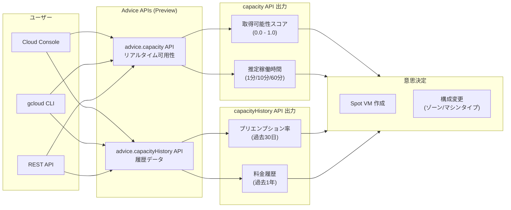

# Compute Engine: Spot VM の可用性・プリエンプション率・料金情報の事前確認機能

**リリース日**: 2026-06-15

**サービス**: Compute Engine / AI Hypercomputer

**機能**: Spot VM 可用性情報の事前確認 (advice.capacity API / advice.capacityHistory API)

**ステータス**: Preview

📊 [このアップデートのインフォグラフィックを見る](https://takech9203.github.io/google-cloud-news-summary/20260615-compute-engine-spot-vm-availability-preview.html)

## 概要

Google Cloud は、Spot VM の作成前にリアルタイムの可用性情報、推定稼働時間、過去のプリエンプション率、および料金情報を確認できる機能を Preview として公開しました。この機能は `advice.capacity` API と `advice.capacityHistory` API を通じて提供され、ユーザーが Spot VM を作成する際の成功率を最大化し、ワークロードの要件と予算に最適な構成を選択するための情報を提供します。

Spot VM はオンデマンド料金と比較して最大 91% の割引を提供する一方、Compute Engine がリソースを回収するためにいつでもプリエンプト（中断）される可能性があります。従来はこのリスクを事前に定量的に評価する手段が限られていましたが、本機能によりデータに基づいた意思決定が可能になります。

この機能は、大規模なバッチ処理、AI/ML トレーニング、HPC ワークロードなどで Spot VM を活用するすべてのユーザーに有用です。

**アップデート前の課題**

- Spot VM を作成する前に、特定のマシンタイプやゾーンでの実際の利用可能性を確認する方法がなかった
- プリエンプション率の傾向を把握できず、ワークロードの安定性を事前に見積もることが困難だった
- 料金の変動傾向を確認する手段が限られており、コスト最適化の判断材料が不足していた
- 複数のゾーンやマシンタイプを比較して最適な構成を選択するためのデータがなかった

**アップデート後の改善**

- `advice.capacity` API によりリアルタイムの取得可能性スコア（obtainability score）と推定稼働時間を確認可能になった
- `advice.capacityHistory` API により過去 30 日間のプリエンプション率と過去 1 年間の料金履歴を確認可能になった
- 複数のマシンタイプやゾーンを横断的に比較し、ワークロードに最適な構成を選択できるようになった
- リソース可用性エラーの発生を事前に回避できるようになった

## アーキテクチャ図



本図は、ユーザーが 2 つの Advice API を通じて可用性情報と履歴データを取得し、その結果に基づいて Spot VM の作成判断を行うフローを示しています。

## サービスアップデートの詳細

### 主要機能

1. **リアルタイム可用性の確認 (advice.capacity API)**
   - 特定のマシンタイプとゾーンにおける Spot VM の取得可能性スコア（obtainability score）を提供
   - スコアは 0.0 から 1.0 の範囲で、作成リクエストの成功確率を示す
   - 推定稼働時間（estimatedUptime）により、プリエンプションまでの期待稼働時間を提示
   - 複数ゾーンへの分散配置の推奨を含むレコメンデーションを提供

2. **プリエンプション率の履歴確認 (advice.capacityHistory API)**
   - 指定したマシンタイプとゾーンの過去 30 日間のプリエンプション率を日次で表示
   - プリエンプション率は 0.00 から 1.00 の範囲で表現
   - Google Cloud 全体での同マシンタイプ・ゾーンにおける停止 VM に対するプリエンプト率として算出

3. **料金履歴の確認 (advice.capacityHistory API)**
   - 指定したマシンタイプとリージョンの過去 1 年間の料金変動履歴を表示
   - 各エントリは価格が有効だった期間と時間あたりの料金（USD）を含む
   - 料金変更は太平洋時間の午前 0 時に設定される

## 技術仕様

### API 仕様

| 項目 | advice.capacity API | advice.capacityHistory API |
|------|---------------------|---------------------------|
| 目的 | リアルタイム可用性確認 | 履歴データ確認 |
| 出力 | 取得可能性スコア、推定稼働時間 | プリエンプション率、料金履歴 |
| データ範囲 | リアルタイム | プリエンプション: 過去30日、料金: 過去1年 |
| IAM 権限 | `compute.advice.capacity` | `compute.advice.capacityHistory` |
| 必要ロール | `roles/compute.viewer` | `roles/compute.viewer` |
| 制限事項 | TPU は対象外 | N1+GPU、カスタムマシンタイプ、TPU は対象外 |

### 取得可能性スコアの解釈

| スコア範囲 | 成功確率 | 推奨アクション |
|-----------|---------|--------------|
| 0.7 - 1.0 | 高い | Spot VM の作成を実行 |
| 0.4 - 0.6 | 中程度 | 一部のみ取得可能な場合あり |
| 0.0 - 0.3 | 低い | 別のゾーン/マシンタイプを検討、または別のプロビジョニングモデルを使用 |

### 推定稼働時間の解釈

| 推定稼働時間 | 推奨ワークロード |
|-------------|----------------|
| 60 分 (3,600 秒) | 長時間実行のバッチワークロード |
| 10 分 (600 秒) | 短時間タスク、頻繁にチェックポイントを保存するワークロード |
| 1 分 (60 秒) | 非常に短いタスク、テスト、非クリティカルなワークロードのみ |

## 設定方法

### 前提条件

1. Google Cloud プロジェクトで Compute Engine API が有効化されていること
2. `roles/compute.viewer` ロール（または `compute.advice.capacity` / `compute.advice.capacityHistory` 権限）が付与されていること
3. AI ゾーンを利用する場合、プロジェクトで AI ゾーンが有効化されていること

### 手順

#### ステップ 1: リアルタイム可用性の確認

```bash
gcloud beta compute advice capacity \
  --provisioning-model=SPOT \
  --instance-selection-machine-types=n2-standard-2,n2-standard-4 \
  --target-distribution-shape=ANY \
  --size=100 \
  --region=us-central1
```

出力例:
```
recommendations:
- scores:
    obtainability: 0.9
    estimatedUptime: 600s
  - shards:
    - instanceCount: 90
      machineType: n2-standard-2
      provisioningModel: SPOT
      zone: us-central1-a
    - instanceCount: 10
      machineType: n2-standard-4
      provisioningModel: SPOT
      zone: us-central1-c
```

#### ステップ 2: プリエンプション率と料金履歴の確認

```bash
gcloud beta compute advice capacity-history \
  --provisioning-model=SPOT \
  --machine-type=n2-standard-32 \
  --types=PREEMPTION,PRICE \
  --region=us-central1
```

出力例:
```
location: .../zones/us-central1-a
machineType: n2-standard-32
preemptionHistory:
- interval:
    startTime: "2026-04-20T07:00:00Z"
    endTime: "2026-04-21T07:00:00Z"
  preemptionRate: 0.52
priceHistory:
- interval:
    startTime: "2026-04-27T07:00:00Z"
    endTime: "2026-05-11T07:00:00Z"
  listPrice:
    currencyCode: "USD"
    nanos: "478720000"
```

#### ステップ 3: REST API での確認（可用性）

```bash
curl -X POST \
  "https://compute.googleapis.com/compute/beta/projects/PROJECT_ID/regions/REGION/advice/capacity" \
  -H "Authorization: Bearer $(gcloud auth print-access-token)" \
  -H "Content-Type: application/json" \
  -d '{
    "instanceSelection": {
      "machineTypes": ["n2-standard-2", "n2-standard-4"]
    },
    "instanceProperties": {
      "scheduling": {
        "provisioningModel": "SPOT"
      }
    },
    "targetDistributionShape": "ANY",
    "size": 100
  }'
```

#### ステップ 4: REST API での確認（プリエンプション率・料金）

```bash
curl -X POST \
  "https://compute.googleapis.com/compute/beta/projects/PROJECT_ID/regions/REGION/advice/capacityHistory" \
  -H "Authorization: Bearer $(gcloud auth print-access-token)" \
  -H "Content-Type: application/json" \
  -d '{
    "types": ["PREEMPTION", "PRICE"],
    "instanceProperties": {
      "scheduling": {
        "provisioningModel": "SPOT"
      },
      "machineType": "n2-standard-32"
    }
  }'
```

## メリット

### ビジネス面

- **コスト最適化の強化**: 料金履歴データに基づいて最もコスト効率の良いタイミングとリージョンを選択可能
- **予算計画の精度向上**: 過去の料金変動傾向から将来のコストをより正確に予測可能
- **リソース可用性エラーの削減**: 事前にキャパシティを確認することで、作成失敗によるダウンタイムを回避

### 技術面

- **データ駆動の意思決定**: 定量的なスコアと履歴データに基づいてインフラ構成を最適化
- **マルチゾーン分散の最適化**: API レコメンデーションに従い、最適なゾーン分散配置を実現
- **ワークロード適合性の向上**: 推定稼働時間を基に、ワークロードのチェックポイント間隔やフォールトトレランス設計を最適化

## デメリット・制約事項

### 制限事項

- TPU の可用性は `advice.capacity` API では確認不可
- N1 マシンタイプに GPU を接続した構成、カスタムマシンタイプ、TPU は `advice.capacityHistory` API の対象外
- 取得可能性スコアはキャパシティを保証するものではなく、推奨取得後にリソースが利用不可になる可能性がある
- 推定稼働時間も保証ではなく、実際の稼働時間はより長い場合も短い場合もある
- 現在 Preview 段階であり、サポートが限定的で仕様変更の可能性がある

### 考慮すべき点

- API 呼び出しと実際の VM 作成の間にタイムラグがあるため、取得した情報が作成時には変動している可能性がある
- プリエンプション率は Google Cloud 全体の集計値であり、個別プロジェクトの実績とは異なる場合がある
- 料金は最大 30 日に 1 回変動する可能性があるため、料金履歴の過去データが将来を正確に予測するとは限らない

## ユースケース

### ユースケース 1: 大規模バッチ処理の事前計画

**シナリオ**: データ分析チームが毎夜 500 台の Spot VM でバッチ処理を実行する必要があり、処理完了には最低 30 分の連続稼働が必要。

**実装例**:
```bash
# 複数リージョンの可用性を比較
for region in us-central1 us-east1 europe-west1; do
  echo "=== $region ==="
  gcloud beta compute advice capacity \
    --provisioning-model=SPOT \
    --instance-selection-machine-types=n2-standard-4 \
    --target-distribution-shape=BALANCED \
    --size=500 \
    --region=$region
done
```

**効果**: 推定稼働時間が 60 分以上かつ取得可能性スコアが 0.7 以上のリージョンを選択することで、バッチ処理の完了率を大幅に向上。

### ユースケース 2: AI/ML トレーニングのコスト最適化

**シナリオ**: ML エンジニアが GPU 付き Spot VM を使用してモデルトレーニングを行っており、コストを最小化しつつチェックポイント間隔を最適化したい。

**実装例**:
```bash
# プリエンプション率の傾向を確認
gcloud beta compute advice capacity-history \
  --provisioning-model=SPOT \
  --machine-type=a2-highgpu-1g \
  --types=PREEMPTION,PRICE \
  --region=us-central1
```

**効果**: プリエンプション率が低い時間帯・ゾーンを特定し、チェックポイント保存頻度を適切に設定。料金履歴から最もコスト効率の良いリージョンを選択。

### ユースケース 3: MIG でのオートスケーリング設計

**シナリオ**: リージョナル MIG で Spot VM を使用したサービスを運用しており、プリエンプションに対する耐性を高めたい。

**効果**: `target-distribution-shape=BALANCED` で可用性を確認し、ゾーン間で均等に分散配置することで、単一ゾーン障害時の影響を最小化。

## 料金

本機能（advice.capacity API および advice.capacityHistory API）自体の利用に追加料金は発生しません。Spot VM の料金はマシンタイプとリージョンにより異なり、オンデマンド料金から最大 91% の割引が適用されます。料金は最大 30 日に 1 回変動する可能性があります。

## 関連サービス・機能

- **Managed Instance Groups (MIG)**: Spot VM のプリエンプション後に自動的に VM を再作成する機能を提供
- **Instance Flexibility**: MIG で複数のマシンタイプを許可し、プリエンプション率の低いマシンタイプを自動選択
- **Spot VM プリエンプション通知**: プリエンプション前に 120 秒（Preview）または 0 秒の通知を設定可能
- **AI ゾーン**: advice.capacity API はデフォルトで AI ゾーンを推奨対象に含む

## 参考リンク

- 📊 [インフォグラフィック](https://takech9203.github.io/google-cloud-news-summary/20260615-compute-engine-spot-vm-availability-preview.html)
- [View the availability of Spot VMs](https://docs.cloud.google.com/compute/docs/instances/view-vm-availability)
- [View the preemption rate and pricing for Spot VMs](https://docs.cloud.google.com/compute/docs/instances/view-spot-preemption-price)
- [Spot VMs ドキュメント](https://docs.cloud.google.com/compute/docs/instances/spot)
- [Spot VMs 料金ページ](https://cloud.google.com/spot-vms/pricing)
- [gcloud beta compute advice capacity コマンドリファレンス](https://docs.cloud.google.com/sdk/gcloud/reference/beta/compute/advice/capacity)
- [gcloud beta compute advice capacity-history コマンドリファレンス](https://docs.cloud.google.com/sdk/gcloud/reference/beta/compute/advice/capacity-history)

## まとめ

本機能は、Spot VM の利用におけるこれまでの「運任せ」のアプローチを、データに基づいた意思決定プロセスへと変革するものです。取得可能性スコア、推定稼働時間、プリエンプション率履歴、料金履歴という 4 つの指標を活用することで、Spot VM のコストメリットを最大化しつつ、プリエンプションリスクを適切に管理できます。現在 Preview 段階ですが、Spot VM を大規模に活用しているチームは早期に検証を開始し、ワークロード配置戦略の最適化に活用することを推奨します。

---

**タグ**: #ComputeEngine #SpotVM #AIHypercomputer #コスト最適化 #Preview #プリエンプション #キャパシティプランニング
