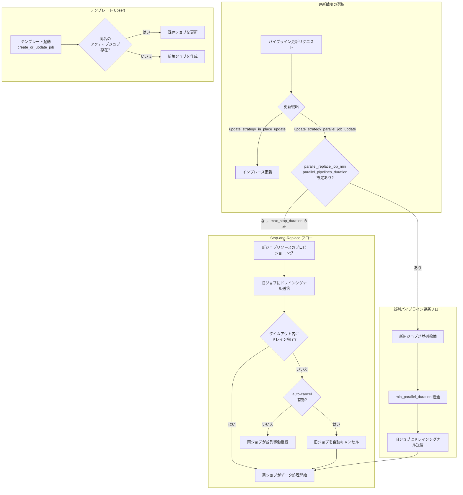

# Dataflow: ストリーミングパイプライン更新機能の拡張

**リリース日**: 2026-06-15

**サービス**: Dataflow

**機能**: ストリーミングジョブのパイプライン更新機能の拡張

**ステータス**: Feature (GA)

[このアップデートのインフォグラフィックを見る](https://takech9203.github.io/google-cloud-news-summary/20260615-dataflow-streaming-pipeline-update-features.html)

## 概要

Dataflow がストリーミングジョブのパイプライン更新機能を大幅に拡張しました。今回のアップデートにより、自動化された stop-and-replace 更新、同一ジョブ名での並列更新、ドレイン中ジョブの自動キャンセル、更新戦略の明示的な設定、テンプレートの upsert 機能の 5 つの新機能が GA として利用可能になりました。

これらの機能により、ストリーミングパイプラインのデプロイメントと運用管理が大幅に簡素化されます。従来は手動で複数のステップを踏む必要があったパイプラインの入れ替え作業が、宣言的な API 呼び出しで自動化できるようになり、ダウンタイムの最小化とデータの整合性確保を両立できます。

対象ユーザーは、Dataflow でストリーミングパイプラインを運用しているデータエンジニアリングチーム、特に頻繁にパイプラインの更新やデプロイを行うチームです。CI/CD パイプラインへの組み込みや Terraform/Config Connector による Infrastructure as Code 管理を行っているチームにとって特に有用です。

**アップデート前の課題**

- パイプラインの更新時に手動で旧ジョブのドレインを開始し、完了を待ち、新ジョブを起動するという手順が必要だった
- 互換性チェックに失敗する破壊的変更の場合、インプレース更新ができず手動の stop-and-replace が必須だった
- ドレイン中にジョブがスタックした場合、手動での監視と介入が必要だった
- テンプレートからのジョブ起動時に、既存ジョブの有無を事前にプログラム的に確認して create/update を切り替える必要があった
- 同一ジョブ名での並列更新ができず、ジョブ名の管理が複雑になっていた

**アップデート後の改善**

- 宣言的な API 呼び出しにより、stop-and-replace の全プロセスが自動化された
- 同一ジョブ名を再利用した並列更新が可能になり、ジョブ名管理が簡素化された
- `parallel_replace_job_max_stop_duration` によるタイムアウト設定で、スタックしたジョブを自動キャンセルできるようになった
- `update_strategy_parallel_job_update` と `update_strategy_in_place_update` の明示的な選択により、更新戦略の意図が明確化された
- `create_or_update_job` エクスペリメントにより、テンプレートからの起動が upsert 方式で簡素化された

## アーキテクチャ図



この図は、Dataflow パイプライン更新時の意思決定フローを示しています。更新戦略の選択から、Stop-and-Replace および並列パイプライン更新の実行フロー、テンプレートの upsert 動作までの全体像を表現しています。

## サービスアップデートの詳細

### 主要機能

1. **自動化された Stop-and-Replace 更新**
   - 宣言的なワークフローにより、手動のプロシージャルステップを排除
   - ジョブの入れ替え対象を宣言するだけで、新ジョブの起動と遷移が自動的に調整される
   - 新ジョブのリソースは旧ジョブがまだ稼働中にプロビジョニングされる
   - 旧ジョブには自動的にドレインシグナルが送信される
   - 旧ジョブのドレイン完了後（またはタイムアウト到達後）、新ジョブが即座にデータ処理を開始
   - 重複データや部分的な集計を許容できないが、ドレイン中の短い処理停止は許容できるパイプラインに最適

2. **同一ジョブ名での並列更新**
   - `--update` フラグと `update_strategy_parallel_job_update` オプションを組み合わせて使用
   - 新ジョブは前回のジョブ開始から少なくとも 2 分後に開始する必要あり（重複並列更新防止のため）
   - ジョブ名の一貫性が保たれ、モニタリングや運用管理が簡素化される

3. **ドレイン中ジョブの自動キャンセル**
   - `parallel_replace_job_max_stop_duration` でタイムアウトを指定
   - `parallel_replace_job_cancel_on_drain_timeout` はデフォルトで `true`（max_stop_duration 設定時）
   - タイムアウト後に旧ジョブが自動的にキャンセルされ、スタック状態を解消
   - `false` に設定すると自動キャンセルを無効化でき、両ジョブが並列稼働を継続

4. **更新戦略の明示的設定**
   - `update_strategy_parallel_job_update`: 並列更新（stop-and-replace を含む）を実行
   - `update_strategy_in_place_update`: 標準のインプレース更新を実行
   - 両戦略は排他的で、他の設定を変更せずに戦略のみを切り替え可能

5. **テンプレート Upsert 機能**
   - `create_or_update_job` エクスペリメントを使用
   - Classic Templates、Flex Templates、Terraform、Config Connector に対応
   - 指定したジョブ名のアクティブなジョブが存在する場合は更新として起動
   - アクティブなジョブが存在しない場合は新規作成として起動
   - プログラム的なジョブ存在確認ロジックが不要になる

## 技術仕様

### サービスオプション一覧

| オプション | 必須/任意 | 説明 |
|------|------|------|
| `update_strategy_parallel_job_update` | 必須（同一ジョブ名更新時） | 並列更新を実行するための戦略指定 |
| `update_strategy_in_place_update` | 任意 | 標準インプレース更新を実行（並列更新と排他的） |
| `parallel_replace_job_max_stop_duration` | 必須（Stop-and-Replace 時） | ドレインの最大待機時間（例: `30m`, `1h`） |
| `parallel_replace_job_min_parallel_pipelines_duration` | 必須（並列パイプライン更新時） | 並列稼働の最小時間（`0s` ~ `744h`） |
| `parallel_replace_job_name` / `parallel_replace_job_id` | 必須（異なるジョブ名更新時） | 旧ジョブの識別（名前または ID） |
| `parallel_replace_job_cancel_on_drain_timeout` | 任意（デフォルト: `true`） | タイムアウト時の自動キャンセルの有効/無効 |
| `create_or_update_job` | 任意 | テンプレートの upsert 動作を有効化 |

### Stop-and-Replace と並列パイプライン更新の使い分け

| ワークフロー | 使用条件 | ユースケース |
|------|------|------|
| Stop-and-Replace | `max_stop_duration` を設定し、`min_parallel_pipelines_duration` は設定しない | 重複データ不可、短い処理停止は許容 |
| 並列パイプライン更新 | `min_parallel_pipelines_duration` を設定 | ダウンタイム最小化が最優先、重複データは許容可能 |

## 設定方法

### 前提条件

1. Google Cloud プロジェクトで Dataflow API が有効化されていること
2. Streaming Engine ジョブであること（自動更新の場合に必須）
3. 適切な IAM 権限（Dataflow 管理者または編集者ロール）

### 手順

#### ステップ 1: 自動 Stop-and-Replace 更新（Java SDK の例）

```bash
# 同一ジョブ名で stop-and-replace 更新を実行
mvn compile exec:java -Dexec.mainClass=com.example.MyPipeline \
  -Dexec.args="--runner=DataflowRunner \
  --project=PROJECT_ID \
  --region=REGION \
  --jobName=MY_STREAMING_JOB \
  --update \
  --dataflowServiceOptions=update_strategy_parallel_job_update \
  --dataflowServiceOptions=parallel_replace_job_max_stop_duration=30m"
```

旧ジョブが 30 分以内にドレインを完了しない場合、自動的にキャンセルされます。

#### ステップ 2: 異なるジョブ名での更新（Python SDK の例）

```bash
# 異なるジョブ名で更新を実行
python my_pipeline.py \
  --runner=DataflowRunner \
  --project=PROJECT_ID \
  --region=REGION \
  --job_name=MY_NEW_JOB \
  --dataflow_service_options="parallel_replace_job_name=MY_OLD_JOB" \
  --dataflow_service_options="parallel_replace_job_max_stop_duration=30m"
```

#### ステップ 3: gcloud CLI でのテンプレート Upsert

```bash
# Flex Template の upsert 起動
gcloud dataflow flex-template run MY_JOB_NAME \
  --template-file-gcs-location=gs://BUCKET/template.json \
  --region=REGION \
  --additional-experiments="create_or_update_job" \
  --additional-experiments="update_strategy_parallel_job_update" \
  --additional-experiments="parallel_replace_job_max_stop_duration=30m"
```

同名のアクティブジョブが存在すれば更新、存在しなければ新規作成されます。

#### ステップ 4: Terraform での設定

```hcl
resource "google_dataflow_flex_template_job" "streaming_job" {
  provider = google-beta
  name     = "my-streaming-job"
  region   = "us-central1"

  container_spec_gcs_path = "gs://my-bucket/templates/my-template.json"

  parameters = {
    inputSubscription = "projects/my-project/subscriptions/my-sub"
    outputTable       = "my-project:my_dataset.my_table"
  }

  additional_experiments = [
    "parallel_replace_job_max_stop_duration=30m",
    "parallel_replace_job_cancel_on_drain_timeout=true",
    "update_strategy_parallel_job_update",
    "create_or_update_job"
  ]
}
```

## メリット

### ビジネス面

- **運用コストの削減**: パイプライン更新作業の自動化により、手動オペレーションの工数が大幅に削減される
- **ダウンタイムの最小化**: 並列更新やリソースの事前プロビジョニングにより、データ処理の中断時間を最小限に抑制
- **リスクの低減**: 自動キャンセルやタイムアウト設定により、スタック状態での長時間の二重課金を防止

### 技術面

- **宣言的な更新ワークフロー**: 手続き的な複数ステップから宣言的な単一 API 呼び出しへの移行により、CI/CD パイプラインとの統合が容易
- **Infrastructure as Code との親和性**: Terraform や Config Connector での管理が `create_or_update_job` により大幅に簡素化
- **柔軟な戦略選択**: インプレース更新と並列更新を同じオプション体系で切り替え可能なため、パイプラインの特性に応じた最適な戦略を選択可能
- **冪等性の実現**: upsert 機能により、テンプレート起動コードに冪等性を持たせることが可能

## デメリット・制約事項

### 制限事項

- 自動更新は Streaming Engine ジョブのみ対応（Classic Streaming には非対応）
- 同一ジョブ名での更新は、前回のジョブ開始から最低 2 分のインターバルが必要
- 同一ジョブ名の同時実行（並列更新ワークフロー外）は禁止されている

### 考慮すべき点

- 並列パイプラインの同一入力ソースからの読み取りは、データの重複、部分的な集計、順序問題を引き起こす可能性がある
- Pub/Sub ソースの場合、同一サブスクリプションを複数パイプラインで使用することは推奨されない（正確性の問題）
- Apache Kafka の場合、重複を最小化するにはオフセットコミットの有効化が必要
- 自動キャンセルを無効化すると、ドレイン完了までの間に旧ジョブと新ジョブの両方が稼働し、コストが二重にかかる

## ユースケース

### ユースケース 1: CI/CD パイプラインでの自動デプロイ

**シナリオ**: データエンジニアリングチームが GitHub Actions や Cloud Build からストリーミングパイプラインを自動デプロイする場合。コード変更がマージされるたびに新しいパイプラインバージョンをデプロイしたい。

**実装例**:
```bash
# Cloud Build ステップでの実行
gcloud dataflow flex-template run my-etl-pipeline \
  --template-file-gcs-location=gs://my-bucket/templates/etl-v${BUILD_ID}.json \
  --region=us-central1 \
  --additional-experiments="create_or_update_job" \
  --additional-experiments="update_strategy_parallel_job_update" \
  --additional-experiments="parallel_replace_job_max_stop_duration=15m" \
  --additional-experiments="parallel_replace_job_cancel_on_drain_timeout=true"
```

**効果**: デプロイスクリプトが冪等になり、既存ジョブの有無を確認するロジックが不要。初回デプロイも再デプロイも同一コマンドで対応可能。

### ユースケース 2: ゼロダウンタイムを要求するリアルタイムデータパイプライン

**シナリオ**: 金融データのリアルタイム処理パイプラインで、ビジネスロジックの更新時にデータ損失やダウンタイムを許容できない場合。

**実装例**:
```bash
# 並列パイプライン更新（最低 5 分間の並列稼働を保証）
python my_pipeline.py \
  --runner=DataflowRunner \
  --project=my-project \
  --region=us-central1 \
  --job_name=financial-stream-processor \
  --update \
  --dataflow_service_options="update_strategy_parallel_job_update" \
  --dataflow_service_options="parallel_replace_job_min_parallel_pipelines_duration=5m" \
  --dataflow_service_options="parallel_replace_job_max_stop_duration=30m"
```

**効果**: 新旧パイプラインが最低 5 分間並列稼働し、データ処理の連続性が保証される。30 分のタイムアウトにより、ドレインが長引いた場合も自動的に解決。

### ユースケース 3: Terraform による宣言的なインフラ管理

**シナリオ**: Terraform で Dataflow パイプラインを管理しており、`terraform apply` のたびにジョブの状態に応じた適切な動作（新規作成 or 更新）を自動で行いたい。

**効果**: Terraform の宣言的なモデルとの親和性が高まり、ジョブのライフサイクル管理が単純化。状態ドリフトへの対応も容易になる。

## 料金

Dataflow のパイプライン更新機能自体に追加料金はありません。ただし、以下のコストが発生する点に注意が必要です。

| 項目 | 料金への影響 |
|------|------|
| 並列稼働期間中の二重リソース | 新旧両ジョブの vCPU、メモリ、ストレージが課金対象 |
| Stop-and-Replace のリソース事前プロビジョニング | 新ジョブのリソースが旧ジョブ稼働中にプロビジョニングされるため、短時間の二重課金が発生 |
| Streaming Engine の使用 | 自動更新には Streaming Engine が必須（追加料金なし） |

## 関連サービス・機能

- **Dataflow Streaming Engine**: 自動更新機能の前提条件となるストリーミング処理エンジン
- **Cloud Pub/Sub**: ストリーミングパイプラインの一般的な入力ソース。並列更新時のサブスクリプション管理に注意が必要
- **Terraform / Config Connector**: Infrastructure as Code による宣言的なパイプライン管理。`create_or_update_job` との組み合わせが特に有用
- **Dataflow Snapshots**: パイプラインの状態保存機能。手動 stop-and-replace 時の状態引き継ぎに使用可能
- **Apache Kafka**: ストリーミング入力ソースとして使用する場合、並列更新時のオフセットコミット設定が重要

## 参考リンク

- [インフォグラフィック](https://takech9203.github.io/google-cloud-news-summary/20260615-dataflow-streaming-pipeline-update-features.html)
- [公式リリースノート](https://cloud.google.com/dataflow/docs/release-notes#June_15_2026)
- [パイプラインアップグレードガイド](https://cloud.google.com/dataflow/docs/guides/upgrade-guide)
- [自動 Stop-and-Replace 更新](https://cloud.google.com/dataflow/docs/guides/upgrade-guide#automated-stop-replace)
- [自動並列パイプライン更新](https://cloud.google.com/dataflow/docs/guides/upgrade-guide#automated-parallel-updates)
- [テンプレートの Upsert 機能](https://cloud.google.com/dataflow/docs/guides/upgrade-guide#templates-create-or-update)
- [Dataflow テンプレート](https://cloud.google.com/dataflow/docs/concepts/dataflow-templates)

## まとめ

今回の Dataflow ストリーミングパイプライン更新機能の拡張は、ストリーミングジョブの運用管理を根本的に改善するアップデートです。宣言的な自動更新ワークフロー、テンプレートの upsert 機能、そして柔軟な更新戦略の選択により、CI/CD パイプラインとの統合が大幅に容易になります。特に Terraform や Config Connector で Dataflow パイプラインを管理しているチームは、`create_or_update_job` エクスペリメントの導入を早期に検討することを推奨します。

---

**タグ**: #Dataflow #Streaming #PipelineUpdate #StopAndReplace #ParallelUpdate #Upsert #Templates #Terraform #GA
