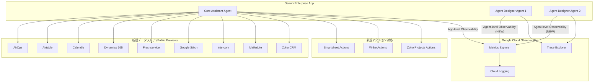

# Gemini Enterprise: 新規データストア追加とエージェント個別オブザーバビリティ

**リリース日**: 2026-06-15

**サービス**: Gemini Enterprise

**機能**: 新規データストアコネクタ (Public Preview) / エージェント個別オブザーバビリティ設定 (Preview)

**ステータス**: Public Preview

[このアップデートのインフォグラフィックを見る](https://takech9203.github.io/google-cloud-news-summary/20260615-gemini-enterprise-data-stores-agent-observability.html)

## 概要

Gemini Enterprise に 2 つの重要なアップデートが同時にリリースされました。第一に、9 つの新しいサードパーティデータストアコネクタが Public Preview として追加され、さらに既存の 3 つのデータストアに新しいアクションが追加されました。第二に、Agent Designer で作成した従業員製エージェントに対して個別にオブザーバビリティ設定を構成できるようになりました。

新規データストアにより、AirOps、Airtable、Calendly、Dynamics 365、Freshservice、Google Stitch、Intercom、MailerLite、Zoho CRM といった幅広い SaaS プラットフォームのデータを Gemini Enterprise から自然言語で検索・活用できるようになります。また、Smartsheet、Wrike、Zoho Projects に対しては、検索だけでなくタスクの作成や更新などの書き込みアクションが新たに追加されました。

オブザーバビリティの機能拡張では、従来アプリケーションレベル (Core Assistant エージェント) でのみ利用可能だったオブザーバビリティ設定を、Agent Designer で作成した個々のエージェントレベルで構成できるようになりました。これにより、特定のエージェントに対するメトリクスやトレースを個別に監視でき、問題の特定やパフォーマンスの最適化がより詳細に行えます。

**アップデート前の課題**

- サードパーティデータソースへの接続先が限定されており、AirOps、Airtable、Calendly などの SaaS ツールのデータを Gemini Enterprise 内で直接検索できなかった
- Smartsheet、Wrike、Zoho Projects に対しては検索のみで、タスク作成・更新などのアクションが実行できなかった
- オブザーバビリティ設定はアプリケーションレベル (Core Assistant) でのみ構成可能で、Agent Designer で作成した個々のエージェントの挙動を個別に監視できなかった
- 複数のエージェントがある環境で特定のエージェントの問題を切り分けることが困難だった

**アップデート後の改善**

- 9 つの新しいデータストアコネクタにより、CRM、プロジェクト管理、カスタマーサポート、マーケティングオートメーション、スケジューリングなど幅広い業務ツールとの連携が可能になった
- Smartsheet、Wrike、Zoho Projects でアクション (タスク作成、プロジェクト更新など) が実行可能になり、Gemini Enterprise 内から直接業務を遂行できるようになった
- Agent Designer エージェントに対して個別にオブザーバビリティを有効化し、Metrics Explorer でメトリクスを、Trace Explorer でトレースを確認できるようになった
- 特定エージェントのパフォーマンス問題や障害の切り分けが容易になった

## アーキテクチャ図



この図は、Gemini Enterprise アプリ内のエージェント (Core Assistant および Agent Designer エージェント) が新規データストアとアクションに接続し、個別のオブザーバビリティ設定により Google Cloud Observability にテレメトリデータを送信する全体構成を示しています。

## サービスアップデートの詳細

### 主要機能

1. **新規データストアコネクタ (Public Preview)**
   - 9 つの新しいサードパーティデータソースを Gemini Enterprise に接続可能
   - 自然言語による検索とデータ取得をサポート
   - フェデレーテッド検索により、データを Gemini Enterprise にコピーせずにリアルタイム検索が可能

2. **新規アクション追加 (Smartsheet / Wrike / Zoho Projects)**
   - 既存のデータストアに対する書き込み操作 (アクション) が追加
   - Gemini Enterprise の会話インターフェースから直接タスクやプロジェクトを作成・更新可能
   - ユーザーの承認フローを経た上でアクションが実行される

3. **エージェント個別オブザーバビリティ設定 (Preview)**
   - Agent Designer で作成した従業員製エージェントごとにオブザーバビリティを個別設定
   - OpenTelemetry 形式のトレースとログを収集
   - Metrics Explorer でセッション数、レイテンシ、エラー率などを監視
   - Trace Explorer でリクエストの実行フローを詳細に確認

## 技術仕様

### 新規データストア一覧

| データストア | 主なエンティティ | ステータス |
|------|------|------|
| AirOps | Workspaces | Public Preview |
| Airtable | Workspaces, Bases | Public Preview |
| Calendly | Events, Scheduled Events | Public Preview |
| Dynamics 365 | - | Public Preview |
| Freshservice | Tickets | Public Preview |
| Google Stitch | - | Public Preview |
| Intercom | Articles | Public Preview |
| MailerLite | Subscribers | Public Preview |
| Zoho CRM | Accounts | Public Preview |

### 新規アクション一覧

| データストア | 主なアクション |
|------|------|
| Smartsheet | タスク作成・更新、シート操作 |
| Wrike | フォルダ/プロジェクト作成・更新、タスク作成・更新 |
| Zoho Projects | プロジェクト作成・更新、タスク作成・更新、フェーズ作成・更新、Issue 作成・更新 |

### オブザーバビリティ設定

| 設定項目 | 説明 |
|------|------|
| Enable instrumentation of OpenTelemetry traces and logs | 有効にすると、トレース、スパン、スパンログ、メトリクスを Cloud Logging で確認可能 |
| Enable logging of prompt inputs and response outputs | 有効にすると、ユーザーのプロンプト入力とレスポンス出力を Cloud Logging に記録 (PII を含む可能性あり) |

## 設定方法

### 前提条件

1. Gemini Enterprise Admin ロール (roles/discoveryengine.agentspaceAdmin) が付与されていること
2. 既存の Gemini Enterprise ウェブアプリが作成済みであること
3. オブザーバビリティ機能には Monitoring Viewer ロール (roles/monitoring.viewer) が必要

### 手順

#### ステップ 1: データストアの作成

Google Cloud コンソールで Gemini Enterprise ページに移動し、Data stores から対象のコネクタを検索して作成します。

1. Google Cloud コンソールで Gemini Enterprise ページを開く
2. Data stores をクリック
3. Create data store をクリック
4. Source セクションで接続先 (例: Airtable) を検索して選択
5. エンティティを選択し、リージョンと暗号化設定を構成
6. データストアを作成後、アプリに接続してユーザー認証を実施

#### ステップ 2: エージェント個別オブザーバビリティの有効化 (コンソール)

1. Google Cloud コンソールで Gemini Enterprise ページに移動
2. 対象のアプリ名をクリック
3. Agents をクリックし、設定対象のエージェント名を選択
4. Observability タブをクリック
5. "Enable instrumentation of OpenTelemetry traces and logs" を有効化
6. (任意) "Enable logging of prompt inputs and response outputs" を有効化

#### ステップ 3: エージェント個別オブザーバビリティの有効化 (REST API)

```bash
curl -X PATCH -H "Authorization: Bearer $(gcloud auth print-access-token)" \
  -H "Content-Type: application/json" \
  -H "X-Goog-User-Project: PROJECT_ID" \
  "https://ENDPOINT_LOCATION-discoveryengine.googleapis.com/v1alpha/projects/PROJECT_ID/locations/LOCATION/collections/default_collection/engines/APP_ID/assistants/default_assistant/agents/AGENT_ID?updateMask=observabilityConfig" \
  -d '{
    "observabilityConfig": {
      "observabilityEnabled": true,
      "sensitiveLoggingEnabled": false
    }
  }'
```

`PROJECT_ID`、`LOCATION` (global / us / eu)、`APP_ID`、`AGENT_ID` を環境に合わせて置き換えてください。

## メリット

### ビジネス面

- **業務ツールとの統合範囲拡大**: CRM (Zoho CRM, Dynamics 365)、プロジェクト管理 (Wrike, Smartsheet, Zoho Projects)、カスタマーサポート (Freshservice, Intercom)、マーケティング (MailerLite) など、幅広い業務ツールのデータを一元的に検索可能
- **生産性向上**: Gemini Enterprise の会話インターフェースから直接タスク作成やプロジェクト更新が可能になり、ツール間の切り替えコストを削減
- **エージェント品質の可視化**: Agent Designer で作成したエージェントのパフォーマンスを個別に監視し、ユーザー体験の継続的な改善が可能

### 技術面

- **きめ細かな監視**: エージェント単位でのメトリクス収集により、特定エージェントの問題を迅速に特定・解決
- **OpenTelemetry 標準準拠**: ベンダーに依存しない標準的なテレメトリ形式により、既存の監視エコシステムとの統合が容易
- **フェデレーテッド検索**: データを Gemini Enterprise にコピーせずに検索可能なため、データガバナンスとセキュリティを維持

## デメリット・制約事項

### 制限事項

- 新規データストアは全て Public Preview であり、Pre-GA Offerings Terms が適用される
- データストアは global、us、eu の 3 リージョンのみでサポート
- 1 つのアプリに対して同一コネクタタイプのデータストアは 1 つのみ推奨
- エージェントオブザーバビリティは Agent Designer で作成した従業員製エージェントのみが対象 (カスタムエージェントやサードパーティエージェントには現時点で非対応)
- VPC Service Controls のパーミッター適用は既存のデータストアでは非対応 (再作成が必要)

### 考慮すべき点

- "Enable logging of prompt inputs and response outputs" を有効にすると PII を含むデータがログに記録されるため、アクセス制御を適切に設定する必要がある
- フェデレーテッド検索ではクエリがサードパーティ API に送信されるため、各サービスの利用規約とプライバシーポリシーが適用される
- メトリクスデータは Cloud Monitoring に保存され、デフォルトで 6 週間保持される

## ユースケース

### ユースケース 1: IT ヘルプデスクエージェントの構築と監視

**シナリオ**: 社内 IT 部門が Agent Designer で作成したヘルプデスクエージェントに Freshservice を接続し、チケット検索と回答を自動化。オブザーバビリティ設定により応答品質を継続的にモニタリング。

**効果**: ヘルプデスク対応時間の短縮とエージェントのパフォーマンス最適化が可能。レイテンシが閾値を超えた場合のアラート設定や、エラー率の時系列分析によるプロアクティブな問題対応を実現。

### ユースケース 2: 営業チーム向け CRM 連携エージェント

**シナリオ**: 営業部門が Zoho CRM データストアを接続し、顧客情報や商談状況を自然言語で検索可能に。同時に Wrike や Zoho Projects のアクションを活用して、商談のフォローアップタスクを Gemini Enterprise から直接作成。

**効果**: CRM データへのアクセス効率化と、アクションによるワークフロー自動化により、営業担当者がツール間の切り替えなく業務を遂行可能。

### ユースケース 3: マーケティングオートメーション連携

**シナリオ**: マーケティングチームが MailerLite と Airtable のデータストアを接続し、キャンペーンの配信状況や購読者リストを Gemini Enterprise から一元検索。

**効果**: 複数のマーケティングツールにまたがるデータを単一の会話インターフェースから確認でき、レポーティングやキャンペーン分析の効率が向上。

## 利用可能リージョン

データストアおよびオブザーバビリティ機能は以下のリージョンで利用可能です。

| リージョン | データストア | オブザーバビリティ |
|------|------|------|
| Global | 利用可能 | 利用可能 |
| US | 利用可能 | 利用可能 |
| EU | 利用可能 | 利用可能 |

## 関連サービス・機能

- **Gemini Enterprise Agent Platform**: エージェントのデプロイとガバナンスを行うプラットフォーム。より高度なオブザーバビリティ (トポロジービュー、MCP サーバー監視) を提供
- **Cloud Monitoring / Metrics Explorer**: メトリクスデータの可視化とアラート設定に使用
- **Cloud Trace / Trace Explorer**: 分散トレーシングによるリクエストフローの分析に使用
- **Agent Designer**: ノーコード/ローコードでエージェントを作成するツール。今回のオブザーバビリティ機能の主な対象
- **Model Armor**: プロンプトとレスポンスのセキュリティスクリーニング。OpenTelemetry テレメトリを自動発行し、トレースデータ内でポリシーインターセプションを監視可能

## 参考リンク

- [インフォグラフィック](https://takech9203.github.io/google-cloud-news-summary/20260615-gemini-enterprise-data-stores-agent-observability.html)
- [公式リリースノート](https://docs.cloud.google.com/gemini/enterprise/docs/release-notes#June_15_2026)
- [オブザーバビリティ設定の管理](https://docs.cloud.google.com/gemini/enterprise/docs/manage-observability-settings)
- [サードパーティデータソースの接続](https://docs.cloud.google.com/gemini/enterprise/docs/connectors/connect-third-party-data-source)
- [Metrics Explorer でのメトリクス確認](https://docs.cloud.google.com/gemini/enterprise/docs/access-metrics)
- [Trace Explorer でのトレース確認](https://docs.cloud.google.com/gemini/enterprise/docs/access-traces-and-spans)
- [Agent Designer 概要](https://docs.cloud.google.com/gemini/enterprise/docs/agent-designer)

## まとめ

今回のアップデートにより、Gemini Enterprise のサードパーティツール連携がさらに強化され、9 つの新しいデータストアと 3 つのサービスへの新規アクション追加によって業務ツールとの統合範囲が大幅に拡大しました。加えて、エージェント個別のオブザーバビリティ設定により、Agent Designer で作成したエージェントの運用監視が精緻化され、品質管理とトラブルシューティングが容易になります。Gemini Enterprise を活用している組織は、まず新規データストアの接続を検討し、Agent Designer エージェントを運用している場合はオブザーバビリティ設定を有効化してモニタリング体制を構築することを推奨します。

---

**タグ**: #GeminiEnterprise #DataStores #AgentDesigner #Observability #OpenTelemetry #CloudMonitoring #CloudTrace #PublicPreview
