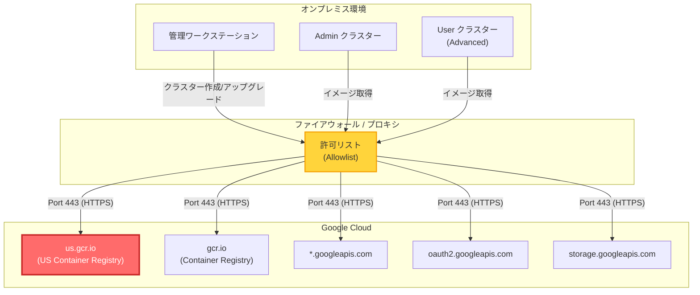

# Google Distributed Cloud (software only) for VMware: ファイアウォール許可リストへの us.gcr.io 追加が必須に

**リリース日**: 2026-06-15

**サービス**: Google Distributed Cloud (software only) for VMware

**機能**: ファイアウォール許可リストへの us.gcr.io 追加要件

**ステータス**: 破壊的変更 (Breaking Change)

📊 [このアップデートのインフォグラフィックを見る](https://takech9203.github.io/google-cloud-news-summary/20260615-google-distributed-cloud-vmware-firewall-allowlist.html)

## 概要

Google Distributed Cloud (software only) for VMware のバージョン 1.33.0-gke.799 以降において、Advanced クラスターの作成またはアップグレードを行う際に、ファイアウォール許可リスト (allowlist) に `us.gcr.io` を追加することが必須となりました。これは Breaking Change (破壊的変更) として発表されており、対応を行わない場合、クラスターの作成やアップグレードが失敗する可能性があります。

この変更は、Google Distributed Cloud が Advanced クラスターのコンテナイメージを `us.gcr.io` レジストリから取得する必要が生じたことに起因します。バージョン 1.33 では、クラスターのアップグレード時にデフォルトで Advanced クラスターへの自動変換が行われるため、多くのユーザーがこの変更の影響を受ける可能性があります。

対象となるのは、オンプレミス環境で Google Distributed Cloud for VMware を運用しており、プロキシサーバーやファイアウォールを介してインターネットアクセスを制御している組織です。特に、バージョン 1.32 から 1.33 へのアップグレードを計画している環境では、事前の対応が必要です。

**アップデート前の課題**

これまでのバージョンでは、ファイアウォール許可リストに `gcr.io` が含まれていれば、Advanced クラスターの作成やアップグレードが正常に動作していました。

- `us.gcr.io` がファイアウォール許可リストに含まれていなくても、クラスター操作が可能だった
- 地域別 Container Registry エンドポイントへの明示的なアクセスが不要だった
- 既存のファイアウォールルールでクラスターのライフサイクル管理が機能していた

**アップデート後の改善**

今回の変更により、イメージ取得の信頼性と地域最適化が強化されます。

- `us.gcr.io` を許可リストに追加することで、米国リージョンの Container Registry から直接イメージを取得可能になった
- イメージの取得パスが明確化され、ネットワーク設計の透明性が向上した
- Advanced クラスターのデプロイメントに必要なすべてのエンドポイントが公式ドキュメントで明文化された

## アーキテクチャ図



上図は、オンプレミス環境の Google Distributed Cloud クラスターがファイアウォールを経由して Google Cloud のコンテナレジストリにアクセスする構成を示しています。赤色で強調された `us.gcr.io` が今回新たに必須となったエンドポイントです。

## サービスアップデートの詳細

### 主要機能

1. **us.gcr.io ファイアウォール許可リスト要件**
   - バージョン 1.33.0-gke.799 以降で Advanced クラスターを作成またはアップグレードする際に必須
   - `us.gcr.io` への HTTPS (ポート 443) アクセスをファイアウォールで許可する必要がある
   - プロキシサーバーを使用している場合は、プロキシの許可リストにも追加が必要

2. **Advanced クラスターへの自動変換との関連**
   - バージョン 1.32 から 1.33 へのアップグレード時、クラスターはデフォルトで Advanced クラスターに変換される
   - Advanced クラスターでは cert-manager が自動インストールされるなど、アーキテクチャが大幅に変更される
   - 非 Advanced のまま維持するオプションも 1.33 では利用可能だが、1.34 では必ず Advanced に変換される

3. **既存のファイアウォール要件との統合**
   - 従来から `gcr.io`、`oauth2.googleapis.com`、`storage.googleapis.com` などが必須だった
   - 今回の変更で `us.gcr.io` が明示的に要件リストに追加された
   - プライベート Docker レジストリを使用している場合は、この要件は不要

## 技術仕様

### 必須ファイアウォール許可リスト

以下は、Google Distributed Cloud for VMware で必要なファイアウォール許可リストの主要エントリです。

| エンドポイント | ポート | プロトコル | 用途 |
|------|------|------|------|
| us.gcr.io | 443 | TCP/HTTPS | **新規追加** - Advanced クラスターのコンテナイメージ取得 |
| gcr.io | 443 | TCP/HTTPS | コンテナイメージ取得 |
| storage.googleapis.com | 443 | TCP/HTTPS | ストレージアクセス |
| oauth2.googleapis.com | 443 | TCP/HTTPS | 認証 |
| www.googleapis.com | 443 | TCP/HTTPS | API アクセス |
| dl.google.com | 443 | TCP/HTTPS | Google Cloud SDK |
| accounts.google.com | 443 | TCP/HTTPS | アカウント認証 |
| gkeonprem.googleapis.com | 443 | TCP/HTTPS | GKE On-Prem API |
| gkeconnect.googleapis.com | 443 | TCP/HTTPS | Fleet 登録 |

### 影響を受けるバージョン

| 項目 | 詳細 |
|------|------|
| 影響開始バージョン | 1.33.0-gke.799 以降 |
| 影響を受ける操作 | Advanced クラスターの作成、アップグレード |
| 影響を受けないケース | プライベート Docker レジストリ使用時 |
| 関連するアップグレードパス | 1.32 → 1.33 (Advanced 自動変換) |

### ファイアウォールルール設定例

```bash
# iptables を使用した許可ルール追加例
iptables -A OUTPUT -d us.gcr.io -p tcp --dport 443 -j ACCEPT

# プロキシサーバー (Squid) の設定例
# squid.conf に以下を追加
acl google_gcr_us dstdomain us.gcr.io
http_access allow google_gcr_us
```

## 設定方法

### 前提条件

1. Google Distributed Cloud (software only) for VMware 1.33.0-gke.799 以降を使用予定であること
2. 環境がプロキシサーバーまたはファイアウォールを経由してインターネットにアクセスしていること
3. プライベート Docker レジストリを使用していないこと (使用している場合はこの変更の影響を受けない)

### 手順

#### ステップ 1: 現在のファイアウォール許可リストを確認

```bash
# 既存のファイアウォールルールを確認
iptables -L OUTPUT -n | grep 443

# プロキシサーバーの許可リストを確認 (Squid の場合)
grep -i "gcr.io" /etc/squid/squid.conf
```

現在の設定に `gcr.io` が含まれていることを確認します。含まれていない場合は、まず公式ドキュメントのファイアウォール要件全体を確認してください。

#### ステップ 2: us.gcr.io をファイアウォール許可リストに追加

```bash
# ファイアウォールルールに us.gcr.io を追加
# 実際のコマンドはファイアウォール製品により異なります

# プロキシサーバー (Squid) の場合、squid.conf に追加:
acl gdc_allowlist dstdomain us.gcr.io
http_access allow gdc_allowlist

# 設定を反映
systemctl reload squid
```

ネットワーク管理者と連携し、組織のファイアウォールポリシーに従って `us.gcr.io` への HTTPS アクセスを許可してください。

#### ステップ 3: 接続性を確認

```bash
# 管理ワークステーションから us.gcr.io への接続を確認
curl -v https://us.gcr.io/v2/ 2>&1 | grep "HTTP/"

# DNS 解決を確認
nslookup us.gcr.io

# gkectl を使用した事前検証チェック
gkectl diagnose cluster --kubeconfig ADMIN_CLUSTER_KUBECONFIG
```

HTTP 200 または 401 (認証必要) レスポンスが返れば、ネットワーク接続は正常です。

#### ステップ 4: クラスターのアップグレードを実行

```bash
# Admin クラスターのアップグレード
gkectl upgrade admin \
  --kubeconfig ADMIN_CLUSTER_KUBECONFIG \
  --config ADMIN_CLUSTER_CONFIG

# User クラスターのアップグレード
gkectl upgrade cluster \
  --kubeconfig ADMIN_CLUSTER_KUBECONFIG \
  --config USER_CLUSTER_CONFIG
```

アップグレード前に `gkectl diagnose` を実行して、すべての前提条件が満たされていることを確認してください。

## メリット

### ビジネス面

- **サービス可用性の向上**: 地域最適化されたレジストリアクセスにより、イメージ取得の信頼性が向上する
- **明確な要件定義**: 必要なネットワーク要件が明文化されたことで、インフラ計画が容易になる

### 技術面

- **レイテンシの削減**: `us.gcr.io` への直接アクセスにより、米国リージョンからのイメージ取得が最適化される
- **トラブルシューティングの容易化**: 必要なエンドポイントが明確になったことで、接続問題の切り分けが容易になる
- **セキュリティ設計の明確化**: 許可すべきエンドポイントが明示されることで、最小権限原則に基づくネットワーク設計が可能になる

## デメリット・制約事項

### 制限事項

- バージョン 1.33.0-gke.799 以降では、ファイアウォール許可リストに `us.gcr.io` が含まれていない場合、Advanced クラスターの作成やアップグレードが失敗する
- プロキシサーバーを使用している環境では、プロキシとファイアウォールの両方で設定変更が必要な場合がある
- バージョン 1.33 から 1.34 へのアップグレードでは Advanced クラスターへの変換が必須となるため、将来的にすべてのユーザーがこの要件に対応する必要がある

### 考慮すべき点

- 組織のセキュリティポリシーにより、新しい外部エンドポイントの許可に承認プロセスが必要な場合、アップグレード計画のタイムラインに影響する可能性がある
- SSL MITM プロキシは Google Distributed Cloud ではサポートされていないため、許可リスト方式でのアクセス制御が必要
- クラスターが複数の地域に分散している場合、すべてのサイトで一貫したファイアウォール設定を適用する必要がある

## ユースケース

### ユースケース 1: バージョン 1.32 から 1.33 へのアップグレード

**シナリオ**: 企業がオンプレミスの VMware 環境で Google Distributed Cloud 1.32 を運用しており、1.33 へのアップグレードを計画している。アップグレード時に Advanced クラスターへの自動変換が行われる。

**実装例**:
```bash
# 1. アップグレード前にファイアウォール許可リストを更新
# ネットワークチームに us.gcr.io の許可を依頼

# 2. 接続確認
curl -s -o /dev/null -w "%{http_code}" https://us.gcr.io/v2/

# 3. gkectl のバージョンを合わせる (Advanced クラスターへの変換時は必須)
gkectl version
# 出力: 1.33.0-gke.799 であることを確認

# 4. プリフライトチェック
gkectl diagnose cluster --kubeconfig /path/to/kubeconfig

# 5. アップグレード実行
gkectl upgrade admin --kubeconfig /path/to/admin-kubeconfig --config /path/to/admin-config.yaml
```

**効果**: ファイアウォール許可リストの事前更新により、アップグレードがブロックされることなくスムーズに完了する

### ユースケース 2: 新規 Advanced クラスターの作成

**シナリオ**: 新たにオンプレミス環境に Google Distributed Cloud for VMware を導入し、バージョン 1.33 以降で Advanced クラスターを新規作成する。

**効果**: 初期構築時からファイアウォール要件を満たしていることで、クラスター作成が一度で成功し、デプロイメント時間を短縮できる

## 料金

この変更はファイアウォール設定に関するものであり、Google Distributed Cloud の料金体系自体には影響しません。

### 料金例

| 項目 | 備考 |
|--------|-----------------|
| ファイアウォール設定変更 | 追加料金なし (インフラ管理コストのみ) |
| コンテナイメージ取得 | 通常のネットワーク転送料金が適用される場合あり |

## 利用可能リージョン

Google Distributed Cloud (software only) for VMware はオンプレミス環境で動作するため、リージョンの制約はありません。ただし、`us.gcr.io` は米国リージョンの Container Registry エンドポイントであり、インターネット経由でグローバルにアクセス可能です。

## 関連サービス・機能

- **Google Distributed Cloud (software only) for VMware**: 本アップデートの対象サービス。オンプレミスの VMware 環境で GKE を実行するためのプラットフォーム
- **Container Registry (gcr.io)**: Google のコンテナイメージレジストリ。`us.gcr.io` は米国リージョンのエンドポイント
- **Artifact Registry**: Container Registry の後継サービス。将来的な移行先として推奨される
- **Advanced クラスター**: Google Distributed Cloud 1.33 から導入された新しいクラスターアーキテクチャ。柔軟性とスケーラビリティが向上

## 参考リンク

- 📊 [インフォグラフィック](https://takech9203.github.io/google-cloud-news-summary/20260615-google-distributed-cloud-vmware-firewall-allowlist.html)
- [公式リリースノート](https://cloud.google.com/release-notes#June_15_2026)
- [ファイアウォールルール設定ガイド](https://cloud.google.com/kubernetes-engine/distributed-cloud/vmware/docs/how-to/firewall-rules)
- [クラスターアップグレードガイド](https://cloud.google.com/kubernetes-engine/distributed-cloud/vmware/docs/how-to/upgrading)
- [Advanced クラスターの概要](https://cloud.google.com/kubernetes-engine/distributed-cloud/vmware/docs/concepts/advanced-clusters)

## まとめ

Google Distributed Cloud (software only) for VMware 1.33.0-gke.799 以降では、Advanced クラスターの作成やアップグレードに `us.gcr.io` へのファイアウォールアクセスが必須となります。バージョン 1.33 へのアップグレードでは Advanced クラスターへの自動変換がデフォルトで行われるため、アップグレードを計画している組織はネットワークチームと連携し、事前にファイアウォール許可リストを更新することを強く推奨します。対応を怠るとクラスター操作が失敗するため、計画的な準備が重要です。

---

**タグ**: #GoogleDistributedCloud #VMware #Firewall #BreakingChange #AdvancedClusters #ContainerRegistry #GKE #OnPremise #NetworkSecurity
