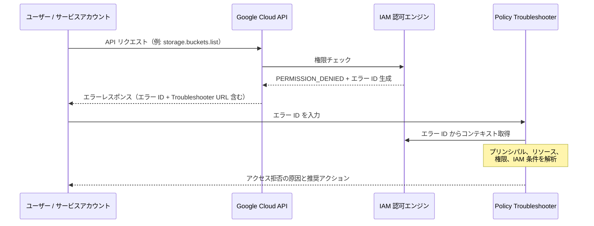

# Identity and Access Management (IAM): 権限エラーメッセージにおけるエラー ID の提供

**リリース日**: 2026-06-15

**サービス**: Identity and Access Management (IAM)

**機能**: 権限エラーメッセージにおけるエラー ID の提供

**ステータス**: Preview

[このアップデートのインフォグラフィックを見る](https://takech9203.github.io/google-cloud-news-summary/20260615-iam-error-id-permission-messages.html)

## 概要

Google Cloud IAM において、権限エラーメッセージにエラー ID が含まれるようになりました。このエラー ID は、アクセス拒否が発生した際のトラブルシューティングを大幅に効率化する一意の識別子です。エラー ID には、プリンシパル（認証アカウント）、リソース、権限、およびサポートされる IAM 条件（`principal.type` や `principal.subject` を含む）に関するコンテキスト情報がエンコードされています。

この機能により、管理者やデベロッパーは権限エラーが発生した際に、エラー ID を Policy Troubleshooter に入力するだけで、エラーの原因を迅速に特定できるようになります。従来のように手動でプリンシパル、リソース、権限を一つずつ確認する手間が大幅に削減されます。

対象ユーザーは、Google Cloud 環境のセキュリティ管理者、IAM ポリシー管理者、および権限エラーのトラブルシューティングを日常的に行うプラットフォームエンジニアやデベロッパーです。

**アップデート前の課題**

- 権限エラーが発生した際、エラーメッセージだけでは原因の特定が困難で、プリンシパル、リソース、権限を手動で確認する必要があった
- Policy Troubleshooter を使用する場合、プリンシパルのメールアドレス、リソースのフルネーム、権限名を手動で入力する必要があった
- エラーの再現や共有が難しく、管理者間でのトラブルシューティングの連携が非効率だった
- IAM 条件（Conditions）が関与するアクセス拒否の場合、原因の特定がさらに複雑になっていた

**アップデート後の改善**

- エラー ID により、権限エラーのコンテキスト（プリンシパル、リソース、権限、IAM 条件）が一つの識別子に集約された
- Policy Troubleshooter にエラー ID を入力するだけで、即座にアクセス問題の診断が可能になった
- エラー ID を管理者と共有するだけで、同じエラーコンテキストを即座に再現・調査できるようになった
- gcloud CLI および REST API のエラーレスポンスに Troubleshooter URL が直接含まれるようになり、ワンクリックで診断画面にアクセス可能になった

## アーキテクチャ図



この図は、ユーザーが権限エラーを受け取ってから Policy Troubleshooter を使用してエラーを解決するまでの一連のフローを示しています。エラー ID がコンテキスト情報のブリッジとして機能し、トラブルシューティングプロセスを簡素化します。

## サービスアップデートの詳細

### 主要機能

1. **エラー ID の自動生成**
   - 権限エラー発生時に一意のエラー ID が自動的に生成される
   - エラー ID にはプリンシパル、リソース、権限、IAM 条件のコンテキストが含まれる
   - gcloud CLI、REST API、Google Cloud コンソールのすべてのインターフェースで利用可能

2. **Policy Troubleshooter との統合**
   - Policy Troubleshooter でエラー ID を直接入力してトラブルシューティングが可能
   - エラーレスポンスに Troubleshooter URL が直接含まれ、ワンクリックで診断画面にアクセス可能
   - 手動でプリンシパル、リソース、権限を入力する必要がなくなった

3. **IAM 条件のサポート**
   - `principal.type` および `principal.subject` 条件がエラー ID に含まれる
   - 条件付きバインディングに起因するアクセス拒否の診断が容易になった

4. **Privileged Access Manager 連携**
   - Google Cloud コンソールでは、不足している権限を含むロールの Privileged Access Manager エンタイトルメントが提案される
   - エンタイトルメントをクリックして直接アクセスグラントをリクエスト可能

## 技術仕様

### エラーレスポンスの形式

| インターフェース | エラー ID の位置 | 追加情報 |
|------|------|------|
| gcloud CLI | `ErrorInfo` メタデータ内の `error_info_id` フィールド | 認証アカウント情報、Troubleshooter URL |
| REST API | `details[].metadata.error_info_id` フィールド | Troubleshooter URL がメッセージに含まれる |
| Google Cloud コンソール | エラーページ内に表示 | 推奨ロール一覧、PAM エンタイトルメント |

### gcloud CLI エラーレスポンス例

```yaml
ERROR: (gcloud.storage.buckets.list) PERMISSION_DENIED:
  user@example.com does not have storage.buckets.list access to the Google Cloud project.
  Permission 'storage.buckets.list' denied on resource (or it may not exist).
  This command is authenticated as user@example.com which is the active account
  specified by the [core/account] property.
- '@type': type.googleapis.com/google.rpc.ErrorInfo
  domain: storage.googleapis.com
  metadata:
    permission: storage.buckets.list
    error_info_id: ERROR_ID
  reason: IAM_PERMISSION_DENIED
```

### REST API エラーレスポンス例

```json
{
  "error": {
    "code": 403,
    "message": "Permission 'storage.buckets.list' denied on resource (or it may not exist). Remediate access with this Troubleshooter URL or share it with your administrator - https://console.cloud.google.com/iam-admin/troubleshooter;errorId=ERROR_ID .",
    "details": [
      {
        "@type": "type.googleapis.com/google.rpc.ErrorInfo",
        "reason": "forbidden",
        "domain": "global",
        "metadata": {
          "error_info_id": "ERROR_ID",
          "permission": "storage.buckets.list"
        }
      }
    ]
  }
}
```

## 設定方法

### 前提条件

1. Google Cloud プロジェクトが有効であること
2. IAM API が有効化されていること（デフォルトで有効）

### 手順

#### ステップ 1: エラー ID の確認

権限エラーが発生した際、エラーメッセージ内のエラー ID を確認します。エラー ID は自動的に生成されるため、追加の設定は不要です。

```bash
# 例: 権限エラーが発生するコマンドを実行
gcloud storage buckets list --project=my-project

# エラーレスポンス内の error_info_id を確認
```

#### ステップ 2: Policy Troubleshooter でのトラブルシューティング

```bash
# エラーメッセージ内の Troubleshooter URL をブラウザで開く
# または Google Cloud コンソールの Policy Troubleshooter ページでエラー ID を入力

# コンソールの場合:
# 1. IAM & Admin > Troubleshooter に移動
# 2. "Error ID" を選択
# 3. エラー ID を入力
# 4. "Check access" をクリック
```

#### ステップ 3: Policy Troubleshooter API の利用（プログラム的なアクセス）

```bash
curl -X POST \
  -H "Authorization: Bearer $(gcloud auth print-access-token)" \
  -H "x-goog-user-project: PROJECT_ID" \
  -H "Content-Type: application/json; charset=utf-8" \
  -d '{"accessTuple": {"principal": "EMAIL", "fullResourceName": "RESOURCE", "permission": "PERMISSION"}}' \
  "https://policytroubleshooter.googleapis.com/v3/iam:troubleshoot"
```

## メリット

### ビジネス面

- **運用効率の向上**: 権限エラーの解決時間が大幅に短縮され、開発者の生産性が向上する
- **コミュニケーションコストの削減**: エラー ID を共有するだけで管理者が即座に問題を把握でき、やり取りの往復が減少する
- **セルフサービス化の促進**: 開発者自身がエラーの原因を特定し、適切なロールのリクエストを管理者に行えるようになる

### 技術面

- **診断精度の向上**: エラー ID にコンテキスト情報が集約されているため、誤診断のリスクが低減する
- **IAM 条件対応**: `principal.type` や `principal.subject` 条件を含む複雑なアクセスポリシーの問題も正確に診断可能
- **自動化対応**: エラーレスポンスの構造化により、アクセスエラーの自動検知・通知パイプラインの構築が容易になる

## デメリット・制約事項

### 制限事項

- 本機能は現在 Preview ステータスであり、本番環境での利用は SLA 対象外となる可能性がある
- Policy Troubleshooter で対応するプリンシパルタイプは、ユーザー、単一サービスアカウント、サービスアカウントプリンシパルセットに限定される（グループ、ドメイン、Workforce Identity、Workload Identity は非対応）
- Pub/Sub リソースに設定された Allow ポリシーの評価は Policy Troubleshooter で直接サポートされていない

### 考慮すべき点

- Policy Troubleshooter を使用するには、組織レベルで Security Reviewer ロール（`roles/iam.securityReviewer`）が必要
- Deny ポリシーのトラブルシューティングには追加で Deny Reviewer ロール（`roles/iam.denyReviewer`）が必要
- エラー ID に含まれるコンテキスト情報はセンシティブな可能性があるため、外部共有時は注意が必要

## ユースケース

### ユースケース 1: デベロッパーのセルフサービストラブルシューティング

**シナリオ**: デベロッパーが Cloud Storage バケットにアクセスしようとして権限エラーが発生した。エラー ID を使用して原因を特定し、必要なロールを管理者にリクエストする。

**実装例**:
```bash
# 1. エラー発生
$ gcloud storage buckets list --project=my-project
ERROR: (gcloud.storage.buckets.list) PERMISSION_DENIED: ...
  metadata:
    error_info_id: abc123xyz

# 2. Troubleshooter URL をブラウザで開く
# https://console.cloud.google.com/iam-admin/troubleshooter;errorId=abc123xyz

# 3. 不足しているロールを確認し、管理者にリクエスト
```

**効果**: デベロッパーが自力で問題を特定でき、管理者への問い合わせ内容が具体的になるため、解決までの時間が数時間から数分に短縮される。

### ユースケース 2: プラットフォームチームによるアクセスエラーの一元管理

**シナリオ**: プラットフォームチームが Cloud Logging でアクセスエラーを監視し、エラー ID を使用して頻発する権限問題を特定・予防する。

**効果**: エラー ID の構造化データを活用して、アクセスエラーのパターン分析が可能になり、プロアクティブな権限設定の改善につながる。

### ユースケース 3: CI/CD パイプラインでのアクセスエラー自動診断

**シナリオ**: CI/CD パイプライン内でサービスアカウントの権限エラーが発生した際、エラー ID を自動的に抽出してアラートに含め、管理者が即座に原因を特定できるようにする。

**効果**: パイプラインの障害時間が短縮され、サービスアカウントの権限管理が効率化される。

## 関連サービス・機能

- **Policy Troubleshooter**: エラー ID を使用してアクセス問題を診断するための主要ツール。Allow ポリシー、Deny ポリシー、Principal Access Boundary ポリシーの評価が可能
- **Privileged Access Manager (PAM)**: 不足している権限を含むロールのエンタイトルメントを提案し、一時的なアクセスグラントのリクエストが可能
- **Cloud Audit Logs**: 権限エラーの発生を監査ログとして記録。`authorizationInfo` フィールドで詳細なアクセスチェック結果を確認可能
- **IAM Deny ポリシー**: エラー ID のトラブルシューティングで Deny ポリシーによるアクセス拒否も診断可能
- **Principal Access Boundary ポリシー**: プリンシパルがアクセスできるリソースの境界を定義するポリシー。エラー ID のトラブルシューティングで評価可能

## 参考リンク

- [インフォグラフィック](https://takech9203.github.io/google-cloud-news-summary/20260615-iam-error-id-permission-messages.html)
- [Permission error messages ドキュメント](https://cloud.google.com/iam/docs/permission-error-messages)
- [Policy Troubleshooter ドキュメント](https://cloud.google.com/policy-intelligence/docs/troubleshoot-access)
- [IAM ドキュメント](https://cloud.google.com/iam/docs)

## まとめ

IAM のエラー ID 機能は、権限エラーのトラブルシューティングにおける長年の課題を解決する重要なアップデートです。エラー ID を Policy Troubleshooter に入力するだけで、プリンシパル、リソース、権限、IAM 条件を含むすべてのコンテキストが即座に復元され、原因の特定と解決が大幅に効率化されます。Preview 段階ですが、日常的に権限エラー対応を行うチームは早期に評価し、トラブルシューティングワークフローへの組み込みを検討することを推奨します。

---

**タグ**: #IAM #Security #PolicyTroubleshooter #AccessManagement #ErrorDiagnostics #Preview
