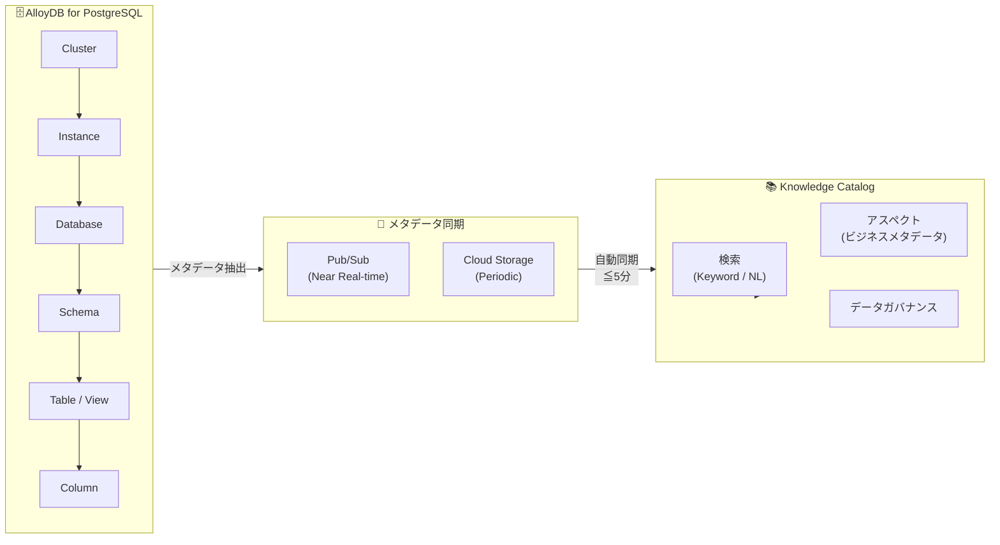

# AlloyDB for PostgreSQL: Knowledge Catalog Integration が GA (一般提供開始)

**リリース日**: 2026-06-16

**サービス**: AlloyDB for PostgreSQL

**機能**: Knowledge Catalog Integration (GA)

**ステータス**: GA (一般提供)

📊 [このアップデートのインフォグラフィックを見る](https://takech9203.github.io/google-cloud-news-summary/20260616-alloydb-knowledge-catalog-integration-ga.html)

## 概要

AlloyDB for PostgreSQL と Knowledge Catalog (旧 Dataplex Catalog) の統合機能が一般提供 (GA) となりました。この統合により、AlloyDB のメタデータが Knowledge Catalog に自動的に同期され、データガバナンスと分析のための統一的なメタデータビューが提供されます。

Knowledge Catalog は Google Cloud のメタデータ管理プラットフォームであり、データの発見、理解、ガバナンスを統合的に支援します。今回の GA により、AlloyDB のクラスタ、インスタンス、データベース、スキーマ、テーブル、ビュー、カラムといった階層的なリソースのメタデータが、ほぼリアルタイムで Knowledge Catalog に反映されるようになりました。主キーや外部キーなどの拡張メタデータ詳細も含まれます。

この機能は、大規模なデータ基盤を運用する組織のデータエンジニア、データスチュワード、Solutions Architect を主な対象としています。

**アップデート前の課題**

- AlloyDB のメタデータを把握するには、直接データベースに接続して情報スキーマを参照する必要があった
- 組織全体でのデータアセットの可視性が低く、データの発見やインパクト分析が困難だった
- データガバナンスのためのメタデータ管理が手動で、PII ラベリングや変更追跡が煩雑だった
- Preview 段階ではメタデータ同期が数時間おきで、リアルタイム性に欠けていた

**アップデート後の改善**

- 新規クラスタではデフォルトで Knowledge Catalog 統合が有効化され、追加設定不要でメタデータが自動収集される
- 2026年4月3日以降に作成またはリストアされたクラスタでは、ほぼリアルタイム (5分以内) でメタデータが同期される
- 主キー、外部キー (参照テーブル、カラムマッピング含む) などの拡張メタデータが自動取得される
- キーワード検索や自然言語検索 (Preview) でデータアセットを横断的に発見できる
- アスペクト機能により、ビジネスメタデータ (PII ラベルなど) を付加してガバナンスを強化できる

## アーキテクチャ図



AlloyDB のメタデータは Pub/Sub (リアルタイム) または Cloud Storage (定期バッチ) を経由して Knowledge Catalog に自動同期され、統一的な検索・ガバナンス機能を利用できます。

## サービスアップデートの詳細

### 主要機能

1. **ほぼリアルタイムのメタデータ同期**
   - 2026年4月3日以降に作成・リストアされたクラスタでは、メタデータ更新が5分以内に Knowledge Catalog に反映
   - 抽出プロセス自体は通常数秒で完了
   - Pub/Sub トピックを通じたイベント駆動型同期

2. **拡張メタデータの自動取得**
   - 主キー (Primary Key) の検出と登録
   - 外部キー (Foreign Key) - 参照テーブルとカラムマッピングを含む
   - カラムのデータ型、モード
   - データベースの文字セット (Charset) とコレーション (Collation)
   - 作成日時、最終更新日時

3. **階層的リソースナビゲーション**
   - Cluster > Instance > Database > Schema > Table/View > Column の階層構造
   - 各レベルでのメタデータ表示と検索
   - リソース間の依存関係の可視化

4. **メタデータエンリッチメント (アスペクト)**
   - カスタムアスペクトタイプの作成と再利用
   - PII ラベリング、データ品質スコアなどのビジネスメタデータ付加
   - アスペクトによる検索フィルタリング

5. **検索機能**
   - キーワード検索: `system=AlloyDB AND type=Database` のような構造化クエリ
   - 自然言語検索 (Preview): 「売上に関連する AlloyDB テーブルを表示」のような日常言語

## 技術仕様

### 同期対象メタデータ

| リソースタイプ | 自動取得メタデータ | 同期タイミング |
|---|---|---|
| Cluster | 名前、リージョン、ラベル、統合有効状態 | デフォルト (常時有効) |
| Instance | 名前、CPU数、可用性タイプ、マシンタイプ | デフォルト (常時有効) |
| Database | 名前、DB バージョン、文字セット、コレーション | 統合有効化後 |
| Schema | 名前、オーナー | 統合有効化後 |
| Table / View | 名前、説明、カラム、主キー、外部キー | 統合有効化後 |
| Column | 名前、データ型、モード、説明 | 統合有効化後 |

### 必要な IAM ロール

| 操作 | 必要なロール |
|---|---|
| AlloyDB メタデータの検索・表示 | `roles/alloydb.viewer` (AlloyDB Viewer) |
| Knowledge Catalog エントリ検索 | `roles/dataplex.catalogViewer` 以上 |
| アスペクトの管理 | `roles/dataplex.catalogEditor` 以上 |

## 設定方法

### 前提条件

1. Dataplex API がプロジェクトで有効化されていること
2. 適切な IAM ロール (`roles/alloydb.viewer` + `roles/dataplex.catalogViewer`) が付与されていること
3. AlloyDB のプライマリクラスタであること (セカンダリクラスタは非サポート)

### 手順

#### ステップ 1: 統合の有効化 (既存クラスタの場合)

新規クラスタではデフォルトで有効です。2026年2月26日以前に作成されたクラスタでは手動有効化が必要です。

```bash
# gcloud CLI で有効化
gcloud alloydb clusters update CLUSTER_ID \
  --region=REGION \
  --enable-dataplex-integration
```

#### ステップ 2: 統合状態の確認

```bash
# クラスタの dataplexConfig を確認
gcloud alloydb clusters describe CLUSTER_ID --region=REGION
```

出力に `dataplexConfig: enabled: true` が含まれていれば有効です。

#### ステップ 3: Knowledge Catalog での検索

Google Cloud コンソールの Knowledge Catalog 検索ページから AlloyDB アセットを検索できます。

```
# キーワード検索の例
system=AlloyDB AND type=Database
system=AlloyDB AND type=Table
```

#### ステップ 4: アスペクトによるメタデータエンリッチメント (オプション)

カスタムアスペクトタイプを作成し、AlloyDB アセットにビジネスメタデータを付加します。

## メリット

### ビジネス面

- **データガバナンスの強化**: PII カラムの識別、データ分類、アクセス管理のためのメタデータ基盤を構築可能
- **データ発見の効率化**: 自然言語を含む検索機能により、組織内のデータアセットを迅速に発見・理解できる
- **変更管理の改善**: スキーマ変更や依存関係の追跡により、変更のインパクト分析が容易になる

### 技術面

- **運用負荷の軽減**: メタデータの自動収集・同期により、手動でのカタログ更新が不要
- **リアルタイム性**: 5分以内の同期により、最新のデータベース構造が常に反映される
- **統合ビュー**: AlloyDB だけでなく、BigQuery、Cloud SQL 等の他サービスのメタデータと統一的に管理可能

## デメリット・制約事項

### 制限事項

- データベースあたり最大100万テーブル、テーブルあたり平均150カラムの制限。超過した場合、データベース・スキーマ・テーブル・ビューのメタデータは抽出されない
- セカンダリクラスタ (クロスリージョンレプリケーション用) では、データベース・スキーマ・テーブル・ビューのメタデータ統合は非サポート
- 初回同期には最大48時間かかる場合がある
- 高頻度のメタデータ変更 (100 DDL/秒以上) 時は、同期が最大30分間一時停止する可能性がある
- ネットワーク障害や同期中断により更新が反映されない場合、最大48時間以内に反映される

### 考慮すべき点

- メタデータ抽出は AlloyDB クラスタの CPU リソースを消費する (小規模マシンで大規模スキーマの場合、最大5%程度の CPU 増加)
- 2026年2月26日〜4月3日に作成されたクラスタは「数時間ごと」の同期であり、リアルタイム同期へのアップグレードにはサポートへの連絡が必要
- インスタンスが存在しないまたは停止中の場合、メタデータ削除に最大7日かかる

## ユースケース

### ユースケース 1: PII データのガバナンス管理

**シナリオ**: 金融機関が AlloyDB 上の顧客データベースに含まれる PII カラム (氏名、メールアドレス、口座番号等) を特定し、適切なアクセス制御とデータ保護ポリシーを適用したい。

**実装例**:
```
# 1. Knowledge Catalog で AlloyDB テーブルを検索
system=AlloyDB AND type=Column

# 2. PII カラムにアスペクトを付加
# Google Cloud コンソールから「PII」アスペクトタイプを作成し、
# 該当カラムにアタッチ

# 3. PII ラベル付きアセットを検索
aspect:pii AND system=AlloyDB
```

**効果**: 組織全体の PII データの所在を可視化し、規制要件 (GDPR、個人情報保護法等) への準拠を効率的に管理できる

### ユースケース 2: マイクロサービス間のデータ依存関係分析

**シナリオ**: 複数のマイクロサービスが AlloyDB の異なるデータベースを使用しており、スキーマ変更前にダウンストリームへの影響を把握したい。

**効果**: 外部キー情報と階層構造の可視化により、テーブル間の依存関係を Knowledge Catalog から一元的に確認でき、安全なスキーマ変更計画を立案できる

### ユースケース 3: データ分析チームのセルフサービスデータ発見

**シナリオ**: データアナリストが分析に必要なデータセットを、DBA に問い合わせることなく自分で発見したい。

**効果**: 自然言語検索とアスペクトによるビジネスメタデータにより、技術的な知識がなくても必要なデータを発見・理解できる

## 料金

AlloyDB の技術メタデータを Knowledge Catalog に格納する費用は無料です。ただし、以下の利用には Knowledge Catalog の標準料金が適用されます:

- API コール
- 追加のビジネスメタデータエンリッチメント (アスペクト管理)

AlloyDB 本体の料金:

| 項目 | 料金 (USD) |
|---|---|
| vCPU | $0.06608/vCPU 時間〜 |
| メモリ | $0.0112/GB 時間〜 |
| リージョナルストレージ | $0.0004109/GB 時間〜 |
| バックアップストレージ | $0.000137/GB 時間〜 |

詳細は [Knowledge Catalog 料金ページ](https://cloud.google.com/dataplex/pricing) および [AlloyDB 料金ページ](https://cloud.google.com/alloydb/pricing) を参照してください。

## 利用可能リージョン

AlloyDB for PostgreSQL が利用可能なすべてのリージョンで Knowledge Catalog 統合を使用できます。詳細は [AlloyDB のリージョン一覧](https://cloud.google.com/alloydb/docs/locations) を参照してください。

## 関連サービス・機能

- **Knowledge Catalog (Dataplex)**: メタデータ管理プラットフォーム。AlloyDB 以外にも BigQuery、Cloud SQL、Cloud Storage 等のメタデータを統合管理
- **Dataplex**: データメッシュアーキテクチャのためのデータファブリックサービス。Knowledge Catalog はその中核コンポーネント
- **Data Catalog**: Knowledge Catalog の前身。既存の Data Catalog ユーザーは Knowledge Catalog への移行が推奨される
- **Cloud Logging / Cloud Monitoring**: AlloyDB のオペレーショナルメトリクスと組み合わせることで、メタデータとオペレーションの統合ビューを実現
- **BigQuery**: Knowledge Catalog を通じて AlloyDB と BigQuery のメタデータを横断的に検索・管理可能

## 参考リンク

- 📊 [インフォグラフィック](https://takech9203.github.io/google-cloud-news-summary/20260616-alloydb-knowledge-catalog-integration-ga.html)
- [公式リリースノート](https://cloud.google.com/release-notes#June_16_2026)
- [AlloyDB Knowledge Catalog Integration ドキュメント](https://cloud.google.com/alloydb/docs/knowledge-catalog-integration)
- [Knowledge Catalog 概要](https://cloud.google.com/dataplex/docs/catalog-overview)
- [Knowledge Catalog 料金](https://cloud.google.com/dataplex/pricing)
- [AlloyDB 料金ページ](https://cloud.google.com/alloydb/pricing)

## まとめ

AlloyDB for PostgreSQL と Knowledge Catalog の統合が GA となり、エンタープライズレベルのデータガバナンスとメタデータ管理が本番環境で利用可能になりました。ほぼリアルタイムの同期、主キー・外部キーを含む拡張メタデータの自動取得により、大規模なデータ基盤における可観測性とガバナンスが大幅に向上します。既存クラスタ (2026年2月26日以前に作成) を運用している場合は、`--enable-dataplex-integration` フラグで統合を有効化し、組織全体のデータカタログ戦略に AlloyDB メタデータを組み込むことを推奨します。

---

**タグ**: #AlloyDB #KnowledgeCatalog #Dataplex #DataGovernance #Metadata #GA #PostgreSQL
