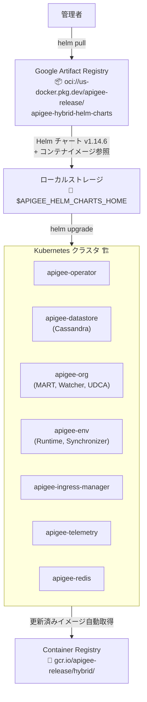

# Apigee hybrid: v1.14.6 パッチリリース

**リリース日**: 2026-06-16

**サービス**: Apigee hybrid

**機能**: v1.14.6 パッチリリース (セキュリティおよび CVE 修正)

**ステータス**: Patch Release

[このアップデートのインフォグラフィックを見る](https://takech9203.github.io/google-cloud-news-summary/20260616-apigee-hybrid-v1-14-6.html)

## 概要

2026 年 6 月 16 日、Apigee hybrid ソフトウェアの新バージョン v1.14.6 がリリースされた。これはパッチリリースであり、主にセキュリティ脆弱性の修正と CVE 対応を含む。パッチリリースでは、コンテナイメージが Helm チャートに統合されているため、Helm チャート経由でアップグレードすることでイメージも自動的に更新される。

Apigee hybrid は、Google Cloud の API 管理プラットフォーム Apigee をオンプレミスやマルチクラウド環境の Kubernetes クラスタ上で実行するためのソフトウェアである。v1.14 系列は 2024 年 12 月に初回リリースされ、v1.14.6 は同系列の 6 番目のパッチリリースとなる。

**アップデート前の課題**

- v1.14.5 以前のバージョンに存在するセキュリティ脆弱性 (CVE) が未修正の状態であった
- セキュリティパッチを適用するには手動でのバージョンアップ作業が必要であった

**アップデート後の改善**

- 各種セキュリティ脆弱性および CVE が修正された
- Helm チャート経由のアップグレードにより、コンテナイメージが自動的に最新のセキュリティ修正済みバージョンに更新される
- 手動でのイメージタグ変更が不要であり、運用負荷が軽減された

## アーキテクチャ図



Apigee hybrid のパッチアップグレードフロー。Helm チャートを pull して upgrade コマンドを実行するだけで、各コンポーネントのコンテナイメージが自動的に更新される。

## サービスアップデートの詳細

### 主要機能

1. **セキュリティおよび CVE 修正**
   - 本リリースには各種セキュリティ脆弱性の修正が含まれている
   - 具体的な CVE 番号は公開リリースノートでは開示されていないが、依存ライブラリやベースイメージのセキュリティアップデートが適用されている

2. **Helm チャート統合コンテナイメージ**
   - パッチリリースのコンテナイメージは Apigee hybrid Helm チャートに統合されている
   - Helm チャート経由でアップグレードすることで、イメージが自動的に更新される
   - 手動でのイメージ変更は通常不要

3. **v1.14 系列の継続サポート**
   - v1.14.0 (2024年12月) からの機能を継承しつつ、セキュリティを強化
   - 新しいアナリティクス/デバッグデータパイプライン、Cassandra 認証情報ローテーション、Guardrails チェックなどの v1.14 機能がすべて利用可能

## 技術仕様

### リリースバージョニング

| 項目 | 詳細 |
|------|------|
| バージョン | v1.14.6 |
| リリースタイプ | パッチリリース |
| リリース元 | v1.14 マイナーリリース系列 |
| Helm チャートリポジトリ | `oci://us-docker.pkg.dev/apigee-release/apigee-hybrid-helm-charts` |
| コンテナイメージリポジトリ | `gcr.io/apigee-release/hybrid/` |

### Apigee hybrid リリースプロセス

| リリース種別 | サポート期間 | リリース頻度 | 説明 |
|-------------|-------------|-------------|------|
| メジャー | 次のメジャーリリース後 12 ヶ月 | 必要に応じて | 後方互換性なし。新機能、アーキテクチャ変更を含む |
| マイナー | 初回リリースから 12 ヶ月 | 年 3 回 (約 4 ヶ月ごと) | 後方互換性あり。機能強化、バグ修正を含む |
| パッチ | 対応するマイナーリリースと同じ | 必要に応じて (月 1 回以内) | バグ修正、セキュリティ脆弱性パッチ |
| ホットフィックス | パッチと同じ | 必要に応じて | 重大なセキュリティ修正。手動でのイメージタグ更新が必要 |

## 設定方法

### 前提条件

1. 既存の Apigee hybrid v1.14.x インストール環境
2. Helm v3.14.2 以上がインストールされていること
3. Cassandra バックアップが有効化されていること (Guardrails による強制チェック)
4. CSI バックアップ使用時は、アップグレード前 24 時間以内にバックアップが実行されていること

### 手順

#### ステップ 1: Helm チャートの取得

```bash
# 環境変数の設定
export APIGEE_HELM_CHARTS_HOME=$PWD
export CHART_REPO=oci://us-docker.pkg.dev/apigee-release/apigee-hybrid-helm-charts
export CHART_VERSION=1.14.6

# 全 Helm チャートを pull
helm pull $CHART_REPO/apigee-operator --version $CHART_VERSION --untar
helm pull $CHART_REPO/apigee-datastore --version $CHART_VERSION --untar
helm pull $CHART_REPO/apigee-env --version $CHART_VERSION --untar
helm pull $CHART_REPO/apigee-ingress-manager --version $CHART_VERSION --untar
helm pull $CHART_REPO/apigee-org --version $CHART_VERSION --untar
helm pull $CHART_REPO/apigee-redis --version $CHART_VERSION --untar
helm pull $CHART_REPO/apigee-telemetry --version $CHART_VERSION --untar
helm pull $CHART_REPO/apigee-virtualhost --version $CHART_VERSION --untar
```

#### ステップ 2: CRD の更新

```bash
# dry-run で検証
kubectl apply -k apigee-operator/etc/crds/default/ \
  --server-side --force-conflicts --validate=false --dry-run=server

# 検証後に適用
kubectl apply -k apigee-operator/etc/crds/default/ \
  --server-side \
  --force-conflicts \
  --validate=false
```

#### ステップ 3: Helm チャートのアップグレード

```bash
# dry-run で確認 (各チャートに --dry-run を付与)
helm upgrade apigee-operator apigee-operator/ \
  --namespace APIGEE_NAMESPACE \
  --atomic \
  -f overrides.yaml \
  --dry-run

# 本番適用 (各コンポーネントを順次アップグレード)
helm upgrade apigee-operator apigee-operator/ \
  --namespace APIGEE_NAMESPACE \
  --atomic \
  -f overrides.yaml

helm upgrade apigee-datastore apigee-datastore/ \
  --namespace APIGEE_NAMESPACE \
  --atomic \
  -f overrides.yaml

helm upgrade apigee-org apigee-org/ \
  --namespace APIGEE_NAMESPACE \
  --atomic \
  -f overrides.yaml

helm upgrade apigee-env apigee-env/ \
  --namespace APIGEE_NAMESPACE \
  --set env=ENV_NAME \
  --atomic \
  -f overrides.yaml
```

コンテナイメージは Helm チャートに統合されているため、手動でのイメージタグ変更は不要。

## メリット

### ビジネス面

- **セキュリティコンプライアンスの維持**: 最新の CVE 修正により、セキュリティ監査やコンプライアンス要件を満たしやすくなる
- **運用リスクの低減**: 既知の脆弱性が修正されることで、セキュリティインシデントのリスクが軽減される

### 技術面

- **シンプルなアップグレードプロセス**: Helm チャートにイメージが統合されているため、`helm pull` と `helm upgrade` だけでアップグレードが完了する
- **自動イメージ更新**: パッチリリースではコンテナイメージの手動変更が不要であり、ホットフィックスとは異なり運用負荷が低い
- **Guardrails による安全性**: v1.14 で導入された Guardrails チェックにより、バックアップが確保された状態でのみアップグレードが実行される

## デメリット・制約事項

### 制限事項

- パッチリリースの具体的な CVE 修正内容は公開されていないため、個別の脆弱性対応状況の確認が難しい
- v1.14 系列のサポート期間は初回リリース (2024年12月) から 12 ヶ月であり、2025 年 12 月以降はサポート終了の可能性がある。v1.15 または v1.16 への移行計画を検討すべきである
- アップグレードは順次バージョンでのみサポートされる (v1.13 から v1.15 への直接アップグレードは不可)

### 考慮すべき点

- アップグレード前に Cassandra バックアップが必須 (Guardrails で強制)
- CSI バックアップ使用時は 24 時間以内のバックアップが必要
- アップグレード中に新しい環境を作成しないこと
- サービスアカウント認証ファイル (.json) を使用している場合、正しい Helm チャートディレクトリに配置されていることを確認すること

## ユースケース

### ユースケース 1: 定期セキュリティパッチ適用

**シナリオ**: 金融業界の企業で Apigee hybrid v1.14.5 を運用しているプラットフォームチームが、月次のセキュリティパッチ適用サイクルの一環として v1.14.6 にアップグレードする。

**実装例**:
```bash
# 1. Cassandra バックアップの確認
kubectl get backups -n apigee

# 2. Helm チャートの取得とアップグレード
export CHART_VERSION=1.14.6
helm pull $CHART_REPO/apigee-operator --version $CHART_VERSION --untar
# ... (他のチャートも同様)

# 3. アップグレード実行
helm upgrade apigee-operator apigee-operator/ \
  --namespace apigee --atomic -f overrides.yaml
```

**効果**: セキュリティコンプライアンスを維持しつつ、Helm チャート統合により最小限のダウンタイムでパッチ適用が完了する。

### ユースケース 2: マルチクラスタ環境での段階的ロールアウト

**シナリオ**: 複数リージョンにまたがる Apigee hybrid クラスタを運用する企業が、ステージング環境で検証後に本番環境へ段階的にパッチを適用する。

**効果**: Helm の `--dry-run` 機能と `--atomic` フラグにより、問題発生時の自動ロールバックが保証され、安全な段階的デプロイが可能。

## 関連サービス・機能

- **Google Artifact Registry**: Apigee hybrid Helm チャートのホスティング先 (`oci://us-docker.pkg.dev/apigee-release/apigee-hybrid-helm-charts`)
- **Google Kubernetes Engine (GKE)**: Apigee hybrid の推奨実行プラットフォーム
- **Cloud Monitoring / Cloud Logging**: Apigee hybrid のテレメトリデータ収集先
- **cert-manager**: Apigee hybrid が使用する TLS 証明書管理 (v1.15.5+ または v1.16.3+ を推奨)

## 参考リンク

- [インフォグラフィック](https://takech9203.github.io/google-cloud-news-summary/20260616-apigee-hybrid-v1-14-6.html)
- [公式リリースノート](https://docs.cloud.google.com/release-notes#June_16_2026)
- [Apigee hybrid リリースノート](https://docs.cloud.google.com/apigee/docs/hybrid/release-notes)
- [アップグレードガイド (v1.14)](https://docs.cloud.google.com/apigee/docs/hybrid/v1.14/upgrade)
- [新規インストールガイド (v1.14)](https://docs.cloud.google.com/apigee/docs/hybrid/v1.14/big-picture)
- [Apigee リリースプロセス](https://docs.cloud.google.com/apigee/docs/release/apigee-release-process#apigee-hybrid-container-images)
- [Guardrails ドキュメント](https://docs.cloud.google.com/apigee/docs/hybrid/v1.14/guardrails)

## まとめ

Apigee hybrid v1.14.6 は、セキュリティ脆弱性と CVE を修正するパッチリリースである。Helm チャートにコンテナイメージが統合されているため、管理者は `helm pull` と `helm upgrade` を実行するだけでアップグレードが完了する。v1.14 系列を利用中の環境では、セキュリティリスク低減のため速やかな適用が推奨される。また、v1.14 のサポート期間終了を見据え、v1.15 以降への移行計画も並行して検討すべきである。

---

**タグ**: #Apigee #hybrid #セキュリティ #CVE #パッチリリース #Helm #Kubernetes #API管理
