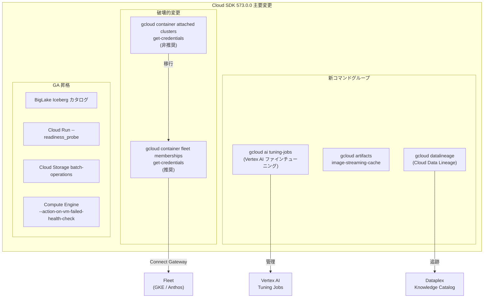

# Cloud SDK: バージョン 573.0.0 リリース (破壊的変更を含む)

**リリース日**: 2026-06-16

**サービス**: Cloud SDK

**機能**: Cloud SDK 573.0.0 - 破壊的変更、新コマンドグループ追加、GA 昇格

**ステータス**: GA (Breaking Changes)

[このアップデートのインフォグラフィックを見る](https://takech9203.github.io/google-cloud-news-summary/20260616-cloud-sdk-573.html)

## 概要

Cloud SDK 573.0.0 がリリースされ、破壊的変更1件と多数の新機能が追加されました。最も注目すべきは Anthos Multi-Cloud における `gcloud container attached clusters get-credentials` コマンドの非推奨化であり、今後は `gcloud container fleet memberships get-credentials` への移行が必要です。

本リリースでは、Vertex AI のファインチューニングジョブ管理、Artifact Registry のイメージストリーミングキャッシュ、Cloud Data Lineage のコマンドラインサポートなど、AI/ML、データ分析、インフラストラクチャの各領域で重要な機能追加が行われています。また、BigLake Iceberg カタログ、Cloud Run の readiness probe、Cloud Storage バッチオペレーションなど、複数の機能が GA に昇格しました。

対象ユーザーは、Google Cloud を利用するすべての開発者・運用者です。特に、Anthos Multi-Cloud で attached clusters を利用している組織、Vertex AI でモデルのファインチューニングを行うデータサイエンティスト、データリネージを追跡するデータエンジニアにとって重要なアップデートとなります。

**アップデート前の課題**

- Anthos Multi-Cloud で attached clusters の認証情報を取得するために `gcloud container attached clusters get-credentials` を使用しており、Fleet ベースの統一的な管理ができていなかった
- Vertex AI のファインチューニングジョブを CLI から直接管理する手段がなく、コンソールや REST API に依存していた
- Cloud Data Lineage の操作に CLI サポートがなく、API 呼び出しが必要だった
- Artifact Registry のイメージストリーミングキャッシュを gcloud CLI から管理できなかった

**アップデート後の改善**

- Fleet memberships を通じた統一的なクラスタ認証情報取得が可能になり、マルチクラウド環境の管理が簡素化された
- `gcloud ai tuning-jobs` コマンドグループにより、CLI からファインチューニングジョブのライフサイクルを完全に管理可能になった
- `gcloud datalineage` コマンドグループにより、データリネージの管理が CLI から直接可能になった
- BigLake Iceberg カタログの GA 昇格により、本番環境での Apache Iceberg データレイクハウス運用が正式にサポートされた

## アーキテクチャ図



Cloud SDK 573.0.0 の主要変更を示す図です。破壊的変更として attached clusters コマンドから fleet memberships コマンドへの移行が必要であり、新コマンドグループとして AI、Artifact Registry、Data Lineage が追加され、複数の機能が GA に昇格しています。

## サービスアップデートの詳細

### 破壊的変更

1. **Anthos Multi-Cloud: `gcloud container attached clusters get-credentials` の非推奨化**
   - 今後は `gcloud container fleet memberships get-credentials` を使用する必要がある
   - Fleet memberships コマンドは Connect Gateway サービスを通じて、Fleet に登録された全クラスタへの統一的な認証情報取得を提供する
   - kubeconfig ファイルが適切な認証情報とエンドポイント情報で更新され、kubectl コマンドの実行が可能になる
   - 既存のスクリプトやCI/CDパイプラインで該当コマンドを使用している場合は、早急な移行が必要

### 新コマンドグループ

2. **AI: `gcloud ai tuning-jobs` コマンドグループ**
   - Vertex AI の教師あり学習によるファインチューニングジョブの作成・管理・監視が CLI から可能に
   - ジョブの一覧表示、詳細確認、キャンセルなどのライフサイクル管理をサポート
   - Gemini モデル (gemini-2.5-pro, gemini-2.5-flash, gemini-2.5-flash-lite) のファインチューニングに対応

3. **Artifact Registry: `gcloud artifacts image-streaming-cache` コマンドグループ**
   - create, describe, delete, list のサブコマンドを提供
   - コンテナイメージのストリーミングキャッシュを管理し、起動時間を短縮

4. **Cloud Data Lineage: `gcloud datalineage` コマンドグループ**
   - データリネージ (データの系譜) の管理を CLI から直接実行可能に
   - BigQuery、Dataproc などのデータパイプラインにおけるデータの流れを追跡
   - Knowledge Catalog (旧 Dataplex Universal Catalog) と連携

5. **Cloud Datastream: 新規接続先の追加**
   - Dataverse 接続のサポートを追加
   - Salesforce Marketing Cloud 接続のサポートを追加
   - ServiceNow 接続のサポートを追加

### GA 昇格

6. **BigLake: Iceberg カタログの GA 昇格**
   - Apache Iceberg REST カタログが正式に GA となり、本番環境での利用が推奨される
   - `gcloud biglake iceberg catalogs` コマンドで管理可能
   - Iceberg V2 テーブル (GA) および V3 テーブル (Preview) をサポート
   - Credential vending、クロスリージョンレプリケーション、災害復旧にも対応

7. **Cloud Run: `--readiness_probe` の GA 昇格**
   - コンテナの準備状態を確認するプローブ設定が正式にサポート
   - 本番環境でのヘルスチェック設定が安定版として利用可能

8. **Cloud Storage: batch-operations bucket-operations の GA 昇格**
   - バケットに対するバッチオペレーションが正式に GA に
   - 大量のオブジェクト操作を効率的に実行可能

9. **Compute Engine: `--action-on-vm-failed-health-check` の GA 昇格**
   - VM のヘルスチェック失敗時のアクション指定が正式にサポート
   - `any-reservation-then-fail` の予約アフィニティオプションも追加

10. **Kubernetes Engine: 新機能と非推奨化**
    - `--dataplane-optimization-mode` オプションの追加 (Dataplane V2 向け)
    - None リリースチャンネルの非推奨化

11. **Network Security: ファイアウォール関連の GA/BETA 昇格**
    - ファイアウォールエンドポイントのプロジェクトスコーピングが GA に
    - WildFire 機能が BETA に昇格

12. **Cluster Director: Blueprint サポート**
    - クラスタ作成時に Blueprint を使用可能に

## 技術仕様

### 破壊的変更の移行パス

| 変更前 | 変更後 | 備考 |
|--------|--------|------|
| `gcloud container attached clusters get-credentials CLUSTER` | `gcloud container fleet memberships get-credentials MEMBERSHIP` | `--location` フラグで位置を指定可能 |

### 新コマンドグループ一覧

| コマンドグループ | 対象サービス | ステータス |
|-----------------|-------------|-----------|
| `gcloud ai tuning-jobs` | Vertex AI | GA |
| `gcloud artifacts image-streaming-cache` | Artifact Registry | GA |
| `gcloud datalineage` | Cloud Data Lineage | GA |

## 設定方法

### 前提条件

1. Cloud SDK 573.0.0 以上がインストールされていること
2. 適切な IAM 権限が付与されていること

### 手順

#### ステップ 1: Cloud SDK のアップデート

```bash
# Cloud SDK を最新版にアップデート
gcloud components update

# バージョンを確認
gcloud version
```

#### ステップ 2: 破壊的変更への対応 (Anthos Multi-Cloud ユーザー)

```bash
# 旧コマンド (非推奨)
# gcloud container attached clusters get-credentials my-cluster

# 新コマンド (推奨)
gcloud container fleet memberships get-credentials my-cluster --location=global

# リージョン指定の場合
gcloud container fleet memberships get-credentials my-cluster --location=us-central1
```

#### ステップ 3: 新機能の利用例 - Vertex AI ファインチューニング

```bash
# チューニングジョブの一覧表示
gcloud ai tuning-jobs list --region=us-central1

# チューニングジョブの詳細確認
gcloud ai tuning-jobs describe JOB_ID --region=us-central1
```

#### ステップ 4: 新機能の利用例 - Cloud Data Lineage

```bash
# データリネージのコマンドグループを確認
gcloud datalineage --help
```

## メリット

### ビジネス面

- **マルチクラウド管理の統一化**: Fleet memberships による統一的なクラスタ管理で、運用コストの削減と管理の簡素化が実現
- **データガバナンスの強化**: Cloud Data Lineage の CLI サポートにより、データの系譜追跡が自動化パイプラインに組み込みやすくなった
- **AI/ML ワークフローの効率化**: gcloud CLI からファインチューニングジョブを直接管理でき、開発サイクルが短縮

### 技術面

- **CLI ファーストの操作性**: 新コマンドグループの追加により、GUI を使わずにほぼ全ての操作が CLI から可能に
- **GA 昇格による安定性保証**: BigLake Iceberg カタログや Cloud Run readiness probe の GA 昇格により、SLA に基づく本番運用が可能
- **インフラ自動化の拡張**: 新コマンドが Infrastructure as Code やCI/CDパイプラインに容易に統合可能

## デメリット・制約事項

### 制限事項

- `gcloud container attached clusters get-credentials` は非推奨であり、将来のバージョンで削除される可能性がある。早期の移行が推奨される
- GKE の None リリースチャンネルが非推奨となったため、既存の None チャンネルを利用しているクラスタは他のチャンネルへの移行を検討する必要がある
- BigLake Iceberg カタログは V1 テーブルをサポートしないため、既存の V1 テーブルはアップグレードが必要

### 考慮すべき点

- 破壊的変更の影響を受けるスクリプトやCI/CDパイプラインの事前調査と移行計画の策定が必要
- 新コマンドグループの権限設定 (IAM ロール) を確認し、必要に応じて付与する必要がある
- Dataplane V2 の最適化モードは追加の検証が推奨される

## ユースケース

### ユースケース 1: Anthos Multi-Cloud 環境の移行対応

**シナリオ**: AWS 上の EKS クラスタを Anthos で管理しており、CI/CDパイプラインで `gcloud container attached clusters get-credentials` を使用してデプロイを行っている。

**実装例**:
```bash
# CI/CD パイプライン内の更新
# Before (非推奨)
# gcloud container attached clusters get-credentials my-eks-cluster \
#   --location=us-west1

# After (推奨)
gcloud container fleet memberships get-credentials my-eks-cluster \
  --location=us-west1
kubectl get pods -n production
```

**効果**: Fleet ベースの統一管理により、GKE、EKS、AKS 全てのクラスタに対して同一のコマンド体系で認証情報を取得でき、スクリプトの保守性が向上する。

### ユースケース 2: Vertex AI ファインチューニングの自動化

**シナリオ**: データサイエンスチームが定期的に新しいデータセットで Gemini モデルをファインチューニングしており、ジョブの管理を自動化したい。

**実装例**:
```bash
# ファインチューニングジョブの作成と監視を自動化
gcloud ai tuning-jobs list --region=us-central1 --filter="state=JOB_STATE_RUNNING"
```

**効果**: コンソールにログインせずに CLI からジョブの状態監視やライフサイクル管理が可能になり、自動化パイプラインへの組み込みが容易になる。

## 関連サービス・機能

- **GKE Fleet**: マルチクラスタ管理のための統一プラットフォーム。今回の破壊的変更の移行先
- **Vertex AI**: AI/ML プラットフォーム。ファインチューニングジョブの CLI 管理が追加
- **Dataplex Knowledge Catalog**: データガバナンスプラットフォーム。Cloud Data Lineage の CLI サポートが連携
- **BigLake (Lakehouse for Apache Iceberg)**: オープンフォーマットのデータレイクハウス。Iceberg カタログが GA に
- **Cloud Run**: サーバーレスコンテナプラットフォーム。readiness probe が GA に
- **Artifact Registry**: コンテナイメージ管理。イメージストリーミングキャッシュの管理が追加

## 参考リンク

- [インフォグラフィック](https://takech9203.github.io/google-cloud-news-summary/20260616-cloud-sdk-573.html)
- [Cloud SDK リリースノート](https://cloud.google.com/sdk/docs/release-notes)
- [Fleet memberships get-credentials ドキュメント](https://cloud.google.com/sdk/gcloud/reference/container/fleet/memberships/get-credentials)
- [Vertex AI ファインチューニング ドキュメント](https://cloud.google.com/vertex-ai/generative-ai/docs/models/gemini-use-supervised-tuning)
- [BigLake Iceberg カタログ ドキュメント](https://cloud.google.com/lakehouse/docs/lakehouse-iceberg-rest-catalog)
- [Cloud Data Lineage ドキュメント](https://cloud.google.com/dataplex/docs/use-lineage)

## まとめ

Cloud SDK 573.0.0 は、破壊的変更として Anthos Multi-Cloud の認証情報取得コマンドの統一を含む大型リリースです。Vertex AI ファインチューニング、Cloud Data Lineage、Artifact Registry イメージストリーミングキャッシュの新コマンドグループ追加により CLI からの操作範囲が大幅に拡張されました。特に `gcloud container attached clusters get-credentials` を使用しているユーザーは、`gcloud container fleet memberships get-credentials` への早急な移行を推奨します。

---

**タグ**: #CloudSDK #BreakingChange #AnthosMultiCloud #FleetMemberships #VertexAI #FineTuning #BigLake #Iceberg #CloudDataLineage #ArtifactRegistry #CloudRun #ComputeEngine #GKE #NetworkSecurity
