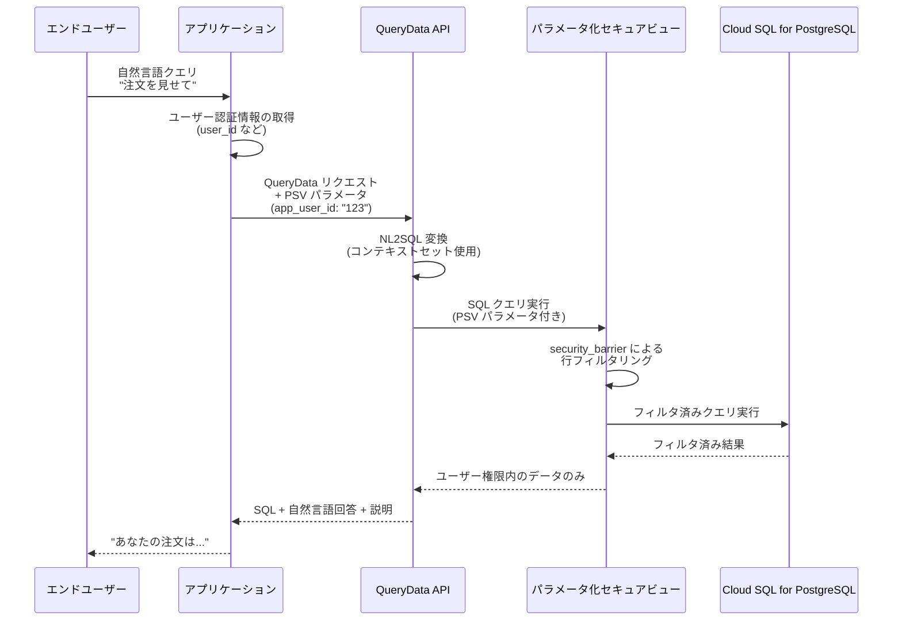

# Cloud SQL for PostgreSQL: QueryData がパラメータ化セキュアビュー (PSV) をサポート

**リリース日**: 2026-06-16

**サービス**: Cloud SQL for PostgreSQL

**機能**: QueryData Parameterized Secure Views (PSV) Support

**ステータス**: Preview

[このアップデートのインフォグラフィックを見る](https://takech9203.github.io/google-cloud-news-summary/20260616-cloud-sql-postgresql-querydata-psv.html)

## 概要

Cloud SQL for PostgreSQL の QueryData ツールが、パラメータ化セキュアビュー (Parameterized Secure Views: PSV) をサポートしました。QueryData は自然言語でデータベースに問い合わせを行い、データエージェントを構築するための機能であり、今回の統合により、自然言語クエリを使用するアプリケーションのデータセキュリティが大幅に強化されます。

QueryData は、コンテキストセット（データベースのスキーマやビジネスロジックを記述した情報の集合）を活用して自然言語の質問を正確な SQL クエリに変換します。今回のアップデートでは、PSV パラメータを QueryData API リクエストに含めることが可能になり、自然言語クエリの実行時にも行レベルのアクセス制御が適用されるようになりました。

この機能は、カスタマーサービスの自動化、EC サイトのショッピングアシスタント、フィールドオペレーションツールなど、エンドユーザーが自然言語でデータにアクセスするあらゆるアプリケーションにおいて、プロンプトインジェクション攻撃やデータの過剰公開を防止するための重要なセキュリティレイヤーを提供します。

**アップデート前の課題**

QueryData を使用した自然言語クエリアプリケーションでは、以下のセキュリティ上の課題がありました。

- ユーザーがプロンプトインジェクション攻撃を通じて、アプリケーションがアクセス権を持つ全データの露出を試みる可能性があった
- NL2SQL（自然言語から SQL への変換）モデルが、データセキュリティの観点から適切な範囲を超えた SQL クエリを生成する可能性があった
- 自然言語クエリの実行時に行レベルのアクセス制御を適用する標準的な方法がなかった

**アップデート後の改善**

今回のアップデートにより、以下の改善が実現されました。

- QueryData API リクエストに PSV パラメータを指定することで、自然言語クエリ実行時にも行レベルセキュリティが自動適用される
- ユーザーの表現方法に関わらず、アクセス可能なデータが厳密に制御される
- プロンプトインジェクション攻撃に対するデータベースレベルでの防御層が追加された

## アーキテクチャ図



この図は、エンドユーザーの自然言語クエリが QueryData API と PSV を経由して安全に処理される流れを示しています。アプリケーションがユーザー認証情報に基づいた PSV パラメータを付与することで、データベースレベルでの行アクセス制御が実現されます。

## サービスアップデートの詳細

### 主要機能

1. **QueryData API での PSV パラメータサポート**
   - QueryData API リクエストに `parameterized_secure_view_parameters` フィールドを追加可能
   - アプリケーションのユーザー認証情報に基づいたパラメータ値を指定
   - パラメータは SQL 実行全体を通じて一貫して適用される

2. **動的行レベルセキュリティ**
   - `WITH (security_barrier)` 句による行レベルセキュリティの適用
   - 名前付きビューパラメータ (`$@parameter_name` 構文) によるユーザー固有のフィルタリング
   - 悪意のある関数やオペレーターがビューのフィルタリング前に行値にアクセスすることを防止

3. **クエリ実行時の自動制限適用**
   - パラメータ化ビューにアクセスするクエリに対して追加の制限を自動適用
   - パラメータ値に基づくチェックの回避攻撃を防止
   - 単一の共有データベースロールで全アプリケーションユーザーを管理可能

### 背景: パラメータ化セキュアビュー (2026-06-12 リリース)

2026年6月12日にリリースされたパラメータ化セキュアビュー自体は、PostgreSQL のビューを拡張し、アプリケーション固有の名前付きパラメータを使用してよりきめ細かいアクセス制御を実現する機能です。今回の6月16日のアップデートは、この PSV を QueryData（自然言語クエリエンジン）と統合し、NL2SQL のセキュリティを強化するものです。

## 技術仕様

### QueryData API リクエスト形式

| 項目 | 詳細 |
|------|------|
| エンドポイント | `geminidataanalytics.googleapis.com/v1beta/projects/{PROJECT}/locations/{REGION}:queryData` |
| PSV パラメータフィールド | `context.parameterized_secure_view_parameters.parameters` |
| パラメータ形式 | キーバリューペア（例: `"app_user_id": "123"`） |
| 対応データベース | Cloud SQL for PostgreSQL |
| ステータス | Preview |

### QueryData API リクエスト例

```json
{
  "prompt": "注文を表示して",
  "context": {
    "datasource_references": {
      "cloud_sql_reference": {
        "database_reference": {
          "engine": "POSTGRESQL",
          "project_id": "my-project",
          "region": "us-central1",
          "instance_id": "my-instance",
          "database_id": "my-database"
        }
      }
    },
    "agent_context_reference": {
      "context_set_id": "my-context-set"
    },
    "parameterized_secure_view_parameters": {
      "parameters": {
        "app_user_id": "123"
      }
    }
  },
  "generation_options": {
    "generate_query_result": true,
    "generate_natural_language_answer": true,
    "generate_explanation": true
  }
}
```

## 設定方法

### 前提条件

1. Cloud SQL for PostgreSQL インスタンスが作成済みであること
2. `cloudsql.enable_parameterized_views` データベースフラグが有効であること（データベースの再起動が必要）
3. QueryData のコンテキストセットが作成・アップロード済みであること

### 手順

#### ステップ 1: パラメータ化セキュアビューの作成

```sql
-- parameterized_views 拡張機能の有効化
CREATE EXTENSION parameterized_views;

-- パラメータ化セキュアビューの作成
CREATE VIEW app_schema.user_orders_view WITH (security_barrier) AS
SELECT order_id, order_date, total_amount, status
FROM app_schema.orders
WHERE customer_id = $@app_user_id;
```

ユーザー固有のデータのみを返すビューを `security_barrier` オプション付きで作成します。

#### ステップ 2: アプリケーション用データベースロールの設定

```sql
-- アプリケーション用ロールの作成
CREATE ROLE app_query_role WITH LOGIN PASSWORD 'secure_password';

-- ビューへのアクセス権付与
GRANT USAGE ON SCHEMA app_schema TO app_query_role;
GRANT SELECT ON app_schema.user_orders_view TO app_query_role;

-- ベーステーブルへの直接アクセスを拒否
REVOKE ALL PRIVILEGES ON app_schema.orders FROM app_query_role;
```

最小権限の原則に基づき、ビューへのアクセスのみを許可します。

#### ステップ 3: コンテキストセットの作成とアップロード

```json
{
  "templates": [
    {
      "nl_query": "注文を表示して",
      "sql": "SELECT * FROM app_schema.user_orders_view",
      "intent": "ユーザーの注文一覧を表示する"
    }
  ]
}
```

QueryData が自然言語クエリを正確に PSV 対象のビューに変換できるようにコンテキストセットを定義します。

#### ステップ 4: QueryData API リクエストに PSV パラメータを含める

```bash
curl -X POST \
  "https://geminidataanalytics.googleapis.com/v1beta/projects/PROJECT_ID/locations/REGION:queryData" \
  -H "Authorization: Bearer $(gcloud auth print-access-token)" \
  -H "Content-Type: application/json" \
  -d '{
    "prompt": "注文を表示して",
    "context": {
      "datasource_references": {
        "cloud_sql_reference": {
          "database_reference": {
            "engine": "POSTGRESQL",
            "project_id": "PROJECT_ID",
            "region": "REGION",
            "instance_id": "INSTANCE_ID",
            "database_id": "DATABASE_ID"
          }
        }
      },
      "agent_context_reference": {
        "context_set_id": "CONTEXT_SET_ID"
      },
      "parameterized_secure_view_parameters": {
        "parameters": {
          "app_user_id": "123"
        }
      }
    },
    "generation_options": {
      "generate_query_result": true,
      "generate_natural_language_answer": true,
      "generate_explanation": true
    }
  }'
```

アプリケーションの認証レイヤーで取得したユーザー ID を PSV パラメータとして渡します。

## メリット

### ビジネス面

- **データ漏洩リスクの大幅低減**: 自然言語インターフェースを提供しつつ、ユーザーが権限外のデータにアクセスすることを防止
- **コンプライアンス対応の簡素化**: 行レベルのアクセス制御がデータベースレベルで自動適用されるため、監査対応が容易
- **自然言語アプリケーションの安全な展開**: セキュリティを理由に自然言語クエリ機能の導入を躊躇していた組織が、安心して導入可能

### 技術面

- **多層防御の実現**: アプリケーション層 + データベース層の二重セキュリティ
- **ロール管理の簡素化**: 個々のユーザーごとにデータベースロールを作成する必要がなく、単一の共有ロールで運用可能
- **プロンプトインジェクション耐性**: NL2SQL が生成する SQL がどのようなものであっても、PSV が行レベルでデータを制限

## デメリット・制約事項

### 制限事項

- `cloudsql.enable_parameterized_views` データベースフラグの有効化にはデータベースの再起動が必要
- `parameterized_views` 拡張機能は各データベースで個別に作成する必要がある
- パラメータ化ビューをユーザー定義関数内で参照する場合はエラーが発生する（親クエリで直接参照する必要がある）
- 本機能は Preview 段階であり、SLA や本番環境での利用保証はない

### 考慮すべき点

- コンテキストセットの品質が QueryData の SQL 生成精度に直接影響するため、十分なテンプレートの準備が必要
- PSV パラメータ値はアプリケーション側で適切に管理・提供する必要がある（認証情報との紐付け）
- コンテキストセットの作成可能リージョンは us-central1、us-east1、europe-west4、asia-southeast1 に限定

## ユースケース

### ユースケース 1: カスタマーサービス自動化

**シナリオ**: EC サイトのカスタマーサポートチャットボットが、ユーザーの自然言語質問に対して注文情報を返す場合

**実装例**:
```sql
-- パラメータ化セキュアビューの定義
CREATE VIEW store.customer_orders_view WITH (security_barrier) AS
SELECT order_id, order_date, shipping_status, total_amount
FROM store.orders
WHERE customer_id = $@authenticated_customer_id;
```

```json
{
  "prompt": "最近の注文の配送状況を教えて",
  "context": {
    "parameterized_secure_view_parameters": {
      "parameters": {
        "authenticated_customer_id": "cust_456"
      }
    }
  }
}
```

**効果**: ユーザーがどのような表現で質問しても、自分の注文情報のみが返却される。「全員の注文を見せて」といったプロンプトインジェクションにも耐性がある。

### ユースケース 2: マルチテナント SaaS アプリケーション

**シナリオ**: 複数企業が共有するデータベース上で、各テナントが自然言語で自社データのみを検索する場合

**実装例**:
```sql
CREATE VIEW saas.tenant_analytics_view WITH (security_barrier) AS
SELECT metric_name, metric_value, recorded_at
FROM saas.analytics_data
WHERE tenant_id = $@current_tenant_id;
```

**効果**: テナント間のデータ分離がデータベースレベルで保証され、NL2SQL モデルの生成する SQL に関わらずデータ漏洩を防止。

## 料金

QueryData の利用料金は Gemini Enterprise Agent Platform の料金体系に従います。Cloud SQL for PostgreSQL インスタンス自体の料金は通常の Cloud SQL 料金に基づきます。

### 料金例

| 項目 | 料金 (概算) |
|------|------------|
| Cloud SQL Enterprise (コンピュート) | $0.0413/vCPU/時間から |
| Cloud SQL Enterprise Plus (コンピュート) | $0.05369/vCPU/時間から |
| SSD ストレージ | $0.17/GB/月 |
| QueryData API | Gemini Enterprise Agent Platform の料金に準拠 |

※ PSV 機能自体には追加料金は発生しません。通常の Cloud SQL インスタンス料金に含まれます。

## 利用可能リージョン

コンテキストセットの作成は以下のリージョンで利用可能です:

- us-central1
- us-east1
- europe-west4
- asia-southeast1

Cloud SQL for PostgreSQL インスタンス自体はすべての Cloud SQL 対応リージョンで利用可能です。

## 関連サービス・機能

- **Cloud SQL パラメータ化セキュアビュー (2026-06-12)**: 今回の QueryData 統合の基盤となる PSV 機能自体。直接 SQL (`execute_parameterized_query`) でも使用可能
- **QueryData ツール**: 自然言語でデータベースに問い合わせを行うための API（2026-04-06 Preview リリース）
- **コンテキストセット**: QueryData が高精度な SQL 生成を行うためのテンプレート・ファセット・値検索の集合
- **MCP Toolbox for Databases**: QueryData エージェントをアプリケーションに接続するためのツール (v0.31.0 以降)
- **Cloud SQL Studio**: コンテキストセットの管理と QueryData のテストを行う GUI ツール

## 参考リンク

- [インフォグラフィック](https://takech9203.github.io/google-cloud-news-summary/20260616-cloud-sql-postgresql-querydata-psv.html)
- [公式リリースノート](https://cloud.google.com/release-notes#June_16_2026)
- [パラメータ化セキュアビュー概要](https://docs.cloud.google.com/sql/docs/postgres/parameterized-secure-views)
- [QueryData でのセキュアアクセス制御チュートリアル](https://docs.cloud.google.com/sql/docs/postgres/secure-app-data-parameterized-secure-views-qd)
- [パラメータ化セキュアビューの使用方法](https://docs.cloud.google.com/sql/docs/postgres/use-parameterized-secure-views)
- [QueryData ツール概要](https://docs.cloud.google.com/sql/docs/postgres/data-agent-overview)
- [コンテキストセット概要](https://docs.cloud.google.com/sql/docs/postgres/context-sets-overview)
- [料金ページ](https://cloud.google.com/sql/pricing)

## まとめ

QueryData のパラメータ化セキュアビュー (PSV) サポートは、自然言語クエリアプリケーションにデータベースレベルのセキュリティを追加する重要なアップデートです。プロンプトインジェクション攻撃への耐性と行レベルアクセス制御を同時に実現し、NL2SQL を活用したアプリケーションを安心して本番環境に展開できるようになります。自然言語インターフェースを提供するすべてのアプリケーション開発者は、PSV の導入を検討することを推奨します。

---

**タグ**: #CloudSQL #PostgreSQL #QueryData #ParameterizedSecureViews #NL2SQL #セキュリティ #行レベルアクセス制御 #Preview #自然言語クエリ #データエージェント
