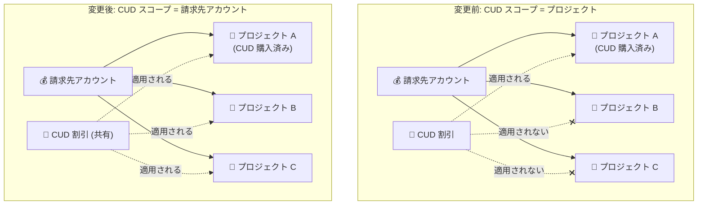

# Compute Engine: リソースベース CUD スコープのデフォルト値が「請求先アカウント」に変更

**リリース日**: 2026-06-16

**サービス**: Compute Engine

**機能**: リソースベース確約利用割引 (CUD) スコープのデフォルト構成変更

**ステータス**: Change (一般提供)

📊 [このアップデートのインフォグラフィックを見る](https://takech9203.github.io/google-cloud-news-summary/20260616-compute-engine-cud-scope-billing-account-default.html)

## 概要

2026 年 6 月 16 日より、Compute Engine のリソースベース確約利用割引 (CUD) における CUD スコープのデフォルト値が、ほとんどの Cloud Billing アカウントで「プロジェクト」から「請求先アカウント」に変更されました。これにより、CUD 共有がデフォルトで有効となり、購入した確約利用割引が請求先アカウント配下の全プロジェクトで自動的に共有されるようになります。

この変更は、組織全体でのコミットメント利用率を最大化し、コスト最適化を促進するためのものです。既存のアクティブなリソースベースコミットメントを持つ請求先アカウントについては、既存の構成が維持されるため、突然の請求変更は発生しません。

**アップデート前の課題**

- CUD スコープのデフォルトが「プロジェクト」であったため、購入したコミットメントは購入したプロジェクト内でのみ利用可能だった
- 他プロジェクトで同じリソースタイプの使用量があっても CUD が適用されず、コミットメントの未使用分が無駄になるケースがあった
- CUD 共有を有効にするには管理者が明示的に設定変更を行う必要があった

**アップデート後の改善**

- 新規請求先アカウントでは CUD 共有がデフォルトで有効になり、追加設定なしで全プロジェクトにわたって CUD が共有される
- 既存のアクティブなコミットメントがない請求先アカウントも自動的に「請求先アカウント」スコープに変更された
- コミットメントの利用率が向上し、組織全体でのコスト最適化が容易になった

## アーキテクチャ図

CUD スコープが「プロジェクト」の場合、CUD は購入プロジェクトのみに適用されます。「請求先アカウント」に変更すると、同一請求先アカウント配下の全プロジェクトで CUD が共有され、利用率が向上します。

## サービスアップデートの詳細

### 主要機能

1. **CUD スコープの自動構成変更**
   - 2026 年 6 月 16 日以降に作成された請求先アカウント: デフォルトで「請求先アカウント」(CUD 共有有効)
   - 2026 年 6 月 16 日以前に作成され、アクティブなリソースベースコミットメントがない請求先アカウント: 自動的に「請求先アカウント」に変更
   - 2026 年 6 月 16 日以前に作成され、アクティブなリソースベースコミットメントがある請求先アカウント: 既存の構成を維持 (変更なし)

2. **CUD 共有メカニズム**
   - CUD 共有が有効な場合、リソースベース CUD は請求先アカウント配下の全プロジェクトの適格な使用量に適用される
   - 割引の配分方式として「比例配分 (Proportional)」と「優先配分 (Prioritized)」の 2 種類を選択可能
   - デフォルトは比例配分方式

3. **手動での設定変更**
   - CUD スコープは管理者がいつでも手動で変更可能
   - 「請求先アカウント」への変更: 翌日の午前 0 時 (太平洋時間) に有効
   - 「プロジェクト」への変更: 数分以内に有効

## 技術仕様

### CUD スコープの動作比較

| 項目 | プロジェクトスコープ | 請求先アカウントスコープ |
|------|---------------------|------------------------|
| CUD の適用範囲 | 購入プロジェクトのみ | 請求先アカウント配下の全プロジェクト |
| 未使用コミットメントの扱い | 購入プロジェクトに課金 | 購入プロジェクトに課金 |
| 配分方式 | N/A (単一プロジェクト) | 比例配分 or 優先配分 |
| 有効化に必要な権限 | N/A | `billing.subscriptions.update` |
| 設定変更の反映時間 | 数分以内 | 翌日午前 0 時 (太平洋時間) |

### 影響を受けるアカウントの分類

| シナリオ | 対象アカウント | 変更内容 |
|---------|---------------|---------|
| シナリオ 1 | 2026/6/16 以降に作成された新規アカウント | デフォルトで「請求先アカウント」 |
| シナリオ 2 | 2026/6/16 以前作成、アクティブ CUD なし | 自動的に「請求先アカウント」に変更 |
| シナリオ 3 | 2026/6/16 以前作成、アクティブ CUD あり | 変更なし (既存構成を維持) |

### 必要な権限

CUD スコープを変更するには、Cloud Billing アカウントに対する以下の権限が必要です:

- `billing.subscriptions.update` (請求先アカウントに対して)
- 事前定義ロール: **請求先アカウント管理者 (Billing Account Administrator)**

## 設定方法

### CUD スコープの確認手順

#### ステップ 1: CUD 分析ページにアクセス

Google Cloud コンソールで CUD 分析ページに移動し、対象の Cloud Billing アカウントを選択します。

#### ステップ 2: CUD スコープの確認

CUD 分析ページのツールバーで「CUD scope & settings」をクリックし、「Resource-based CUDs scope」セクションで現在の設定を確認します。

- **Project**: CUD 共有が無効 (購入プロジェクトのみに適用)
- **Billing account**: CUD 共有が有効 (全プロジェクトで共有)

### CUD 共有の無効化 (必要な場合)

自動変更後に CUD 共有を無効にしたい場合:

1. CUD 分析ページにアクセス
2. 「CUD scope & settings」をクリック
3. 「Resource-based CUDs scope」で「Project」を選択
4. 「Save」をクリック (数分以内に反映)

## メリット

### ビジネス面

- **コスト最適化の自動化**: CUD 共有がデフォルトで有効になることで、管理者の追加設定なしにコミットメントの利用率を最大化できる
- **未使用コミットメントの削減**: 複数プロジェクト間で CUD を共有することで、特定プロジェクトの使用量減少による CUD の無駄を防止できる
- **組織全体のコスト可視性向上**: 比例配分または優先配分により、各プロジェクトの実コストをより正確に把握できる

### 技術面

- **運用負荷の軽減**: 新規請求先アカウント作成時に CUD 共有を個別に有効化する手間が不要
- **柔軟な配分制御**: 優先配分を使用することで、特定プロジェクトに優先的に CUD を配分可能
- **BigQuery エクスポートとの連携**: 配分結果は Cloud Billing の BigQuery エクスポートに反映され、詳細な分析が可能

## デメリット・制約事項

### 制限事項

- 共有予約 (Shared Reservation) を使用している場合、共有先プロジェクトが同一請求先アカウントに紐づいていないと、そのプロジェクトの使用量は CUD 適用対象外となりオンデマンド料金が課金される
- CUD 共有が有効でもコミットメントの未使用分が発生した場合、その費用は購入プロジェクトに課金される
- カスタムマシンタイプで使用する場合、コミットメント価格に対して 5% のプレミアムが課される

### 考慮すべき点

- 優先配分を設定する場合は、CUD 共有を有効にする前に優先配分の設定を完了することが推奨される (一時的な比例配分によるコストレポートの変動を防ぐため)
- プロジェクトを別の請求先アカウントに移動した場合、移動先の CUD 共有設定が適用される
- CUD 共有を有効にした際のデフォルト配分方式は「比例配分」であり、特定プロジェクトを優先したい場合は別途設定が必要

## ユースケース

### ユースケース 1: マルチプロジェクト環境でのコスト最適化

**シナリオ**: 開発、ステージング、本番の 3 プロジェクトを持つ組織で、本番プロジェクトで N2 マシンのリソースベース CUD を購入している。開発・ステージング環境でも同じマシンタイプを使用しているが、これまで CUD が適用されていなかった。

**効果**: CUD スコープが「請求先アカウント」に変更されることで、開発・ステージング環境の N2 使用量にも自動的に CUD 割引が適用され、コミットメントの利用率が向上する。

### ユースケース 2: 部門別プロジェクトでの優先配分

**シナリオ**: 複数部門がそれぞれ専用プロジェクトを持ち、IT 部門が一括で CUD を購入している。各部門のコストを正確に把握するため、部門ごとに CUD の配分を制御したい。

**効果**: CUD 共有を有効にした上で優先配分を設定することで、各部門のプロジェクトに購入量に応じた CUD を配分し、プロジェクト単位での正確なコスト管理が可能になる。

## 料金

リソースベース CUD の割引率は、コミットメント期間とリソースタイプによって異なります:

| コミットメント期間 | 一般マシンシリーズ | メモリ最適化マシンシリーズ |
|-------------------|-------------------|-------------------------|
| 1 年 | 最大 37% 割引 | 最大 40% 割引 |
| 3 年 | 最大 55% 割引 | 最大 70% 割引 |

CUD スコープの変更自体に追加料金は発生しません。CUD 共有の有効化・無効化も無料です。詳細な料金はリージョンやマシンタイプによって異なります。

## 関連サービス・機能

- **Cloud Billing**: CUD スコープの管理、コスト配分レポート、BigQuery へのエクスポート
- **Cloud Billing CUD Attribution**: 比例配分・優先配分の設定、プロジェクト別コスト可視化
- **Compute Engine 確約利用割引**: リソースベース CUD の購入・管理
- **Compute Flexible CUD (支出ベース)**: 支出ベースのコミットメントは元々請求先アカウントレベルで共有されており、別途 CUD 共有設定は不要

## 参考リンク

- 📊 [インフォグラフィック](https://takech9203.github.io/google-cloud-news-summary/20260616-compute-engine-cud-scope-billing-account-default.html)
- [公式リリースノート](https://docs.cloud.google.com/release-notes#June_16_2026)
- [CUD スコープ構成ドキュメント](https://docs.cloud.google.com/compute/docs/committed-use-discounts/share-resource-cuds-across-projects#cud-scope-configuration)
- [CUD 共有の有効化手順](https://docs.cloud.google.com/compute/docs/committed-use-discounts/share-resource-cuds-across-projects#turning_on_committed_use_discount_sharing)
- [CUD 配分 (Attribution) の設定](https://docs.cloud.google.com/docs/cuds-attribution)
- [確約利用割引の概要](https://docs.cloud.google.com/compute/docs/instances/committed-use-discounts-overview)
- [Compute Engine 料金ページ](https://cloud.google.com/products/compute/pricing)

## まとめ

今回の変更により、リソースベース CUD のデフォルトスコープが「請求先アカウント」に変更され、組織全体でのコミットメント利用率の最大化が容易になりました。管理者は自身の請求先アカウントの CUD スコープ設定を確認し、特にアクティブなコミットメントを持つアカウントでは、必要に応じて CUD 共有の有効化と配分方式の設定を検討することを推奨します。

---

**タグ**: #ComputeEngine #CUD #CommittedUseDiscount #CostOptimization #Billing #ResourceManagement
