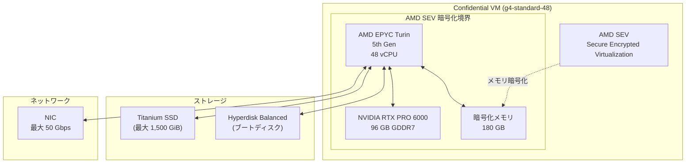

# Confidential VM: g4-standard-48 マシンタイプのサポート (GPU 付き Confidential Computing)

**リリース日**: 2026-06-16

**サービス**: Confidential VM

**機能**: アクセラレータ最適化 g4-standard-48 マシンタイプで Confidential VM をサポート

**ステータス**: Preview

📊 [このアップデートのインフォグラフィックを見る](https://takech9203.github.io/google-cloud-news-summary/20260616-confidential-vm-g4-standard-48-gpu.html)

## 概要

Google Cloud は、Confidential VM において新たにアクセラレータ最適化 g4-standard-48 マシンタイプのサポートを Preview として提供開始しました。これにより、NVIDIA RTX PRO 6000 GPU を搭載した VM 上で、AMD SEV (Secure Encrypted Virtualization) による機密コンピューティングを利用しながら AI/ML ワークロードを安全に実行できるようになります。

このアップデートは、GPU を活用した AI/ML 推論やモデルチューニングを行いつつ、データの機密性を確保する必要がある企業にとって重要な進展です。第5世代 AMD EPYC Turin プロセッサと AMD SEV テクノロジーの組み合わせにより、処理中のデータがメモリ上で暗号化され、クラウド上でのデータプライバシーが強化されます。

従来、Confidential VM で GPU を利用する場合は A3 マシンシリーズ (NVIDIA H100) と Intel TDX の組み合わせに限定されていましたが、今回のアップデートにより、よりコスト効率の高い G4 シリーズでも Confidential Computing が可能になりました。

**アップデート前の課題**

- Confidential VM で GPU を使用する場合、A3 マシンシリーズ (H100 GPU) と Intel TDX の組み合わせのみに限定されていた
- G4 マシンタイプでは Confidential VM インスタンスを作成できないという制限があった
- 推論やモデルチューニングなどの比較的軽量な GPU ワークロードでも、機密性を確保するには高価な A3 シリーズを使用する必要があった

**アップデート後の改善**

- g4-standard-48 マシンタイプで AMD SEV による Confidential Computing が利用可能に
- NVIDIA RTX PRO 6000 GPU (96 GB GDDR7) を搭載した環境で機密 AI/ML ワークロードを実行可能に
- A3 シリーズと比較してコスト効率の高い選択肢で機密コンピューティングが実現可能に

## アーキテクチャ図



AMD SEV がメモリを暗号化し、CPU と GPU 間のデータ転送を保護する構成を示しています。g4-standard-48 は 1 基の NVIDIA RTX PRO 6000 GPU を搭載し、最大 50 Gbps のネットワーク帯域幅を提供します。

## サービスアップデートの詳細

### 主要機能

1. **AMD SEV によるメモリ暗号化**
   - 処理中のデータがハードウェアレベルで暗号化
   - VM 固有の暗号鍵がプロセッサ内で生成・管理
   - ホスト OS やハイパーバイザーからもデータが保護される

2. **NVIDIA RTX PRO 6000 GPU (Blackwell Server Edition)**
   - 96 GB GDDR7 GPU メモリ
   - AI/ML 推論、モデルチューニング、グラフィックス処理に最適
   - NVIDIA Omniverse シミュレーション対応

3. **第5世代 AMD EPYC Turin プロセッサ**
   - 48 vCPU による高い並列処理性能
   - 最新世代のセキュリティ機能を統合
   - AMD SEV テクノロジーのネイティブサポート

## 技術仕様

### g4-standard-48 マシンタイプ (Confidential VM)

| 項目 | 詳細 |
|------|------|
| vCPU 数 | 48 |
| インスタンスメモリ | 180 GB |
| GPU | NVIDIA RTX PRO 6000 x 1 |
| GPU メモリ | 96 GB GDDR7 |
| Confidential Computing テクノロジー | AMD SEV |
| CPU プラットフォーム | AMD EPYC Turin (第5世代) |
| 最大ネットワーク帯域幅 | 50 Gbps |
| Titanium SSD 最大容量 | 1,500 GiB |
| 物理 NIC 数 | 1 |

### 対応ディスクタイプ

| ディスクタイプ | 最大接続数 |
|------|------|
| Hyperdisk Balanced (ブートディスク) | 32 |
| Hyperdisk Balanced High Availability | 32 |
| Hyperdisk ML | 32 |
| Hyperdisk Throughput | 32 |
| Titanium SSD | 4 |

## 設定方法

### 前提条件

1. Google Cloud プロジェクトで Compute Engine API が有効化されていること
2. 対象リージョンで十分な GPU クォータが確保されていること
3. AMD SEV 対応の OS イメージを使用すること

### 手順

#### ステップ 1: GPU クォータの確認

```bash
# プロジェクトの GPU クォータを確認
gcloud compute regions describe REGION \
  --format="value(quotas)"
```

必要に応じて Google Cloud Console の [クォータ] ページから GPU クォータの増加をリクエストしてください。

#### ステップ 2: Confidential VM インスタンスの作成

```bash
gcloud compute instances create INSTANCE_NAME \
  --machine-type=g4-standard-48 \
  --zone=ZONE \
  --confidential-compute-type=SEV \
  --boot-disk-size=200GB \
  --image-family=ubuntu-2404-lts \
  --image-project=ubuntu-os-cloud \
  --maintenance-policy=TERMINATE \
  --restart-on-failure
```

`--confidential-compute-type=SEV` フラグにより AMD SEV が有効化されます。

#### ステップ 3: インスタンスの確認

```bash
# Confidential Computing が有効であることを確認
gcloud compute instances describe INSTANCE_NAME \
  --zone=ZONE \
  --format="value(confidentialInstanceConfig)"
```

## メリット

### ビジネス面

- **コンプライアンス対応の強化**: 医療、金融、政府機関など、データの機密性が厳格に求められる業界で GPU ワークロードを安全に実行可能
- **コスト効率の向上**: A3 シリーズ (H100) と比較して、推論やモデルチューニングなどのワークロードをより低コストで実行可能
- **マルチパーティ連携**: 機密データを保護しながら、パートナーやサードパーティとの AI/ML コラボレーションを実現

### 技術面

- **ハードウェアレベルのセキュリティ**: AMD SEV によりメモリが VM 単位で暗号化され、ソフトウェアベースのセキュリティを超えた保護を提供
- **パフォーマンスの維持**: ハードウェア暗号化のため、ソフトウェア暗号化と比較してオーバーヘッドが最小限
- **GPU ワークロードの保護**: AI モデルの学習データや推論結果が処理パイプライン全体で保護される

## デメリット・制約事項

### 制限事項

- Preview ステータスのため、本番環境での使用には注意が必要 (SLA の適用外)
- 既存の VM インスタンスを Confidential VM に変換することはできない (新規作成が必要)
- Persistent Disk (リージョナルまたはゾーナル) は G4 マシンタイプでは使用不可
- ライブマイグレーションが制限される可能性あり

### 考慮すべき点

- Confidential VM インスタンスはブート時間が長くなる傾向がある (メモリ量に比例)
- SSH 接続の確立に通常の VM より時間がかかる場合がある
- ネットワーク帯域幅やレイテンシが非 Confidential VM と比較して低下する可能性がある
- サステインドユースディスカウントおよびフレキシブル CUD は G4 マシンタイプには適用されない

## ユースケース

### ユースケース 1: 医療 AI 推論における患者データの保護

**シナリオ**: 医療機関が患者の画像データ (X線、MRI) を使用して AI 診断支援モデルの推論を実行する際、HIPAA 等の規制に準拠しつつ GPU アクセラレーションを活用したい。

**実装例**:
```bash
gcloud compute instances create medical-ai-inference \
  --machine-type=g4-standard-48 \
  --zone=us-central1-a \
  --confidential-compute-type=SEV \
  --boot-disk-size=200GB \
  --image-family=ubuntu-2404-lts \
  --image-project=ubuntu-os-cloud \
  --maintenance-policy=TERMINATE
```

**効果**: 患者データがメモリ上で暗号化されたまま GPU 推論が実行され、データの機密性とパフォーマンスを両立。

### ユースケース 2: 金融機関における機密モデルのチューニング

**シナリオ**: 金融機関が顧客の取引データを使用してリスク予測モデルのファインチューニングを行う際、モデルとデータの両方を保護しながら GPU アクセラレーションを利用したい。

**効果**: AMD SEV により学習データとモデルパラメータがハードウェアレベルで保護され、クラウド事業者を含む第三者からのデータアクセスを防止。

## 関連サービス・機能

- **Confidential VM (A3 + Intel TDX)**: H100 GPU を使用したより高性能な Confidential Computing オプション
- **Confidential GKE Nodes**: Kubernetes 環境での Confidential Computing
- **Confidential Space**: マルチパーティ計算のための機密実行環境
- **G4 マシンシリーズ**: NVIDIA RTX PRO 6000 を搭載したアクセラレータ最適化マシン

## 参考リンク

- 📊 [インフォグラフィック](https://takech9203.github.io/google-cloud-news-summary/20260616-confidential-vm-g4-standard-48-gpu.html)
- [公式リリースノート](https://cloud.google.com/release-notes)
- [Confidential VM ドキュメント](https://cloud.google.com/confidential-computing/confidential-vm/docs/confidential-vm-overview)
- [G4 マシンタイプの仕様](https://cloud.google.com/compute/docs/accelerator-optimized-machines#g4-series)
- [Confidential VM インスタンスの作成](https://cloud.google.com/confidential-computing/confidential-vm/docs/create-a-confidential-vm-instance)
- [サポートされる構成](https://cloud.google.com/confidential-computing/confidential-vm/docs/supported-configurations)

## まとめ

今回の Confidential VM における g4-standard-48 マシンタイプのサポートは、GPU を活用した機密 AI/ML ワークロードの選択肢を大幅に広げる重要なアップデートです。従来は高価な A3 シリーズに限定されていた GPU + Confidential Computing の組み合わせが、よりコスト効率の高い G4 シリーズでも利用可能になりました。医療、金融、政府機関など機密性の高いデータを扱う組織は、Preview 段階でこの機能を評価し、GA 後の本番導入に備えることを推奨します。

---

**タグ**: #ConfidentialVM #GPU #AMDEPYC #AMDsev #G4 #NVIDIARTXPRO6000 #AI #ML #セキュリティ #機密コンピューティング #Preview
