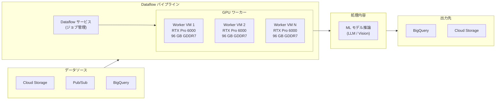

# Dataflow: NVIDIA RTX Pro 6000 GPU サポート

**リリース日**: 2026-06-16

**サービス**: Dataflow

**機能**: NVIDIA RTX Pro 6000 GPU サポート

**ステータス**: GA (一般提供)

[このアップデートのインフォグラフィックを見る](https://takech9203.github.io/google-cloud-news-summary/20260616-dataflow-nvidia-rtx-pro-6000-gpu.html)

## 概要

Dataflow が NVIDIA RTX Pro 6000 GPU をサポートするようになりました。この GPU は NVIDIA Blackwell アーキテクチャを採用した最新のプロフェッショナル向け GPU であり、96 GB の GDDR7 GPU メモリを搭載しています。Apache Beam パイプラインを Dataflow 上で実行する際に、アクセラレータタイプとして `nvidia-rtx-pro-6000` を指定することで利用可能です。

RTX Pro 6000 は、大規模・中規模・小規模のモデル推論ワークロードに推奨されています。従来の NVIDIA L4 (24 GB VRAM) や T4 (16 GB VRAM) と比較して、96 GB という大容量のGPU メモリを持ち、より大きなモデルをロードして推論を実行できます。また、第5世代 Tensor コアによる FP4 精度のサポートにより、推論パフォーマンスが大幅に向上しています。

このアップデートは、Dataflow を使用して ML 推論パイプラインを構築しているデータエンジニアや ML エンジニアを主な対象としています。特に、L4 では GPU メモリが不足するが A100/H100 ほどの計算能力は不要というユースケースにおいて、コスト効率の良い選択肢を提供します。

**アップデート前の課題**

- Dataflow で大規模な ML モデル推論を行う場合、L4 (24 GB) では GPU メモリが不足し、A100/H100 (40-80 GB) ではコストが高すぎるケースがあった
- 中程度の規模のモデル推論に対して、コストとパフォーマンスのバランスが取れた GPU 選択肢が限られていた
- 最新の Blackwell アーキテクチャの性能を Dataflow のバッチ/ストリーミングパイプラインで活用できなかった

**アップデート後の改善**

- 96 GB GDDR7 メモリを持つ RTX Pro 6000 により、L4 と A100 の間のギャップを埋める選択肢が利用可能になった
- 第5世代 Tensor コア (FP4 精度対応) により、推論ワークロードの処理速度が向上した
- PCIe Gen 5 対応により、CPU メモリから GPU へのデータ転送速度が改善された
- 24,064 CUDA コア、752 Tensor コア、188 RT コアという豊富な計算リソースが利用可能になった

## アーキテクチャ図



この図は、Dataflow パイプラインが RTX Pro 6000 GPU を搭載したワーカー VM を使用して、データソースからデータを取得し、ML モデル推論を実行して結果を出力先に書き込む全体的なアーキテクチャを示しています。

## サービスアップデートの詳細

### 主要機能

1. **NVIDIA RTX Pro 6000 GPU アクセラレータ**
   - Blackwell アーキテクチャベースの NVIDIA RTX Pro 6000 GPU を Dataflow ワーカーにアタッチ可能
   - アクセラレータタイプ文字列: `nvidia-rtx-pro-6000`
   - 96 GB GDDR7 GPU メモリ搭載

2. **幅広い推論ワークロード対応**
   - 大規模モデル推論 (Large model inference): 推奨
   - 中規模モデル推論 (Medium model inference): 推奨
   - 小規模モデル推論 (Small model inference): 推奨
   - A100/H100 と比較して低コストで推論ワークロードを実行可能

3. **Dataflow Runner v2 との統合**
   - Runner v2 を使用した GPU ワークロード実行
   - カスタムコンテナイメージによる柔軟な環境構築
   - NVIDIA ドライバの自動インストール対応

## 技術仕様

### NVIDIA RTX Pro 6000 GPU スペック

| 項目 | 詳細 |
|------|------|
| アーキテクチャ | NVIDIA Blackwell |
| GPU メモリ | 96 GB GDDR7 |
| CUDA コア | 24,064 |
| Tensor コア | 752 (第5世代) |
| RT コア | 188 (第4世代) |
| PCIe | Gen 5 |
| FP4 精度 | サポート |
| Dataflow 識別子 | `nvidia-rtx-pro-6000` |

### GPU タイプ別推奨ワークロード比較

| ワークロード | A100 / H100 | RTX Pro 6000 | L4 | T4 |
|------------|-------------|--------------|-----|-----|
| モデルファインチューニング | 推奨 | - | - | - |
| 大規模モデル推論 | 推奨 | 推奨 | 推奨 | - |
| 中規模モデル推論 | - | 推奨 | 推奨 | 推奨 |
| 小規模モデル推論 | - | 推奨 | 推奨 | 推奨 |

### Compute Engine G4 マシンタイプ

RTX Pro 6000 は Compute Engine の G4 シリーズマシンタイプで使用されます。

| マシンタイプ | vCPU | メモリ (GB) | GPU 数 | GPU メモリ (GB) |
|------------|------|------------|--------|---------------|
| g4-standard-6 | 6 | 22 | 1/8 | 12 |
| g4-standard-12 | 12 | 45 | 1/4 | 24 |
| g4-standard-24 | 24 | 90 | 1/2 | 48 |
| g4-standard-48 | 48 | 180 | 1 | 96 |
| g4-standard-96 | 96 | 360 | 2 | 192 |
| g4-standard-192 | 192 | 720 | 4 | 384 |
| g4-standard-384 | 384 | 1,440 | 8 | 768 |

## 設定方法

### 前提条件

1. Dataflow Runner v2 を使用すること
2. GPU クォータが対象リージョンで確保されていること
3. カスタムコンテナイメージに必要な CUDA ライブラリがインストールされていること
4. ブートディスクサイズを 50 GB 以上に設定すること

### 手順

#### ステップ 1: GPU クォータの確認・申請

```bash
# プロジェクトの GPU クォータを確認
gcloud compute regions describe us-central1 \
  --project=PROJECT_ID \
  --format="table(quotas.filter(metric='NVIDIA_RTX_PRO_6000_GPUS'))"
```

GPU クォータが不足している場合は、Google Cloud コンソールの「IAM と管理 > 割り当て」ページからクォータ増加をリクエストしてください。

#### ステップ 2: カスタムコンテナイメージの準備

```dockerfile
FROM apache/beam_python3.11_sdk:2.x.x

# CUDA ツールキットのインストール
RUN apt-get update && apt-get install -y --no-install-recommends \
    cuda-toolkit-12-2 \
    && rm -rf /var/lib/apt/lists/*

# ML フレームワークのインストール
RUN pip install torch torchvision transformers

# パイプラインコードのコピー
COPY pipeline/ /app/pipeline/
```

コンテナイメージをビルドして Artifact Registry にプッシュします。

```bash
# コンテナイメージのビルドとプッシュ
gcloud builds submit --tag REGION-docker.pkg.dev/PROJECT_ID/REPO/gpu-pipeline:latest
```

#### ステップ 3: Dataflow ジョブの実行

```bash
python pipeline.py \
  --runner "DataflowRunner" \
  --project "PROJECT_ID" \
  --temp_location "gs://BUCKET/tmp" \
  --region "us-central1" \
  --worker_harness_container_image "REGION-docker.pkg.dev/PROJECT_ID/REPO/gpu-pipeline:latest" \
  --disk_size_gb 50 \
  --dataflow_service_options "worker_accelerator=type:nvidia-rtx-pro-6000;count:1;install-nvidia-driver" \
  --experiments "use_runner_v2"
```

#### ステップ 4: Dataflow Prime でのリソースヒント使用 (代替方法)

```python
import apache_beam as beam

with beam.Pipeline() as p:
    (p
     | "Read" >> beam.io.ReadFromBigQuery(...)
     | "Inference" >> beam.ParDo(
         RunInference(model_handler)
       ).with_resource_hints(
         accelerator='type:nvidia-rtx-pro-6000;count:1;install-nvidia-driver'
       )
     | "Write" >> beam.io.WriteToBigQuery(...)
    )
```

Dataflow Prime を使用する場合は、パイプライン全体ではなく特定のステップにのみ GPU を割り当てることができます。

## メリット

### ビジネス面

- **コスト最適化**: A100/H100 と比較して低コストで中規模~大規模の推論ワークロードを実行でき、GPU メモリ容量あたりのコストパフォーマンスが向上
- **スケーラビリティ**: Dataflow のオートスケーリング機能と組み合わせることで、需要に応じた GPU リソースの自動調整が可能
- **Time-to-Market 短縮**: Dataflow の管理型サービスにより、GPU インフラの構築・運用の手間を削減し、ML パイプラインの開発に集中可能

### 技術面

- **大容量 GPU メモリ**: 96 GB GDDR7 により、L4 (24 GB) では不可能だった大規模モデルのロードと推論が可能
- **最新アーキテクチャ**: 第5世代 Tensor コアによる FP4 精度サポートで、推論スループットが大幅に向上
- **GPU P2P 通信**: マルチ GPU 構成 (g4-standard-96 以上) で PCIe バスを介した直接 GPU 間通信をサポート
- **柔軟なプロビジョニング**: 標準プロビジョニングおよび Flex-start プロビジョニングモデルに対応

## デメリット・制約事項

### 制限事項

- Dataflow Runner v2 が必須 (Runner v1 では GPU を使用できない)
- GPU ドライバはカスタムコンテナイメージにインストールせず、`install-nvidia-driver` オプションを使用する必要がある
- Flex-start プロビジョニングはバッチパイプラインのみ対応 (ストリーミングパイプラインは非対応)
- リージョンおよびゾーンの GPU 可用性に依存する

### 考慮すべき点

- GPU コンテナイメージは大きくなりがちなため、ブートディスクサイズを適切に設定する必要がある (50 GB 以上推奨)
- GPU クォータは事前に確保しておく必要があり、新規プロジェクトではクォータ申請が必要
- コスト管理: GPU 利用時間に基づく課金が発生するため、パイプラインの実行時間とコストのバランスを考慮する
- Apache Beam SDK のバージョンとコンテナイメージ内の Python バージョンを一致させる必要がある

## ユースケース

### ユースケース 1: 大規模言語モデル (LLM) によるバッチ推論

**シナリオ**: 大量のカスタマーレビューデータに対して、70B パラメータクラスの LLM を使用して感情分析・要約・カテゴリ分類を一括実行する。

**実装例**:
```python
import apache_beam as beam
from apache_beam.ml.inference.base import RunInference

class LLMModelHandler:
    def __init__(self):
        self.model_path = "gs://bucket/models/llm-70b"
    
    def load_model(self):
        # 96 GB GPU メモリに 70B モデルをロード
        from transformers import AutoModelForCausalLM
        return AutoModelForCausalLM.from_pretrained(
            self.model_path, 
            device_map="auto",
            torch_dtype=torch.float16
        )

with beam.Pipeline(options=pipeline_options) as p:
    (p
     | "ReadReviews" >> beam.io.ReadFromBigQuery(
         query="SELECT review_text FROM reviews WHERE date = CURRENT_DATE()")
     | "RunLLMInference" >> RunInference(LLMModelHandler())
     | "WriteResults" >> beam.io.WriteToBigQuery("project:dataset.results")
    )
```

**効果**: 96 GB GPU メモリにより 70B パラメータモデルを GPU 上に完全にロードでき、CPU 推論と比較して 10-50 倍の処理速度向上が期待できる。

### ユースケース 2: リアルタイム画像・動画分析パイプライン

**シナリオ**: Pub/Sub 経由で流入する画像データに対して、物体検出・セグメンテーション・OCR などの複合的な Vision AI 処理をストリーミングで実行する。

**効果**: RTX Pro 6000 の大容量 GPU メモリにより、複数の Vision モデルを同時にロードし、マルチモデル推論パイプラインを単一 GPU 上で効率的に実行可能。レイテンシーの低減とスループットの向上が実現できる。

### ユースケース 3: RAG (Retrieval-Augmented Generation) パイプライン

**シナリオ**: 企業内ドキュメントに対して埋め込みベクトルを生成し、ベクトル検索と組み合わせた RAG パイプラインをバッチで実行する。

**効果**: 大規模な Embedding モデルと生成モデルの両方を GPU メモリに保持しながら処理でき、ドキュメント処理のスループットが大幅に向上する。

## 料金

GPU を使用する Dataflow ジョブの料金は、Dataflow の料金ページに記載された GPU 課金が適用されます。料金は使用するリージョン、GPU 使用時間、および追加のコンピューティングリソース (vCPU、メモリ、ディスク) に基づいて計算されます。

### 料金構成要素

| 構成要素 | 説明 |
|---------|------|
| GPU 時間 | RTX Pro 6000 GPU の使用時間に基づく課金 |
| vCPU 時間 | ワーカー VM の vCPU 使用時間 |
| メモリ時間 | ワーカー VM のメモリ使用量と時間 |
| ディスク | ブートディスクおよび追加ディスクの使用量 |
| ネットワーク | データ転送量に基づく課金 |

### コスト最適化のヒント

| 方法 | 説明 |
|------|------|
| Flex-start プロビジョニング | バッチジョブで利用可能。プリエンプティブル料金の適用でコスト削減 |
| Dataflow Prime リソースヒント | GPU が必要なステップのみに GPU を割り当て、不要なステップでは CPU のみ使用 |
| 確約利用割引 (CUD) | 継続的な利用が見込まれる場合、1年/3年の確約で 20-40% 割引 |

## 利用可能リージョン

RTX Pro 6000 GPU の利用可能リージョンは、Compute Engine の GPU リージョン・ゾーン可用性に準じます。Dataflow ジョブを作成する際は、RTX Pro 6000 が利用可能なゾーンを持つリージョンを指定してください。

参考として、Cloud Run での RTX Pro 6000 は以下のリージョンでサポートされています:

- us-central1 (アイオワ)
- europe-west4 (オランダ)
- asia-southeast1 (シンガポール)
- asia-south2 (デリー)

Dataflow での正確なリージョン可用性は、[GPU regions and zones availability](https://cloud.google.com/compute/docs/gpus/gpu-regions-zones) を参照してください。

## 関連サービス・機能

- **Compute Engine G4 マシンシリーズ**: RTX Pro 6000 GPU を搭載した G4 シリーズのベースとなるコンピューティングプラットフォーム
- **Dataflow Prime**: リソースヒントを使用してパイプラインの特定ステップにのみ GPU を割り当てる機能
- **Vertex AI**: モデルの学習・デプロイメントプラットフォーム。Dataflow と連携して ML パイプラインを構築
- **Cloud Run GPU**: 同じ RTX Pro 6000 GPU をサーバーレスコンテナで利用可能
- **Artifact Registry**: GPU 対応カスタムコンテナイメージの保存・管理

## 参考リンク

- [インフォグラフィック](https://takech9203.github.io/google-cloud-news-summary/20260616-dataflow-nvidia-rtx-pro-6000-gpu.html)
- [公式リリースノート](https://cloud.google.com/release-notes#June_16_2026)
- [Dataflow GPU サポート ドキュメント](https://cloud.google.com/dataflow/docs/gpu/gpu-support)
- [Dataflow で GPU を使用する](https://cloud.google.com/dataflow/docs/gpu/use-gpus)
- [Compute Engine GPU プラットフォーム](https://cloud.google.com/compute/docs/gpus)
- [Dataflow 料金](https://cloud.google.com/dataflow/pricing)
- [GPU リージョンとゾーンの可用性](https://cloud.google.com/compute/docs/gpus/gpu-regions-zones)

## まとめ

Dataflow における NVIDIA RTX Pro 6000 GPU のサポートは、ML 推論パイプラインの選択肢を大幅に拡大する重要なアップデートです。96 GB の GPU メモリと最新の Blackwell アーキテクチャにより、従来 L4 では対応できなかった大規模モデルの推論をコスト効率よく実行できるようになりました。Dataflow で ML 推論ワークロードを運用しているチームは、パイプラインのアクセラレータタイプを `nvidia-rtx-pro-6000` に変更するだけで、この新しい GPU の恩恵を受けることができます。

---

**タグ**: #Dataflow #GPU #NVIDIA #RTX-Pro-6000 #ML推論 #Apache-Beam #Blackwell #機械学習
