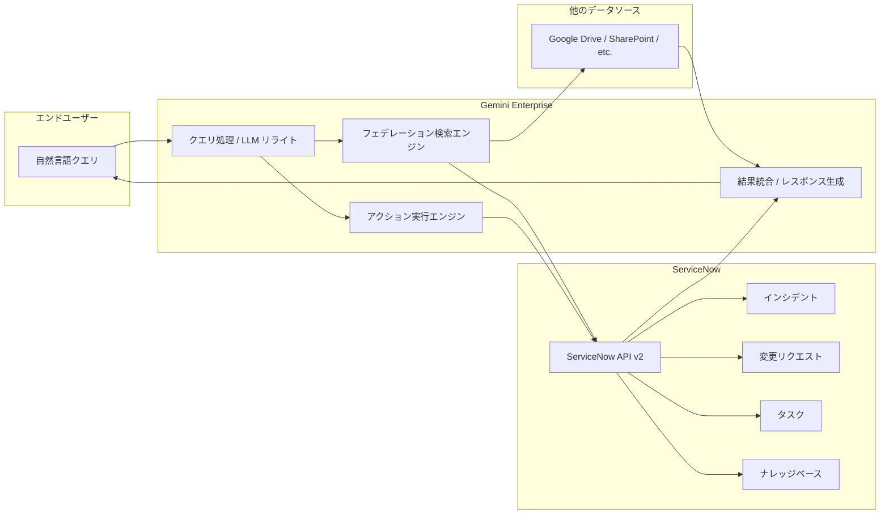

# Gemini Enterprise: ServiceNow データストアのフェデレーションおよびアシスタントアクションが GA

**リリース日**: 2026-06-16

**サービス**: Gemini Enterprise

**機能**: ServiceNow データストアのフェデレーション検索とアシスタントアクション

**ステータス**: GA (Generally Available)

📊 [このアップデートのインフォグラフィックを見る](https://takech9203.github.io/google-cloud-news-summary/20260616-gemini-enterprise-servicenow-data-store-ga.html)

## 概要

Gemini Enterprise において、ServiceNow データストアのフェデレーション検索およびアシスタントアクション機能が一般提供（GA）となりました。この機能により、ユーザーは Gemini Enterprise のインターフェースから自然言語を使って ServiceNow のデータに直接アクセスし、インシデント、変更リクエスト、タスク、ナレッジベース記事の検索・閲覧が可能になります。

さらに、インシデントの作成や更新といったアクションも Gemini Enterprise アプリから直接実行できるようになりました。これにより、IT サービスマネジメント（ITSM）業務において、ServiceNow と Gemini Enterprise 間のコンテキストスイッチを大幅に削減し、業務効率を向上させることができます。

この機能は、エンタープライズ環境で ServiceNow を ITSM プラットフォームとして利用している IT サポートチーム、サービスデスク担当者、変更管理者、ナレッジマネージャーを主な対象としています。

**アップデート前の課題**

- ServiceNow のデータを確認するために、Gemini Enterprise と ServiceNow の間で画面を切り替える必要があった
- インシデントの作成や更新のために ServiceNow の UI に直接アクセスする必要があった
- ServiceNow のフェデレーション検索とアクション機能はパブリックプレビュー段階であり、本番環境での利用に制限があった

**アップデート後の改善**

- Gemini Enterprise から自然言語で ServiceNow のデータを直接検索・閲覧が可能になった
- インシデントの作成・更新を Gemini Enterprise 内で完結できるようになった
- GA となったことで SLA に基づいたサポートが提供され、本番ワークロードでの利用が推奨される状態になった
- 他のデータソースの検索結果と ServiceNow のデータを統合的に表示できるようになった

## アーキテクチャ図



Gemini Enterprise がユーザーの自然言語クエリを受け取り、必要に応じて LLM がクエリを書き換えた後、ServiceNow API に直接送信します。フェデレーション検索では ServiceNow からのリアルタイム結果が他のデータソースの結果と統合され、包括的な回答が生成されます。

## サービスアップデートの詳細

### 主要機能

1. **フェデレーション検索（Federated Search）**
   - ServiceNow のデータをリアルタイムで直接検索（データの取り込み不要）
   - インシデント、変更リクエスト、タスク、ナレッジベース記事を横断検索
   - 他の接続データソースの結果と統合して表示
   - Authorization Code グラントフローによるセキュアな認証

2. **アシスタントアクション（Assistant Actions）**
   - インシデントの新規作成: サービス中断を報告・追跡するためのインシデントレコードを作成
   - インシデントの更新: 一意のシステム ID を使用して既存のインシデントを更新
   - 自然言語コマンドによる操作が可能
   - 追加の読み取り専用アクションも利用可能

3. **2 つのコネクタタイプ**
   - **フェデレーション検索**: データ取り込みなしで ServiceNow からリアルタイムにレコードにアクセス
   - **データ取り込み（Data Ingestion）**: ローカルデータストアにレコードを同期・インデックス化して高速検索を実現

## 技術仕様

### 認証フロー

| コネクタタイプ | 認証フロー | 用途 |
|------|------|------|
| フェデレーション検索 | Authorization Code グラントフロー | リアルタイム検索、アクション実行 |
| データ取り込み | Resource Owner Password Credentials (ROPC) | データの同期・インデックス化 |
| データ取り込み + アクション | ROPC + Authorization Code | 両方の機能を利用 |

### サポート要件

| 項目 | 詳細 |
|------|------|
| ServiceNow API バージョン | v2 以降 |
| 対応リージョン | global、us、eu |
| OAuth スコープ | Broadly scoped（推奨） |
| 暗号化 | Google マネージド鍵 または Cloud KMS 鍵 |
| 必要な IAM ロール | Discovery Engine Editor（roles/discoveryengine.editor） |

### アクセス制御

ServiceNow コネクタは、インシデントエンティティに対して制限的なアクセス制御を適用します。

- `admin`、`incident_manager`、`change_manager` ロールを持つユーザーは全インシデントを閲覧可能
- その他のユーザーは、自身が関連付けられているインシデントのみ閲覧可能（オープン、再オープン、解決、クローズしたもの、またはアサインメントグループ・コーラー・アサイニー・ウォッチリスト・ワークノートリスト・追加アサイニーリストに含まれるもの）
- ServiceNow の `itil` や `sn_incident_read` などのロールベースの広範な権限は Gemini Enterprise では適用されない

## 設定方法

### 前提条件

1. Google Cloud プロジェクトの作成または選択
2. Discovery Engine Editor ロール（`roles/discoveryengine.editor`）の付与
3. ServiceNow OAuth アプリケーションの登録（Broadly scoped スコープ制限）
4. ServiceNow アカウントのセットアップと認証情報の取得
5. 管理者ロールの設定とユーザーロール・権限の構成
6. テーブルインデックスの有効化（キーワード検索を使用する場合）

### 手順

#### ステップ 1: ServiceNow データストアの作成

1. Google Cloud コンソールで Gemini Enterprise ページに移動
2. ナビゲーションメニューから「Data stores」をクリック
3. 「Create data store」をクリック
4. Source セクションで「ServiceNow」を検索し選択
5. Configuration セクションでマルチリージョン、コネクタ名、暗号化設定を構成
6. Billing セクションで料金プランを選択
7. 「Create」をクリック

#### ステップ 2: アプリの作成とデータストアの接続

1. データストアのステータスが「Active」になるまで待機
2. アプリを作成し、ServiceNow データストアを接続
3. Gemini Enterprise が ServiceNow にアクセスするための認可を設定

#### ステップ 3: アクションの有効化

1. データストアのナビゲーションメニューから「Actions」を選択
2. 「Enable actions」をクリック
3. フェデレーションデータストアの場合、リストからアクションを選択
4. 「Enable actions」をクリックして有効化

## メリット

### ビジネス面

- **業務効率の向上**: ServiceNow と Gemini Enterprise 間のコンテキストスイッチが不要になり、IT サポート担当者の生産性が向上
- **レスポンス時間の短縮**: 自然言語でインシデントの検索・作成・更新が行えるため、対応時間が短縮
- **ナレッジの活用促進**: ナレッジベース記事を他のデータソースと統合して検索できるため、既存知識の再利用が促進

### 技術面

- **リアルタイムデータアクセス**: フェデレーション検索によりデータの取り込みなしでリアルタイムに ServiceNow データにアクセス
- **セキュアな統合**: OAuth 2.0 Authorization Code フローによる安全な認証、制限的なアクセス制御
- **GA レベルの信頼性**: 一般提供のステータスにより、SLA に基づくサポートと安定性が保証

## デメリット・制約事項

### 制限事項

- 対応リージョンは global、us、eu のみ
- アクション付きのデータストアを新規作成または既存アプリに追加する場合、1 つのコネクタタイプに属する 1 つのデータストアのみを関連付けることを推奨
- 既存の ServiceNow データストアに VPC Service Controls ペリメーターを適用することは不サポート（削除して再作成が必要）
- ServiceNow の `itil` や `sn_incident_read` ロールによる広範なインシデント閲覧権限は Gemini Enterprise では適用されない
- LLM がクエリを書き換える際、セッションのクエリ履歴の一部が ServiceNow API に送信される可能性がある

### 考慮すべき点

- フェデレーション検索ではクエリ文字列がサードパーティの検索バックエンド（ServiceNow API）に送信される
- 複数のフェデレーション検索データソースが有効な場合、クエリがすべてのデータソースに送信される可能性がある
- データが ServiceNow に到達した後は、ServiceNow の利用規約とプライバシーポリシーが適用される

## ユースケース

### ユースケース 1: IT サービスデスクの効率化

**シナリオ**: IT サポート担当者がユーザーからの問い合わせを受け、過去の類似インシデントを調べながら新しいインシデントを作成する必要がある。

**実装例**:
```
ユーザー: "VPN接続エラーに関する過去のインシデントを検索して"
Gemini Enterprise: [ServiceNow から関連インシデントをリアルタイム検索して結果を表示]

ユーザー: "新しいインシデントを作成して。タイトルは'VPN接続障害 - 東京オフィス'、優先度は高"
Gemini Enterprise: [ServiceNow にインシデントを作成し、システム ID を返却]
```

**効果**: 画面切り替えなしで検索からインシデント作成まで完結し、対応時間を短縮

### ユースケース 2: ナレッジベースを活用した自己解決促進

**シナリオ**: 従業員が IT 関連の問題について、Gemini Enterprise を通じて ServiceNow のナレッジベースと社内ドキュメント（Google Drive など）を横断検索する。

**効果**: 複数のデータソースから統合的に情報を取得し、サービスデスクへの問い合わせ件数を削減

### ユースケース 3: 変更管理プロセスの可視化

**シナリオ**: 変更管理者が進行中の変更リクエストやタスクの状況を自然言語で確認し、関連するインシデントの影響を把握する。

**効果**: 変更管理の意思決定に必要な情報を迅速に収集し、承認プロセスを加速

## 関連サービス・機能

- **Gemini Enterprise データコネクタ**: ServiceNow 以外にも Microsoft SharePoint、OneDrive、Outlook、Jira Cloud、Confluence Cloud、Box、Dropbox など多数のサードパーティデータソースに対応
- **Workforce Identity Federation**: サードパーティ ID プロバイダーとの統合認証基盤
- **VPC Service Controls**: データストアのセキュリティ境界を定義（新規作成時に適用が必要）
- **Cloud KMS**: カスタマー管理暗号鍵によるデータ保護
- **Discovery Engine**: Gemini Enterprise のデータストア管理基盤

## 参考リンク

- 📊 [インフォグラフィック](https://takech9203.github.io/google-cloud-news-summary/20260616-gemini-enterprise-servicenow-data-store-ga.html)
- [Connect ServiceNow ドキュメント](https://docs.cloud.google.com/gemini/enterprise/docs/connectors/servicenow)
- [ServiceNow データストアのセットアップ](https://docs.cloud.google.com/gemini/enterprise/docs/connectors/servicenow/set-up-data-store)
- [サポートされるアクション一覧](https://docs.cloud.google.com/gemini/enterprise/docs/connectors/connect-third-party-data-source#supported_actions)
- [アクションの管理](https://docs.cloud.google.com/gemini/enterprise/docs/connectors/manage-actions)
- [ServiceNow サードパーティ設定](https://docs.cloud.google.com/gemini/enterprise/docs/connectors/servicenow/third-party-config)
- [Gemini Enterprise リリースノート](https://docs.cloud.google.com/gemini/enterprise/docs/release-notes)

## まとめ

Gemini Enterprise の ServiceNow データストアにおけるフェデレーション検索とアシスタントアクションの GA リリースは、エンタープライズ ITSM ワークフローの大幅な効率化を実現します。自然言語インターフェースによる ServiceNow データへのリアルタイムアクセスとインシデント管理操作の統合により、IT サポートチームの生産性向上が期待できます。ServiceNow を利用している組織では、早期にフェデレーション検索の設定を行い、ユーザーへの展開を検討することを推奨します。

---

**タグ**: #GeminiEnterprise #ServiceNow #フェデレーション検索 #ITSM #GA #データコネクタ #自然言語処理 #インシデント管理
