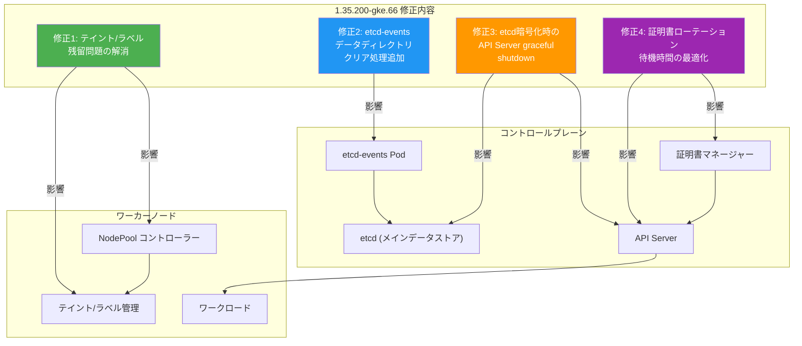

# Google Distributed Cloud (software only) for bare metal: バージョン 1.35.200-gke.66 リリース

**リリース日**: 2026-06-16

**サービス**: Google Distributed Cloud (software only) for bare metal

**機能**: バージョン 1.35.200-gke.66 パッチリリース (バグ修正)

**ステータス**: GA (一般提供)

[このアップデートのインフォグラフィックを見る](https://takech9203.github.io/google-cloud-news-summary/20260616-google-distributed-cloud-bare-metal-1-35-200.html)

## 概要

Google Distributed Cloud (software only) for bare metal 1.35.200-gke.66 がダウンロード可能になりました。本バージョンは Kubernetes v1.35.3-gke.400 上で動作し、前回のパッチリリース (1.35.100-gke.72) から約 4 週間後のリリースとなります。

本リリースは主にバグ修正に焦点を当てたパッチリリースであり、etcd 関連の安定性向上、ノードプール更新時の信頼性改善、コントロールプレーン操作時のダウンタイム削減が含まれています。特に、etcd 暗号化の有効化/更新時やコントロールプレーン証明書ローテーション時に発生していた一時的なサービス中断の問題が解決されています。

リリース後、GKE On-Prem API クライアント (Google Cloud コンソール、gcloud CLI、Terraform) でのインストールまたはアップグレードが利用可能になるまで、約 7 ~ 14 日かかります。

**アップデート前の課題**

以前のバージョンでは、以下のような問題が存在していました。

- ノードプール更新中に一時的な障害が発生すると、ワーカーノード上のテイントやラベルが永続的に残留 (ストランド) してしまい、NodePool カスタムリソースの仕様から削除しても反映されなかった
- etcd-events Pod がマシン初期化フェーズ中に古いデータディレクトリを読み込み、古いメンバー ID でクラスタに再参加しようとして無限リトライループに陥っていた
- etcd 暗号化の有効化・更新時に API サーバーが突然終了し、最大 5 分間の接続タイムアウトが発生していた
- コントロールプレーン証明書ローテーションや etcd 暗号化更新時に、インストーラーがコントロールプレーンノードあたり 3 分間停滞していた

**アップデート後の改善**

今回のアップデートにより以下が改善されました。

- ノードプール更新時の一時的な障害がテイント/ラベルの永続的な残留を引き起こさなくなった
- etcd-events のデータディレクトリが障害時に適切にクリアされ、kubeadm-reset にリトライロジックが追加された
- etcd 暗号化操作時の API サーバーの突然の終了が修正され、ワークロードへの影響が排除された
- コントロールプレーン操作時の 3 分間の停滞が解消され、ノードの Unknown ステータスや 503 エラーが防止された

## アーキテクチャ図



この図は、1.35.200-gke.66 で修正された 4 つの主要バグとそれぞれが影響するコンポーネントの関係を示しています。各修正はコントロールプレーンおよびワーカーノードの安定性向上に直接貢献しています。

## サービスアップデートの詳細

### 主要機能

1. **ノードプールテイント/ラベル残留問題の修正**
   - ノードプール更新中の一時的または部分的な障害が発生した場合でも、ワーカーノード上のテイントやラベルが永続的に残留しなくなった
   - NodePool カスタムリソースの仕様からテイント/ラベルを削除すると、確実にワーカーノードに反映されるようになった
   - ノードのスケジューリング動作が意図しない状態で固定されることがなくなり、運用の信頼性が向上

2. **etcd-events Pod の起動時データディレクトリ問題の修正**
   - マシン初期化フェーズで etcd-events Pod が古いデータディレクトリを読み込む問題を解決
   - 障害時に `/var/lib/etcd-events` ディレクトリが適切にクリアされるようになった
   - kubeadm-reset に一時的な API エラーに対するリトライロジックが追加され、回復力が向上
   - 古いメンバー ID でクラスタに再参加しようとする無限リトライループが解消

3. **etcd 暗号化更新時の API サーバー安定性向上**
   - etcd 暗号化の有効化・更新時に API サーバーが突然終了する問題を修正
   - 以前は最大 5 分間の接続タイムアウトやワークロード障害が発生していたが、これが解消
   - API サーバーのグレースフルシャットダウンが適切に行われるようになった

4. **コントロールプレーン証明書ローテーション時の停滞解消**
   - 証明書ローテーションや etcd 暗号化更新時にインストーラーがノードあたり 3 分間停滞する問題を修正
   - ノードが一時的に Unknown ステータスを報告することがなくなった
   - 503 Service Unavailable や ImagePullBackOff エラーなどの一時的なルーティング障害が防止された

5. **セキュリティ脆弱性の修正**
   - 脆弱性修正一覧に記載された脆弱性が修正された

## 技術仕様

### バージョン情報

| 項目 | 詳細 |
|------|------|
| リリースバージョン | 1.35.200-gke.66 |
| Kubernetes バージョン | v1.35.3-gke.400 |
| 前回パッチ | 1.35.100-gke.72 (2026-05-21) |
| 初期リリース | 1.35.0-gke.525 (2026-05-06) |
| cgroupsv2 | 必須 (cgroupsv1 は非サポート) |
| containerd バージョン | 2.1 |
| Ansible バージョン | 2.18 (Python 3.9 必須) |

### 影響を受けるコンポーネント

| コンポーネント | 修正内容 | 影響範囲 |
|------|------|------|
| NodePool コントローラー | テイント/ラベル残留の修正 | ワーカーノード |
| etcd-events Pod | データディレクトリクリア + リトライ追加 | コントロールプレーン |
| API Server | etcd 暗号化時のグレースフル停止 | クラスタ全体 |
| インストーラー | 証明書ローテーション待機ロジック改善 | コントロールプレーン |

## 設定方法

### 前提条件

1. 既存の Google Distributed Cloud (bare metal) 1.35.x クラスタが稼働していること
2. 管理ワークステーションに bmctl がインストールされていること
3. OS が cgroupsv2 を使用していること (RHEL 7/8 の場合は手動設定が必要)
4. ターゲットノードに Python 3.9 以上がインストールされていること (Ansible 2.18 要件)
5. サードパーティストレージベンダー使用時は、本リリースとの互換性確認済みであること

### 手順

#### ステップ 1: リリースの利用可能性を確認

```bash
# GKE On-Prem API 経由での利用は、リリース後 7-14 日後に可能
# bmctl 直接ダウンロードの場合は即座に利用可能
bmctl version
```

リリース直後は bmctl による直接ダウンロードのみ利用可能です。GKE On-Prem API クライアント (Google Cloud コンソール、gcloud CLI、Terraform) 経由でのアップグレードは 7 ~ 14 日後に有効になります。

#### ステップ 2: クラスタのアップグレード

```bash
# 管理ワークステーションから bmctl を使用してアップグレード
bmctl upgrade cluster -c CLUSTER_NAME \
  --kubeconfig ADMIN_KUBECONFIG
```

アップグレードはコントロールプレーンノード、ワーカーノードの順に実行されます。

#### ステップ 3: アップグレード完了の確認

```bash
# クラスタのバージョンを確認
kubectl get cluster CLUSTER_NAME -n CLUSTER_NAMESPACE \
  -o jsonpath='{.status.anthosBareMetalVersion}'

# ノードのステータスを確認
kubectl get nodes -o wide
```

## メリット

### ビジネス面

- **サービス可用性の向上**: etcd 暗号化操作時の最大 5 分間のダウンタイムが解消され、SLA 達成率が向上
- **運用コストの削減**: ノードプールのテイント/ラベル残留問題の手動修復が不要になり、運用者の負担が軽減
- **メンテナンスウィンドウの短縮**: 証明書ローテーション時の 3 分/ノードの停滞が解消され、計画メンテナンスの所要時間が短縮

### 技術面

- **etcd クラスタの回復力向上**: etcd-events Pod の起動時問題が修正され、コントロールプレーンの自動回復が確実になった
- **API サーバーの安定性向上**: 暗号化操作時のグレースフルシャットダウンにより、クライアント接続の中断が最小化
- **ノード管理の信頼性向上**: テイント/ラベルの整合性が保証され、Pod スケジューリングが意図通りに動作

## デメリット・制約事項

### 制限事項

- GKE On-Prem API クライアント経由でのアップグレードはリリース後 7 ~ 14 日間利用不可
- cgroupsv1 を使用している環境ではアップグレード不可 (1.35 系の要件)
- RHEL 7/8 使用時は事前に cgroupsv2 への移行が必要
- ターゲットノードに Python 3.9 以上が必要 (Ansible 2.18 要件)

### 考慮すべき点

- アップグレード前にサードパーティストレージベンダーとの互換性を確認すること
- アップグレード中はワークロードの再配置が発生するため、計画的なメンテナンスウィンドウでの実施を推奨
- マルチクラスタ環境では、管理クラスタとユーザークラスタのバージョン互換性に注意
- 本リリースは 1.35.100-gke.72 からのインプレースアップグレードをサポート

## ユースケース

### ユースケース 1: 大規模ノードプール運用環境

**シナリオ**: 数十台のワーカーノードを持つクラスタで、ノードプールのテイント/ラベルを頻繁に更新する運用を行っている環境。以前は一時的なネットワーク障害などにより更新が部分的に失敗すると、一部ノードにテイントが残留し、Pod が意図しないノードにスケジュールされる問題が発生していた。

**実装例**:
```yaml
apiVersion: baremetal.cluster.gke.io/v1
kind: NodePool
metadata:
  name: gpu-pool
  namespace: cluster-prod
spec:
  clusterName: prod-cluster
  nodes:
  - address: 10.0.1.10
  - address: 10.0.1.11
  taints:
  - key: nvidia.com/gpu
    value: "true"
    effect: NoSchedule
```

**効果**: テイント/ラベルの更新が障害に対して堅牢になり、NodePool カスタムリソースの宣言的な状態が常にノードに正確に反映されるようになる。

### ユースケース 2: 高可用性が求められるコントロールプレーン運用

**シナリオ**: 金融機関や通信事業者など、コントロールプレーンの高可用性が厳しく求められる環境で、定期的な証明書ローテーションや etcd 暗号化ポリシーの更新を行う必要がある。以前はこれらの操作時に API サーバーの中断やノードの Unknown ステータスが発生していた。

**効果**: 証明書ローテーションや暗号化更新時のダウンタイムが大幅に削減され、メンテナンスウィンドウの短縮とサービスレベル目標の達成が容易になる。コントロールプレーンノードが 3 台の構成であれば、以前は合計 9 分以上の停滞が発生していたが、これが解消される。

## 料金

Google Distributed Cloud (software only) for bare metal の料金は、クラスタ内の vCPU 数に基づいて課金されます。本パッチリリースによる追加料金は発生しません。

### 料金例

| 構成 | 月額料金 (概算) |
|--------|-----------------|
| GDC (software only) for bare metal - Standard エディション | vCPU あたりの料金が適用 |
| GDC (software only) for bare metal - Enterprise エディション | vCPU あたりの料金が適用 (追加機能含む) |

詳細な料金については Google Cloud の公式料金ページを参照してください。

## 利用可能リージョン

Google Distributed Cloud (software only) for bare metal はオンプレミス環境で動作するため、リージョンの制約はありません。ただし、GKE On-Prem API を使用したクラスタ管理には、フリート管理が利用可能な Google Cloud リージョンが必要です。

## 関連サービス・機能

- **GKE Enterprise**: Google Distributed Cloud は GKE Enterprise の一部として提供され、マルチクラスタ管理、セキュリティポリシー、オブザーバビリティなどの機能を利用可能
- **Config Sync**: クラスタ設定の GitOps ベースの管理を実現し、複数クラスタへの一貫した設定適用が可能
- **Anthos Service Mesh / Cloud Service Mesh**: サービスメッシュによるトラフィック管理、セキュリティ、オブザーバビリティの提供
- **Google Cloud Operations Suite**: クラスタのモニタリング、ロギング、アラート機能の提供
- **Binary Authorization**: コンテナイメージのデプロイポリシーの適用

## 参考リンク

- [インフォグラフィック](https://takech9203.github.io/google-cloud-news-summary/20260616-google-distributed-cloud-bare-metal-1-35-200.html)
- [公式リリースノート](https://cloud.google.com/release-notes#June_16_2026)
- [Google Distributed Cloud for bare metal リリースノート](https://cloud.google.com/kubernetes-engine/distributed-cloud/bare-metal/docs/release-notes)
- [クラスタのアップグレード手順](https://cloud.google.com/kubernetes-engine/distributed-cloud/bare-metal/docs/how-to/upgrade)
- [脆弱性修正一覧](https://cloud.google.com/kubernetes-engine/distributed-cloud/bare-metal/docs/vulnerabilities)
- [バージョン履歴](https://cloud.google.com/kubernetes-engine/distributed-cloud/bare-metal/docs/version-history)
- [料金ページ](https://cloud.google.com/kubernetes-engine/distributed-cloud/bare-metal/pricing)

## まとめ

Google Distributed Cloud (software only) for bare metal 1.35.200-gke.66 は、コントロールプレーンとワーカーノードの安定性を大幅に向上させるパッチリリースです。特に etcd 暗号化操作時の API サーバー中断、証明書ローテーション時の停滞、ノードプール更新時のテイント/ラベル残留という 3 つの重要な運用課題が解決されています。1.35.x を運用中の環境では、計画的なメンテナンスウィンドウ内での早期アップグレードを推奨します。

---

**タグ**: #GoogleDistributedCloud #GDC #BareMetal #Kubernetes #etcd #ControlPlane #PatchRelease #BugFix #OnPremise #GKEEnterprise
