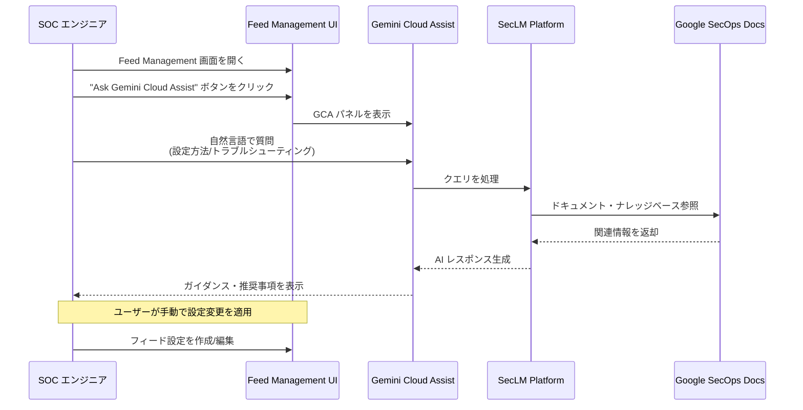

# Google SecOps SIEM: Feed Management に Gemini Cloud Assist を統合

**リリース日**: 2026-06-16

**サービス**: Google SecOps SIEM

**機能**: Ask Gemini Cloud Assist in Feed Management

**ステータス**: Feature (Spotlight Feature)

[このアップデートのインフォグラフィックを見る](https://takech9203.github.io/google-cloud-news-summary/20260616-google-secops-siem-gemini-cloud-assist-feed-management.html)

## 概要

Google SecOps SIEM の Feed Management インターフェースに Gemini Cloud Assist (GCA) が直接統合されました。これにより、セキュリティアナリストやSOCエンジニアは、データフィードの作成、セットアップ、トラブルシューティングにおいて、AI アシスタントによるリアルタイムのガイダンスを受けることが可能になります。

Feed Management は Google SecOps におけるデータ取り込みの中核機能であり、Cloud Storage、Amazon S3、サードパーティ API、Webhook など多様なソースからのログデータ取り込みを管理します。今回のアップデートでは、この複雑なフィード設定プロセスに対して、Gemini Cloud Assist が自然言語でのサポートを提供し、セットアップのハードルを大幅に引き下げます。

対象ユーザーは、Google SecOps の Feed Management を使用してデータソースの設定・管理を行うセキュリティ運用チーム、SOC エンジニア、およびシステム管理者です。

**アップデート前の課題**

- フィード作成時に各ソースタイプ固有の前提条件や認証設定を公式ドキュメントから個別に確認する必要があった
- 取り込みエラー（認証エラー、フォーマットエラーなど）のトラブルシューティングに時間がかかり、ドキュメント検索やサポート問い合わせが必要だった
- 新しいログソースの追加時に、対応するソースタイプ・ログタイプの組み合わせや設定パラメータの理解に学習コストが発生していた

**アップデート後の改善**

- Feed Management 画面内で「Ask Gemini Cloud Assist」ボタンから即座に AI ガイダンスを取得可能になった
- フィード設定手順、前提条件、認証要件について自然言語で質問し、コンテキストに応じた回答を得られるようになった
- 一般的なセットアップエラーの原因特定と解決策の提案がその場で受けられるようになった

## アーキテクチャ図

この図は、ユーザーが Feed Management 画面から Gemini Cloud Assist パネルを呼び出し、AI によるガイダンスを受けた後、手動で設定を適用するまでのフローを示しています。

## サービスアップデートの詳細

### 主要機能

1. **Ask Gemini Cloud Assist ボタン**
   - Feed Management インターフェースに新しく追加されたアクセスポイント
   - クリックすると Gemini Cloud Assist パネルが画面内に表示される
   - フィード作成・編集・モニタリングの各画面から利用可能

2. **データフィードの設定ガイダンス**
   - 各ソースタイプ（Cloud Storage V2、Amazon S3 V2、サードパーティ API、Webhook など）に応じた設定手順の案内
   - ログタイプの選択に関するアドバイス
   - 認証設定（サービスアカウント、OAuth、API キーなど）に関する具体的な指示

3. **取り込み前提条件の説明**
   - 各ログソースに必要なネットワーク設定や権限設定の案内
   - VPC Service Controls 環境での追加設定要件の説明
   - サービスアカウントへの適切な権限付与手順のガイダンス

4. **トラブルシューティング支援**
   - フィードステータス（Active、Failed、Archived など）に基づくエラー原因の特定
   - 一般的な設定ミス（認証情報の誤り、パス指定エラーなど）の解決策提案
   - 取り込みレイテンシや重複データに関する問題への対応

## 技術仕様

### Gemini Cloud Assist 統合の詳細

| 項目 | 詳細 |
|------|------|
| 基盤モデル | SecLM Platform (セキュリティ特化 LLM) |
| データ処理 | グローバルエンドポイント (Vertex AI) |
| 対応ソースタイプ | Cloud Storage V2、Amazon S3 V2、Amazon SQS V2、Azure Blob Storage V2、Third-party API、Webhook、Google Cloud Pub/Sub、Amazon Data Firehose |
| 動作モード | アドバイザリーのみ（設定変更は手動） |
| データガバナンス | Gemini for Google Cloud データガバナンスポリシーに準拠 |

### 重要な制約

Gemini Cloud Assist は推奨事項の提供のみを行い、実際の設定変更は実行しません。ユーザーは提案された内容を確認した上で、手動でフィード設定の作成・編集・削除を行う必要があります。

## 設定方法

### 前提条件

1. Google SecOps インスタンスへのアクセス権限
2. Gemini Cloud Assist が有効化されていること（組織レベルでの有効化が必要）
3. Feed Management への適切な IAM 権限

### 手順

#### ステップ 1: Feed Management 画面にアクセス

Google SecOps コンソールのメニューから **SIEM Settings > Feeds** に移動します。

#### ステップ 2: Gemini Cloud Assist を起動

Feed Management 画面内の **「Ask Gemini Cloud Assist」** ボタンをクリックします。GCA パネルが画面右側に表示されます。

#### ステップ 3: 質問を入力

自然言語で質問を入力します。例:
- 「Amazon S3 からログを取り込むにはどうすればよいですか？」
- 「フィードのステータスが Failed になっています。原因は何ですか？」
- 「Webhook フィードの認証設定方法を教えてください」

#### ステップ 4: ガイダンスに基づいて設定を適用

GCA からの推奨事項を確認し、手動で必要な設定変更を Feed Management UI または Feed Management API から適用します。

## メリット

### ビジネス面

- **オンボーディング時間の短縮**: 新規メンバーが Feed Management の設定方法を習得するまでの時間を大幅に削減
- **サポートチケットの削減**: 一般的な設定問題を自己解決できるため、サポートへの問い合わせが減少
- **セキュリティ監視の迅速な立ち上げ**: 新しいデータソースの追加が迅速化され、脅威検出の網羅性が早期に向上

### 技術面

- **コンテキスト認識型サポート**: Feed Management 画面内に統合されているため、現在の作業コンテキストに即した回答が得られる
- **SecLM ベースの回答品質**: セキュリティ特化のナレッジベースにより、一般的な LLM より正確なガイダンスを提供
- **マルチソース対応**: 12以上のソースタイプに対応した設定ガイダンスを一元的に取得可能

## デメリット・制約事項

### 制限事項

- Gemini Cloud Assist は設定の**自動適用を行わない** - すべての変更はユーザーが手動で実施する必要がある
- AI による推奨事項は参考情報であり、環境固有の要件に対して常に正確とは限らない
- グローバルエンドポイントでのデータ処理となるため、データレジデンシー要件が厳しい環境では考慮が必要

### 考慮すべき点

- Gemini Cloud Assist の利用には組織レベルでの有効化が必要であり、個別ユーザーでの有効化はできない
- SecLM Platform のナレッジベースは定期的に更新されるが、最新のリリース直後は情報が反映されていない場合がある
- SIEM スタンドアロンプラットフォームを使用している場合、Content Hub 経由でのフィード設定には対応していない可能性がある

## ユースケース

### ユースケース 1: 新規データソースの追加

**シナリオ**: SOC チームが新たに Azure AD のログを Google SecOps に取り込む必要がある。担当エンジニアは Azure AD のフィード設定経験がない。

**効果**: Feed Management 画面で GCA に「Azure AD のログを取り込むにはどのソースタイプを選べばよいですか？」と質問することで、Third-party API ソースタイプの選択、必要な認証情報（テナント ID、クライアント ID、シークレット）、および Microsoft Graph API の権限設定について即座にガイダンスを受けられる。

### ユースケース 2: フィード取り込みエラーの解決

**シナリオ**: Cloud Storage V2 フィードのステータスが「Failed」に変わり、データ取り込みが停止している。

**効果**: GCA に「Cloud Storage V2 フィードが Failed ステータスになりました。何を確認すべきですか？」と質問することで、サービスアカウントの権限確認、バケット URI の形式確認、VPC Service Controls の設定確認など、段階的なトラブルシューティング手順が提示される。

### ユースケース 3: BYOP（Bring Your Own Project）移行後のフィード再作成

**シナリオ**: Google Cloud プロジェクトの変更に伴い、既存のフィードが読み取り専用になり再作成が必要。

**効果**: GCA に移行後のフィード再作成手順を質問することで、Max File Age の適切な設定値、重複データの防止方法、影響を受けるコネクタ（AMAZON_S3_V2、GOOGLE_CLOUD_STORAGE_V2 など）の再設定手順について包括的なガイダンスを受けられる。

## 関連サービス・機能

- **Gemini in Google SecOps**: YARA-L ルール生成、UDM 検索クエリ生成、脅威インテリジェンスなど、SecOps 全体での AI 支援機能群
- **Gemini Cloud Assist**: Google Cloud 全体の運用管理を支援する AI アシスタント（トラブルシューティング、コスト最適化、インフラ設計）
- **Google SecOps Feed Management API**: プログラムによるフィード作成・管理のための REST API
- **Bindplane Agent**: オンプレミス環境からのログ収集に使用するマネージドエージェント
- **Google SecOps Health Hub**: データソースとパーサーの運用状態を監視するダッシュボード

## 参考リンク

- [インフォグラフィック](https://takech9203.github.io/google-cloud-news-summary/20260616-google-secops-siem-gemini-cloud-assist-feed-management.html)
- [Feed Management Overview](https://docs.cloud.google.com/chronicle/docs/administration/feed-management-overview)
- [Create and manage feeds using the feed management UI](https://docs.cloud.google.com/chronicle/docs/administration/feed-management)
- [Gemini in Google SecOps](https://docs.cloud.google.com/chronicle/docs/secops/gemini-secops)
- [Gemini Cloud Assist](https://cloud.google.com/products/gemini/cloud-assist)
- [Google SecOps Data Ingestion Overview](https://docs.cloud.google.com/chronicle/docs/secops/secops-ingestion)

## まとめ

今回のアップデートは、Google SecOps の Feed Management における設定・運用の複雑さを AI で補完する重要な進化です。Gemini Cloud Assist の統合により、セキュリティチームはデータフィードの設定やトラブルシューティングにかかる時間を削減し、より迅速にセキュリティ監視体制を構築・維持できるようになります。Google SecOps を使用している組織は、Gemini Cloud Assist が有効化されていることを確認し、SOC チームに新機能の活用を推奨することをお勧めします。

---

**タグ**: #GoogleSecOps #SIEM #GeminiCloudAssist #FeedManagement #DataIngestion #SecurityOperations #AI #SecLM
