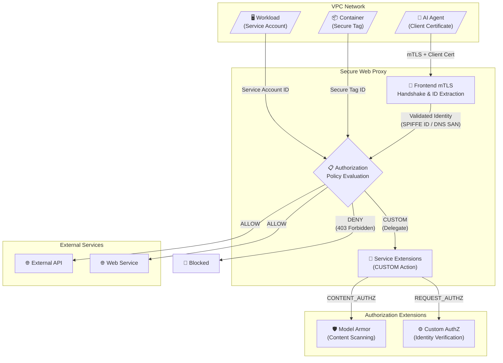

# Secure Web Proxy: Authorization Policies と Frontend mTLS 統合

**リリース日**: 2026-06-16

**サービス**: Secure Web Proxy

**機能**: Authorization Policies / Frontend mTLS Integration

**ステータス**: Preview

📊 [このアップデートのインフォグラフィックを見る](https://takech9203.github.io/google-cloud-news-summary/20260616-secure-web-proxy-authorization-policies-mtls.html)

## 概要

Google Cloud は Secure Web Proxy に 2 つの新機能を Preview として追加した。1 つ目は「Authorization Policies (認可ポリシー)」で、アウトバウンドトラフィックに対して ID ベースおよびコンテンツベースのアクセス制御を実現する。2 つ目は「Frontend mTLS 統合」で、クライアント証明書による相互 TLS 認証を通じてワークロードの ID を暗号的に検証し、きめ細かなアクセス制御を可能にする。

これらの機能により、Secure Web Proxy は従来の IP ベース・宛先ベースのゲートウェイセキュリティポリシーに加え、ゼロトラストアーキテクチャに適合した ID 中心のセキュリティモデルを提供する。特に AI エージェントやマイクロサービスが外部サービスにアクセスする際の認可制御において、Service Extensions との連携による柔軟な認可委譲が可能となる。

**アップデート前の課題**

- ゲートウェイセキュリティポリシーでは IP アドレス、サービスアカウント、セキュアタグ、宛先ホスト名に基づくフィルタリングのみ可能で、リクエストコンテンツに基づく制御ができなかった
- 外部認可エンジンへの認可判断の委譲 (Service Extensions) がサポートされていなかった
- クライアント証明書による暗号的な ID 検証を Secure Web Proxy のフロントエンドで実施する手段がなく、ゼロトラストモデルの完全な実装が困難だった
- Secure Web Proxy、Application Load Balancer、Cloud Service Mesh で異なるポリシー API を使用する必要があり、一貫した管理が難しかった

**アップデート後の改善**

- 統一された AuthzPolicy API により、Secure Web Proxy のトラフィック認可を Application Load Balancer や Cloud Service Mesh と同じインターフェースで管理可能になった
- Service Extensions を使用して認可判断を外部エンジン (カスタムロジック、Model Armor、IAP) に委譲可能になった
- Frontend mTLS により、クライアント証明書の SPIFFE ID や DNS SAN に基づくきめ細かなアクセス制御が可能になった
- リクエストレベルの認可 (ヘッダー、ID) とコンテンツスキャン (機密データ保護、脅威検出) の両方をサポート

## アーキテクチャ図



Secure Web Proxy の Authorization Policies と Frontend mTLS の連携アーキテクチャ。ワークロードは mTLS クライアント証明書、サービスアカウント、またはセキュアタグによって識別され、認可ポリシーが ALLOW/DENY/CUSTOM アクションを評価する。CUSTOM アクションの場合、Service Extensions を通じて外部認可エンジンに判断が委譲される。

## サービスアップデートの詳細

### 主要機能

1. **Authorization Policies (認可ポリシー)**
   - 統一された AuthzPolicy API を使用し、ソース、宛先、リクエスト属性に基づくアクセス制御ルールを定義
   - ALLOW、DENY、CUSTOM の 3 つのアクションをサポート
   - ALLOW: 条件に一致するリクエストを外部宛先に転送
   - DENY: 条件に一致するリクエストを 403 Forbidden で拒否
   - CUSTOM: Service Extensions に認可判断を委譲
   - Gateway リソースにアタッチして、アウトバウンドトラフィックのセキュリティ境界を定義

2. **Frontend mTLS 統合**
   - クライアントが Secure Web Proxy に接続する際に相互 TLS ハンドシェイクを実施
   - TrustConfig リソースを使用してクライアント証明書を検証
   - 検証済み証明書から URI_SAN (SPIFFE ID) や DNS SAN などの ID 属性を抽出
   - 抽出した ID を Authorization Policies で使用し、きめ細かなアクセス制御を実施
   - Explicit Proxy Routing モードでのみサポート

3. **Service Extensions による認可委譲**
   - REQUEST_AUTHZ プロファイル: リクエストメタデータとヘッダーに基づく認可判断を委譲 (ID 検証、権限確認)
   - CONTENT_AUTHZ プロファイル: リクエストのデータペイロードに基づく認可判断を委譲 (機密データ保護、脅威検出、Model Armor 連携)
   - FQDN ベースの外部認可エンジンをサポート
   - failOpen 設定により、拡張機能のタイムアウト時の動作を制御可能

## 技術仕様

### Authorization Policies の構成要素

| 項目 | 詳細 |
|------|------|
| API | AuthzPolicy (network-security) |
| ポリシープロファイル | REQUEST_AUTHZ / CONTENT_AUTHZ |
| アクション | ALLOW / DENY / CUSTOM |
| ソース条件 | サービスアカウント、セキュアタグ、mTLS 証明書の principals |
| 宛先条件 | ホスト名 (exact)、パス (exact / prefix) |
| 前提条件 | TLS インスペクションの有効化が必須 |

### Frontend mTLS の構成要素

| 項目 | 詳細 |
|------|------|
| 認証モード | REJECT_INVALID / ALLOW_INVALID_OR_MISSING_CLIENT_CERT |
| 証明書リソース | TrustConfig (Certificate Manager) |
| ポリシーリソース | ServerTlsPolicy (network-security) |
| サポートする ID | SPIFFE ID (URI_SAN)、DNS SAN |
| デプロイモード | Explicit Proxy Routing モードのみ |

### 認可ポリシーの YAML 設定例 (mTLS ベース)

```yaml
name: test-authz-policy-mtls
target:
  resources:
    - "projects/PROJECT_ID/locations/LOCATION/gateways/swp1"
  policyProfile: REQUEST_AUTHZ
httpRules:
  - to:
      operations:
        - hosts:
            - exact: "example.com"
          paths:
            - exact: "/mcp"
    from:
      sources:
        - principals:
            - principalSelector: CLIENT_CERT_URI_SAN
              principal:
                exact: "spiffe://PROJECT_ID.global.123.workload.id.goog/ns/ns1/sa/hellomcp"
    action: ALLOW
```

## 設定方法

### 前提条件

1. Secure Web Proxy インスタンスが Explicit Proxy Routing モードでデプロイ済みであること
2. TLS インスペクションが有効化されていること
3. 以下の IAM ロールが付与されていること:
   - Certificate Manager Owner (`roles/certificatemanager.owner`)
   - Compute Network Admin (`roles/compute.networkAdmin`)
   - Compute Security Admin (`roles/compute.securityAdmin`)
   - Networksecurity Admin (`roles/networksecurity.admin`)

### 手順

#### ステップ 1: ルート証明書と中間証明書の作成

```bash
# OpenSSL 設定ファイルの作成
cat > example.cnf << EOF
[req]
distinguished_name = empty_distinguished_name
[empty_distinguished_name]
[ca_exts]
basicConstraints=critical,CA:TRUE
keyUsage=keyCertSign
extendedKeyUsage=clientAuth
EOF

# ルート証明書の作成
openssl req -x509 \
  -new -sha256 -newkey rsa:2048 -nodes \
  -days 3650 -subj '/CN=root' \
  -config example.cnf \
  -extensions ca_exts \
  -keyout root.key -out root.cert

# 中間証明書の作成
openssl req -new \
  -sha256 -newkey rsa:2048 -nodes \
  -subj '/CN=int' \
  -config example.cnf \
  -extensions ca_exts \
  -keyout int.key -out int.req

openssl x509 -req \
  -CAkey root.key -CA root.cert \
  -set_serial 1 -days 3650 \
  -extfile example.cnf \
  -extensions ca_exts \
  -in int.req -out int.cert
```

本番環境では Certificate Authority Service (CAS) の使用を推奨。

#### ステップ 2: TrustConfig リソースの作成

```bash
# trust_config.yaml を作成しインポート
gcloud certificate-manager trust-configs import TRUST_CONFIG_NAME \
  --source=trust_config.yaml \
  --location=LOCATION
```

#### ステップ 3: ServerTlsPolicy リソースの作成

```yaml
# server_tls_policy.yaml
name: SERVER_TLS_POLICY_NAME
mtlsPolicy:
  clientValidationMode: REJECT_INVALID
  clientValidationTrustConfig: projects/PROJECT_ID/locations/LOCATION/trustConfigs/TRUST_CONFIG_NAME
```

```bash
gcloud network-security server-tls-policies import SERVER_TLS_POLICY_NAME \
  --source=server_tls_policy.yaml \
  --location=LOCATION
```

#### ステップ 4: ServerTlsPolicy を Secure Web Proxy に関連付け

```bash
echo "serverTlsPolicy: //networksecurity.googleapis.com/projects/PROJECT_ID/locations/LOCATION/serverTlsPolicies/SERVER_TLS_POLICY_NAME" >> gateway.yaml

gcloud network-services gateways import GATEWAY_NAME \
  --source=gateway.yaml \
  --location=LOCATION
```

#### ステップ 5: Authorization Policy の作成とインポート

```bash
gcloud beta network-security authz-policies import my-authz-policy \
  --source=authz-policy.yaml \
  --location=LOCATION
```

## メリット

### ビジネス面

- **ゼロトラスト戦略の実現**: IP ベースではなく ID ベースの認可により、クラウドネイティブなゼロトラストセキュリティを実装可能
- **統合的なポリシー管理**: AuthzPolicy API により、Secure Web Proxy、Application Load Balancer、Cloud Service Mesh の認可を統一的に管理でき、運用コストを削減
- **コンプライアンス強化**: コンテンツスキャンと ID 検証の組み合わせにより、データ漏洩防止や規制要件への対応が容易

### 技術面

- **暗号的な ID 検証**: mTLS ハンドシェイクによりクライアント ID を暗号的に検証し、なりすましを防止
- **柔軟な認可委譲**: Service Extensions により、カスタム認可ロジックや Model Armor によるコンテンツスキャンに判断を委譲可能
- **SPIFFE 準拠の ID**: SPIFFE ID (URI_SAN) をサポートし、サービスメッシュやワークロード ID 管理との統合が容易

## デメリット・制約事項

### 制限事項

- Frontend mTLS は Explicit Proxy Routing モードでのみサポート (Next Hop モード、PSC モードは非対応)
- Authorization Policies は URL リスト (UrlList) や正規表現によるマッチングをサポートしない
- Authorization Policies を適用する場合、TLS インスペクションの有効化が必須
- 同一ゲートウェイで Authorization Policies と Gateway Security Policies を同時に使用できない (排他的)
- Authorization Extensions は FQDN ベースのターゲットのみサポート
- Preview ステータスのため、「Pre-GA Offerings Terms」が適用され、サポートが限定的

### 考慮すべき点

- 既存の Gateway Security Policies から Authorization Policies への移行時、URL リストのサポートがないため事前に代替手段の検討が必要
- mTLS を導入する場合、証明書のライフサイクル管理 (発行、更新、失効) の運用設計が必要
- Service Extensions への認可委譲では、failOpen の設定がセキュリティと可用性のトレードオフとなる

## ユースケース

### ユースケース 1: AI エージェントの外部 API アクセス制御

**シナリオ**: 複数の AI エージェントが外部 API にアクセスする環境で、各エージェントがアクセスできる宛先を SPIFFE ID に基づいて制御する。

**実装例**:
```yaml
name: agent-authz-policy
target:
  resources:
    - "projects/my-project/locations/us-central1/gateways/swp-agents"
  policyProfile: REQUEST_AUTHZ
httpRules:
  - to:
      operations:
        - hosts:
            - exact: "api.openai.com"
    from:
      sources:
        - principals:
            - principalSelector: CLIENT_CERT_URI_SAN
              principal:
                exact: "spiffe://my-project.global.123.workload.id.goog/ns/ai-agents/sa/chatbot"
    action: ALLOW
```

**効果**: 認証済みの AI エージェントのみが特定の外部 API にアクセス可能となり、不正なエージェントからの API 呼び出しを防止

### ユースケース 2: コンテンツスキャンによるデータ漏洩防止

**シナリオ**: アウトバウンドトラフィックに機密データが含まれていないか、Model Armor や Sensitive Data Protection と連携してスキャンする。

**効果**: Service Extensions (CONTENT_AUTHZ プロファイル) により、リクエストペイロードのディープインスペクションが可能となり、PII や機密データの外部流出を検知・ブロック

### ユースケース 3: マルチテナント環境でのテナント別アクセス制御

**シナリオ**: 複数のテナントが共有する GKE クラスタ内で、各テナントのワークロードがアクセスできる外部サービスをサービスアカウントやセキュアタグに基づいて制限する。

**効果**: テナントごとに異なる認可ポリシーを適用し、アイソレーションを確保しつつ統一されたプロキシインフラストラクチャを共有可能

## 料金

Secure Web Proxy の課金は以下の 2 つのメトリクスに基づく:

1. **データ処理量**: Secure Web Proxy が処理するデータ量に対する GB あたりの課金
2. **インスタンス稼働時間**: 作成・稼働中の Secure Web Proxy インスタンスごとの時間あたりの課金

Authorization Policies および Frontend mTLS 機能自体に追加料金は明記されていない。詳細は公式料金ページを参照。

## 関連サービス・機能

- **Certificate Manager**: Frontend mTLS で使用する TrustConfig (信頼アンカー) の管理に使用
- **Service Extensions**: 認可判断の外部委譲に使用。REQUEST_AUTHZ と CONTENT_AUTHZ の 2 つのプロファイルをサポート
- **Model Armor**: CONTENT_AUTHZ プロファイルを通じたコンテンツスキャン・脅威検出に使用
- **Cloud Service Mesh (CSM)**: 同じ AuthzPolicy API を共有し、インバウンド/East-West トラフィックの認可と統一的に管理可能
- **Application Load Balancer**: 同じ AuthzPolicy API を共有し、インバウンドトラフィックの認可と一貫したポリシー管理が可能
- **VPC Service Controls**: データ漏洩防止のため、Secure Web Proxy と組み合わせて使用可能
- **Certificate Authority Service (CAS)**: 本番環境での証明書発行・管理に推奨

## 参考リンク

- 📊 [インフォグラフィック](https://takech9203.github.io/google-cloud-news-summary/20260616-secure-web-proxy-authorization-policies-mtls.html)
- [公式リリースノート](https://docs.google.com/release-notes#June_16_2026)
- [Authorization Policies の概要](https://docs.cloud.google.com/secure-web-proxy/docs/policies-and-rules-overview#authorization-policies)
- [Authorization Policies のセットアップ](https://docs.cloud.google.com/secure-web-proxy/docs/setup-authz-policies)
- [Frontend mTLS の設定](https://docs.cloud.google.com/secure-web-proxy/docs/use-frontend-mtls-with-swp)
- [Service Extensions for SWP](https://docs.cloud.google.com/service-extensions/docs/configure-extensions-for-swp)
- [Secure Web Proxy の概要](https://docs.cloud.google.com/secure-web-proxy/docs/overview)
- [料金ページ](https://cloud.google.com/secure-web-proxy/pricing)

## まとめ

Secure Web Proxy の Authorization Policies と Frontend mTLS 統合により、Google Cloud のアウトバウンドトラフィック制御がゼロトラストモデルに大きく進化した。特に AI エージェントやマイクロサービスが外部リソースにアクセスする現代的なアーキテクチャにおいて、暗号的に検証された ID に基づくきめ細かなアクセス制御と、Service Extensions による柔軟な認可委譲は極めて有用である。現時点では Preview であるが、既存環境での評価を開始し、Gateway Security Policies からの移行計画を策定することを推奨する。

---

**タグ**: #SecureWebProxy #AuthorizationPolicies #mTLS #ZeroTrust #ServiceExtensions #NetworkSecurity #Egress #IdentityBasedAccess
