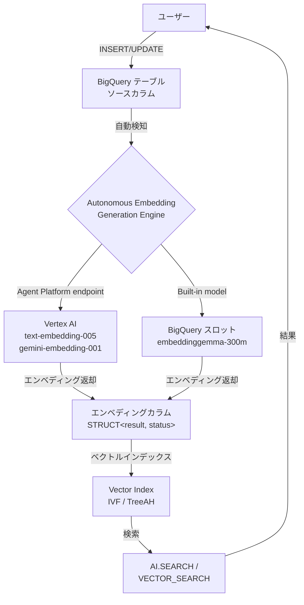

# BigQuery: Autonomous Embedding Generation (GA)

**リリース日**: 2026-06-17

**サービス**: BigQuery

**機能**: Autonomous Embedding Generation (自律的エンベディング生成)

**ステータス**: GA (一般提供開始)

[このアップデートのインフォグラフィックを見る](https://takech9203.github.io/google-cloud-news-summary/20260617-bigquery-autonomous-embedding-generation-ga.html)

## 概要

BigQuery の Autonomous Embedding Generation が一般提供 (GA) となりました。この機能により、`CREATE TABLE` または `ALTER TABLE` ステートメントを使用してテーブルを作成・変更する際に、自律的なエンベディング生成を有効化できます。BigQuery がソースカラムに基づいてエンベディングカラムを自動的に維持し、ソースカラムのデータが追加・変更されると、対応するエンベディングも自動的に生成・更新されます。

この機能は、RAG (Retrieval Augmented Generation) やセマンティック検索などの生成 AI アプリケーションにおいて、エンベディングの作成・管理・クエリを大幅に簡素化します。従来は外部パイプラインやバッチ処理を手動で構築する必要がありましたが、BigQuery がすべてを自動的に処理するようになりました。

対象ユーザーは、BigQuery でベクトル検索やセマンティック検索を活用したいデータエンジニア、ML エンジニア、およびアプリケーション開発者です。

**アップデート前の課題**

従来、BigQuery でエンベディングを管理するには多くの手動作業が必要でした。

- エンベディング生成のためのバッチパイプラインを外部で構築・維持する必要があった
- ソースデータが更新されるたびに、エンベディングの再生成を手動でトリガーする必要があった
- データの鮮度とエンベディングの同期を保つためのオーケストレーション層が必要だった
- エンベディング生成の失敗やリトライのハンドリングを自前で実装する必要があった

**アップデート後の改善**

今回の GA リリースにより、以下が実現されました。

- DDL (CREATE TABLE / ALTER TABLE) のみでエンベディング自動生成が設定可能になった
- ソースデータの変更を BigQuery が自動検知し、エンベディングを自動更新するため外部パイプラインが不要になった
- AI.SEARCH 関数との統合により、エンベディング列を意識せずにセマンティック検索が可能になった
- ビルトインモデル (embeddinggemma-300m) を使用すれば、Vertex AI の設定なしにスロットのみで動作可能になった
- Preview から GA へ移行したことで、本番ワークロードでの利用に適したサポートレベルが保証された

## アーキテクチャ図



BigQuery テーブルへのデータ挿入・更新をトリガーとして、Autonomous Embedding Generation Engine がエンベディングモデル (外部 Agent Platform エンドポイントまたはビルトインモデル) を呼び出し、エンベディングカラムを自動更新します。生成されたエンベディングはベクトルインデックスと組み合わせて高速なセマンティック検索に利用できます。

## サービスアップデートの詳細

### 主要機能

1. **DDL ベースの自動エンベディング生成**
   - `CREATE TABLE` で新規テーブル作成時にエンベディングカラムを定義可能
   - `ALTER TABLE ADD COLUMN` で既存テーブルにエンベディングカラムを追加可能
   - `GENERATED ALWAYS AS` 句と `AI.EMBED` 関数を使用して宣言的に定義

2. **自動同期メカニズム**
   - ソースカラムへのデータ追加・変更を BigQuery がバックグラウンドで自動検知
   - バックグラウンド DML ジョブとしてエンベディングが生成・更新される
   - 進捗状況を SQL クエリで確認可能

3. **複数エンベディングモデルのサポート**
   - Agent Platform エンドポイント: `text-embedding-005`, `text-multilingual-embedding-002`, `gemini-embedding-001`, `gemini-embedding-2-preview`
   - ビルトインモデル: `embeddinggemma-300m` (データが BigQuery 内に留まり、スロットのみで動作)

4. **AI.SEARCH との統合**
   - エンベディング列を直接意識せず、ソースカラム名を指定するだけでセマンティック検索が可能
   - ベクトルインデックスと自動連携して高速な近似最近傍検索を実現

## 技術仕様

### 対応モデル一覧

| モデル指定 | 出力次元数 | 最大トークン長 | 対応言語 | 課金 |
|------|------|------|------|------|
| `model => 'embeddinggemma-300m'` | 768 | 2048 tokens | 多言語 | BigQuery スロットのみ |
| `endpoint => 'text-embedding-005'` | 最大 768 | 2048 tokens | 英語 | Agent Platform 課金 |
| `endpoint => 'text-multilingual-embedding-002'` | 最大 768 | 2048 tokens | 多言語 | Agent Platform 課金 |
| `endpoint => 'gemini-embedding-001'` | 最大 3072 | 2048 tokens | 多言語 | Agent Platform 課金 |
| `endpoint => 'gemini-embedding-2-preview'` | 最大 3072 | 8192 tokens | 多言語 | Agent Platform 課金 |

### エンベディングカラムの構造

```sql
-- エンベディングカラムの型定義
EMBEDDING_COL_NAME STRUCT<result ARRAY<FLOAT64>, status STRING>
  GENERATED ALWAYS AS (
    AI.EMBED(
      STRING_COL,
      connection_id => 'PROJECT.LOCATION.CONNECTION',
      endpoint => 'text-embedding-005'
    )
  ) STORED OPTIONS (asynchronous = TRUE)
```

### 必要な IAM ロール

| ロール | 用途 |
|------|------|
| `roles/bigquery.connectionUser` | Connection リソースの使用 |
| `roles/bigquery.dataEditor` | テーブルの作成・変更 |
| `roles/aiplatform.user` | Connection のサービスアカウントに付与 (Agent Platform モデル使用時) |

## 設定方法

### 前提条件

1. Vertex AI API が有効化されていること (Agent Platform エンドポイント使用時)
2. Cloud Resource Connection が作成済みであること
3. Connection のサービスアカウントに `roles/aiplatform.user` が付与されていること

### 手順

#### ステップ 1: Connection の作成 (Agent Platform エンドポイント使用時)

```sql
-- BigQuery の Connection を作成 (コンソールまたは bq コマンドで実施)
-- 作成後、Connection のサービスアカウントに Vertex AI User ロールを付与
```

BigQuery コンソールまたは `bq` CLI で Cloud Resource Connection を作成し、自動的に作成されるサービスアカウントに `roles/aiplatform.user` を付与します。

#### ステップ 2: テーブルの作成 (新規テーブル)

```sql
CREATE TABLE mydataset.products (
  name STRING,
  description STRING,
  description_embedding STRUCT<result ARRAY<FLOAT64>, status STRING>
    GENERATED ALWAYS AS (
      AI.EMBED(
        description,
        connection_id => 'us.example_connection',
        endpoint => 'text-embedding-005'
      )
    ) STORED OPTIONS(asynchronous = TRUE)
);
```

`description` カラムの内容に基づいて、`description_embedding` カラムが自動生成されます。

#### ステップ 3: データの挿入

```sql
-- エンベディングカラムを指定せずにデータを挿入
INSERT INTO mydataset.products (name, description)
VALUES
  ('Lounger chair', 'A comfortable chair for relaxing in.'),
  ('Super slingers', 'An exciting board game for the whole family.');
```

エンベディングはバックグラウンドで自動生成されます。

#### ステップ 4: 生成状況の確認

```sql
SELECT
  COUNT(*) AS total_num_rows,
  COUNTIF(description_embedding IS NOT NULL
    AND description_embedding.status = '') AS total_num_generated_embeddings
FROM mydataset.products;
```

#### ステップ 5: セマンティック検索の実行

```sql
SELECT * FROM AI.SEARCH(
  TABLE mydataset.products,
  'description',
  'A really fun toy'
);
```

#### 既存テーブルへの追加

```sql
ALTER TABLE mydataset.existing_table
ADD COLUMN description_embedding STRUCT<result ARRAY<FLOAT64>, status STRING>
  GENERATED ALWAYS AS (
    AI.EMBED(
      description,
      connection_id => 'us.example_connection',
      endpoint => 'text-embedding-005'
    )
  ) STORED OPTIONS (asynchronous = TRUE);
```

#### ビルトインモデルを使用する場合

```sql
CREATE TABLE mydataset.products (
  name STRING,
  description STRING,
  description_embedding STRUCT<result ARRAY<FLOAT64>, status STRING>
    GENERATED ALWAYS AS (
      AI.EMBED(description, model => 'embeddinggemma-300m')
    ) STORED OPTIONS(asynchronous = TRUE)
);
```

ビルトインモデルの場合、Connection の設定は不要で、BigQuery スロットのみで動作します。

## メリット

### ビジネス面

- **運用コストの削減**: エンベディング生成パイプラインの構築・維持が不要となり、インフラ運用の負担が大幅に軽減される
- **データ鮮度の向上**: ソースデータの更新と同時にエンベディングが更新されるため、検索結果が常に最新の状態を反映する
- **Time to Market の短縮**: DDL のみでセマンティック検索機能を実装できるため、RAG アプリケーションの開発サイクルが短縮される

### 技術面

- **宣言的な定義**: SQL DDL でエンベディング生成を定義でき、ETL パイプラインのコードが不要
- **自動スケーリング**: BigQuery のバックグラウンドジョブとして実行されるため、データ量に応じた自動スケールが可能
- **モデル選択の柔軟性**: Agent Platform エンドポイント (高精度) とビルトインモデル (低コスト・データローカリティ) を用途に応じて選択可能
- **エコシステム統合**: Vector Index、AI.SEARCH、VECTOR_SEARCH との シームレスな統合

## デメリット・制約事項

### 制限事項

- テーブルあたり自動生成エンベディングカラムは最大 1 つのみ
- ソースカラムは STRING 型のみ対応 (他のデータ型は不可)
- エンベディングカラムへの直接書き込み (DML、ストリーミング、bq insert) は不可
- テーブルのコピー・クローン・スナップショットでは生成設定がコピーされない (データのみ)
- パーティション付きベクトルインデックスは作成不可
- カラムレベルのセキュリティポリシー (ポリシータグ等) は非対応

### 考慮すべき点

- 並行 DML 操作はエンベディング生成の遅延や一時的な失敗を引き起こす可能性がある (バッチでのデータ投入推奨)
- BigQuery Storage Write API 使用時はエンベディング生成開始までに遅延が発生する場合がある
- エンベディング生成カラムの存在は Google Cloud コンソール、`bq show`、`INFORMATION_SCHEMA.TABLES` の DDL フィールドからは確認不可
- スナップショットからのテーブル復元では、エンベディング生成設定は復元されない
- エンベディングカラム作成後はソースカラムの削除・リネームが不可 (エンベディングカラムを先に削除する必要あり)

## ユースケース

### ユースケース 1: EC サイトの商品セマンティック検索

**シナリオ**: 大規模 EC サイトで数百万件の商品説明テキストに対して、自然言語でのセマンティック検索を実装したい。商品情報は日々更新され、新商品も頻繁に追加される。

**実装例**:
```sql
-- 商品テーブルの作成
CREATE TABLE ecommerce.products (
  product_id STRING,
  name STRING,
  description STRING,
  description_embedding STRUCT<result ARRAY<FLOAT64>, status STRING>
    GENERATED ALWAYS AS (
      AI.EMBED(description,
        connection_id => 'us.my_connection',
        endpoint => 'text-multilingual-embedding-002')
    ) STORED OPTIONS(asynchronous = TRUE)
);

-- ベクトルインデックスの作成 (80% 以上のエンベディング生成後)
CREATE VECTOR INDEX product_search_idx
ON ecommerce.products(description_embedding)
OPTIONS(index_type = 'IVF');

-- セマンティック検索の実行
SELECT * FROM AI.SEARCH(
  TABLE ecommerce.products,
  'description',
  '防水で軽量なランニングシューズ',
  top_k => 20
);
```

**効果**: 新商品追加や商品説明の更新時に自動的にエンベディングが更新され、検索結果に即座に反映される。パイプライン管理のオーバーヘッドがゼロになる。

### ユースケース 2: 社内ナレッジベースの RAG システム

**シナリオ**: 社内ドキュメントを BigQuery に蓄積し、RAG パターンで社内チャットボットのコンテキストとして活用したい。

**実装例**:
```sql
-- ナレッジベーステーブルの作成 (ビルトインモデル使用)
CREATE TABLE knowledge.documents (
  doc_id STRING,
  title STRING,
  content STRING,
  content_embedding STRUCT<result ARRAY<FLOAT64>, status STRING>
    GENERATED ALWAYS AS (
      AI.EMBED(content, model => 'embeddinggemma-300m')
    ) STORED OPTIONS(asynchronous = TRUE)
);

-- 関連ドキュメントの検索
SELECT base.title, base.content, distance
FROM AI.SEARCH(
  TABLE knowledge.documents,
  'content',
  'クラウド移行のベストプラクティス',
  top_k => 5
);
```

**効果**: ビルトインモデルを使用することで、データが BigQuery 外に送信されずデータガバナンスを維持しつつ、Agent Platform の追加コストなしにセマンティック検索を実現できる。

### ユースケース 3: カスタマーサポートチケットの類似検索

**シナリオ**: 新規サポートチケットに対して過去の類似チケットを自動検索し、解決策の提案を行いたい。

**効果**: チケット登録と同時にエンベディングが生成されるため、リアルタイムに近い形で類似チケット検索が可能になり、初回応答時間の短縮に貢献する。

## 料金

Autonomous Embedding Generation の料金は、以下の 2 つのカテゴリに分かれます。

### 料金体系

| コスト項目 | 説明 |
|--------|-----------------|
| BigQuery バックグラウンド DML コスト | エンベディングの書き込みに使用されるバックグラウンド DML ジョブの料金。オンデマンドスロット (デフォルト) または BACKGROUND 予約で課金 |
| Agent Platform コスト | 外部エンベディングモデル (text-embedding-005 等) を使用する場合の Vertex AI 料金 |
| BigQuery スロットコスト (ビルトインモデル) | `embeddinggemma-300m` 使用時は Agent Platform 料金は発生せず、BigQuery スロットのみで課金 |
| ストレージコスト | エンベディングデータおよびベクトルインデックスのアクティブストレージ料金 |

### コスト最適化のポイント

- **ビルトインモデル**: `embeddinggemma-300m` を使用すれば Agent Platform 料金が不要
- **バッチ投入**: データを小刻みに DML するのではなくバッチで投入することで、バックグラウンドジョブの効率が向上
- **BACKGROUND 予約**: 予測可能なパフォーマンスとコストが必要な場合は、`job_type = BACKGROUND` の予約を作成
- **コスト追跡**: Cloud Billing で `Vertex AI` サービスをフィルタし、ラベル `bigquery_ml_job` でジョブ別コストを確認可能

## 利用可能リージョン

AI.EMBED 関数は、Agent Platform エンベディングモデルをサポートする全てのロケーション、および US と EU のマルチリージョンで利用可能です。ビルトインモデル (`embeddinggemma-300m`) は BigQuery が利用可能な全リージョンで動作します。

なお、`gemini-embedding-2-preview` モデルは US および us-central1 リージョンのみで対応しています。

## 関連サービス・機能

- **Vertex AI Agent Platform**: エンベディングモデル (text-embedding-005, gemini-embedding-001 等) のホスティング基盤
- **BigQuery Vector Index**: 生成されたエンベディングに対して IVF / TreeAH アルゴリズムのベクトルインデックスを作成し、近似最近傍検索を高速化
- **AI.SEARCH 関数**: Autonomous Embedding Generation が有効なテーブルに対してセマンティック検索を実行する関数
- **VECTOR_SEARCH 関数**: エンベディング配列を直接指定してベクトル検索を行う汎用関数
- **BigQuery ML**: モデルの学習・推論を BigQuery 内で実行するための機械学習フレームワーク
- **Cloud Resource Connection**: BigQuery から外部サービス (Vertex AI 等) に接続するためのリソース

## 参考リンク

- [インフォグラフィック](https://takech9203.github.io/google-cloud-news-summary/20260617-bigquery-autonomous-embedding-generation-ga.html)
- [公式リリースノート](https://cloud.google.com/release-notes#June_17_2026)
- [ドキュメント: Autonomous embedding generation](https://cloud.google.com/bigquery/docs/autonomous-embedding-generation)
- [ドキュメント: AI.EMBED 関数リファレンス](https://cloud.google.com/bigquery/docs/reference/standard-sql/bigqueryml-syntax-ai-embed)
- [ドキュメント: AI.SEARCH 関数リファレンス](https://cloud.google.com/bigquery/docs/reference/standard-sql/bigqueryml-syntax-ai-search)
- [ドキュメント: Vector Search 概要](https://cloud.google.com/bigquery/docs/vector-search-intro)
- [料金ページ: BigQuery](https://cloud.google.com/bigquery/pricing)

## まとめ

BigQuery Autonomous Embedding Generation の GA リリースにより、エンベディングの生成・管理が完全に BigQuery に統合され、外部パイプラインなしでセマンティック検索や RAG アプリケーションを構築できるようになりました。特にビルトインモデル (embeddinggemma-300m) を使用すれば、データの外部送信なしに BigQuery スロットのみでエンベディング生成が可能であり、データガバナンスとコスト効率の両面で優れた選択肢です。本番ワークロードで活用するために、まずは小規模なテーブルでの検証から開始し、ベクトルインデックスとの組み合わせによる検索パフォーマンスを評価することを推奨します。

---

**タグ**: #BigQuery #Embedding #VectorSearch #SemanticSearch #AI #MachineLearning #RAG #GA #GenerativeAI
