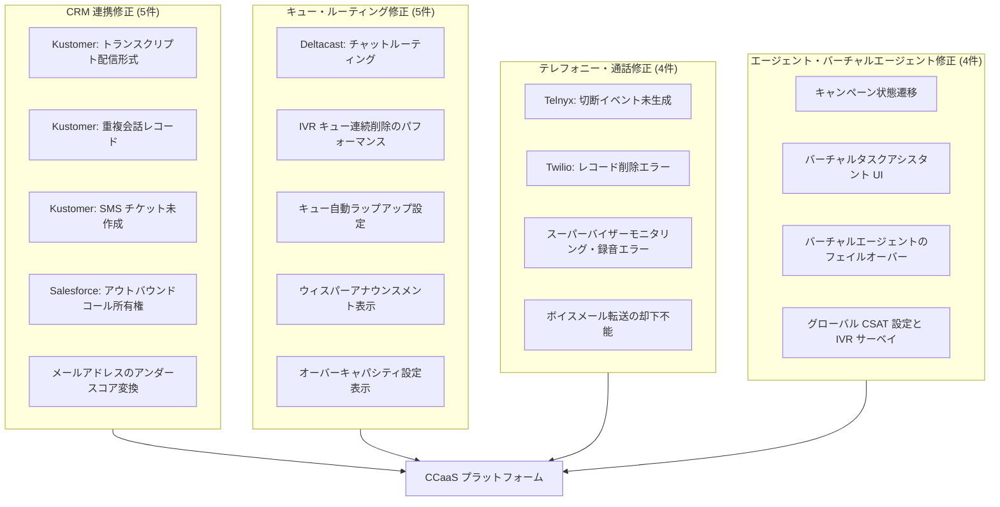

# Google Cloud Contact Center as a Service (CCaaS): バグ修正 (16件)

**リリース日**: 2026-06-17

**サービス**: Google Cloud Contact Center as a Service (CCaaS)

**機能**: Bug Fixes (16 issues fixed)

**ステータス**: Fixed

[このアップデートのインフォグラフィックを見る](https://takech9203.github.io/google-cloud-news-summary/20260617-ccaas-bug-fixes-june-17.html)

## 概要

Google Cloud Contact Center as a Service (CCaaS) において、2026年6月17日付で16件のバグ修正がリリースされました。CCaaS は Google Cloud のネイティブなオムニチャネルコンタクトセンターソリューションであり、AI 駆動のルーティング、バーチャルエージェント、Agent Assist、IVR などの機能を提供するプラットフォームです。

今回の修正は、CRM 連携 (Kustomer、Salesforce)、通話ルーティング、IVR キュー管理、スーパーバイザー機能、テレフォニー統合 (Telnyx、Twilio)、バーチャルエージェント、エージェントデスクトップ UI など、プラットフォームの広範な領域にわたります。特に CRM 連携に関する問題が複数修正されており、コンタクトセンター運用の信頼性向上に寄与する重要なリリースです。

対象ユーザーは、CCaaS を利用するすべてのコンタクトセンター管理者およびエージェントです。特に Kustomer や Salesforce を CRM として統合しているユーザー、Telnyx や Twilio をテレフォニープロバイダーとして使用しているユーザーに直接的な影響があります。

**アップデート前の課題**

- Kustomer CRM で Agent Assist のトランスクリプトがタイムラインノートではなくファイル添付として配信されていた
- キャンペーンが完了後もポーズ状態のまま遷移しないことがあった
- Telnyx 通話の正常終了時に切断イベントが生成されず、録音やトランスクリプトが欠落していた
- スーパーバイザーのモニタリングやウィスパー機能が通話録音中にシステムエラーを引き起こしていた
- IVR キューの連続削除がパフォーマンス低下やタイムアウトエラーを引き起こしていた

**アップデート後の改善**

- CRM 連携の信頼性が向上し、トランスクリプトやチケットが正しく作成されるようになった
- キャンペーンのライフサイクル管理が正常に動作するようになった
- テレフォニー統合の安定性が向上し、録音・トランスクリプトの欠落が解消された
- スーパーバイザー機能が通話録音と正しく共存するようになった
- キュー管理操作のパフォーマンスが改善され、設定の整合性が保たれるようになった

## アーキテクチャ図

この図は、今回修正された16件のバグを4つのカテゴリ (CRM 連携、キュー・ルーティング、テレフォニー・通話、エージェント・バーチャルエージェント) に分類し、CCaaS プラットフォーム全体との関係を示しています。

## サービスアップデートの詳細

### CRM 連携修正 (5件)

1. **Kustomer: Agent Assist トランスクリプト配信形式の修正**
   - Agent Assist のトランスクリプトがファイル添付ではなくタイムラインノートとして正しく配信されるようになった
   - エージェントが会話の文脈を CRM 上で効率的に確認できるようになった

2. **Kustomer: 重複会話レコードの修正**
   - 通話中に CRM で重複した会話レコードが作成される問題を解消
   - データの整合性が保たれ、レポーティングの正確性が向上

3. **Kustomer: SMS チャットセッションのチケット作成修正**
   - SMS チャットセッション時に CRM でチケットが作成されない問題を修正
   - すべてのチャネルからのインタラクションが CRM に正しく記録されるようになった

4. **Salesforce: アウトバウンドコールの所有権修正**
   - アクティブなケースからアウトバウンドコールを発信した際に所有権が誤って上書きされる問題を修正
   - ケース管理のワークフローが正しく維持される

5. **メールアドレスのアンダースコア変換修正**
   - ショートカット内のメールアドレスに含まれるアンダースコアがダブルバックスラッシュに変換される問題を解消

### キュー・ルーティング修正 (5件)

1. **Deltacast: チャットルーティングの修正**
   - 会社全体の同時接続設定が無効で個別エージェント制限が有効な場合に、チャットが利用可能なエージェントに正しくルーティングされない問題を修正
   - エージェントのキャパシティ管理と正確なルーティングが保証される

2. **IVR キュー連続削除のパフォーマンス改善**
   - 連続してIVR キューを削除した際のパフォーマンス低下とタイムアウトエラーを解消
   - キュー管理操作がスムーズに実行可能

3. **キュー自動ラップアップ設定の修正**
   - キューレベルの自動ラップアップ設定がユーザーの操作なしに無効化される問題を修正
   - 管理者が設定した構成が意図通りに維持される

4. **ウィスパーアナウンスメント表示の修正**
   - キュー設定ページで不整合なウィスパーアナウンスメントステータスが表示される問題を解消
   - 管理画面の表示が実際の設定状態と一致する

5. **オーバーキャパシティデフレクション設定表示の修正**
   - キューページで誤ったオーバーキャパシティデフレクション設定が表示される問題を修正

### テレフォニー・通話修正 (4件)

1. **Telnyx: 切断イベント生成の修正**
   - 正常に終了した Telnyx 通話で切断イベントが生成されず、録音・トランスクリプトが欠落し通話がアクティブに見える問題を修正
   - すべての通話終了が正しく記録される

2. **Twilio: レコード削除エラーの修正**
   - Twilio レコードの削除時に不要なエラーが発生する問題を解消
   - テレフォニー管理操作の安定性が向上

3. **スーパーバイザーモニタリング・通話録音の修正**
   - スーパーバイザーのモニタリングおよびウィスパー機能が通話録音中にシステムエラーを引き起こす問題を修正
   - 品質管理とスーパーバイザー機能が正常に共存

4. **ボイスメール転送の却下機能修正**
   - ソースキューが削除された場合に、エージェントが転送されたボイスメールを却下できない問題を修正
   - エージェントのワークフローが中断されない

### エージェント・バーチャルエージェント修正 (4件)

1. **キャンペーン状態遷移の修正**
   - キャンペーンが完了後もポーズ状態のまま留まり、完了状態に遷移しない問題を修正
   - キャンペーンのライフサイクル管理が正確に

2. **バーチャルタスクアシスタント UI の修正**
   - バーチャルタスクアシスタントのリクエスト開始後に「処理中」バナーとキャンセルボタンが即座に表示されない問題を修正
   - ユーザーエクスペリエンスの即応性が向上

3. **バーチャルエージェントのフェイルオーバー制御修正**
   - ヒューマンエージェントが設定されていない場合でも、障害時にバーチャルエージェントがヒューマンエージェントへのフェイルオーバーを試行する問題を修正
   - エラーハンドリングの適切な動作が保証される

4. **グローバル CSAT 設定と IVR サーベイの修正**
   - グローバル CSAT 設定を無効にすると IVR サーベイも提供されなくなる問題を修正
   - CSAT 設定と IVR サーベイの独立性が確保される

## 技術仕様

### 修正カテゴリ別の内訳

| カテゴリ | 修正件数 | 影響範囲 |
|---------|---------|---------|
| CRM 連携 (Kustomer, Salesforce) | 5件 | データ記録・チケット管理 |
| キュー・ルーティング | 5件 | エージェント割当・設定管理 |
| テレフォニー (Telnyx, Twilio) | 4件 | 通話録音・イベント管理 |
| エージェント・バーチャルエージェント | 4件 | キャンペーン・UI・フェイルオーバー |

### 影響を受ける統合パートナー

| パートナー | 修正内容 |
|-----------|---------|
| Kustomer | トランスクリプト配信、重複レコード、SMS チケット (3件) |
| Salesforce | アウトバウンドコール所有権 (1件) |
| Telnyx | 切断イベント未生成 (1件) |
| Twilio | レコード削除エラー (1件) |
| Deltacast | チャットルーティング (1件) |

## メリット

### ビジネス面

- **CRM データの信頼性向上**: Kustomer および Salesforce との連携における複数の問題が解消され、顧客インタラクションデータの正確性が保証される
- **コンタクトセンター運用の安定性**: キュー管理、ルーティング、キャンペーン管理の動作が正常化され、運用中断リスクが低減
- **品質管理の改善**: スーパーバイザーのモニタリング機能と通話録音が正常に共存し、効果的な品質管理が可能に

### 技術面

- **テレフォニー統合の安定性**: Telnyx および Twilio との統合における問題が解消され、通話イベントの完全な記録が保証される
- **UI の一貫性**: キュー設定ページの表示が実際の設定状態と一致し、管理者の混乱を防止
- **エラーハンドリングの改善**: バーチャルエージェントのフェイルオーバーや設定変更時の不適切な動作が修正

## デメリット・制約事項

### 制限事項

- バグ修正リリースのため、新機能の追加はなし
- 修正は自動的に適用されるが、CRM 側の設定確認が推奨される場合がある

### 考慮すべき点

- Kustomer 統合を使用しているユーザーは、修正後にトランスクリプトやチケットの作成が正常に動作していることを確認することを推奨
- Telnyx を使用しているユーザーは、修正前に「アクティブ」と表示されていた通話セッションが適切にクリーンアップされているか確認が必要な場合がある
- キュー設定に変更を加えた場合、修正後の表示が正しいことを再確認することを推奨

## ユースケース

### ユースケース 1: Kustomer CRM を使用するコンタクトセンター

**シナリオ**: 大規模な E コマース企業が Kustomer CRM と CCaaS を統合して顧客サポートを提供している。エージェントは Agent Assist を使用してリアルタイムの提案を受け、通話後にトランスクリプトが CRM に記録される。

**効果**: トランスクリプトがタイムラインノートとして正しく配信されるようになり、エージェントや他のチームメンバーが会話履歴を効率的に参照可能。重複レコードが排除されレポーティングの正確性が向上。SMS チャネルからのインタラクションも漏れなくチケット化される。

### ユースケース 2: マルチテレフォニープロバイダー環境

**シナリオ**: 金融サービス企業が Telnyx をプライマリテレフォニープロバイダーとして使用し、コンプライアンス要件に基づき全通話を録音している。

**効果**: 正常終了した通話の切断イベントが確実に生成され、録音とトランスクリプトが完全に記録される。コンプライアンス監査に必要な通話記録の欠落が解消される。

### ユースケース 3: 大規模キュー管理を行うコンタクトセンター

**シナリオ**: テレコム企業が数百のIVRキューを管理しており、組織変更に伴い不要なキューを一括削除する必要がある。

**効果**: 連続したキュー削除操作がタイムアウトせずに完了し、管理作業の効率が大幅に向上。設定変更後もキューの自動ラップアップやウィスパーアナウンスメントの設定が正しく維持される。

## 料金

今回のバグ修正リリースに伴う追加料金はありません。既存の CCaaS 契約に基づき、修正は自動的に適用されます。

### CCaaS 基本料金体系

| プラン | 内容 |
|--------|------|
| CCaaS Instance | SLA 99.9% 保証 |
| 料金体系 | カスタム見積もり (営業チームへの問い合わせが必要) |

## 利用可能リージョン

CCaaS は複数の国およびリージョンで利用可能です。詳細なリージョン一覧については、[CCAI Platform のロケーションページ](https://cloud.google.com/contact-center/ccai-platform/docs/localities)を参照してください。

## 関連サービス・機能

- **Agent Assist**: エージェントへのリアルタイム支援を提供。今回、Kustomer との連携でトランスクリプト配信の修正が含まれる
- **Conversational Agents (Dialogflow CX)**: バーチャルエージェントの構築に使用。フェイルオーバー動作の修正が含まれる
- **Customer Experience Insights**: コンタクトセンターデータのパターン検出と可視化
- **IVR (Interactive Voice Response)**: 音声による自動応答。キュー削除パフォーマンスおよび CSAT サーベイの修正が含まれる

## 参考リンク

- [インフォグラフィック](https://takech9203.github.io/google-cloud-news-summary/20260617-ccaas-bug-fixes-june-17.html)
- [公式リリースノート](https://cloud.google.com/release-notes#June_17_2026)
- [CCaaS ドキュメント](https://cloud.google.com/contact-center/ccai-platform/docs)
- [CCaaS ソリューションページ](https://cloud.google.com/solutions/contact-center-as-a-service)
- [CCaaS SLA](https://cloud.google.com/terms/contact-center/ccai-platform/sla)

## まとめ

今回の CCaaS バグ修正リリースは、CRM 連携、キュー管理、テレフォニー統合、エージェント機能の4つの主要領域にわたる16件の問題を解消する包括的なアップデートです。特に Kustomer 連携の3件の修正と Telnyx の切断イベント問題の修正は、コンタクトセンターの日常運用に直接影響する重要な修正です。CCaaS を利用中の組織は、CRM 統合やテレフォニー設定が正常に動作していることを確認し、キュー設定の表示が正しいことを確認することを推奨します。

---

**タグ**: #CCaaS #ContactCenter #BugFix #Kustomer #Salesforce #Telnyx #Twilio #IVR #AgentAssist #QueueManagement #CRM
