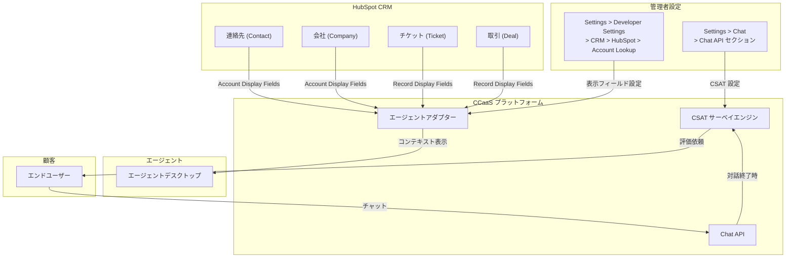

# Google Cloud CCaaS: プレリリースノート - HubSpot 表示フィールド制御 / Chat API CSAT サーベイ対応

**リリース日**: 2026-06-17

**サービス**: Google Cloud Contact Center as a Service (CCaaS)

**機能**: HubSpot CRM 表示フィールド制御、Chat API CSAT サーベイ対応、18件のバグ修正

**ステータス**: Prerelease (プレリリース)

[このアップデートのインフォグラフィックを見る](https://takech9203.github.io/google-cloud-news-summary/20260617-ccaas-prerelease-hubspot-csat-fixes.html)

## 概要

Google Cloud Contact Center as a Service (CCaaS) の次期バージョンのプレリリースノートが公開されました。本リリースでは、HubSpot CRM 連携における表示フィールドのカスタマイズ機能と、Chat API での CSAT (顧客満足度) サーベイ対応という2つの新機能が追加される予定です。加えて、CRM 連携、ルーティング、テレフォニー統合など幅広い領域にわたる18件のバグ修正が含まれています。

対象ユーザーは、CCaaS を HubSpot と統合して運用するコンタクトセンター管理者、Chat API を活用してカスタムチャットエクスペリエンスを構築する開発者、および CCaaS プラットフォーム全般を利用するすべての運用担当者です。

**アップデート前の課題**

- HubSpot 連携において、エージェントアダプターに表示される CRM フィールドを管理者が制御できなかった
- エージェントが対応中に VIP ステータスやアカウントオーナー、チケット優先度などの重要コンテキストへ即座にアクセスするのが困難だった
- Chat API 経由のチャットインタラクションでは CSAT サーベイを実施する手段がなかった
- CSAT サーベイはモバイル/Web SDK および IVR (音声) でのみ利用可能だった

**アップデート後の改善**

- 管理者が HubSpot の CRM アカウントフィールド (連絡先・会社) とレコードフィールド (チケット・取引) のエージェントアダプターへの表示を制御可能になった
- エージェントがライブインタラクション中に重要なコンテキスト情報に即座にアクセスできるようになった
- Chat API で CSAT サーベイをグローバルレベルおよびキューレベルで設定・実施可能になった
- 18件のバグ修正により、CRM 連携やルーティング、テレフォニー統合の信頼性が向上した

## アーキテクチャ図

HubSpot CRM のフィールドが管理者設定に基づいてエージェントアダプターに表示される流れと、Chat API 経由での CSAT サーベイフローを示しています。

## サービスアップデートの詳細

### 主要機能

1. **HubSpot: CRM アカウントフィールドとレコードフィールドの表示制御**
   - エージェントアダプターに表示する HubSpot CRM フィールドを管理者がカスタマイズ可能
   - CRM アカウント表示フィールド: 連絡先 (Contact) と会社 (Company) の2セクション
   - CRM レコード表示フィールド: チケット (Ticket) と取引 (Deal)
   - エージェントが VIP ステータス、アカウントオーナーシップ、チケット優先度などの重要情報をライブインタラクション中に即座に確認可能
   - 設定場所: **Settings > Developer Settings > CRM > Agent Platform > HubSpot > Account Lookup**

2. **Chat API での CSAT サーベイ対応**
   - Chat API を使用して顧客満足度サーベイを実施可能
   - グローバルレベルでの CSAT サーベイ設定に対応
   - キューレベルでの CSAT サーベイ設定に対応
   - 設定場所: **Settings > Chat** ページの新しい **Chat API** セクション

3. **18件のバグ修正**
   - **CRM 連携**: Kustomer トランスクリプト配信、Kustomer 重複レコード、Kustomer SMS チケット、Salesforce アウトバウンドコール
   - **UI/UX**: バーチャルタスクアシスタント UI、メールショートカット (アンダースコア)
   - **ルーティング**: Deltacast ルーティング、キューウィスパーアナウンス、オーバーキャパシティデフレクション
   - **テレフォニー**: Telnyx 切断イベント、Twilio レコード削除
   - **管理機能**: キャンペーン状態遷移、スーパーバイザーモニタリング/ウィスパー、ボイスメール破棄、IVR キュー削除、ラップアップ設定
   - **AI/自動化**: バーチャルエージェントフェイルオーバー、CSAT/IVR サーベイ

## 技術仕様

### HubSpot 表示フィールド設定

| 項目 | 詳細 |
|------|------|
| 設定パス | Settings > Developer Settings > CRM > Agent Platform > HubSpot > Account Lookup |
| CRM Account Display Fields (1) | 連絡先 (Contact) フィールドの表示制御 |
| CRM Account Display Fields (2) | 会社 (Company) フィールドの表示制御 |
| CRM Record Display Fields | チケット (Ticket) / 取引 (Deal) フィールドの表示制御 |
| 前提条件 | HubSpot CRM 連携がアクティブであること |
| 必要権限 | Administrator 権限、edit_developer_settings 権限 |

### Chat API CSAT サーベイ設定

| 項目 | 詳細 |
|------|------|
| 設定パス | Settings > Chat > Chat API セクション |
| 設定レベル | グローバルレベル、キューレベル |
| 評価方式 | 1-5 のスター評価 (既存の CSAT 仕様に準拠) |
| 対応チャネル | Chat API 経由のチャットインタラクション |

## 設定方法

### 前提条件

1. Google Cloud CCaaS のアクティブなインスタンス
2. 管理者権限 (Administrator) を持つアカウント
3. HubSpot 機能: HubSpot CRM 連携がアクティブで、edit_developer_settings 権限が付与されていること

### 手順

#### ステップ 1: HubSpot 表示フィールドの設定

1. CCAI Platform ポータルにログイン
2. **Settings > Developer Settings > CRM** に移動
3. **Agent Platform** で **HubSpot** を選択
4. **Account Lookup** セクションに移動
5. **CRM Account Display Fields** セクション (連絡先/会社) で表示するフィールドを設定
6. **CRM Record Display Fields** セクション (チケット/取引) で表示するフィールドを設定
7. **Save** をクリック

#### ステップ 2: Chat API CSAT サーベイの設定

1. CCAI Platform ポータルにログイン
2. **Settings > Chat** ページに移動
3. 新しい **Chat API** セクションを確認
4. グローバルレベルまたはキューレベルで CSAT サーベイを有効化
5. 設定を保存

## メリット

### ビジネス面

- **エージェント対応品質の向上**: VIP ステータスやチケット優先度を即座に把握できることで、顧客に応じた適切な対応が可能になり、顧客満足度が向上する
- **Chat API チャネルの CSAT 可視化**: Chat API を利用したカスタムチャット実装でも CSAT スコアを収集でき、チャネル横断的な顧客満足度測定が可能になる
- **運用効率の改善**: エージェントが CRM 画面に切り替えることなく重要情報を確認できるため、平均処理時間 (AHT) の短縮が期待される

### 技術面

- **柔軟なフィールド表示制御**: 管理者がビジネスニーズに応じて表示フィールドをカスタマイズできる。不要な情報を非表示にすることでエージェントの認知負荷を軽減
- **API ファーストの CSAT 対応**: Chat API 経由でプログラマティックに CSAT サーベイを制御できるため、カスタムワークフローとの統合が容易
- **プラットフォーム安定性の向上**: 18件のバグ修正により、CRM 連携、ルーティング、テレフォニー統合の信頼性が改善

## デメリット・制約事項

### 制限事項

- 本リリースはプレリリース段階であり、正式リリース時に仕様が変更される可能性がある
- HubSpot 表示フィールド制御は HubSpot 連携のみが対象 (Salesforce、Zendesk、Kustomer には別途対応が必要)
- Chat API CSAT サーベイの詳細な設定オプション (定性フィードバック有無、時間制限など) はプレリリースノートでは明記されていない

### 考慮すべき点

- プレリリースのため、正式リリース日は未確定
- 表示フィールドの設定変更がエージェントアダプターに反映されるまでのタイムラグの有無は未確認
- 既存の CSAT 設定 (IVR/SDK) との優先順位や競合については追加ドキュメントの確認が推奨される

## ユースケース

### ユースケース 1: VIP 顧客の優先対応

**シナリオ**: 金融サービス企業が HubSpot を CRM として使用しており、VIP 顧客からの問い合わせ時にエージェントが即座に顧客ステータスを把握して対応品質を差別化したい。

**実装例**:
- CRM Account Display Fields に「VIP ステータス」「顧客セグメント」「アカウントオーナー」を設定
- CRM Record Display Fields に「チケット優先度」「契約プラン」を設定
- エージェントは着信と同時に顧客の重要コンテキストを把握し、適切なトーンと対応レベルで応対

**効果**: VIP 顧客の初回解決率の向上、エスカレーション率の低減、顧客満足度スコアの改善

### ユースケース 2: カスタムチャットウィジェットでの CSAT 収集

**シナリオ**: EC サイトが Chat API を使用してカスタムチャットウィジェットを実装しており、チャット終了後に顧客満足度を計測してサービス品質を可視化したい。

**実装例**:
- Settings > Chat > Chat API セクションで CSAT サーベイを有効化
- 商品に関する問い合わせキューではキューレベルで CSAT を有効化
- 一般的な問い合わせキューではグローバル設定のみ適用

**効果**: Chat API チャネルでの CSAT スコア収集が可能になり、チャネル横断的な顧客体験の可視化と改善サイクルの確立

## 料金

Google Cloud CCaaS の料金はサブスクリプションベースで提供されています。具体的な料金については、直接 Google Cloud の営業担当にお問い合わせいただくか、以下のリンクから無料コンサルテーションをリクエストしてください。

- [CCaaS 無料コンサルテーション](https://cloud.google.com/resources/offers/cloud-cx-consultation)

SLA として 99.9% の月間稼働率が保証されています。

## 利用可能リージョン

CCaaS は複数の国および Google Cloud リージョンで利用可能です。利用可能な地域の詳細については、[ロケーションページ](https://docs.cloud.google.com/contact-center/ccai-platform/docs/localities)を参照してください。

## 関連サービス・機能

- **Dialogflow CX (Conversational Agents)**: バーチャルエージェントの構築に使用。CCaaS とシームレスに統合されルーティング対応の定型的なインタラクションを自動化
- **Customer Experience Insights**: 自然言語処理を活用した顧客インタラクション分析。コールドライバー、センチメント、よくある質問の特定
- **Agent Assist**: リアルタイムのエージェント支援。顧客のインテントを識別し、通話・チャット中にステップバイステップのガイダンスを提供
- **HubSpot CRM**: CCaaS のネイティブ CRM 統合先の一つ。アカウント検索、レコード作成、セッションデータ連携に対応
- **Cloud Monitoring / Cloud Logging**: CCaaS プラットフォームの監視およびログ管理

## 参考リンク

- [インフォグラフィック](https://takech9203.github.io/google-cloud-news-summary/20260617-ccaas-prerelease-hubspot-csat-fixes.html)
- [公式リリースノート](https://docs.cloud.google.com/release-notes#June_17_2026)
- [CCaaS ドキュメント](https://docs.cloud.google.com/contact-center/ccai-platform/docs)
- [HubSpot 連携ガイド](https://docs.cloud.google.com/contact-center/ccai-platform/docs/hubspot)
- [HubSpot アカウント検索設定](https://docs.cloud.google.com/contact-center/ccai-platform/docs/hubspot-lookups)
- [CSAT サーベイ (モバイル/Web)](https://docs.cloud.google.com/contact-center/ccai-platform/docs/csat-mobile-web)
- [CSAT サーベイ (通話)](https://docs.cloud.google.com/contact-center/ccai-platform/docs/csat-calls)
- [Chat API エンドポイント](https://docs.cloud.google.com/contact-center/ccai-platform/docs/chat-platform-api-endpoints)
- [CCaaS SLA](https://cloud.google.com/terms/contact-center/ccai-platform/sla)

## まとめ

本プレリリースノートは、Google Cloud CCaaS の次期バージョンに含まれる2つの重要な新機能と18件のバグ修正を予告するものです。HubSpot 表示フィールド制御により、エージェントがライブインタラクション中に重要なビジネスコンテキストへ即座にアクセスできるようになり、Chat API CSAT サーベイ対応により、カスタムチャット実装でも顧客満足度の測定が可能になります。HubSpot 連携を利用している管理者は、正式リリース後に表示フィールドの最適化を計画しておくことを推奨します。

---

**タグ**: #GoogleCloud #CCaaS #ContactCenter #HubSpot #CSAT #ChatAPI #CRM #CustomerExperience #Prerelease
