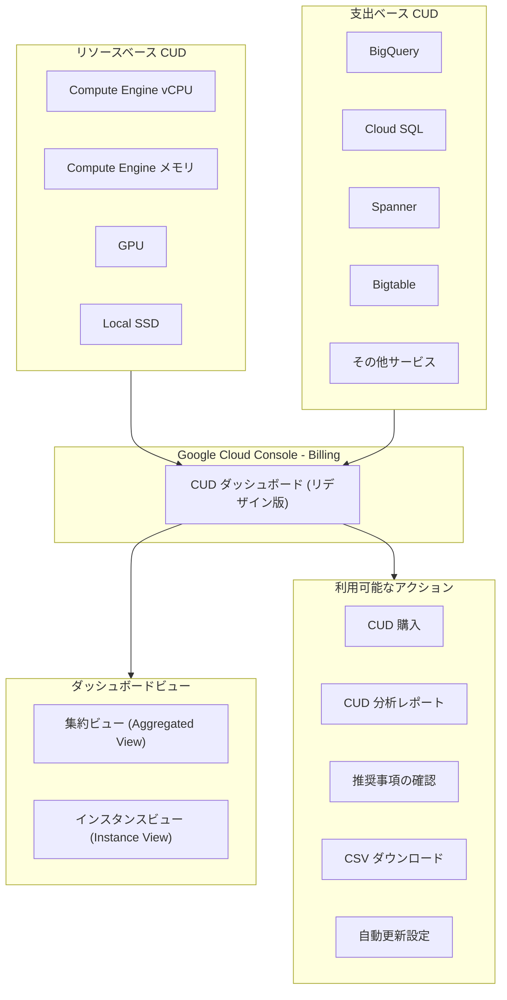

# Cloud Billing: CUD ダッシュボードのリデザイン (プレビュー)

**リリース日**: 2026-06-17

**サービス**: Cloud Billing

**機能**: Committed Use Discounts (CUD) ダッシュボードのリデザイン

**ステータス**: Preview

[このアップデートのインフォグラフィックを見る](https://takech9203.github.io/google-cloud-news-summary/20260617-cloud-billing-cud-dashboard-redesign-preview.html)

## 概要

Google Cloud は、Cloud Billing セクションにおける Committed Use Discounts (CUD) ダッシュボードのリデザイン版をプレビューとして公開しました。この新しいダッシュボードは、リソースベースの CUD と支出ベースの CUD を単一の統合ビューで確認できるようになっており、コミットメントの管理を大幅に効率化します。

従来の CUD 管理画面では、リソースベースの CUD（Compute Engine のマシンタイプや GPU など）と支出ベースの CUD（BigQuery、Cloud SQL、Spanner など）が別々のインターフェースに分散していたため、全体像を把握するのが困難でした。新しいダッシュボードは、これらすべてのコミットメントを一箇所に集約し、ユーザビリティとスケーラビリティを向上させています。

この機能は、CUD を複数サービスにまたがって管理する FinOps チームや、大規模な Cloud Billing アカウントを運用する組織にとって特に有用です。

**アップデート前の課題**

- リソースベースの CUD（Compute Engine）と支出ベースの CUD（BigQuery、Cloud SQL など）の情報が分散しており、全体像を把握するために複数の画面を行き来する必要があった
- 大量のコミットメントを持つ組織では、情報の検索やフィルタリングに時間がかかっていた
- CUD の種類ごとに異なるインターフェースで管理する必要があり、統一的なコスト最適化戦略の策定が難しかった

**アップデート後の改善**

- リソースベースと支出ベースの全 CUD を単一画面で一覧表示・管理可能になった
- リデザインによりユーザビリティが向上し、必要な情報をより迅速に見つけることが可能になった
- スケーラビリティの改善により、大量のコミットメントを持つ組織でもスムーズに操作できるようになった

## アーキテクチャ図

リデザインされた CUD ダッシュボードは、リソースベースと支出ベースの両方の CUD を統合的に表示し、集約ビューとインスタンスビューの 2 つのレベルで詳細情報を提供します。

## サービスアップデートの詳細

### 主要機能

1. **統合 CUD ビュー**
   - リソースベースの CUD（Compute Engine のvCPU、メモリ、GPU、Local SSD）と支出ベースの CUD（BigQuery、Cloud SQL、Spanner など）を単一画面で表示
   - Aggregated View（集約ビュー）で高レベルのメトリクスを確認し、Instance View（インスタンスビュー）で個別のコミットメント詳細にドリルダウン可能

2. **ユーザビリティの向上**
   - フィルタリング機能により、プロパティに基づいてコミットメントを絞り込み可能
   - フィルタ設定、列の表示設定、ソート設定が次回訪問時にも保持される
   - サイドパネルでコミットメント詳細（過去の利用率履歴を含む）を表示

3. **スケーラビリティの改善**
   - 大量のコミットメントを持つ Cloud Billing アカウントでもスムーズに動作
   - Active CUDs 列でフィルタ条件に合致するコミットメントの合計数を表示
   - CSV ダウンロード機能でオフライン分析にも対応

4. **アクション統合**
   - ダッシュボードから直接 CUD の購入が可能
   - 推奨事項（Recommendations）の確認と適用
   - リソースベース CUD の自動更新設定の変更
   - CUD 分析レポートへの直接アクセス

## 技術仕様

### CUD の種類と対象

| CUD タイプ | 対象 | 割引率 |
|------|------|------|
| リソースベース CUD | Compute Engine の vCPU、メモリ、GPU、Local SSD、ソールテナントノード | 最大 55-70%（リソースタイプにより異なる） |
| 支出ベース CUD（新モデル） | BigQuery、Cloud SQL、Spanner、Bigtable、AlloyDB、Dataflow、Memorystore など | サービスにより異なる |
| 支出ベース CUD（レガシーモデル） | VMware Engine、NetApp Volumes | サービスにより異なる |

### 必要な権限

| 権限 | 操作 |
|------|------|
| Billing Account Administrator | CUD の購入・管理・表示 |
| Billing Account Viewer | CUD の表示のみ |

## 設定方法

### 前提条件

1. Google Cloud Console へのアクセス権限
2. Cloud Billing アカウントに対する Billing Account Administrator または Billing Account Viewer のロール

### 手順

#### ステップ 1: CUD ダッシュボードにアクセス

Google Cloud Console のナビゲーションメニューから「Billing」を選択し、Cloud Billing メニューから「Committed use discounts (CUDs)」を選択します。

#### ステップ 2: Billing アカウントの選択

プロンプトが表示されたら、確認したい Cloud Billing アカウントを選択します。リデザインされた CUD ページが開き、選択した Billing アカウントに関連するすべてのアクティブなコミットメントが表示されます。

#### ステップ 3: ビューの切り替えと操作

- **Aggregated View**: 高レベルのメトリクスを確認
- **Instance View**: 個別のコミットメント詳細を確認
- **Filter**: プロパティに基づいてコミットメントを絞り込み
- **Column display options**: 表示する列をカスタマイズ

## メリット

### ビジネス面

- **コスト可視化の一元化**: 全 CUD を一箇所で確認できることで、FinOps チームのコスト最適化戦略策定が容易になる
- **意思決定の迅速化**: 推奨事項や分析レポートへのアクセスが統合され、新規 CUD 購入や更新に関する判断が素早く行える
- **運用効率の向上**: 複数の画面を行き来する必要がなくなり、管理工数を削減

### 技術面

- **スケーラビリティ**: 多数のコミットメントを持つ大規模環境でもパフォーマンスが維持される
- **データ永続性**: フィルタやソート設定がセッション間で保持され、繰り返しの操作が不要
- **BigQuery 連携**: CSV ダウンロードの Subscription ID を使用して BigQuery エクスポートデータとの結合分析が可能

## デメリット・制約事項

### 制限事項

- 現在プレビュー段階であり、GA（一般提供）時に機能や UI が変更される可能性がある
- CUD の購入後はキャンセルできない（ダッシュボードのリデザインに関わらず、CUD の基本制約は変わらない）
- コミットメント購入後のリージョンや期間の変更は不可

### 考慮すべき点

- レガシーの CSV ダウンロード形式は 2026 年 9 月 8 日まで利用可能であり、それまでに新形式への移行を計画する必要がある
- プレビュー機能のため、本番環境での運用ワークフローに完全に組み込む前に十分な検証が推奨される

## ユースケース

### ユースケース 1: マルチサービス CUD ポートフォリオの管理

**シナリオ**: 大規模な組織が Compute Engine のリソースベース CUD と、BigQuery・Cloud SQL・Spanner の支出ベース CUD を複数保有している場合

**効果**: 新しいダッシュボードで全コミットメントを一覧表示し、期限切れ間近のコミットメント（30 日以内に期限切れ）を迅速に特定。自動更新設定の確認や、追加購入の推奨事項を一箇所で確認できる。

### ユースケース 2: CUD 利用率の最適化分析

**シナリオ**: FinOps チームが月次のコスト最適化レビューで、CUD の利用率を確認し、過剰利用や不足利用のパターンを特定したい場合

**効果**: サイドパネルの詳細ビューから各コミットメントの過去の利用率履歴を確認し、CUD 分析レポートに直接アクセスして効果を評価。不足利用のコミットメントを特定し、リソース計画の改善に活用できる。

## 関連サービス・機能

- **CUD 分析レポート**: CUD の有効性を分析するレポート機能。ダッシュボードから直接アクセス可能
- **CUD Recommender**: 過去の使用パターンに基づいて追加コミットメントを推奨する機能
- **BigQuery Billing Export**: CUD メタデータのエクスポートにより、詳細な分析が可能
- **Cost Breakdown Reports**: CUD による節約額を含むコスト内訳の可視化

## 参考リンク

- [インフォグラフィック](https://takech9203.github.io/google-cloud-news-summary/20260617-cloud-billing-cud-dashboard-redesign-preview.html)
- [公式リリースノート](https://docs.cloud.google.com/release-notes#June_17_2026)
- [ドキュメント: CUD リスト概要](https://docs.cloud.google.com/billing/docs/how-to/cuds-list-overview)
- [ドキュメント: 支出ベース CUD](https://docs.cloud.google.com/docs/cuds-multiprice)
- [ドキュメント: リソースベース CUD](https://docs.cloud.google.com/compute/docs/instances/signing-up-committed-use-discounts)
- [ドキュメント: CUD 分析レポート](https://docs.cloud.google.com/billing/docs/how-to/analyze-cuds)

## まとめ

今回の CUD ダッシュボードのリデザインは、Google Cloud のコスト最適化管理における重要な UX 改善です。リソースベースと支出ベースの CUD を統合的に管理できることで、特に複数サービスにまたがるコミットメントを持つ組織の FinOps 運用が大幅に効率化されます。プレビュー段階ではありますが、早期にアクセスして新しいインターフェースに慣れておくことを推奨します。

---

**タグ**: #CloudBilling #CUD #CommittedUseDiscounts #FinOps #CostOptimization #Preview #Dashboard #コスト管理
