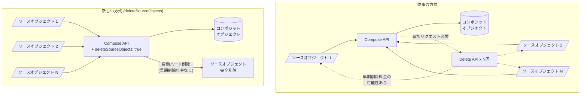

# Cloud Storage: コンポジットオブジェクト作成時のソースオブジェクト自動削除

**リリース日**: 2026-06-17

**サービス**: Cloud Storage

**機能**: コンポジットオブジェクト作成時の一時ソースオブジェクト削除オプション

**ステータス**: GA (一般提供)

📊 [このアップデートのインフォグラフィックを見る](https://takech9203.github.io/google-cloud-news-summary/20260617-cloud-storage-composite-objects-delete-source.html)

## 概要

Cloud Storage のコンポジットオブジェクト作成機能に、コンポジション処理の一環として一時ソースオブジェクトを削除するオプションが追加された。これにより、並列コンポジットアップロードやオブジェクト結合のワークフローにおいて、一時オブジェクトの管理が大幅に簡素化される。

従来、コンポジットオブジェクトを作成した後に一時ソースオブジェクトを削除するには、別途 Delete リクエストを発行する必要があった。今回の `deleteSourceObjects` オプションにより、コンポジション処理とソース削除をアトミックに実行でき、早期削除料金の免除やソフトデリート・オブジェクトバージョニングの影響回避といったコスト最適化が実現される。

対象ユーザーは、大容量ファイルの並列アップロード、ログファイルの結合、データパイプラインでのオブジェクト連結を行うすべての Cloud Storage ユーザーである。

**アップデート前の課題**

- コンポジットオブジェクト作成後、一時ソースオブジェクトを削除するために追加の API リクエスト (Delete Object) が必要だった
- ソースオブジェクトを後から削除する場合、ストレージクラスの最低保存期間に基づく早期削除料金が発生する可能性があった
- ソフトデリートやオブジェクトバージョニングが有効なバケットでは、削除後もソースオブジェクトがソフトデリート状態またはノンカレント状態として残存し、追加のストレージ料金が発生していた

**アップデート後の改善**

- コンポジション処理の一部としてソースオブジェクトをハード削除できるようになり、追加の API リクエストが不要になった
- `deleteSourceObjects` オプションで削除されたオブジェクトは早期削除料金の対象外となる
- `deleteSourceObjects` オプションで削除されたオブジェクトはソフトデリートやオブジェクトバージョニングによって保持されない (データはコンポジットオブジェクトに保存されるため)

## アーキテクチャ図



従来はコンポジション後に個別の Delete リクエストが必要だったが、新しい `deleteSourceObjects` オプションにより 1 回の API 呼び出しでコンポジションとソース削除を同時に実行でき、早期削除料金も免除される。

## サービスアップデートの詳細

### 主要機能

1. **deleteSourceObjects オプション**
   - JSON API の Compose リクエストボディに `"deleteSourceObjects": true` を指定することで、コンポジション成功時にソースオブジェクトをハード削除する
   - デフォルトは `false` (従来の動作と同じ)
   - gcloud CLI では `--delete-source-objects` フラグとして提供

2. **早期削除料金の免除**
   - このオプションで削除されたオブジェクトは、ストレージクラスの最低保存期間に関係なく早期削除料金が発生しない
   - Nearline (30日)、Coldline (90日)、Archive (365日) ストレージクラスのオブジェクトでも追加課金なし

3. **ソフトデリート・バージョニングのバイパス**
   - このオプションで削除されたオブジェクトは、ソフトデリートやオブジェクトバージョニングによって保持されない
   - データはコンポジットオブジェクトに保存されるため、データ損失のリスクなし

## 技術仕様

### JSON API リクエスト

| 項目 | 詳細 |
|------|------|
| エンドポイント | `POST https://storage.googleapis.com/storage/v1/b/{bucket}/o/{destinationObject}/compose` |
| 新規パラメータ | `deleteSourceObjects` (boolean) |
| デフォルト値 | `false` |
| 最大ソースオブジェクト数 | 32 |
| ソースオブジェクト要件 | 同一バケット内、同一ストレージクラス |

### 必要な IAM 権限

| 権限 | 用途 |
|------|------|
| `storage.objects.create` | コンポジットオブジェクトの作成 |
| `storage.objects.get` | ソースオブジェクトの読み取り |
| `storage.objects.delete` | 既存オブジェクトの上書き時 |
| `storage.objects.list` | ワイルドカード使用時 |

推奨 IAM ロール: `roles/storage.objectUser` (Storage Object User)

## 設定方法

### 前提条件

1. Cloud Storage バケットが作成済みであること
2. `roles/storage.objectUser` 以上の IAM ロールが付与されていること
3. ソースオブジェクトが同一バケット内に存在し、同一ストレージクラスであること

### 手順

#### ステップ 1: gcloud CLI を使用する場合

```bash
gcloud storage objects compose \
  gs://BUCKET_NAME/SOURCE_OBJECT_1 gs://BUCKET_NAME/SOURCE_OBJECT_2 \
  gs://BUCKET_NAME/COMPOSITE_OBJECT_NAME \
  --delete-source-objects
```

ソースオブジェクトの指定にはワイルドカードも使用可能。

#### ステップ 2: JSON API を使用する場合

```json
{
  "sourceObjects": [
    { "name": "SOURCE_OBJECT_1" },
    { "name": "SOURCE_OBJECT_2" }
  ],
  "destination": {
    "contentType": "application/octet-stream"
  },
  "deleteSourceObjects": true
}
```

```bash
curl -X POST --data-binary @compose_request.json \
  -H "Authorization: Bearer $(gcloud auth print-access-token)" \
  -H "Content-Type: application/json" \
  "https://storage.googleapis.com/storage/v1/b/BUCKET_NAME/o/COMPOSITE_OBJECT_NAME/compose"
```

#### ステップ 3: クライアントライブラリを使用する場合 (C#)

```csharp
storage.Service.Objects.Compose(new ComposeRequest
{
    DeleteSourceObjects = true,
    SourceObjects = sourceObjects,
    Destination = new Object { ContentType = "application/octet-stream" }
}, bucketName, targetObjectName).Execute();
```

#### ステップ 4: クライアントライブラリを使用する場合 (Rust)

```rust
client
    .compose_object()
    .set_destination(Object::new().set_bucket(bucket).set_name(dest))
    .set_source_objects([
        SourceObject::new().set_name(source1),
        SourceObject::new().set_name(source2),
    ])
    .set_delete_source_objects(true)
    .send()
    .await?;
```

## メリット

### ビジネス面

- **コスト削減**: 早期削除料金が免除されるため、Nearline/Coldline/Archive ストレージクラスの一時オブジェクトを使用するワークフローでのコストが削減される
- **ストレージ料金の最適化**: ソフトデリートやバージョニングによる不要なストレージ料金の発生を回避できる

### 技術面

- **API 呼び出し数の削減**: コンポジションと削除を 1 リクエストで完了するため、API 呼び出し回数が削減され、オペレーション料金も節約できる
- **アトミック性の向上**: コンポジションと削除が一体で実行されるため、中間状態での不整合が発生しにくい
- **並列コンポジットアップロードの簡素化**: 大容量ファイルのアップロードワークフローにおける一時オブジェクト管理が容易になる

## デメリット・制約事項

### 制限事項

- コンポジットオブジェクトには MD5 ハッシュメタデータフィールドがない (CRC32C のみ)
- 1 回のコンポーズリクエストで指定できるソースオブジェクトは最大 32 個
- ソースオブジェクトはすべて同一バケット内かつ同一ストレージクラスである必要がある
- XML API では `deleteSourceObjects` オプションは利用できない (JSON API とクライアントライブラリのみ)

### 考慮すべき点

- `deleteSourceObjects` で削除されたオブジェクトは復元不可能 (ソフトデリートやバージョニングをバイパスするため)
- リテンションポリシーが設定されたバケットでは一時オブジェクトの削除ができない場合がある
- デフォルトオブジェクトホールドが有効なバケットでは、ホールドの解除が必要
- Python クライアントライブラリおよび Node.js クライアントライブラリでは並列コンポジットアップロードが未サポート

## ユースケース

### ユースケース 1: 大容量ファイルの並列コンポジットアップロード

**シナリオ**: 10 GB のファイルを 32 チャンクに分割して並列アップロードし、コンポジットオブジェクトとして再構築する。

**実装例**:
```bash
# チャンクを並列アップロード後、コンポジションで結合 + ソース削除
gcloud storage objects compose \
  gs://my-bucket/upload-chunks/chunk_* \
  gs://my-bucket/final/large-file.dat \
  --delete-source-objects
```

**効果**: アップロード完了後の一時チャンクファイルを自動削除し、追加の Delete リクエストと早期削除料金を回避。

### ユースケース 2: ログファイルの定期的な結合

**シナリオ**: 時間ごとに生成されるログファイル (Coldline ストレージ) を日次で 1 つのファイルに結合する。

**実装例**:
```json
{
  "sourceObjects": [
    {"name": "logs/2026-06-17/hour-00.log"},
    {"name": "logs/2026-06-17/hour-01.log"},
    {"name": "logs/2026-06-17/hour-23.log"}
  ],
  "destination": {"contentType": "text/plain"},
  "deleteSourceObjects": true
}
```

**効果**: Coldline ストレージの 90 日最低保存期間に関わらず、時間別ログファイルを早期削除料金なしで即座に削除可能。

### ユースケース 3: オブジェクトへのデータ追記

**シナリオ**: 既存のデータファイルに新しいデータを追記する。

**実装例**:
```bash
# 追記データを一時オブジェクトとしてアップロード
echo 'new data' | gcloud storage cp - gs://my-bucket/temporary_object

# 既存オブジェクトと一時オブジェクトをコンポーズ + ソース削除
gcloud storage objects compose \
  gs://my-bucket/existing_object gs://my-bucket/temporary_object \
  gs://my-bucket/existing_object \
  --delete-source-objects
```

**効果**: 一時オブジェクトと既存オブジェクトの旧バージョンを自動削除し、バージョニングやソフトデリートによる追加ストレージ課金を回避。

## 料金

Cloud Storage のコンポーズ操作は Class A オペレーションとして課金される。`deleteSourceObjects` オプション自体に追加料金はなく、むしろ以下のコスト削減効果がある。

### コスト削減効果

| シナリオ | 従来 | deleteSourceObjects 使用時 |
|----------|------|---------------------------|
| Nearline 一時オブジェクト (30日未満で削除) | 早期削除料金あり | 早期削除料金なし |
| Coldline 一時オブジェクト (90日未満で削除) | 早期削除料金あり | 早期削除料金なし |
| Archive 一時オブジェクト (365日未満で削除) | 早期削除料金あり | 早期削除料金なし |
| ソフトデリート有効バケット | ソフトデリート保持期間分のストレージ料金 | 追加ストレージ料金なし |
| Delete API リクエスト | ソースオブジェクト数 x 削除リクエスト料金 | 不要 |

## 利用可能リージョン

Cloud Storage のコンポジットオブジェクト機能はすべての Cloud Storage リージョン、デュアルリージョン、マルチリージョンで利用可能。

## 関連サービス・機能

- **Cloud Storage Transfer Service**: 大規模データ移行時の並列アップロードでコンポジットオブジェクトを活用
- **Cloud Storage Object Lifecycle Management**: ストレージクラスの自動遷移とオブジェクト削除ポリシー管理
- **Cloud Storage Soft Delete**: 誤削除からの保護機能 (deleteSourceObjects はこれをバイパス)
- **Cloud Storage Object Versioning**: オブジェクトのバージョン管理 (deleteSourceObjects はこれをバイパス)
- **Parallel Composite Uploads**: 大容量ファイルの高速アップロード手法で本機能を活用

## 参考リンク

- 📊 [インフォグラフィック](https://takech9203.github.io/google-cloud-news-summary/20260617-cloud-storage-composite-objects-delete-source.html)
- [公式リリースノート](https://docs.cloud.google.com/release-notes#June_17_2026)
- [コンポジットオブジェクト概要](https://docs.cloud.google.com/storage/docs/composite-objects)
- [オブジェクトのコンポーズ手順](https://docs.cloud.google.com/storage/docs/composing-objects)
- [並列コンポジットアップロード](https://docs.cloud.google.com/storage/docs/parallel-composite-uploads)
- [JSON API - Objects: compose](https://docs.cloud.google.com/storage/docs/json_api/v1/objects/compose)
- [Cloud Storage 料金](https://cloud.google.com/storage/pricing)

## まとめ

Cloud Storage のコンポジットオブジェクト作成時にソースオブジェクトを自動削除する `deleteSourceObjects` オプションは、並列アップロードやオブジェクト結合ワークフローにおけるコスト最適化と運用簡素化を実現する重要な機能である。特に Nearline/Coldline/Archive ストレージクラスの一時オブジェクトを使用するユースケースでは、早期削除料金の免除により大幅なコスト削減が期待できる。並列コンポジットアップロードやログ結合処理を行っているユーザーは、既存のワークフローに本オプションを組み込むことを推奨する。

---

**タグ**: #CloudStorage #CompositeObjects #コスト最適化 #並列アップロード #オブジェクト管理
