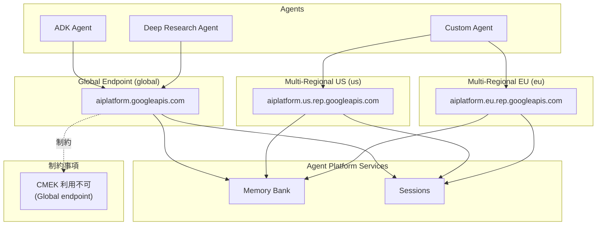

# Gemini Enterprise Agent Platform: Memory Bank / Sessions グローバル・マルチリージョナルエンドポイント GA

**リリース日**: 2026-06-17

**サービス**: Gemini Enterprise Agent Platform

**機能**: Memory Bank and Sessions global and multi-regional endpoints GA

**ステータス**: GA (General Availability)

[このアップデートのインフォグラフィックを見る](https://takech9203.github.io/google-cloud-news-summary/20260617-gemini-agent-platform-memory-bank-global-endpoints-ga.html)

## 概要

Gemini Enterprise Agent Platform の Memory Bank および Sessions が、マルチリージョナルエンドポイントとグローバルエンドポイントに対応し、GA (一般提供) となった。これにより、エージェントの長期記憶管理とセッション管理を、特定のリージョンに縛られることなくグローバルまたはマルチリージョン (US / EU) で運用できるようになる。

Memory Bank はエージェントに長期記憶を提供するサービスであり、会話から重要な情報を抽出・統合・保存し、複数のセッションにわたってパーソナライズされた応答を実現する。Sessions はユーザーとエージェント間のインタラクション履歴を管理し、会話の文脈を維持するサービスである。今回の GA により、これらのサービスをグローバル規模でデプロイする際のエンドポイント選択肢が正式に拡大された。

なお、グローバルエンドポイントを使用する場合は Customer-Managed Encryption Keys (CMEK) が利用できないという制約がある点に注意が必要である。

**アップデート前の課題**

- Memory Bank と Sessions は個別のリージョナルエンドポイントでのみ利用可能であり、グローバルに展開するエージェントでは複数リージョンにまたがるセッション・記憶管理が煩雑だった
- マルチリージョン・グローバルエンドポイントは Preview 段階 (2026年5月19日〜) であり、本番環境での利用には SLA の保証がなかった
- グローバルに展開するエージェント (例: Gemini Deep Research Agent) との統合において、エンドポイントのロケーション制約が障壁となっていた

**アップデート後の改善**

- Memory Bank と Sessions でグローバル (`global`) およびマルチリージョナル (`us`, `eu`) エンドポイントが GA となり、本番ワークロードで SLA 付きで利用可能になった
- グローバルエンドポイントにより、リージョンを意識せずにエージェントの記憶とセッションを管理できるようになった
- マルチリージョナルエンドポイントにより、US または EU 内でのデータ処理保証を維持しながら高可用性を実現できるようになった

## アーキテクチャ図



Memory Bank と Sessions は、グローバルエンドポイント、マルチリージョナルエンドポイント (US/EU)、および従来のリージョナルエンドポイントの3種類から選択して利用できる。グローバルエンドポイントでは CMEK が使用できない制約がある。

## サービスアップデートの詳細

### 主要機能

1. **グローバルエンドポイント対応**
   - ロケーションを `global` に設定することで、リージョンを指定せずに Memory Bank と Sessions を利用可能
   - グローバルエンドポイント URL: `https://aiplatform.googleapis.com`
   - Gemini Deep Research Agent (Preview) など、グローバルエンドポイントをサポートする Google エージェントとの統合が可能

2. **マルチリージョナルエンドポイント対応**
   - ロケーションを `us` または `eu` に設定することで、マルチリージョン内でのデータ処理を保証
   - US エンドポイント: `https://aiplatform.us.rep.googleapis.com`
   - EU エンドポイント: `https://aiplatform.eu.rep.googleapis.com`
   - 管轄区域内でのデータ処理要件を満たしつつ、複数リージョンにわたる高可用性を実現

3. **Memory Bank の主要機能 (GA 対応済み)**
   - メモリ生成: LLM を使用した会話からの情報抽出・統合
   - 類似検索: エンベディングモデルによるスコープベースの記憶検索
   - TTL 設定: メモリの自動有効期限管理 (デフォルト TTL、操作別 TTL)
   - メモリリビジョン: メモリの変遷履歴の自動管理
   - マルチモーダル対応: マルチモーダルコンテンツからのテキスト知見抽出

4. **Sessions の主要機能 (GA 対応済み)**
   - セッション作成・再開: ユーザーとエージェント間の会話状態の管理
   - イベント管理: 会話内容やエージェントのアクション (関数呼び出し等) の記録
   - ステート管理: 現在の会話に関連する一時データの保持
   - TTL 設定: セッションの自動有効期限管理 (デフォルト 365 日)

## 技術仕様

### エンドポイント構成

| エンドポイントタイプ | ロケーション設定 | ホスト名 | CMEK 対応 |
|------|------|------|------|
| グローバル | `global` | `https://aiplatform.googleapis.com` | 不可 |
| マルチリージョナル (US) | `us` | `https://aiplatform.us.rep.googleapis.com` | 可能 |
| マルチリージョナル (EU) | `eu` | `https://aiplatform.eu.rep.googleapis.com` | 可能 |
| リージョナル | 各リージョン名 | `https://{region}-aiplatform.googleapis.com` | 可能 |

### リージョナルエンドポイント対応リージョン (Memory Bank)

| リージョン | ロケーション |
|------|------|
| us-east1 | South Carolina |
| us-east4 | Northern Virginia |
| us-west1 | Oregon |
| us-central1 | Iowa |
| europe-west1 | Belgium |
| europe-west2 | London |
| europe-west3 | Frankfurt |
| europe-west4 | Netherlands |
| asia-east1 | Taiwan |
| asia-northeast1 | Tokyo |
| asia-south1 | Mumbai |
| asia-southeast1 | Singapore |

注: 一部リージョン (asia-southeast2, australia-southeast2, northamerica-northeast2) では Memory Bank は未対応。

### SDK 設定例

```python
import vertexai

# グローバルエンドポイントを使用する場合
client = vertexai.Client(
    project="PROJECT_ID",
    location="global",
)

# マルチリージョナルエンドポイント (US) を使用する場合
client = vertexai.Client(
    project="PROJECT_ID",
    location="us",
)

# マルチリージョナルエンドポイント (EU) を使用する場合
client = vertexai.Client(
    project="PROJECT_ID",
    location="eu",
)
```

### 必要な IAM ロール

```
roles/aiplatform.user (Agent Platform User)
```

GKE や Cloud Run からリクエストする場合は、サービスアカウントに上記権限が必要。Agent Runtime からのアウトバウンドリクエストには、Reasoning Engine Service Agent が既に必要な権限を持っている。

## 設定方法

### 前提条件

1. Google Cloud プロジェクトのセットアップ済み
2. Agent Platform SDK (`google-cloud-aiplatform>=1.111.0`) のインストール
3. `roles/aiplatform.user` IAM ロールの付与

### 手順

#### ステップ 1: SDK のインストール

```bash
pip install google-cloud-aiplatform>=1.111.0
```

#### ステップ 2: クライアントの初期化 (グローバルエンドポイント)

```python
import vertexai

client = vertexai.Client(
    project="my-project-id",
    location="global",
)
```

#### ステップ 3: Memory Bank インスタンスの作成

```python
from vertexai.types import (
    ReasoningEngineContextSpecMemoryBankConfig as MemoryBankConfig,
    ReasoningEngineContextSpecMemoryBankConfigSimilaritySearchConfig as SimilaritySearchConfig,
    ReasoningEngineContextSpecMemoryBankConfigTtlConfig as TtlConfig,
)

memory_bank_config = MemoryBankConfig(
    similarity_search_config=SimilaritySearchConfig(
        embedding_model="projects/my-project/locations/global/publishers/google/models/text-embedding-005"
    ),
    ttl_config=TtlConfig(
        default_ttl="2592000s"  # 30日
    )
)
```

#### ステップ 4: Sessions の利用 (ADK 連携)

```python
from google.adk.agents import Agent

agent = Agent(
    model="gemini-3.5-flash",
    name="my_global_agent"
)

# セッションの作成
session = await session_service.create_session(
    app_name=app_name,
    user_id=user_id,
    ttl="864000s"  # 10日
)
```

## メリット

### ビジネス面

- **グローバル展開の簡素化**: 単一のグローバルエンドポイントで世界中のユーザーにパーソナライズされたエージェント体験を提供でき、リージョンごとの個別管理が不要になる
- **コンプライアンス対応**: マルチリージョナルエンドポイント (US/EU) により、データ処理の地理的境界を保証しながら高可用性を実現できる
- **本番環境対応**: GA となったことで SLA が適用され、エンタープライズワークロードでの採用が可能になる

### 技術面

- **高可用性**: グローバルおよびマルチリージョナルエンドポイントは、単一リージョンよりも高い可用性と信頼性を提供する
- **統合の柔軟性**: ADK、LangChain、LlamaIndex、Agent2Agent など多様なフレームワークとの統合において、エンドポイントの選択肢が増えた
- **スケーラビリティ**: グローバルに分散したエージェントが同一の Memory Bank インスタンスにアクセスでき、セッション間の記憶共有が容易

## デメリット・制約事項

### 制限事項

- グローバルエンドポイント使用時は CMEK (Customer-Managed Encryption Keys) が利用不可。Cloud KMS は暗号鍵が固定された地理的データレジデンシー境界内に存在することを要求するが、グローバルリージョンには物理的な地理的境界がないため
- マルチリージョナルエンドポイントへのプライベート接続では Private Google Access が非対応。Private Service Connect エンドポイントの構成が必要
- グローバルエンドポイントで対応している Google エージェントは現時点で Gemini Deep Research Agent (Preview) のみ

### 考慮すべき点

- データレジデンシー要件が厳格な場合は、グローバルエンドポイントではなくリージョナルまたはマルチリージョナルエンドポイントを選択すべき
- CMEK が必須要件の場合は、リージョナルまたはマルチリージョナルエンドポイントを使用する必要がある
- グローバルエンドポイントはデータレジデンシーやリージョン内 ML 処理を保証しない

## ユースケース

### ユースケース 1: グローバルカスタマーサポートエージェント

**シナリオ**: 世界中の顧客にサービスを提供する企業が、顧客の過去の問い合わせ履歴や製品選好を記憶するカスタマーサポートエージェントをデプロイする。

**実装例**:
```python
import vertexai

# グローバルエンドポイントで初期化
client = vertexai.Client(project="support-project", location="global")

# Memory Bank が顧客ごとの過去の対応履歴を保持
# どのリージョンからアクセスしても同一の記憶を参照可能
```

**効果**: リージョンごとに Memory Bank インスタンスを管理する必要がなくなり、運用コストを削減しながら一貫した顧客体験を提供できる。

### ユースケース 2: EU データ保護規制準拠のエージェント

**シナリオ**: EU 内のユーザーデータを EU 内で処理する必要がある GDPR 準拠のエージェントを構築する。

**実装例**:
```python
import vertexai

# EU マルチリージョナルエンドポイントで初期化
client = vertexai.Client(project="eu-project", location="eu")

# EU 内の複数リージョンで高可用性を確保しつつ
# データ処理が EU 境界内に留まることを保証
```

**効果**: 単一リージョンに比べて高い可用性を実現しながら、EU 内でのデータ処理要件を満たすことができる。

### ユースケース 3: Deep Research Agent との統合

**シナリオ**: Gemini Deep Research Agent をグローバルエンドポイントで利用し、リサーチ結果をセッション間で記憶として蓄積する。

**効果**: 複数の調査セッションにわたって知見を蓄積し、過去のリサーチ結果を踏まえた深い調査を継続的に実行できる。

## 利用可能リージョン

- **グローバル**: `global`
- **マルチリージョン**: `us` (米国), `eu` (欧州連合)
- **リージョナル**: us-east1, us-east4, us-west1, us-central1, europe-west1, europe-west2, europe-west3, europe-west4, europe-west6, europe-west8, europe-southwest1, asia-east1, asia-east2, asia-northeast1, asia-northeast3, asia-south1, asia-southeast1, me-west1, northamerica-northeast1, southamerica-east1 など

詳細は[サポート対象ロケーション](https://docs.cloud.google.com/gemini-enterprise-agent-platform/resources/agent-locations)を参照。

## 関連サービス・機能

- **Agent Runtime**: Memory Bank と Sessions を利用するエージェントのデプロイ・スケーリング環境
- **Agent Development Kit (ADK)**: Memory Bank と Sessions を統合したエージェント開発フレームワーク。`VertexAiMemoryBankService` による組み込み連携
- **Cloud KMS**: 暗号鍵管理。グローバルエンドポイントでは CMEK 非対応のため、リージョナル/マルチリージョナルエンドポイント使用時に活用
- **Gemini Deep Research Agent**: グローバルエンドポイントをサポートする Google エージェント (Preview)
- **Agent Gateway**: エージェントのトラフィックルーティングとガバナンス

## 参考リンク

- [インフォグラフィック](https://takech9203.github.io/google-cloud-news-summary/20260617-gemini-agent-platform-memory-bank-global-endpoints-ga.html)
- [公式リリースノート](https://docs.cloud.google.com/release-notes#June_17_2026)
- [Supported locations for agents - Multi-regional and global endpoints](https://docs.cloud.google.com/gemini-enterprise-agent-platform/resources/agent-locations#multi-regional-and-global-endpoints)
- [Memory Bank セットアップガイド](https://docs.cloud.google.com/gemini-enterprise-agent-platform/scale/memory-bank/setup)
- [Memory Bank 概要](https://docs.cloud.google.com/gemini-enterprise-agent-platform/scale/memory-bank)
- [Sessions 概要](https://docs.cloud.google.com/gemini-enterprise-agent-platform/scale/sessions)

## まとめ

Gemini Enterprise Agent Platform の Memory Bank と Sessions がグローバル・マルチリージョナルエンドポイントに GA 対応したことで、エージェントの長期記憶とセッション管理をグローバル規模で本番運用できるようになった。グローバルエンドポイントでは CMEK が使用できない制約があるため、データ保護要件に応じてリージョナル/マルチリージョナル/グローバルの適切なエンドポイントを選択することが推奨される。

---

**タグ**: #GeminiEnterpriseAgentPlatform #MemoryBank #Sessions #GlobalEndpoint #MultiRegional #GA #AgentPlatform #LongTermMemory
