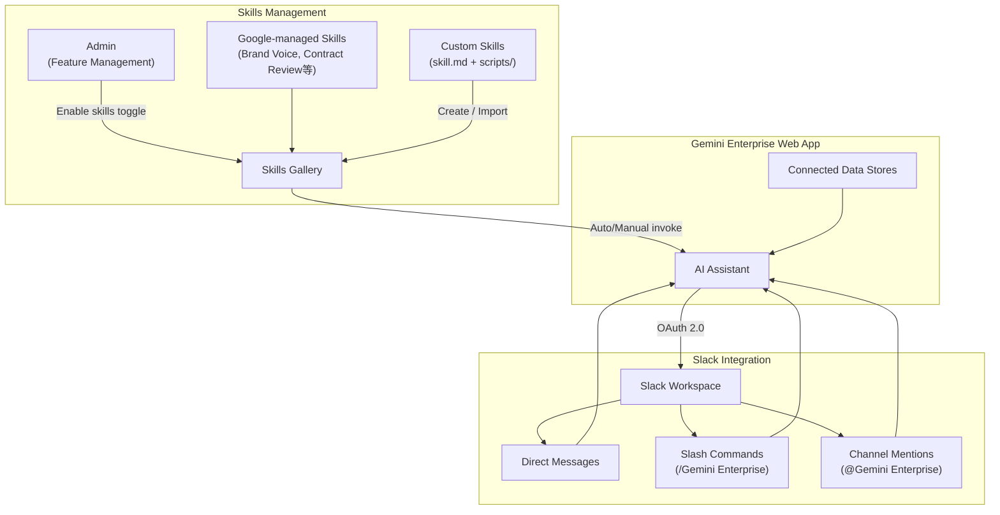

# Gemini Enterprise: スキル管理機能と Slack アプリ連携

**リリース日**: 2026-06-17

**サービス**: Gemini Enterprise

**機能**: スキルの作成・管理 (GA with allowlist) / Gemini Enterprise app for Slack (GA)

**ステータス**: GA with allowlist / GA

[このアップデートのインフォグラフィックを見る](https://takech9203.github.io/google-cloud-news-summary/20260617-gemini-enterprise-skills-slack-app.html)

## 概要

Gemini Enterprise に 2 つの主要機能が GA としてリリースされた。1 つ目は「スキル (Skills)」の作成・管理機能で、再利用可能なカスタム指示をアシスタントに追加し、特定のタスクを効率的に実行させることができる。2 つ目は Slack アプリ連携で、Slack ワークスペース内からダイレクトメッセージ、スラッシュコマンド、チャンネルメンションを通じて Gemini Enterprise の AI 回答と検索を利用できる。

スキル機能は agentskills.io が管理するオープンスタンダードに準拠しており、ドメイン固有のタスクをモジュール式に拡張できる。Slack 連携は接続済みのすべてのデータストアからの情報を活用した回答を提供し、エンタープライズの生産性向上に寄与する。

**アップデート前の課題**

- Gemini Enterprise アシスタントに特定タスクの実行方法を教えるには、都度プロンプトで詳細な指示を提供する必要があった
- 組織のブランドボイスや契約レビュー手順などの定型的な指示を再利用する仕組みがなかった
- Slack ユーザーは Gemini Enterprise の回答を得るために Web アプリに切り替える必要があった
- チームのコミュニケーションツール内で AI 検索を直接利用する手段が限られていた

**アップデート後の改善**

- スキルとして再利用可能なカスタム指示を作成・インポートし、アシスタントが自動的に適用できるようになった
- Python/Bash スクリプトを含む ZIP パッケージとしてスキルをインポートし、より高度なタスク自動化が可能になった
- Slack ワークスペースから直接 Gemini Enterprise に質問し、接続済みデータストアを横断した回答を受け取れるようになった
- ダイレクトメッセージ、スラッシュコマンド (/Gemini Enterprise)、チャンネルメンションの 3 つの方法でインタラクションが可能になった

## アーキテクチャ図



Skills 管理フローと Slack 連携のアーキテクチャ。管理者がスキル機能を有効化した後、ユーザーはカスタムスキルを作成・利用でき、Slack からもアシスタントにアクセスして接続済みデータストアを横断した回答を得られる。

## サービスアップデートの詳細

### 主要機能

1. **スキルの作成・管理 (GA with allowlist)**
   - 再利用可能なカスタム指示をパッケージ化し、Gemini Enterprise アシスタントに特定タスクの実行方法を教える
   - agentskills.io が管理するオープンスタンダードに準拠
   - Markdown ファイル (skill.md) 単体、または Python/Bash スクリプトを含む ZIP パッケージとしてインポート可能
   - アシスタントはスキルの説明とトリガー指示に基づいて自動的にスキルを選択・適用

2. **Google 提供デフォルトスキル**
   - Brand Voice: 企業のトーン・スタイル・ブランドガイドラインに沿ったコンテンツ生成
   - Contract Creation: 提供された条件に基づいて法的契約書のドラフトを生成
   - Contract Review: 法的文書の主要条項・リスク・テンプレートからの逸脱を分析
   - Customer Briefing: 顧客情報・最近のやりとり・主要目標を要約
   - Project Updates: プロジェクトデータとステータスレポートを統合

3. **Gemini Enterprise app for Slack (GA)**
   - Slack ワークスペースから Gemini Enterprise の AI 回答と検索を直接利用
   - 接続済みのすべてのデータストアからの情報を統合した回答を提供
   - 3 つのインタラクション方式: ダイレクトメッセージ、スラッシュコマンド、チャンネルメンション

## 技術仕様

### スキルの構成

| 項目 | 詳細 |
|------|------|
| コアファイル | skill.md (プロンプトファイル) |
| サポートファイル | scripts/ ディレクトリ (Python, Bash) |
| インポート形式 | Markdown ファイルまたは ZIP パッケージ |
| スタンダード | agentskills.io オープンスタンダード |
| スクリプト言語 | Python, Bash のみ |
| スキル名 | 組織内で一意である必要あり |

### スキルの呼び出し方法

| 方法 | 説明 |
|------|------|
| 手動メンション | チャットバーで @ メンション (例: @Brand Voice) |
| 直接リクエスト | プロンプトで明示的に指定 (例: 「Brand Voice スキルを使ってレビューして」) |
| 自動選択 | スキルの説明とトリガー指示に基づいてアシスタントが自動判断 |

### Slack 連携の前提条件

| 項目 | 詳細 |
|------|------|
| Slack プラン | Slack AI アドオンへのアクセスが必要 |
| 認証 | Google Identity (Workforce Identity Federation 非対応) |
| OAuth | Google Cloud OAuth 2.0 クライアント ID/シークレット |
| リダイレクト URI | https://vertexaisearch.cloud.google.com/slack/oauth_callback |
| IAM ロール | Project IAM Admin (roles/resourcemanager.projectIamAdmin) |
| リージョン | グローバルリージョンのアプリが必要 |

## 設定方法

### スキル機能の有効化

#### 前提条件

1. Google アカウントマネージャーに連絡して Google Cloud プロジェクトを allowlist に追加
2. Gemini Enterprise Admin ロールを持つ管理者

#### ステップ 1: 管理者による機能有効化

1. Google Cloud コンソールで Gemini Enterprise ページに移動
2. アプリ名をクリック
3. Configurations > Feature Management タブを開く
4. 「Enable skills」トグルをオンにする

#### ステップ 2: スキルの作成

1. Gemini Enterprise Web アプリにサインイン
2. ナビゲーションメニューから「Skills」をクリック
3. 「+ New skill」をクリック
4. 一意の名前、説明 (トリガー指示を含む)、指示を入力
5. 「Create」をクリック

### Slack アプリの設定

#### 前提条件

1. Slack AI アドオンへのアクセス
2. Google Identity を ID プロバイダーとして設定済みの Gemini Enterprise アプリ
3. 検索対象のデータストアが接続済み
4. Google Cloud OAuth 2.0 クレデンシャルの作成

#### ステップ 1: OAuth クレデンシャルの準備

1. Google Cloud コンソールで APIs & Services > Credentials に移動
2. Create credentials > OAuth client ID を選択
3. Application type: Web application を選択
4. Authorized redirect URIs に `https://vertexaisearch.cloud.google.com/slack/oauth_callback` を追加
5. Client ID と Client secret をコピー

#### ステップ 2: Slack ワークスペースの接続

1. Google Cloud コンソールで Gemini Enterprise ページに移動
2. グローバルリージョンのアプリを選択
3. Integration > Slack をクリック
4. Slack ワークスペース ID、OAuth クライアント ID、クライアントシークレットを入力
5. Save をクリック

#### ステップ 3: Slack アプリのインストール

1. Slack ワークスペースに Gemini Enterprise アプリをインストール
2. 各ユーザーが初回利用時に個別にアクセスを承認

## メリット

### ビジネス面

- **知識の標準化**: ブランドボイスや契約レビュー手順などの組織知識をスキルとしてパッケージ化し、チーム全体で一貫した品質を維持できる
- **コミュニケーションの効率化**: Slack から離れずに AI 支援を受けられるため、ツール切り替えによる生産性低下を防止できる
- **導入障壁の低減**: 普段使い慣れた Slack インターフェースから AI 機能を利用できるため、エンドユーザーの採用率向上が期待できる

### 技術面

- **オープンスタンダード準拠**: agentskills.io のオープンスタンダードに基づくため、他のエージェントプラットフォームとの相互運用性が確保される
- **モジュール式拡張**: システムプロンプトの肥大化やファインチューニングに頼らず、ドメイン固有のタスクを個別に追加・管理できる
- **スクリプト実行**: Python/Bash スクリプトをスキルに含められるため、API 呼び出しやデータ処理などの決定的なタスクも実行可能

## デメリット・制約事項

### スキル機能の制限事項

- GA with allowlist のため、Google アカウントマネージャー経由での allowlist 追加が必要
- スキルはエージェント (Agent Designer) との併用不可
- 組織間でのスキル共有は未サポート
- サポートされるスクリプト言語は Python と Bash のみ
- Web アプリエディタでは単一 skill.md ファイルのスキルのみ作成可能 (複雑なスキルは ZIP インポートが必要)
- カスタム MCP サーバーとの連携は不可
- UI 上ではどのスキルが使用されたか明示的に表示されない
- 自動選択が期待通りにトリガーされないことがある (既知の問題)

### Slack 連携の制限事項

- Gemini Enterprise 検索のみ対応 (データストアアクションは非対応)
- Workforce Identity Federation 非対応 (Google Identity のみ)
- グローバルリージョンのアプリでのみ利用可能

## ユースケース

### ユースケース 1: 法務部門での契約レビュー標準化

**シナリオ**: 法務部門が独自の契約レビュー基準をスキルとして作成し、担当者間で一貫したレビュー品質を確保する。

**実装例**:
```markdown
# skill.md - Contract Review (Custom)
Name: Legal Contract Review - Japan
Description: 日本法に基づく契約書レビュー。NDA、業務委託契約、SaaS 利用規約を対象とする。

## Instructions
1. 契約書の主要条項を抽出する
2. 以下の観点でリスクを評価する:
   - 損害賠償の上限設定
   - 知的財産権の帰属
   - 準拠法と管轄裁判所
3. 問題点を重要度順にリスト化する
```

**効果**: 法務経験の浅い担当者でも組織の基準に沿った契約レビューが可能になり、レビュー品質の底上げとリードタイムの短縮を実現。

### ユースケース 2: Slack からの社内ナレッジ検索

**シナリオ**: エンジニアが Slack チャンネルで技術的な質問をし、Gemini Enterprise が Google Drive や Confluence などの接続済みデータストアから関連情報を検索して回答する。

**効果**: ドキュメントの検索時間を削減し、チームのコミュニケーションフロー内で即座に回答を得られるため、コンテキストスイッチの削減と問題解決の迅速化を実現。

### ユースケース 3: マーケティングチームのブランド統一

**シナリオ**: Brand Voice スキルをカスタマイズし、自社のトーン・スタイルガイドを反映。営業資料、ブログ記事、顧客向けメールすべてで一貫したブランドコミュニケーションを実現する。

**効果**: コンテンツ制作の効率化と、ブランドガイドラインからの逸脱防止を同時に達成。

## 関連サービス・機能

- **Gemini Enterprise Agent Designer**: エージェントワークフローとスキルは補完関係にある (ただし現時点では併用不可)
- **Gemini Enterprise データストア**: Slack アプリは接続済みのすべてのデータストアを横断して回答を生成
- **Google Cloud IAM**: スキル機能の有効化に Gemini Enterprise Admin ロール、Slack 連携に Project IAM Admin ロールが必要
- **Google Identity**: Slack 連携の認証基盤として使用

## 参考リンク

- [インフォグラフィック](https://takech9203.github.io/google-cloud-news-summary/20260617-gemini-enterprise-skills-slack-app.html)
- [公式リリースノート](https://docs.cloud.google.com/release-notes#June_17_2026)
- [Create and manage skills (ドキュメント)](https://docs.cloud.google.com/gemini/enterprise/docs/skills)
- [Manage web app features (ドキュメント)](https://docs.cloud.google.com/gemini/enterprise/docs/manage-web-app-features)
- [Configure the Gemini Enterprise app for Slack (ドキュメント)](https://docs.cloud.google.com/gemini/enterprise/docs/configure-slack-app)

## まとめ

Gemini Enterprise のスキル機能と Slack 連携は、エンタープライズにおける AI アシスタントの実用性を大きく高めるアップデートである。スキルにより組織固有の知識やプロセスを再利用可能な形で管理でき、Slack 連携により日常のワークフロー内で AI 機能にシームレスにアクセスできる。allowlist への追加が必要なスキル機能は、まず Google アカウントマネージャーへの連絡から始めることを推奨する。

---

**タグ**: #GeminiEnterprise #Skills #Slack #GA #AIAssistant #EnterpriseProductivity
