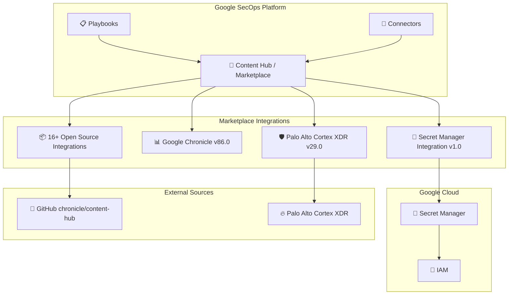

# Google SecOps Marketplace: Secret Manager 統合と複数インテグレーションのオープンソース化

**リリース日**: 2026-06-17

**サービス**: Google SecOps Marketplace

**機能**: Secret Manager Integration v1.0 / 複数インテグレーションのソースコード公開 / バグ修正

**ステータス**: GA (General Availability)

📊 [このアップデートのインフォグラフィックを見る](https://takech9203.github.io/google-cloud-news-summary/20260617-google-secops-marketplace-secret-manager-integration.html)

## 概要

Google SecOps Marketplace に Secret Manager 統合 (Version 1.0) が新たに追加された。これにより、SecOps SOAR のプレイブックやインテグレーションからGoogle Cloud Secret Manager に保存されたシークレット (API キー、パスワード、証明書等) を直接参照できるようになり、認証情報管理のセキュリティと運用効率が大幅に向上する。

また、16 種類のインテグレーションのソースコードが GitHub 上で公開され、コミュニティによるコードレビューやカスタマイズが可能になった。さらに、Google Chronicle v86.0 ではコネクタのページネーション問題が修正され、Palo Alto Cortex XDR v29.0 ではホスト名抽出ロジックが改善された。

**アップデート前の課題**

- インテグレーションの認証情報 (API キー、サービスアカウント JSON) をインテグレーション設定画面に直接入力する必要があり、シークレットのローテーションや一元管理が困難だった
- インテグレーションのソースコードがクローズドであり、ユーザーが動作を確認したりカスタマイズしたりすることができなかった
- Google Chronicle コネクタで nextPageToken / nextPageStartTime のハンドリングに問題があり、大量アラート取得時にデータ欠損が発生する可能性があった
- Palo Alto Cortex XDR のホスト名抽出ロジックに不備があり、一部のイベントでホスト名が正しくパースされなかった

**アップデート後の改善**

- Secret Manager 統合により、認証情報を Secret Manager で一元管理し、自動ローテーションや IAM ベースのアクセス制御が適用できるようになった
- 16 種類のインテグレーションが GitHub でオープンソース化され、透明性の向上とコミュニティコントリビューションが可能になった
- Google Chronicle v86.0 でページネーションの問題が修正され、大量データの確実な取得が保証されるようになった
- Palo Alto Cortex XDR v29.0 でホスト名抽出ロジックが更新され、正確なアセット識別が可能になった

## アーキテクチャ図

SecOps Marketplace のインテグレーションが Secret Manager と連携することで、認証情報の安全な管理と自動ローテーションを実現する。オープンソース化されたインテグレーションは GitHub リポジトリを通じて透明性を確保する。

## サービスアップデートの詳細

### 主要機能

1. **Secret Manager Integration (Version 1.0)**
   - Google Cloud Secret Manager に保存されたシークレットを SecOps プレイブックやインテグレーションから直接参照可能
   - IAM ベースのきめ細かなアクセス制御をシークレットに適用
   - シークレットのバージョニングによるロールバック・リカバリ対応
   - AES-256 ビット暗号化による転送時・保存時のデータ保護
   - CMEK (Customer-Managed Encryption Keys) のサポート
   - 自動ローテーションによるコンプライアンス要件への対応

2. **インテグレーションのオープンソース化 (16 種類)**
   - AlienVault USM Appliance v29.0
   - AlienVaultTI v15.0
   - Arcsight v46.0
   - Axonius v8.0
   - BMC Helix Remedyforce v18.0
   - Cisco AMP v24.0
   - EasyVista v8.0
   - Mandiant v10.0
   - Office 365 Management API v11.0
   - SCCM v22.0
   - SonicWall-Beta v9.0
   - Stellar Cyber Starlight v19.0
   - Symantec Email Security.Cloud v6.0
   - Twilio v16.0
   - XForce v20.0
   - Zabbix v17.0

3. **Google Chronicle v86.0 - コネクタバグ修正**
   - nextPageToken および nextPageStartTime のハンドリングを修正
   - 大量アラート取得時のページネーション処理が正常に動作するよう改善
   - データ欠損のリスクを解消

4. **Palo Alto Cortex XDR v29.0 - ホスト名抽出ロジック更新**
   - ホスト名抽出のパースロジックを改善
   - より多様なホスト名フォーマットに対応
   - アセットの正確な識別精度が向上

## 技術仕様

### Secret Manager 統合の主要機能

| 項目 | 詳細 |
|------|------|
| バージョン | 1.0 |
| 暗号化 (転送時) | TLS |
| 暗号化 (保存時) | AES-256 ビット (デフォルト) / CMEK (オプション) |
| アクセス制御 | IAM ロール・条件ベース |
| レプリケーション | 自動 / ユーザー管理 |
| ローテーション | 自動ローテーション対応 |
| バージョニング | シークレットバージョンによるロールバック可能 |

### オープンソース化されたインテグレーション

| インテグレーション名 | バージョン | カテゴリ |
|---------------------|-----------|---------|
| AlienVault USM Appliance | v29.0 | SIEM |
| AlienVaultTI | v15.0 | 脅威インテリジェンス |
| Arcsight | v46.0 | SIEM |
| Axonius | v8.0 | 資産管理 |
| BMC Helix Remedyforce | v18.0 | ITSM |
| Cisco AMP | v24.0 | エンドポイント保護 |
| EasyVista | v8.0 | ITSM |
| Mandiant | v10.0 | 脅威インテリジェンス |
| Office 365 Management API | v11.0 | クラウドセキュリティ |
| SCCM | v22.0 | エンドポイント管理 |
| SonicWall-Beta | v9.0 | ネットワークセキュリティ |
| Stellar Cyber Starlight | v19.0 | XDR |
| Symantec Email Security.Cloud | v6.0 | メールセキュリティ |
| Twilio | v16.0 | 通信 |
| XForce | v20.0 | 脅威インテリジェンス |
| Zabbix | v17.0 | 監視 |

## メリット

### ビジネス面

- **セキュリティコンプライアンスの向上**: Secret Manager 統合により、認証情報の管理がコンプライアンス要件 (SOC 2, ISO 27001 等) に準拠しやすくなる
- **運用コストの削減**: シークレットの手動ローテーションや管理作業が自動化され、運用負荷が軽減される
- **透明性の確保**: ソースコードの公開により、セキュリティ監査でインテグレーションの動作を検証可能になった

### 技術面

- **認証情報の一元管理**: Secret Manager で全インテグレーションの認証情報を集中管理でき、設定画面への直接入力が不要になった
- **自動ローテーション**: 定期的な認証情報の更新が自動化され、クレデンシャルの漏洩リスクが軽減される
- **監査ログの統合**: Secret Manager のアクセスログと Cloud Audit Logs により、誰がいつ認証情報にアクセスしたかを追跡可能
- **コミュニティコントリビューション**: オープンソース化により、バグ修正や機能追加のプルリクエストが可能

## ユースケース

### ユースケース 1: SOC チームの認証情報セキュリティ強化

**シナリオ**: SOC チームが複数のサードパーティセキュリティツール (Palo Alto, CrowdStrike, AlienVault 等) と SecOps を連携させている環境で、各ツールの API キーを安全に管理したい。

**効果**: Secret Manager 統合により、API キーを Secret Manager に一元保存し、SOC アナリストには実際のキー値を公開せずにインテグレーションを利用させることが可能になる。キーの自動ローテーションにより、定期的なセキュリティ更新も自動化される。

### ユースケース 2: カスタムインテグレーションの開発

**シナリオ**: 組織固有のセキュリティ要件に対応するため、公開されたインテグレーションのソースコードをベースにカスタム版を開発したい。

**効果**: GitHub で公開されたソースコードをフォークし、組織の要件に合わせたカスタマイズが可能。コードの品質を自社で検証した上で、Content Hub の Custom コンテンツとしてデプロイできる。

## 関連サービス・機能

- **Google Cloud Secret Manager**: シークレット管理の中核サービス。API キー、パスワード、証明書などの機密データを安全に保存・管理
- **Cloud IAM**: Secret Manager へのアクセス制御を提供。ロールベースのアクセス制御と条件付きポリシーに対応
- **Cloud Audit Logs**: Secret Manager へのアクセスを監査ログとして記録。セキュリティ監査・コンプライアンス対応に活用
- **Google SecOps SOAR**: セキュリティオーケストレーション・自動化・レスポンス基盤。プレイブックから Secret Manager 統合を利用
- **Google SecOps Content Hub**: インテグレーション、プレイブック、検知ルールを管理する統合プラットフォーム

## 参考リンク

- 📊 [インフォグラフィック](https://takech9203.github.io/google-cloud-news-summary/20260617-google-secops-marketplace-secret-manager-integration.html)
- [公式リリースノート](https://docs.cloud.google.com/release-notes#June_17_2026)
- [Google SecOps Content Hub ドキュメント](https://docs.cloud.google.com/chronicle/docs/secops/content_hub)
- [Secret Manager ドキュメント](https://docs.cloud.google.com/secret-manager/docs/overview)
- [chronicle/content-hub GitHub リポジトリ](https://github.com/chronicle/content-hub)
- [Google Chronicle インテグレーション](https://docs.cloud.google.com/chronicle/docs/soar/marketplace-integrations/google-chronicle)

## まとめ

Secret Manager 統合の追加により、Google SecOps の認証情報管理が Google Cloud のセキュリティベストプラクティスに完全に準拠する形で運用可能になった。16 種類のインテグレーションのオープンソース化はコミュニティの透明性とエコシステムの発展に寄与する。SecOps を利用中の組織は、既存のインテグレーション認証情報を Secret Manager に移行し、自動ローテーションの設定を検討することを推奨する。

---

**タグ**: #GoogleSecOps #SecretManager #Marketplace #SOAR #OpenSource #Chronicle #SecurityOperations #ContentHub
