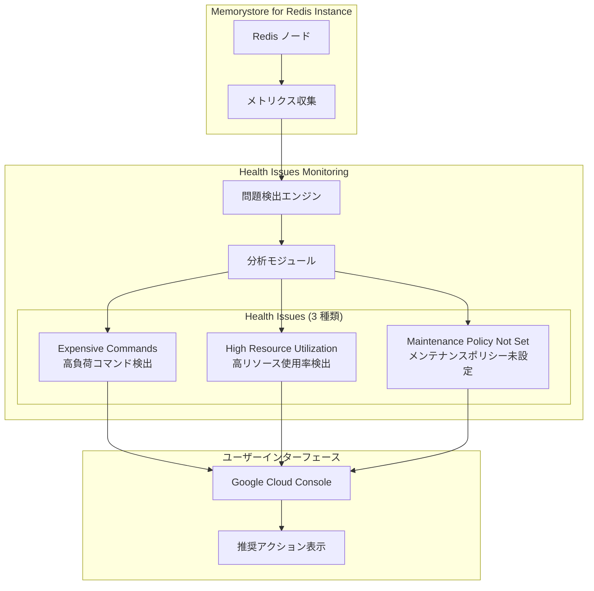

# Memorystore for Redis: Health Issues Monitoring (GA)

**リリース日**: 2026-06-17

**サービス**: Memorystore for Redis

**機能**: Health Issues Monitoring (一般提供開始)

**ステータス**: GA (General Availability)

:bar_chart: [このアップデートのインフォグラフィックを見る](https://takech9203.github.io/google-cloud-news-summary/20260617-memorystore-redis-health-issues-ga.html)

## 概要

Google Cloud は Memorystore for Redis の Health Issues Monitoring 機能の一般提供 (GA) を発表しました。この機能は、Redis インスタンスの健全性に関する問題を自動的に検出し、具体的な解決策を提案するプロアクティブな監視機能です。これにより、運用チームはインスタンスのパフォーマンス問題を迅速に特定し、ダウンタイムを最小限に抑えることができます。

今回 GA となった Health Issues は「高負荷コマンド (Expensive commands)」「高リソース使用率 (High resource utilization)」「メンテナンスポリシー未設定 (Maintenance policy not set)」の 3 種類です。それぞれの問題に対して、Google Cloud コンソール上で具体的な対処方法が提示されるため、Redis の運用経験が浅いチームでも適切な対応を取ることができます。

この機能は、Memorystore for Redis を利用するすべてのユーザーを対象としており、追加料金なしで利用可能です。特に、本番環境で Redis を運用している SRE チームやプラットフォームエンジニアにとって、障害の予防保全に大きく貢献する機能です。

**アップデート前の課題**

- Redis インスタンスのパフォーマンス低下の原因特定には、Cloud Monitoring のメトリクスを個別に確認し、手動で分析する必要があった
- KEYS、HGETALL、EVAL などの高負荷コマンドの使用がインスタンスに与える影響を事前に把握する仕組みがなかった
- メンテナンスウィンドウの設定漏れを検出する自動化された仕組みがなく、予期しないタイミングでメンテナンスが実行されるリスクがあった
- リソース使用率の問題を検出しても、具体的な解決策が自動で提示されることはなかった

**アップデート後の改善**

- Health Issues 機能がインスタンスの健全性問題を自動的に検出し、Google Cloud コンソール上で通知する
- 高負荷コマンドの使用を検知し、代替コマンド (例: KEYS の代わりに SCAN) の使用を提案する
- CPU やメモリの高使用率を検出し、スケールアップやコマンド最適化などの具体的な解決策を提示する
- メンテナンスポリシーが未設定のインスタンスを特定し、トラフィックが少ない最適な時間帯を提案する

## アーキテクチャ図



Health Issues Monitoring は Redis インスタンスからメトリクスを収集し、3 種類の問題パターンを検出して、Google Cloud コンソール上で推奨アクションとともに表示します。

## サービスアップデートの詳細

### 主要機能

1. **Expensive Commands (高負荷コマンド検出)**
   - KEYS、LRANGE、HGETALL、ZRANGE、EVAL などのリソース集約型コマンドの使用を検出
   - 高レイテンシ、クライアントタイムアウト、メモリ圧迫、レプリケーション遅延の原因となるコマンドを特定
   - 代替コマンド (SCAN、HSCAN、SSCAN、UNLINK など) の具体的な提案を提示
   - SLOWLOG と連携してレイテンシの原因となるコマンドを特定

2. **High Resource Utilization (高リソース使用率検出)**
   - CPU 使用率がプライマリノードで 0.8 秒、レプリカノードで 0.5 秒を超過する状態を検出
   - メモリ使用率が最大容量に近づいている状態を検出
   - スケールアップの推奨や、より高い容量ティアへの移行を提案
   - maxmemory-gb パラメータの最適化提案を含む

3. **Maintenance Policy Not Set (メンテナンスポリシー未設定検出)**
   - メンテナンスウィンドウが設定されていないインスタンスを特定
   - トラフィックパターンを分析し、最適なメンテナンス時間帯を提案
   - メンテナンス通知の設定を推奨し、事前通知 (7 日前) を受け取れるようにガイド
   - Basic Tier (約 5 分のダウンタイム) と Standard Tier (約 15 秒のフェイルオーバー) の影響を考慮した提案

## 技術仕様

### 検出対象の高負荷コマンド

| カテゴリ | 高負荷コマンド | 推奨代替コマンド |
|------|------|------|
| キースペース全体走査 | KEYS | SCAN |
| 可変長キーセット取得 | LRANGE | 範囲を制限して使用 |
| 可変長キーセット取得 | ZRANGE | 範囲を制限して使用 |
| ハッシュ全取得 | HGETALL | HSCAN |
| セット全取得 | SMEMBERS | SSCAN |
| スクリプト実行 | EVAL / EVALSHA | 無限ループ回避を確認 |
| キー削除 | DELETE | UNLINK |
| Pub/Sub | PUBLISH / SUBSCRIBE | SPUBLISH / SSUBSCRIBE |

### リソース使用率の閾値

| 項目 | 推奨閾値 | 説明 |
|------|------|------|
| プライマリノード CPU | 0.8 秒以下 | Main Thread CPU Seconds メトリクス |
| レプリカノード CPU | 0.5 秒以下 | Read Replica 使用時 |
| System Memory Usage Ratio | 80% 以下 | 通常運用時の推奨値 |
| メンテナンス時メモリ | 50% 以下 | メンテナンス中の推奨値 |

### 関連メトリクス

```json
{
  "cpu_metrics": {
    "main_thread": "redis.googleapis.com/stats/cpu_utilization_main_thread",
    "total_cpu": "redis.googleapis.com/stats/cpu_utilization"
  },
  "memory_metrics": {
    "system_memory_usage_ratio": "redis.googleapis.com/stats/memory/system_memory_usage_ratio",
    "maxmemory": "redis.googleapis.com/stats/memory/maxmemory"
  },
  "performance_metrics": {
    "calls": "redis.googleapis.com/stats/calls",
    "connected_clients": "redis.googleapis.com/stats/connected_clients"
  }
}
```

## 設定方法

### 前提条件

1. Memorystore for Redis インスタンスが作成済みであること
2. Google Cloud コンソールへのアクセス権限があること
3. `redis.instances.get` 権限を持つ IAM ロールが付与されていること

### 手順

#### ステップ 1: Health Issues の確認

```bash
# Google Cloud コンソールで Memorystore ページにアクセス
# https://console.cloud.google.com/memorystore/redis/instances

# gcloud CLI でインスタンスの状態を確認
gcloud redis instances describe INSTANCE_NAME \
  --region=REGION
```

Health Issues は Google Cloud コンソールのインスタンス詳細ページに自動的に表示されます。追加の設定は不要です。

#### ステップ 2: メンテナンスウィンドウの設定 (推奨)

```bash
# メンテナンスウィンドウを設定
gcloud redis instances update INSTANCE_NAME \
  --region=REGION \
  --maintenance-window-day=SUNDAY \
  --maintenance-window-hour=01
```

トラフィックが最も少ない時間帯にメンテナンスを実行するよう設定します。

#### ステップ 3: Cloud Monitoring アラートの設定 (推奨)

```bash
# CPU 使用率のアラートポリシーを作成
gcloud alpha monitoring policies create \
  --notification-channels=CHANNEL_ID \
  --display-name="Memorystore Redis CPU Alert" \
  --condition-display-name="High CPU Utilization" \
  --condition-filter='resource.type="redis_instance" AND metric.type="redis.googleapis.com/stats/cpu_utilization_main_thread"' \
  --condition-threshold-value=0.8 \
  --condition-threshold-comparison=COMPARISON_GT
```

Health Issues と合わせて Cloud Monitoring のアラートを設定することで、より迅速な対応が可能になります。

## メリット

### ビジネス面

- **ダウンタイムの削減**: パフォーマンス問題を早期に検出し、サービス障害を未然に防止。SLA の維持に貢献
- **運用コストの削減**: 手動の監視・分析作業が不要になり、SRE チームの工数を削減。問題の原因特定にかかる時間を大幅に短縮
- **計画的なメンテナンス**: トラフィックの少ない時間帯にメンテナンスを集約し、ユーザー影響を最小化

### 技術面

- **プロアクティブな問題検出**: 問題が顕在化する前に予兆を検出し、具体的な解決策を提示
- **ベストプラクティスの自動適用**: Google Cloud の推奨事項に基づく最適化提案を自動的に受け取れる
- **追加設定不要**: 既存のインスタンスに対して自動的に有効化され、追加のエージェントやソフトウェアのインストールは不要

## デメリット・制約事項

### 制限事項

- 現時点で対応する Health Issues は 3 種類に限定されている (Expensive commands、High resource utilization、Maintenance policy not set)
- Health Issues の通知はコンソール上での表示が中心であり、プログラマティックな取得には Cloud Monitoring との連携が必要
- Memorystore for Redis Cluster (別製品) には直接適用されない場合がある

### 考慮すべき点

- Health Issues は問題の検出と提案を行うが、自動修復は行わない。対処はユーザーの手動操作が必要
- 高負荷コマンドの代替に切り替える場合、アプリケーションコードの変更が必要になる場合がある
- メンテナンスウィンドウを設定しても、一部のメンテナンスはウィンドウを超過する可能性がある

## ユースケース

### ユースケース 1: E コマースサイトのセッションストア

**シナリオ**: 大規模 E コマースサイトで Redis をセッションストアとして使用。セール期間中に KEYS コマンドを使用した管理スクリプトが実行され、レイテンシが増加していた。

**実装例**:
```python
# Before: 高負荷コマンド (Health Issues が検出)
keys = redis_client.keys("session:*")

# After: 推奨される代替コマンド
cursor = 0
keys = []
while True:
    cursor, partial_keys = redis_client.scan(cursor, match="session:*", count=100)
    keys.extend(partial_keys)
    if cursor == 0:
        break
```

**効果**: Health Issues が KEYS コマンドの使用を検出し、SCAN への移行を推奨。切り替え後、P99 レイテンシが 50% 以上改善。

### ユースケース 2: リアルタイム分析基盤のキャッシュ

**シナリオ**: リアルタイムダッシュボードのキャッシュとして Redis を使用。メモリ使用率が 90% を超え、キーの eviction が頻発していたが気付かなかった。

**効果**: High resource utilization の Health Issue により問題を早期発見。容量ティアのスケールアップを実施し、eviction の発生をゼロに抑制。

### ユースケース 3: マイクロサービス間の Pub/Sub

**シナリオ**: マイクロサービスアーキテクチャで Redis Pub/Sub を活用。メンテナンスウィンドウを設定しておらず、ピーク時間帯にメンテナンスが実行され、一時的にサービスが中断。

**効果**: Maintenance policy not set の Health Issue により、メンテナンスポリシーの設定を促される。日曜日の早朝にウィンドウを設定し、計画外のダウンタイムを解消。

## 料金

Health Issues Monitoring 機能自体は追加料金なしで Memorystore for Redis の全インスタンスに対して利用可能です。

### Memorystore for Redis の基本料金

| 容量ティア | 料金 (オンデマンド) | 1 年 CUD (20% 割引) | 3 年 CUD (40% 割引) |
|--------|-----------------|-----------------|-----------------|
| M1 (1-4 GB) | リージョンにより異なる | 対象外 | 対象外 |
| M2 (5-10 GB) | 約 $0.049/GB/時 | 約 $0.039/GB/時 | 約 $0.029/GB/時 |
| M3 (11-35 GB) | 約 $0.049/GB/時 | 約 $0.039/GB/時 | 約 $0.029/GB/時 |
| M4 (36-100 GB) | 約 $0.035/GB/時 | 約 $0.028/GB/時 | 約 $0.021/GB/時 |
| M5 (101-300 GB) | 約 $0.024/GB/時 | 約 $0.019/GB/時 | 約 $0.014/GB/時 |

※ 料金はリージョンにより異なります。最新の料金は公式料金ページをご確認ください。

## 利用可能リージョン

Health Issues Monitoring は Memorystore for Redis が利用可能なすべてのリージョンで利用できます。主要なリージョンは以下の通りです:

- **アジア太平洋**: 東京 (asia-northeast1)、大阪 (asia-northeast2)、ソウル (asia-northeast3)、シンガポール (asia-southeast1)、ジャカルタ (asia-southeast2)、ムンバイ (asia-south1)、デリー (asia-south2)、香港 (asia-east2)、台湾 (asia-east1)、シドニー (australia-southeast1)、メルボルン (australia-southeast2)
- **北米**: アイオワ (us-central1)、サウスカロライナ (us-east1)、北バージニア (us-east4)、オレゴン (us-west1)、ロサンゼルス (us-west2)、ソルトレイクシティ (us-west3)、ラスベガス (us-west4)、モントリオール (northamerica-northeast1)、トロント (northamerica-northeast2)
- **ヨーロッパ**: ベルギー (europe-west1)、ロンドン (europe-west2)、フランクフルト (europe-west3)、オランダ (europe-west4)、フィンランド (europe-north1)、チューリッヒ (europe-west6)、ワルシャワ (europe-central2)、ミラノ (europe-west8)、パリ (europe-west9)、マドリード (europe-southwest1)、トリノ (europe-west12)
- **中東**: ドーハ (me-central1)、ダンマーム (me-central2)、テルアビブ (me-west1)
- **南米**: サンパウロ (southamerica-east1)、サンティアゴ (southamerica-west1)

## 関連サービス・機能

- **Cloud Monitoring**: Health Issues と連携し、メトリクスのアラート設定やダッシュボード作成が可能
- **Cloud Logging**: Redis のアクティビティログや監査ログを確認し、問題の詳細な原因分析に活用
- **Recommender API**: Google Cloud の他のサービスでも利用される最適化提案フレームワークとの連携
- **Memorystore for Redis Cluster**: クラスタ版でも同様の監視ベストプラクティスが適用可能
- **Cloud Operations Suite**: 統合的な可観測性プラットフォームとして Health Issues の情報を活用

## 参考リンク

- :bar_chart: [インフォグラフィック](https://takech9203.github.io/google-cloud-news-summary/20260617-memorystore-redis-health-issues-ga.html)
- [公式リリースノート](https://cloud.google.com/release-notes#June_17_2026)
- [Memorystore for Redis ドキュメント](https://cloud.google.com/memorystore/docs/redis)
- [一般的なベストプラクティス](https://cloud.google.com/memorystore/docs/redis/general-best-practices)
- [メンテナンスについて](https://cloud.google.com/memorystore/docs/redis/about-maintenance)
- [トラブルシューティング](https://cloud.google.com/memorystore/docs/redis/troubleshoot-issues)
- [インスタンスのモニタリング](https://cloud.google.com/memorystore/docs/redis/monitor-instances)
- [料金ページ](https://cloud.google.com/memorystore/pricing)

## まとめ

Memorystore for Redis の Health Issues Monitoring (GA) は、Redis インスタンスの健全性を自動的に監視し、パフォーマンス問題の予防保全を実現する重要な機能です。高負荷コマンドの検出、リソース使用率の監視、メンテナンスポリシーの設定確認を通じて、運用チームは問題が顕在化する前に対処できるようになります。追加コストなしで利用できるため、Memorystore for Redis を利用しているすべてのユーザーは、Google Cloud コンソールで Health Issues を確認し、推奨されるアクションを実施することを強く推奨します。

---

**タグ**: #Memorystore #Redis #HealthIssues #Monitoring #GA #パフォーマンス最適化 #運用効率化 #プロアクティブ監視
