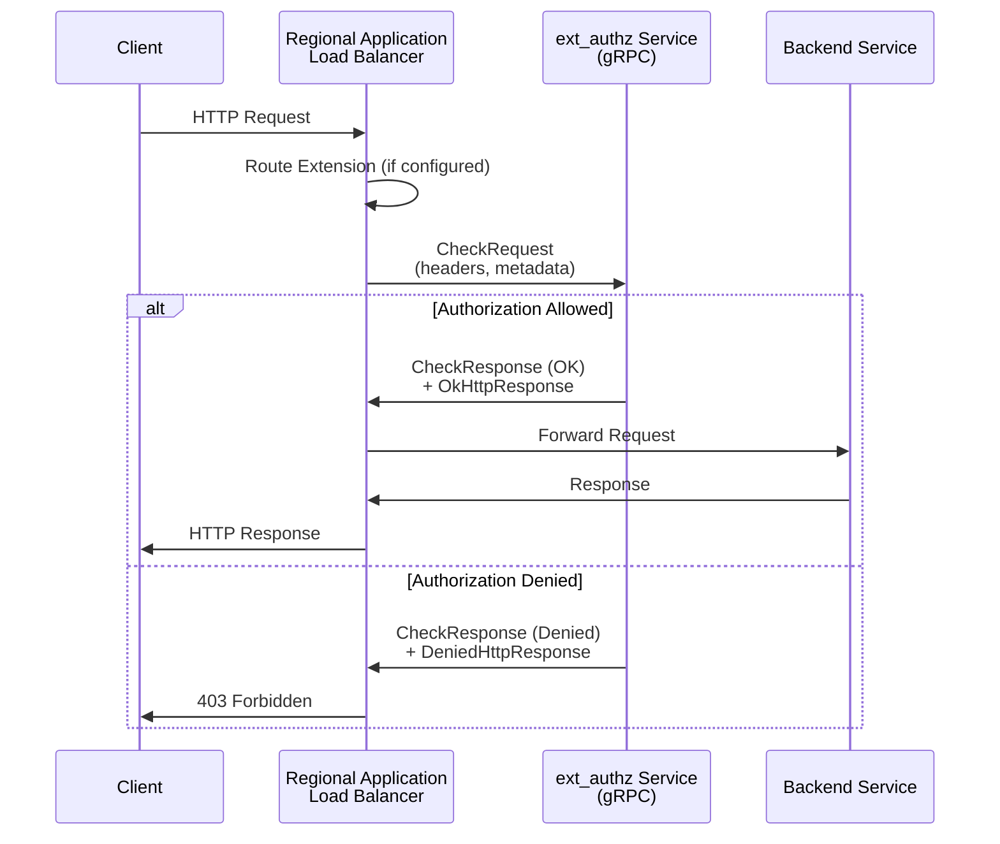

# Service Extensions: ext_authz Envoy gRPC API プロトコルが GA

**リリース日**: 2026-06-17

**サービス**: Service Extensions

**機能**: ext_authz Envoy gRPC API プロトコルのサポート (リージョナル Application Load Balancer)

**ステータス**: GA (一般提供)

[このアップデートのインフォグラフィックを見る](https://takech9203.github.io/google-cloud-news-summary/20260617-service-extensions-ext-authz-envoy-grpc-ga.html)

## 概要

Google Cloud Service Extensions において、`ext_authz` Envoy gRPC API プロトコルのサポートがリージョナル外部 Application Load Balancer およびリージョナル内部 Application Load Balancer で一般提供 (GA) になった。これにより、ロードバランサーのデータパスにおいて外部の認可サービスに認可判断を委譲する機能が本番環境で安定して利用できるようになった。

`ext_authz` プロトコルは、受信リクエストの認可チェックを外部の独立したサービスに委譲するための標準的な Envoy gRPC API である。従来の `ext_proc` プロトコルとは異なり、認可判断に特化したシンプルな API を提供し、リクエストヘッダーやメタデータを検査して許可/拒否の判断を返す。

対象ユーザーは、カスタム認可ロジックを必要とするエンタープライズアプリケーションを運用するクラウドアーキテクトやセキュリティエンジニアである。

**アップデート前の課題**

- リージョナル Application Load Balancer での `ext_authz` プロトコルはプレビュー段階であり、本番環境での利用に SLA が保証されなかった
- 認可拡張には `ext_proc` プロトコルを使用する必要があり、認可専用のシンプルな API を利用できなかった
- リージョナルロードバランサーで外部認可エンジンを統合する際、GA レベルのサポートがないため採用を躊躇するケースがあった

**アップデート後の改善**

- `ext_authz` プロトコルがリージョナル外部/内部 Application Load Balancer で GA となり、SLA に基づいた本番利用が可能になった
- 認可判断に特化したシンプルな `CheckRequest`/`CheckResponse` API を GA レベルで使用できるようになった
- `wireFormat: EXT_AUTHZ_GRPC` オプションを指定するだけで、既存の認可拡張を `ext_authz` プロトコルに切り替え可能になった

## アーキテクチャ図



リージョナル Application Load Balancer が受信リクエストのヘッダーを `ext_authz` サービスに送信し、認可判断 (許可/拒否) を受けてリクエストの転送または拒否を決定するフローを示す。

## サービスアップデートの詳細

### 主要機能

1. **ext_authz プロトコルによる認可委譲**
   - Envoy External Authorization gRPC API に準拠した標準プロトコル
   - `CheckRequest` メッセージでリクエストの属性 (ヘッダー、メタデータ) を外部サービスに送信
   - `CheckResponse` メッセージで認可判断 (OK / Denied) を受信
   - `dynamic_metadata` フィールドで後続のエクステンション (トラフィック拡張など) にメタデータを引き渡し可能

2. **リージョナルロードバランサーでの GA サポート**
   - リージョナル外部 Application Load Balancer (`EXTERNAL_MANAGED`)
   - リージョナル内部 Application Load Balancer (`INTERNAL_MANAGED`)
   - 本番環境での SLA 保証付き利用が可能

3. **認可ポリシーとの統合**
   - Authorization Policy の `customProvider` フィールドで認可拡張を指定
   - `REQUEST_AUTHZ` プロファイルタイプでリクエストヘッダーベースの認可を実行
   - 条件式 (CEL) による認可拡張の呼び出し条件の制御

## 技術仕様

### ext_authz API の構造

| 項目 | 詳細 |
|------|------|
| プロトコル | Envoy External Authorization gRPC API v3 |
| サービス定義 | `service Authorization { rpc Check(CheckRequest) returns (CheckResponse) }` |
| 入力 | `CheckRequest` (リクエスト属性: ヘッダー、メタデータ) |
| 出力 | `CheckResponse` (status + ok_response / denied_response) |
| タイムアウト | 設定可能 (例: `timeout: "0.1s"`) |
| フェイルオープン | `failOpen` パラメータで設定可能 |
| ワイヤフォーマット指定 | `wireFormat: EXT_AUTHZ_GRPC` |

### ext_proc との比較

| 項目 | ext_authz | ext_proc |
|------|-----------|----------|
| 用途 | 認可判断に特化 | リクエスト/レスポンスの処理全般 |
| API 方式 | Unary RPC (Check) | Bidirectional Streaming |
| ボディ処理 | 不可 (ヘッダーのみ) | 可能 |
| レスポンス変更 | 限定的 (ヘッダーのみ) | ヘッダー + ボディ |
| 対応エクステンション | 認可拡張のみ | ルート、トラフィック、認可拡張 |

## 設定方法

### 前提条件

1. リージョナル外部またはリージョナル内部 Application Load Balancer が設定済みであること
2. callout バックエンドサービス (HTTP/2 プロトコル) が構成済みであること
3. `ext_authz` プロトコルを実装した gRPC サーバーがデプロイ済みであること

### 手順

#### ステップ 1: 認可拡張の定義

```yaml
# authz-extension.yaml
name: my-authz-ext
authority: ext11.com
loadBalancingScheme: EXTERNAL_MANAGED  # or INTERNAL_MANAGED
service: https://www.googleapis.com/compute/v1/projects/PROJECT_ID/regions/REGION/backendServices/authz-service
forwardHeaders:
  - Authorization
failOpen: false
timeout: "0.1s"
wireFormat: EXT_AUTHZ_GRPC
```

#### ステップ 2: 認可拡張のインポート

```bash
gcloud service-extensions authz-extensions import my-authz-ext \
  --source=authz-extension.yaml \
  --location=REGION
```

#### ステップ 3: 認可ポリシーの定義

```yaml
# authz-policy-custom.yaml
name: my-authz-policy-custom
target:
  loadBalancingScheme: EXTERNAL_MANAGED
  resources:
    - "https://www.googleapis.com/compute/v1/projects/PROJECT_ID/regions/REGION/forwardingRules/LB_FORWARDING_RULE"
policyProfile: REQUEST_AUTHZ
httpRules:
  - to:
      operations:
        - paths:
            - exact: "/api/payments"
    when: 'request.headers["Authorization"] != ""'
    action: CUSTOM
    customProvider:
      authzExtension:
        resources:
          - "projects/PROJECT_ID/locations/REGION/authzExtensions/my-authz-ext"
```

#### ステップ 4: 認可ポリシーのインポート

```bash
gcloud beta network-security authz-policies import my-authz-policy-custom \
  --source=authz-policy-custom.yaml \
  --location=REGION
```

## メリット

### ビジネス面

- **本番環境での安定運用**: GA となったことで SLA に基づいた本番環境での利用が可能になり、エンタープライズ要件を満たす
- **コンプライアンス対応の柔軟性**: 複雑な認可ロジック (ABAC、RBAC、カスタムポリシー) をロードバランサーレベルで適用可能

### 技術面

- **シンプルな API**: `ext_proc` と比較して認可に特化したシンプルな Unary RPC により、実装の複雑さが低減
- **低レイテンシ**: ヘッダーのみを送信し、ストリーミング不要のため、認可判断のオーバーヘッドが最小限
- **メタデータ引き渡し**: `dynamic_metadata` により認可結果を後続のトラフィック拡張に伝達可能

## デメリット・制約事項

### 制限事項

- 認可拡張はフォワーディングルールに 1 つのみアタッチ可能
- ロードバランサーはリクエストボディを callout バックエンドサービスに転送しない
- callout バックエンドサービスは HTTP/2 プロトコルを使用する必要がある
- callout バックエンドサービスでは Cloud Armor、IAP、Cloud CDN ポリシーを使用できない
- gRPC レスポンスメッセージの最大サイズは 128 KB

### 考慮すべき点

- ext_authz サービスの障害時の動作を `failOpen` パラメータで適切に設定する必要がある
- レイテンシ最適化のため、callout サービスはロードバランサーと同じリージョン/ゾーンにデプロイすることを推奨
- 許可されないヘッダー名・値を CheckResponse で返すと 500 Internal Error が発生する

## ユースケース

### ユースケース 1: マイクロサービスのカスタム認可

**シナリオ**: 複数のマイクロサービスで構成されたアプリケーションで、IAM だけでは表現できないきめ細かいアクセス制御 (テナント分離、リソースレベル RBAC) が必要な場合。

**実装例**:
```yaml
# JWT トークンの Authorization ヘッダーを外部認可サービスに転送
wireFormat: EXT_AUTHZ_GRPC
forwardHeaders:
  - Authorization
  - X-Tenant-ID
```

**効果**: リクエストがバックエンドに到達する前にロードバランサーレベルで認可判断を行い、不正アクセスをブロック。バックエンドサービスの負荷を軽減。

### ユースケース 2: Open Policy Agent (OPA) との統合

**シナリオ**: OPA をポリシーエンジンとして使用し、Rego ポリシーで定義された複雑な認可ルールをロードバランサーに適用する。

**効果**: ポリシーの変更をアプリケーションコードの変更なしにリアルタイムで反映可能。中央集権的なポリシー管理を実現。

## 料金

Service Extensions の料金に関する最新情報は公式料金ページを参照のこと。

- [Service Extensions の料金](https://cloud.google.com/service-extensions/pricing)

## 利用可能リージョン

リージョナル外部 Application Load Balancer およびリージョナル内部 Application Load Balancer がサポートされるすべてのリージョンで利用可能。詳細は公式ドキュメントを参照。

## 関連サービス・機能

- **Cloud Load Balancing**: ext_authz 拡張のホスト環境となるリージョナル Application Load Balancer
- **Authorization Policy**: ext_authz 拡張を呼び出すための認可ポリシーフレームワーク
- **Service Extensions (ext_proc)**: ヘッダー/ボディの汎用処理に使用される別プロトコル
- **Cloud Armor**: ロードバランサーレベルの DDoS 防御とセキュリティポリシー (ext_authz と併用可能)
- **Identity-Aware Proxy (IAP)**: Google が管理する認証/認可機能 (ext_authz はカスタム認可に対応)

## 参考リンク

- [インフォグラフィック](https://takech9203.github.io/google-cloud-news-summary/20260617-service-extensions-ext-authz-envoy-grpc-ga.html)
- [公式リリースノート](https://docs.cloud.google.com/release-notes#June_17_2026)
- [Service Extensions Callouts 概要](https://docs.cloud.google.com/service-extensions/docs/callouts-overview)
- [認可拡張の設定](https://docs.cloud.google.com/service-extensions/docs/configure-authorization-extensions)
- [Cloud Load Balancing 拡張の概要](https://docs.cloud.google.com/service-extensions/docs/lb-extensions-overview)
- [認可ポリシーの設定](https://docs.cloud.google.com/load-balancing/docs/auth-policy/set-up-auth-policy-app-lb)

## まとめ

Service Extensions の `ext_authz` Envoy gRPC API プロトコルがリージョナル Application Load Balancer で GA となり、カスタム認可エンジンとの統合が本番環境で安定して利用可能になった。認可に特化したシンプルな API によりレイテンシを最小限に抑えつつ、複雑な認可判断をロードバランサーレベルで実現できる。リージョナル内部/外部 Application Load Balancer を使用して外部認可サービスとの統合を検討しているチームは、`wireFormat: EXT_AUTHZ_GRPC` オプションを活用した移行を推奨する。

---

**タグ**: #ServiceExtensions #ext_authz #Envoy #gRPC #ApplicationLoadBalancer #Authorization #GA #Security
