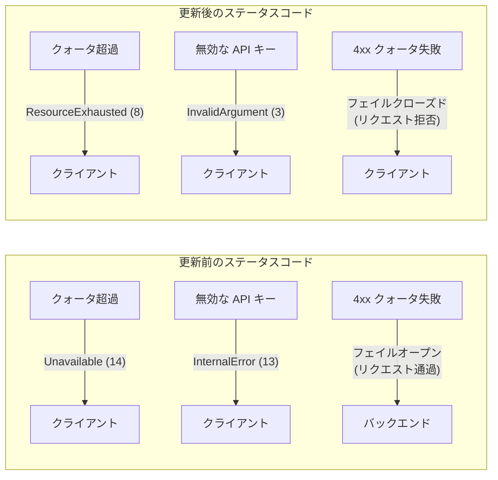

# API Gateway: ランタイムアーキテクチャの更新

**リリース日**: 2026-06-18

**サービス**: API Gateway

**機能**: ランタイムアーキテクチャ更新

**ステータス**: Change

[このアップデートのインフォグラフィックを見る](https://takech9203.github.io/google-cloud-news-summary/20260618-api-gateway-runtime-architecture-update.html)

## 概要

API Gateway のランタイムアーキテクチャが、Google Cloud Platform およびそのサービスとの統合を改善するために更新されました。この変更は既存の API Gateway 機能に影響を与えるものではありませんが、gRPC ゲートウェイにおけるステータスコードの変更と、クォータ超過時の動作変更が含まれています。

具体的には、gRPC API Gateway で返されるエラーステータスコードがより適切なコードに変更され、また 4xx クライアント側クォータ失敗時にリクエストを拒否する「フェイルクローズド」動作が gRPC および OpenAPI の両方の API Gateway に適用されるようになりました。

本更新のロールアウトは全 Google Cloud ゾーンへの展開に最大 4 週間かかる可能性があります。

**アップデート前の課題**

- クォータ超過時に `Unavailable` ステータスコードが返されており、実際のエラー原因（リソース枯渇）を正確に反映していなかった
- 無効な API キーの使用時に `InternalError` が返されており、クライアント側の問題であるにもかかわらずサーバーエラーと誤認される可能性があった
- 4xx クライアント側クォータ失敗時にリクエストが通過する可能性があった（フェイルオープン動作）

**アップデート後の改善**

- クォータ超過時に `ResourceExhausted` が返されるようになり、gRPC の標準的なステータスコード仕様に準拠
- 無効な API キー使用時に `InvalidArgument` が返されるようになり、クライアント側の入力エラーであることが明確に
- 4xx クライアント側クォータ失敗時にリクエストが拒否されるようになり（フェイルクローズド）、API の保護が強化された

## アーキテクチャ図



この図は、今回のアーキテクチャ更新による gRPC ステータスコードの変更と、クォータ失敗時の動作変更を示しています。更新後はより正確なステータスコードが返され、クォータ超過時の保護が強化されています。

## サービスアップデートの詳細

### 主要機能

1. **gRPC ステータスコードの変更**
   - クォータ超過エラー: `Unavailable` (コード 14) から `ResourceExhausted` (コード 8) に変更
   - 無効な API キーエラー: `InternalError` (コード 13) から `InvalidArgument` (コード 3) に変更
   - これらの変更は gRPC の公式ステータスコード仕様により適合している

2. **フェイルクローズド動作の導入**
   - 4xx クライアント側クォータ失敗時にリクエストを拒否する動作に変更
   - gRPC と OpenAPI の両方の API Gateway に適用
   - API のバックエンドサービスを過負荷から保護する効果がある

3. **段階的ロールアウト**
   - 全 Google Cloud ゾーンへの展開に最大 4 週間
   - インスタンスはロールアウト完了まで更新されない可能性あり

## 技術仕様

### gRPC ステータスコード変更の詳細

| エラー種別 | 新ステータスコード | 旧ステータスコード | gRPC コード番号 (新) |
|------|------|------|------|
| クォータ超過 | `ResourceExhausted` | `Unavailable` | 8 |
| 無効な API キー | `InvalidArgument` | `InternalError` | 3 |

### クォータ失敗時の動作変更

| 対象 | 変更前 | 変更後 |
|------|------|------|
| 4xx クライアント側クォータ失敗 (gRPC) | フェイルオープン（リクエスト通過） | フェイルクローズド（リクエスト拒否） |
| 4xx クライアント側クォータ失敗 (OpenAPI) | フェイルオープン（リクエスト通過） | フェイルクローズド（リクエスト拒否） |

### 影響を受けるリソース制限

| 項目 | 制限 |
|------|------|
| API 数 | 50 個 |
| API Config 数 | API あたり 100 個 |
| Gateway 数 | リージョンあたり 50 個 |
| リクエストサイズ | 32 MB |
| レスポンスサイズ | 32 MB |
| gRPC トランスコーディングリクエスト/レスポンスサイズ | 1 MB |

## 設定方法

### 前提条件

1. API Gateway が既にデプロイ済みであること
2. gRPC または OpenAPI ベースの API 定義が設定済みであること

### 手順

#### ステップ 1: 既存のエラーハンドリングの確認

```bash
# 現在のゲートウェイ設定を確認
gcloud api-gateway gateways describe GATEWAY_NAME \
  --location=LOCATION \
  --project=PROJECT_ID
```

既存のクライアントアプリケーションが `Unavailable` や `InternalError` ステータスコードに依存したリトライロジックを実装していないか確認してください。

#### ステップ 2: クライアント側コードの更新

```python
# gRPC クライアントのエラーハンドリング例（更新後）
import grpc

try:
    response = stub.MyMethod(request)
except grpc.RpcError as e:
    if e.code() == grpc.StatusCode.RESOURCE_EXHAUSTED:
        # クォータ超過 - バックオフしてリトライ
        print("クォータ超過: リクエストを遅延させてください")
    elif e.code() == grpc.StatusCode.INVALID_ARGUMENT:
        # 無効な API キー - 設定を確認
        print("無効な API キー: 認証情報を確認してください")
```

リトライロジックが新しいステータスコードに対応するよう更新してください。

#### ステップ 3: モニタリングの設定

```bash
# Cloud Monitoring でステータスコードのアラートを設定
gcloud monitoring policies create \
  --display-name="API Gateway Status Code Alert" \
  --condition-display-name="ResourceExhausted errors" \
  --condition-filter='resource.type="apigateway.googleapis.com/Gateway" AND metric.type="apigateway.googleapis.com/gateway/request_count" AND metric.label.response_code="RESOURCE_EXHAUSTED"'
```

新しいステータスコードに基づいたモニタリングとアラートを設定してください。

## メリット

### ビジネス面

- **API の信頼性向上**: フェイルクローズド動作により、クォータ超過時にバックエンドサービスが過負荷になることを防止
- **運用コスト削減**: より正確なエラーコードにより、トラブルシューティング時間が短縮される

### 技術面

- **gRPC 標準準拠**: ステータスコードが gRPC の公式仕様に準拠し、エコシステムとの互換性が向上
- **エラーの明確化**: クライアント側エラー（InvalidArgument）とサーバー側エラー（Internal）が明確に区別されるようになった
- **セキュリティ強化**: フェイルクローズド動作により、クォータ制限を超えたリクエストが確実にブロックされる

## デメリット・制約事項

### 制限事項

- ロールアウトに最大 4 週間かかるため、ゾーン間で一時的に動作が異なる可能性がある
- 既存のクライアントがステータスコードに基づくリトライロジックを実装している場合、更新が必要

### 考慮すべき点

- `Unavailable` をキャッチしてリトライしていたクライアントコードは、`ResourceExhausted` に対応するよう変更が必要
- フェイルクローズドへの変更により、以前は通過していたリクエストが拒否される可能性がある
- 段階的ロールアウト期間中は、異なるゾーンで異なる動作が見られる可能性があるため、テストに注意が必要

## ユースケース

### ユースケース 1: gRPC マイクロサービスのエラーハンドリング改善

**シナリオ**: gRPC ベースのマイクロサービスアーキテクチャで API Gateway を使用している場合、クォータ超過時のリトライ戦略をより適切に実装できる。

**実装例**:
```python
# ResourceExhausted に対する指数バックオフリトライ
import time
import grpc

def call_with_retry(stub, request, max_retries=3):
    for attempt in range(max_retries):
        try:
            return stub.MyMethod(request)
        except grpc.RpcError as e:
            if e.code() == grpc.StatusCode.RESOURCE_EXHAUSTED:
                wait_time = 2 ** attempt
                time.sleep(wait_time)
            else:
                raise
    raise Exception("最大リトライ回数を超過しました")
```

**効果**: `ResourceExhausted` ステータスコードにより、クォータ超過であることが明確になり、適切なバックオフ戦略を実装できる。

### ユースケース 2: API キー検証の強化

**シナリオ**: 無効な API キーを使用したリクエストに対して、クライアントが即座に問題を特定し修正できるようになる。

**効果**: `InvalidArgument` が返されることで、クライアント側の設定問題であることが明確になり、不要なサーバー側の調査が不要になる。

## 料金

本アーキテクチャ更新による追加料金は発生しません。API Gateway の既存の料金体系がそのまま適用されます。

## 利用可能リージョン

全 Google Cloud リージョンに適用されます。ただし、ロールアウトは段階的に行われ、全ゾーンへの展開完了に最大 4 週間かかります。

## 関連サービス・機能

- **Cloud Endpoints**: API Gateway と同様の API 管理機能を提供するサービス。同じ認証メカニズムをサポート
- **Service Control API**: API Gateway がクォータ管理やレート制限に使用するバックエンドサービス
- **Cloud Run**: API Gateway のバックエンドとして使用可能なサーバーレスコンピューティング環境
- **Cloud Monitoring**: 新しいステータスコードに基づくアラートやダッシュボードの設定に使用

## 参考リンク

- [インフォグラフィック](https://takech9203.github.io/google-cloud-news-summary/20260618-api-gateway-runtime-architecture-update.html)
- [公式リリースノート](https://docs.cloud.google.com/release-notes#June_18_2026)
- [API Gateway ドキュメント](https://docs.cloud.google.com/api-gateway/docs/about-api-gateway)
- [API Gateway アーキテクチャ概要](https://docs.cloud.google.com/api-gateway/docs/architecture-overview)
- [API Gateway gRPC 概要](https://docs.cloud.google.com/api-gateway/docs/grpc-overview)
- [API Gateway クォータと制限](https://docs.cloud.google.com/api-gateway/docs/quotas)

## まとめ

今回の API Gateway ランタイムアーキテクチャ更新は、gRPC ステータスコードの標準準拠と、クォータ超過時のセキュリティ強化を目的としたものです。既存機能への影響はありませんが、gRPC クライアントのエラーハンドリングコードを確認し、新しいステータスコードに対応するよう更新することを推奨します。ロールアウト期間中に予期しない動作が見られた場合は、Google Cloud Customer Care に連絡してください。

---

**タグ**: #APIGateway #gRPC #OpenAPI #ランタイム #ステータスコード #クォータ #フェイルクローズド #アーキテクチャ更新
