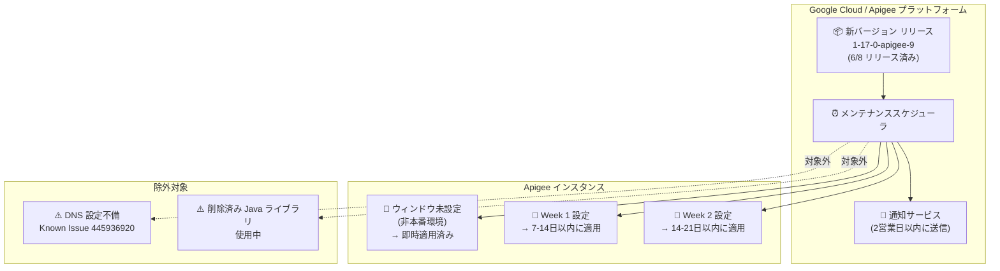

# Apigee X: メンテナンスアップデート (1-17-0-apigee-9)

**リリース日**: 2026-06-18

**サービス**: Apigee X

**機能**: メンテナンスウィンドウを設定したインスタンスへのバージョン 1-17-0-apigee-9 自動適用

**ステータス**: Announcement

:bar_chart: [このアップデートのインフォグラフィックを見る](https://takech9203.github.io/google-cloud-news-summary/20260618-apigee-x-maintenance-update-1-17-0-9.html)

## 概要

2026 年 6 月 18 日、Google はメンテナンスウィンドウを設定している Apigee インスタンスに対して、バージョン 1-17-0-apigee-9 へのメンテナンスアップデートを開始しました。対象となるのは現在のバージョンが 1-17-0-apigee-9 未満のインスタンスで、今後 7 日から 21 日以内にアップデートが適用されます。アップデート予定日を含む通知は 2 営業日以内に送信されます。

バージョン 1-17-0-apigee-9 は 2026 年 6 月 8 日にリリースされたバージョンで、SSRF 対策のセキュリティ修正や OpenTelemetry トレースエクスポートパイプラインの可観測性メトリクス追加などが含まれています。メンテナンスウィンドウの仕組みにより、非本番環境のインスタンス (ウィンドウ未設定) には既にロールアウトが完了しており、本番環境のインスタンスへの計画的な適用が今回開始されたことになります。

なお、DNS 設定に問題があるインスタンス (Known Issue 445936920) または削除済みの Apigee Java ライブラリを使用しているインスタンスはアップデート対象外となります。

**アップデート前の課題**

- メンテナンスウィンドウを設定したインスタンスは、一般ロールアウト後も手動対応なしには最新バージョンへ更新されない
- セキュリティ脆弱性 (SSRF 攻撃など) への対策が古いバージョンでは適用されていない
- OpenTelemetry トレースエクスポートの可観測性が限定的で、エクスポートの問題検出が困難

**アップデート後の改善**

- メンテナンスウィンドウに従い、指定した曜日・時間帯に自動的にバージョン 1-17-0-apigee-9 へアップデートが実施される
- Script ポリシーにおける SSRF 攻撃 (リンクローカルアドレスへのリクエスト) がブロックされる
- OpenTelemetry トレースエクスポートのメトリクス (エクスポート済みスパン数、レイテンシ、バッチサイズ、ドロップされたスパン数) が利用可能になる
- フォワードプロキシ経由の HTTP トレースエクスポート認証の問題が修正される

## アーキテクチャ図



Apigee のメンテナンスアップデートフロー。新バージョンはまずウィンドウ未設定のインスタンスに適用され、その後メンテナンスウィンドウを設定したインスタンスに対して Week 1、Week 2 の順序で計画的に適用されます。DNS 設定不備または削除済み Java ライブラリを使用しているインスタンスは対象外となります。

## サービスアップデートの詳細

### 主要機能

1. **バージョン 1-17-0-apigee-9 への自動アップデート**
   - メンテナンスウィンドウが設定されており、現行バージョンが 1-17-0-apigee-9 未満のインスタンスが対象
   - 7 日から 21 日以内にアップデートが実施される
   - アップデート予定日の通知が 2 営業日以内にメールで送信される

2. **セキュリティ修正 (Bug ID: 514384893)**
   - Script ポリシーにおける SSRF (Server-Side Request Forgery) をブロックするハードニング
   - リンクローカルアドレスへのリクエストを制限

3. **OpenTelemetry 可観測性の強化 (Bug ID: 512850756)**
   - トレースエクスポートパイプラインのメトリクスを追加
   - エクスポート済みスパン数、エクスポートレイテンシ、バッチサイズ、ドロップされたスパン数を報告

4. **フォワードプロキシ認証修正 (Bug ID: 515039499)**
   - HTTP 経由の OpenTelemetry トレースエクスポートがBasic認証を要求するフォワードプロキシを通過する際の認証失敗を修正

### 除外条件

以下のいずれかに該当するインスタンスはアップデート対象外です。

1. **DNS 設定不備 (Known Issue 445936920)**
   - バージョン 1-16-0-apigee-2 で自動 DNS フォールバック機能が削除されたことにより、以前は検出されなかった DNS 設定の問題が DNS エラーとして表面化する
   - ランタイムログで DNS 解決エラーを確認することで検出可能

2. **削除済み Apigee Java ライブラリの使用**
   - 2025 年 10 月 16 日のリリースノートで記載されたライブラリ削除に関連
   - `deprecated` ディレクトリに含まれていた JAR ライブラリが削除されており、Java Callout ポリシーでこれらを使用しているインスタンスは互換性の問題からアップデート対象外

## 技術仕様

### メンテナンスウィンドウ設定

| 項目 | 詳細 |
|------|------|
| 対象バージョン (アップデート後) | 1-17-0-apigee-9 |
| 対象条件 | メンテナンスウィンドウ設定済み かつ 現行バージョンが 1-17-0-apigee-9 未満 |
| アップデート期間 | 7-21 日以内 |
| 通知タイミング | 2 営業日以内 (メール) |
| Week 1 インスタンス | 少なくとも 1 週間前に通知 |
| Week 2 インスタンス | 少なくとも 2 週間前に通知 |
| メンテナンス中の制限 | 新規インスタンス作成、環境アタッチ、エンドポイントアタッチメント作成、一部スケーリング操作が不可 |

### メンテナンスウィンドウ設定 API

```bash
# メンテナンスウィンドウの確認
AUTH="Authorization: Bearer $(gcloud auth print-access-token)"
curl -H "$AUTH" \
  "https://apigee.googleapis.com/v1/organizations/ORGANIZATION_ID/instances/INSTANCE_ID"

# メンテナンスウィンドウの設定例 (日曜 23:00 UTC, Week 2)
curl -X PATCH \
  -H "$AUTH" \
  -H "Content-Type: application/json" \
  -d '{
    "maintenanceUpdatePolicy": {
      "maintenanceWindows": [
        {
          "day": "SUNDAY",
          "startTime": {
            "hours": 23
          }
        }
      ],
      "maintenanceChannel": "WEEK2"
    }
  }' \
  "https://apigee.googleapis.com/v1/organizations/ORGANIZATION_ID/instances/INSTANCE_ID?updateMask=maintenanceUpdatePolicy.maintenanceWindows,maintenanceUpdatePolicy.maintenanceChannel"
```

## 設定方法

### 前提条件

1. Apigee Organization Admin ロール (`roles/apigee.admin`) または `apigee.instances.update` 権限を持つロールが必要
2. メンテナンスウィンドウが既に設定されている場合、アップデートは自動的に適用される

### 手順

#### ステップ 1: 現在のインスタンスバージョンとメンテナンス設定を確認

```bash
AUTH="Authorization: Bearer $(gcloud auth print-access-token)"
curl -H "$AUTH" \
  "https://apigee.googleapis.com/v1/organizations/YOUR_ORG/instances/YOUR_INSTANCE"
```

レスポンスの `scheduledMaintenance` フィールドで予定されたメンテナンス日時を確認できます。

#### ステップ 2: メンテナンス通知のオプトイン

1. Google Cloud コンソールで「ユーザー設定 > コミュニケーション」ページに移動
2. 「Apigee, Maintenance window」の行で、Email のラジオボタンを「On」に設定

#### ステップ 3: DNS 設定の確認 (除外対象の回避)

ランタイムログで DNS 解決エラーがないことを確認してください。エラーがある場合は、Known Issue 445936920 に該当し、アップデートが適用されません。

#### ステップ 4: Java Callout ポリシーの確認 (除外対象の回避)

Java Callout ポリシーで削除済みの Apigee 内部ライブラリを使用していないことを確認してください。使用している場合は、該当ライブラリをプロキシの `/resources/java` ディレクトリにリソースとしてアップロードするか、代替ライブラリに移行してください。

## メリット

### ビジネス面

- **計画的なアップデート**: トラフィックの少ない時間帯にアップデートを実施でき、ビジネスへの影響を最小化
- **段階的なロールアウト**: Week 1/Week 2 の仕組みにより、非本番環境で事前検証後に本番環境へ適用可能
- **セキュリティ強化**: SSRF 脆弱性の修正により、API プラットフォームのセキュリティ態勢が向上

### 技術面

- **可観測性の向上**: OpenTelemetry トレースエクスポートの詳細メトリクスにより、分散トレーシングの問題を迅速に特定可能
- **フォワードプロキシ互換性**: Basic認証を要求するフォワードプロキシ環境でのトレースエクスポートが正常に動作
- **自動化**: メンテナンスウィンドウ設定により、手動介入なしで最新バージョンが適用される

## デメリット・制約事項

### 制限事項

- メンテナンス中は新規インスタンス作成、環境アタッチ、エンドポイントアタッチメント作成、一部スケーリング操作が実行不可
- 1 インスタンスにつき 1 つのメンテナンスウィンドウのみ設定可能
- 同一組織内の複数インスタンスには、少なくとも 12 時間の間隔を空けたウィンドウを設定する必要がある
- メンテナンスの所要時間は顧客の構成により異なり、正確な見積もりは提供されない (通常は数時間)

### 考慮すべき点

- DNS 設定不備のあるインスタンスはアップデートが適用されず、セキュリティ修正が反映されないままとなる
- 削除済み Java ライブラリを使用しているインスタンスも同様にアップデート対象外となるため、ライブラリの移行作業が必要
- セキュリティやコンプライアンスの理由から、Google がメンテナンスウィンドウ外でアップデートを実施する場合がある (ベストエフォート)

## ユースケース

### ユースケース 1: 本番環境の段階的アップデート

**シナリオ**: EC サイトを運営する企業が、Apigee で API ゲートウェイを管理しており、本番環境のダウンタイムを最小化したい。

**実装例**:
```
開発環境: メンテナンスウィンドウ未設定 → 即時アップデート適用
ステージング環境: Week 1, 日曜 02:00 UTC → 1週間後にアップデート
本番環境: Week 2, 日曜 02:00 UTC → 2週間後にアップデート
```

**効果**: 開発環境で先行してアップデートを検証し、問題があればステージング環境への適用前に対処可能。本番環境は最も遅くアップデートされるため、リスクを最小化できる。

### ユースケース 2: DNS 設定問題の事前解決

**シナリオ**: Known Issue 445936920 に該当し、アップデートが適用されないインスタンスがある。

**効果**: ランタイムログで DNS 解決エラーを確認し、DNS 設定を修正することでアップデート対象に復帰し、セキュリティ修正を受けることが可能になる。

## 関連サービス・機能

- **Cloud Monitoring**: Apigee メンテナンスイベントの監視と、OpenTelemetry メトリクスの可視化に活用
- **Cloud Logging**: ランタイムログでの DNS 解決エラー検出に使用
- **Apigee Advanced API Security**: SSRF ブロック機能と組み合わせて API セキュリティを強化
- **Apigee hybrid**: 同日リリースの hybrid v1.16.5 にも同様のセキュリティ修正が含まれる

## 参考リンク

- :bar_chart: [インフォグラフィック](https://takech9203.github.io/google-cloud-news-summary/20260618-apigee-x-maintenance-update-1-17-0-9.html)
- [公式リリースノート](https://docs.cloud.google.com/release-notes#June_18_2026)
- [Apigee リリースノート](https://docs.cloud.google.com/apigee/docs/release-notes)
- [メンテナンス概要](https://docs.cloud.google.com/apigee/docs/api-platform/system-administration/maintenance)
- [メンテナンスウィンドウの管理](https://docs.cloud.google.com/apigee/docs/api-platform/system-administration/maintenance-windows)
- [Known Issue 445936920](https://docs.cloud.google.com/apigee/docs/release/known-issues#445936920)
- [Apigee 既知の問題一覧](https://docs.cloud.google.com/apigee/docs/release/known-issues)

## まとめ

Apigee X バージョン 1-17-0-apigee-9 へのメンテナンスアップデートが開始されました。SSRF 対策や OpenTelemetry 可観測性の強化を含む重要なセキュリティ・機能アップデートです。管理者はメンテナンス通知のオプトインを確認し、DNS 設定や Java Callout ポリシーで使用するライブラリに問題がないことを事前に検証することを推奨します。アップデート対象外となっている場合は、根本原因を解決して次回のメンテナンスサイクルでアップデートを受けられるよう準備してください。

---

**タグ**: #Apigee #ApigeeX #Maintenance #Security #SSRF #OpenTelemetry #Observability #API管理
