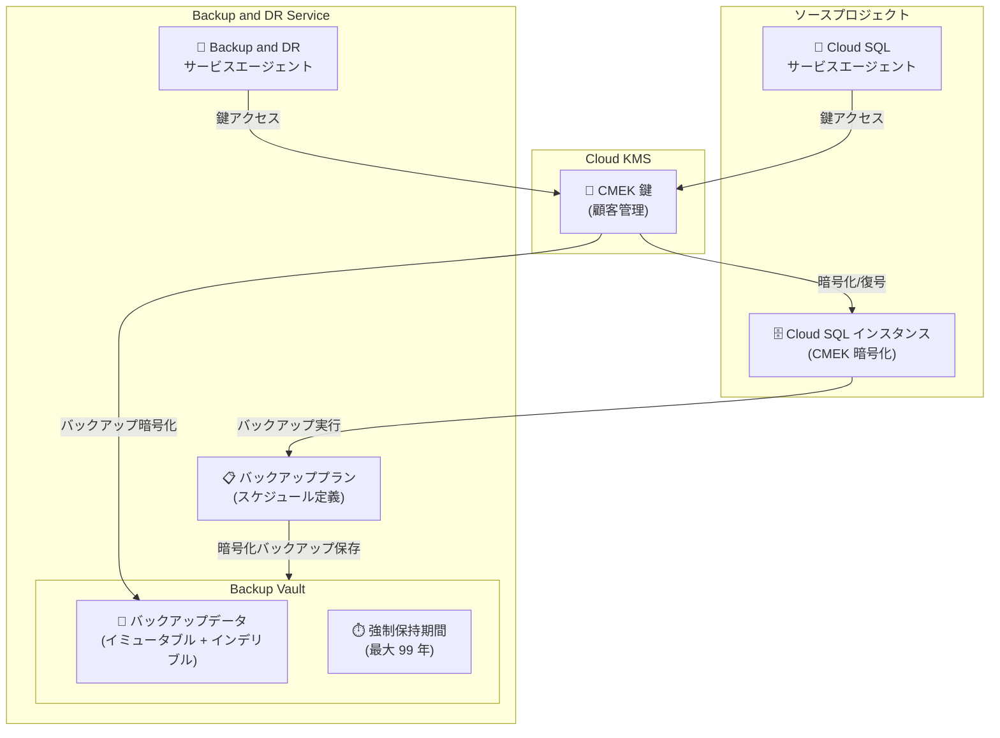

# Backup and DR: Cloud SQL CMEK インスタンスの Backup Vault サポートが GA

**リリース日**: 2026-06-18

**サービス**: Backup and DR Service

**機能**: Cloud SQL CMEK インスタンスの Backup Vault バックアップサポート

**ステータス**: GA (一般提供)

📊 [このアップデートのインフォグラフィックを見る](https://takech9203.github.io/google-cloud-news-summary/20260618-backup-dr-cloud-sql-cmek-backup-vault-ga.html)

## 概要

Google Cloud Backup and DR Service において、顧客管理暗号鍵 (CMEK) で暗号化された Cloud SQL インスタンスの Backup Vault へのバックアップサポートが一般提供 (GA) となった。これにより、CMEK で保護された Cloud SQL データベースのバックアップを、イミュータブル (不変) かつインデリブル (削除不可) なストレージに保存し、強制保持期間を適用できるようになった。

この機能は、規制要件やコンプライアンス要件でデータの暗号鍵を自社管理する必要がある企業にとって重要なアップデートである。金融機関、医療機関、政府機関など、厳格なデータ保護要件を持つ組織が、バックアップデータに対しても CMEK による暗号化と Backup Vault の不変性を同時に実現できる。

**アップデート前の課題**

- CMEK で暗号化された Cloud SQL インスタンスのバックアップを Backup Vault に保存する機能が Preview 段階であり、本番環境での利用に SLA が適用されなかった
- CMEK 暗号化された Cloud SQL バックアップを不変かつ削除不可のストレージに保存するには、追加の運用負荷が必要だった
- コンプライアンス要件を満たすバックアップ保護と顧客管理暗号鍵の両立が困難だった

**アップデート後の改善**

- CMEK で暗号化された Cloud SQL インスタンスを GA として Backup Vault にバックアップ可能になった
- バックアップデータのイミュータビリティ (不変性) とインデリビリティ (削除不可) が保証される
- 強制保持期間 (最大 99 年) の適用により、ランサムウェア攻撃や不正削除からバックアップを保護
- SLA の適用により、本番ワークロードでの利用が正式にサポートされた

## アーキテクチャ図



Cloud SQL インスタンスのソース CMEK 鍵がそのままバックアップの暗号化に使用される。Backup and DR サービスエージェントには Cloud KMS 鍵へのアクセス権限が必要となる。

## サービスアップデートの詳細

### 主要機能

1. **ソースレベル CMEK 暗号化の継承**
   - Cloud SQL バックアップは、ソースインスタンスの CMEK 鍵をそのまま使用して暗号化される
   - Backup Vault レベルの CMEK 鍵ではなく、元のデータベースインスタンスの鍵が使用される
   - 鍵の一貫性が保たれ、鍵管理が簡素化される

2. **イミュータブル・インデリブルストレージ**
   - Backup Vault に保存されたバックアップは変更不可 (イミュータブル)
   - 強制保持期間中は削除不可 (インデリブル)
   - 管理者であってもデータの改ざんや早期削除ができない

3. **強制保持期間 (Enforced Retention)**
   - Backup Vault 単位で最小保持期間を設定可能 (最大 99 年)
   - バックアッププランの保持期間は Vault の最小保持期間以上である必要がある
   - 保持期間経過後に自動削除される

4. **スケジュールバックアップとオンデマンドバックアップ**
   - 時間単位、日次、週次、月次、年次のスケジュール設定が可能
   - 必要に応じてオンデマンドバックアップも作成可能

## 技術仕様

### 暗号化の仕組み

| 項目 | 詳細 |
|------|------|
| 暗号化方式 | ソースインスタンスの CMEK 鍵を継承 |
| 鍵管理サービス | Cloud Key Management Service (Cloud KMS) |
| サービスエージェント | Backup and DR サービスエージェント + Cloud SQL サービスエージェント |
| 必要な IAM ロール | `roles/cloudkms.cryptoKeyEncrypterDecrypter` |
| 鍵のロケーション要件 | Backup Vault と同じリージョンの鍵を使用 |

### CMEK サポート状況 (ワークロード別)

| ワークロード | バックアップ暗号化鍵 | CMEK サポート |
|---|---|---|
| Compute Engine インスタンス | Backup Vault の CMEK 鍵 | サポート |
| Compute Engine ディスク | ソースディスクの暗号化鍵 | サポート |
| Cloud SQL | ソースインスタンスの暗号化鍵 | サポート (GA) |
| AlloyDB クラスタ | - | 非サポート |
| Filestore インスタンス | - | 非サポート |

### 鍵の無効化による影響

| 操作対象 | 影響 |
|---|---|
| Cloud SQL サービスエージェントから鍵アクセスを取り消し | ソースインスタンスが停止状態になる |
| Backup and DR サービスエージェントから鍵アクセスを取り消し | 新規バックアップ作成不可、既存バックアップ復元不可 |

## 設定方法

### 前提条件

1. Backup and DR Service API が有効化されていること
2. Cloud Key Management Service API が有効化されていること
3. CMEK で暗号化された Cloud SQL インスタンスが存在すること
4. Backup Vault が作成済みであること
5. バックアッププランが作成済みであること

### 手順

#### ステップ 1: Backup and DR サービスエージェントに CMEK 鍵へのアクセスを付与

```bash
# Backup and DR サービスエージェントに CryptoKey Encrypter/Decrypter ロールを付与
gcloud kms keys add-iam-policy-binding KEY_NAME \
  --location=KMS_LOCATION \
  --keyring=KEY_RING \
  --member=serviceAccount:service-VAULT_PROJECT_NUMBER@gcp-sa-backupdr.iam.gserviceaccount.com \
  --role=roles/cloudkms.cryptoKeyEncrypterDecrypter \
  --project=KMS_PROJECT_ID
```

Cloud SQL インスタンスの CMEK 鍵に対して、Backup and DR サービスエージェントにアクセス権限を付与する。

#### ステップ 2: Backup Vault サービスエージェントに Cloud SQL プロジェクトへのアクセスを付与

Google Cloud コンソールで以下を実施:
1. Backup Vaults ページに移動
2. 対象の Backup Vault を選択し、サービスエージェントのメールアドレスをコピー
3. IAM ページで以下のロールを付与:
   - `roles/backupdr.cloudSqlOperator` (BackupDR Cloud SQL Operator)
   - `roles/iam.serviceAccountUser` (Service Account User)

#### ステップ 3: バックアッププランを Cloud SQL インスタンスに適用

Google Cloud コンソールまたは gcloud CLI でバックアッププランを CMEK 暗号化された Cloud SQL インスタンスに適用する。

## メリット

### ビジネス面

- **コンプライアンス対応の強化**: 金融規制 (PCI DSS、SOX) や医療規制 (HIPAA) で求められる暗号鍵の自社管理とバックアップの不変性を同時に実現
- **ランサムウェア対策**: イミュータブルなバックアップにより、攻撃者によるバックアップの暗号化や削除を防止
- **監査対応の簡素化**: 鍵管理とバックアップ保持ポリシーを一元管理し、監査証跡を容易に提供可能

### 技術面

- **鍵管理の一貫性**: ソースインスタンスと同じ CMEK 鍵でバックアップを保護し、鍵のライフサイクルを統一管理
- **運用負荷の軽減**: スケジュールベースの自動バックアップと自動期限切れ削除により手動運用を最小化
- **復元時の柔軟性**: クロスリージョン復元時に異なる KMS 鍵を指定可能

## デメリット・制約事項

### 制限事項

- CMEK は Backup Vault 作成時にのみ設定可能 (既存の Vault への後付け不可)
- Cloud KMS 鍵は Backup Vault と同じロケーションに配置する必要がある
- クロスリージョンバックアップでは Backup Vault のリージョンと同じリージョンの鍵を使用する必要がある
- CSEK (顧客提供暗号鍵) はサポートされない
- AlloyDB、Filestore、VMware Engine などのワークロードでは CMEK バックアップ非サポート
- デフォルトの Backup Vault とバックアッププランは Google 管理暗号化を使用するため、CMEK を使用するには新規 Vault の作成が必要

### 考慮すべき点

- CMEK 鍵を無効化または破棄すると、その鍵で暗号化されたバックアップデータに永続的にアクセスできなくなる
- Backup and DR サービスエージェントと Cloud SQL サービスエージェントの両方に適切な IAM 権限を付与する必要がある
- 強制保持期間中はバックアップを削除できないため、ストレージコストが継続的に発生する

## ユースケース

### ユースケース 1: 金融機関のデータベースバックアップ保護

**シナリオ**: 金融機関が PCI DSS 準拠のために、顧客決済データを格納する Cloud SQL インスタンスのバックアップを、自社管理鍵で暗号化し、最低 7 年間の保持が必要

**実装例**:
```bash
# 1. Cloud KMS で鍵を作成
gcloud kms keys create payment-db-backup-key \
  --location=asia-northeast1 \
  --keyring=finance-keyring \
  --purpose=encryption

# 2. CMEK 有効化した Backup Vault を作成 (最小保持期間: 7 年)
# Google Cloud コンソールから作成し、暗号化タイプで CMEK を選択

# 3. バックアッププランを作成・適用
# 日次バックアップ + 7 年保持のプランを設定
```

**効果**: 規制要件を満たしつつ、ランサムウェアや内部不正からバックアップデータを保護

### ユースケース 2: ディザスタリカバリ対応

**シナリオ**: マルチリージョン構成の Cloud SQL インスタンスで、DR 要件としてバックアップの改ざん防止と迅速な復元を実現

**効果**: Backup Vault のイミュータビリティにより、DR シナリオにおいてバックアップの完全性が保証される。復元時には別リージョンの KMS 鍵を指定してクロスリージョンリストアが可能

## 料金

Backup and DR Service は月額使用量ベースの課金。CMEK 使用に対する追加料金は発生しないが、Cloud KMS の鍵使用料が別途課金される。

### 料金例

| 項目 | 料金 |
|------|------|
| CMEK バックアップ追加料金 | なし (Backup and DR の通常料金に含まれる) |
| Cloud KMS 鍵使用料 | Cloud KMS の料金体系に準拠 |
| Backup Vault ストレージ | [料金ページ参照](https://cloud.google.com/backup-disaster-recovery/pricing) |

詳細な料金情報は [Backup and DR Service 料金ページ](https://cloud.google.com/backup-disaster-recovery/pricing) および [Cloud KMS 料金ページ](https://cloud.google.com/kms/pricing) を参照。

## 利用可能リージョン

Backup Vault は大部分の Google Cloud リージョンおよびマルチリージョンで利用可能。CMEK 鍵は Backup Vault と同じロケーションに配置する必要がある。対応ロケーションの詳細は [Backup Vault のサポートロケーション](https://docs.cloud.google.com/backup-disaster-recovery/docs/concepts/backup-vault#locations) を参照。

## 関連サービス・機能

- **Cloud Key Management Service (Cloud KMS)**: CMEK 鍵の作成・管理・ローテーションを行うサービス
- **Cloud SQL**: バックアップ対象のマネージドデータベースサービス (MySQL, PostgreSQL, SQL Server)
- **Backup and DR Service**: バックアップの一元管理、スケジューリング、リストアを提供
- **IAM**: サービスエージェントへの権限付与に使用
- **Cloud Monitoring**: バックアップジョブの監視と通知に使用

## 参考リンク

- 📊 [インフォグラフィック](https://takech9203.github.io/google-cloud-news-summary/20260618-backup-dr-cloud-sql-cmek-backup-vault-ga.html)
- [公式リリースノート](https://docs.cloud.google.com/release-notes#June_18_2026)
- [Cloud SQL インスタンスを Backup Vault にバックアップする](https://docs.cloud.google.com/backup-disaster-recovery/docs/cloud-console/sql/csql-backup)
- [Backup and DR Service の CMEK 設定](https://docs.cloud.google.com/backup-disaster-recovery/docs/configuration/set-up-cmek)
- [Backup and DR Service の CMEK コンセプト](https://docs.cloud.google.com/backup-disaster-recovery/docs/concepts/cmek)
- [Cloud SQL の CMEK 設定](https://docs.cloud.google.com/sql/docs/mysql/configure-cmek)
- [Backup and DR Service 料金](https://cloud.google.com/backup-disaster-recovery/pricing)
- [Cloud KMS 料金](https://cloud.google.com/kms/pricing)

## まとめ

CMEK で暗号化された Cloud SQL インスタンスの Backup Vault サポートが GA となったことで、顧客管理暗号鍵によるデータ保護とイミュータブルバックアップの両立が本番環境で正式にサポートされた。規制要件やコンプライアンス要件が厳しい環境で Cloud SQL を運用している組織は、既存の CMEK 暗号化インスタンスに対して Backup Vault ベースのバックアッププランを適用し、データ保護体制を強化することを推奨する。

---

**タグ**: #BackupAndDR #CloudSQL #CMEK #BackupVault #セキュリティ #暗号化 #GA #データ保護 #コンプライアンス
