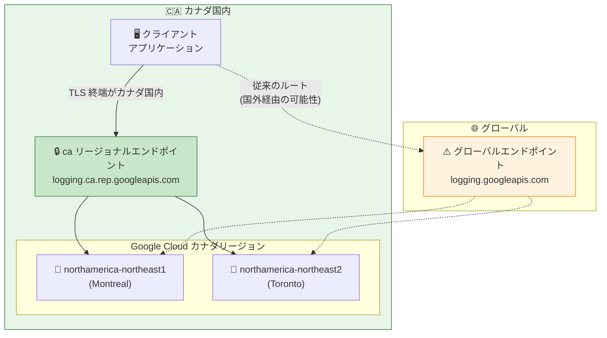

# Cloud Logging: "ca" (Canada) リージョナルエンドポイントの追加

**リリース日**: 2026-06-18

**サービス**: Cloud Logging

**機能**: Canada (ca) リージョナルエンドポイント対応

**ステータス**: GA (一般提供)

[このアップデートのインフォグラフィックを見る](https://takech9203.github.io/google-cloud-news-summary/20260618-cloud-logging-ca-regional-endpoint.html)

## 概要

Cloud Logging API に "ca" (Canada) リージョナルエンドポイントが追加された。これにより、カナダ国内の Google Cloud リージョン (northamerica-northeast1: Montreal、northamerica-northeast2: Toronto) に対する Logging API リクエストを、カナダ国内で完結させることが可能になる。

リージョナルエンドポイント `logging.ca.rep.googleapis.com` を使用することで、API リクエストのルーティングと TLS 終端がカナダ国内で行われ、データのインフライト (転送中) の居住性が確保される。これは PIPEDA (Personal Information Protection and Electronic Documents Act) をはじめとするカナダの個人情報保護規制への準拠を支援する重要なアップデートである。

このエンドポイントは、Cloud Logging が既に提供している "us" (米国)、"eu" (EU)、"in" (インド)、"sa" (サウジアラビア)、"ch" (スイス) といった国/地域別のマルチリージョナルエンドポイントに加わるものであり、Google Cloud のデータ主権対応の拡充を示している。

**アップデート前の課題**

- カナダのリージョン (northamerica-northeast1/northeast2) を使用していても、Logging API のリクエスト自体はグローバルエンドポイントを経由する場合があり、転送中のデータがカナダ国外を通過する可能性があった
- カナダの厳格なデータ居住性要件 (PIPEDA等) に対して、ログデータの転送経路まで含めた完全な準拠を証明することが困難だった
- 個別リージョンエンドポイント (logging.northamerica-northeast1.rep.googleapis.com) は存在したが、カナダ全体をカバーする統合的なエンドポイントがなかった

**アップデート後の改善**

- `logging.ca.rep.googleapis.com` を使用することで、northamerica-northeast1 と northamerica-northeast2 の両リージョンへのリクエストがカナダ国内で処理される
- Assured Workloads の Canada Data Boundary コントロールパッケージと組み合わせることで、保存時・使用時・転送時すべてのデータ居住性を確保可能
- PIPEDA や各州の個人情報保護法 (PHIPA等) への準拠がより容易になった

## アーキテクチャ図



"ca" リージョナルエンドポイントを使用すると、クライアントからの TLS 接続がカナダ国内で終端され、データの転送経路がカナダの法域内に制限される。グローバルエンドポイントを使用した場合は、リクエストが国外を経由する可能性がある。

## サービスアップデートの詳細

### 主要機能

1. **カナダ統合リージョナルエンドポイント**
   - エンドポイント: `logging.ca.rep.googleapis.com`
   - 対象リージョン: northamerica-northeast1 (Montreal) および northamerica-northeast2 (Toronto)
   - 形式: `logging.ca.rep.googleapis.com` (国コード "ca" を使用)

2. **転送中データの居住性確保**
   - TLS セッションがカナダ国内で終端される
   - Standard Tier ネットワーキングを使用し、カナダ最寄りのピアリングポイントからのみ IP アドレスがアナウンスされる
   - カナダ国内の ISP に接続しているユーザーのトラフィックは、カナダの法域内でルーティングされる

3. **既存のリージョン別エンドポイントとの併用**
   - 個別リージョンエンドポイント (`logging.northamerica-northeast1.rep.googleapis.com`) も引き続き利用可能
   - "ca" エンドポイントは両カナダリージョンを統合的にカバーする上位の選択肢

## 技術仕様

### Cloud Logging リージョナルエンドポイント一覧 (国/地域別マルチリージョン)

| エンドポイント | 対象法域 | 対象リージョン |
|------|------|------|
| `logging.ca.rep.googleapis.com` | カナダ | northamerica-northeast1, northamerica-northeast2 |
| `logging.us.rep.googleapis.com` | 米国 | us-central1, us-east1, us-east4, us-east5, us-south1, us-west1, us-west2, us-west3, us-west4 |
| `logging.eu.rep.googleapis.com` | EU | europe-central2, europe-north1, europe-southwest1, europe-west1, europe-west3, europe-west4, europe-west8, europe-west9, europe-west10 |
| `logging.in.rep.googleapis.com` | インド | asia-south1, asia-south2 |
| `logging.sa.rep.googleapis.com` | サウジアラビア | me-central2 |
| `logging.ch.rep.googleapis.com` | スイス | europe-west6 |

### エンドポイントの形式

```
logging.LOCATION.rep.googleapis.com
```

- `LOCATION`: リージョン名 (例: `northamerica-northeast1`) または国/地域コード (例: `ca`)

## 設定方法

### 前提条件

1. Google Cloud プロジェクトで Cloud Logging API が有効化されていること
2. 対象リソースがカナダリージョン (northamerica-northeast1 または northamerica-northeast2) に存在すること

### 手順

#### ステップ 1: gcloud CLI でリージョナルエンドポイントを使用

```bash
# リージョナルエンドポイントを指定して Logging API を呼び出す
gcloud logging read "severity>=WARNING" \
  --project=MY_PROJECT \
  --billing-project=MY_PROJECT \
  --api-endpoint=https://logging.ca.rep.googleapis.com
```

#### ステップ 2: クライアントライブラリでの設定 (Python)

```python
from google.cloud import logging_v2

# カナダリージョナルエンドポイントを指定
client = logging_v2.LoggingServiceV2Client(
    client_options={
        "api_endpoint": "logging.ca.rep.googleapis.com"
    }
)
```

#### ステップ 3: VPC ネットワーク内からのアクセス (Private Service Connect)

```bash
# VPC 内からリージョナルエンドポイントにアクセスする場合は
# Private Service Connect エンドポイントの作成が推奨される
gcloud compute forwarding-rules create logging-ca-endpoint \
  --region=northamerica-northeast1 \
  --network=MY_VPC \
  --address=RESERVED_IP \
  --target-google-apis-bundle=logging.ca.rep.googleapis.com
```

VPC Service Controls と併用する場合や Private Google Access を使用する場合は、証明書エラーを防ぐために Private Service Connect エンドポイントの作成が必要となる。

## メリット

### ビジネス面

- **規制準拠の簡素化**: PIPEDA や各州の個人情報保護法 (PHIPA、PIPA等) への準拠において、ログデータの転送経路に関するリスクを軽減
- **カナダ国内顧客への信頼性向上**: データがカナダ国外に出ないことを技術的に保証することで、顧客やステークホルダーへの説明が容易に
- **Assured Workloads との統合**: Canada Data Boundary コントロールパッケージと組み合わせることで、包括的なデータ主権ソリューションを構築可能

### 技術面

- **レイテンシの最適化**: カナダ国内でのルーティングにより、カナダ拠点のアプリケーションからの API レスポンス時間が安定
- **統合エンドポイント**: 2 つのカナダリージョンを 1 つのエンドポイントでカバーし、設定の簡素化を実現
- **VPC Service Controls との連携**: リージョナルエンドポイントと VPC Service Controls を組み合わせることで、多層的なセキュリティを実現

## デメリット・制約事項

### 制限事項

- リージョナルエンドポイントは、そのエンドポイントが対象とするリージョン内のリソースにのみアクセス可能。他のリージョンのログにはアクセスできない
- ログエントリの書き込み (write) はリージョン制限の対象外。ログが失われないよう、書き込みリクエストは指定されたログバケットにルーティングされる
- VPC ネットワーク内からリージョナルエンドポイントにアクセスする場合、Private Service Connect エンドポイントの作成が必要

### 考慮すべき点

- グローバルエンドポイントからの移行時は、既存のクライアント設定を変更する必要がある
- Apigee などの他サービスと連携する場合、各サービスのリージョナルエンドポイント設定も合わせて変更が必要 (例: MessageLogging ポリシーの `<Endpoint>` 要素)

## ユースケース

### ユースケース 1: 金融機関のコンプライアンス対応

**シナリオ**: カナダの金融機関が OSFI (Office of the Superintendent of Financial Institutions) のガイドラインに基づき、すべての運用データをカナダ国内に保持する必要がある。

**実装例**:
```bash
# Assured Workloads で Canada Data Boundary フォルダを作成
gcloud assured workloads create \
  --organization=ORG_ID \
  --location=northamerica-northeast1 \
  --compliance-regime=CA_DATA_BOUNDARY \
  --display-name="Finance-Logging"

# リージョナルエンドポイントを使用した Logging 設定
gcloud logging settings update \
  --organization=ORG_ID \
  --storage-location=northamerica-northeast1
```

**効果**: ログの保存、転送、処理のすべてがカナダ国内で完結し、規制準拠を技術的に証明可能。

### ユースケース 2: ヘルスケア企業の PHI データ保護

**シナリオ**: オンタリオ州で事業を行うヘルスケア企業が、PHIPA に基づき患者の個人健康情報を含むログをカナダ国内に保持する必要がある。

**効果**: `logging.ca.rep.googleapis.com` エンドポイントを使用することで、アプリケーションログに含まれる可能性のある PHI データが転送中もカナダ国内に留まることを保証。

## 料金

Cloud Logging のリージョナルエンドポイント利用に追加料金は発生しない。通常の Cloud Logging 料金が適用される。

| 項目 | 料金 | 無料枠 |
|------|------|--------|
| ログストレージ (取り込み) | $0.50/GiB | 50 GiB/プロジェクト/月 |
| ログ保持 (30日超) | $0.01/GiB/月 | デフォルト保持期間内は無料 |
| Log Router | 追加料金なし | - |
| Log Analytics | 追加料金なし | - |

## 利用可能リージョン

"ca" リージョナルエンドポイントは以下のカナダリージョンをカバーする:

| リージョン | ロケーション | エンドポイント |
|------|------|------|
| northamerica-northeast1 | Montreal, Quebec | `logging.ca.rep.googleapis.com` |
| northamerica-northeast2 | Toronto, Ontario | `logging.ca.rep.googleapis.com` |

個別リージョンエンドポイントも利用可能:
- `logging.northamerica-northeast1.rep.googleapis.com`
- `logging.northamerica-northeast2.rep.googleapis.com`

## 関連サービス・機能

- **Assured Workloads (Canada Data Boundary)**: カナダのデータ居住性要件に対応する包括的なコントロールパッケージ。リソースロケーション制約により northamerica-northeast1/northeast2 のみにリソース作成を制限
- **Cloud KMS**: 同様に "ca" リージョナルエンドポイント (`cloudkms.ca.rep.googleapis.com`) を提供しており、暗号鍵管理もカナダ国内で完結可能
- **VPC Service Controls**: リージョナルエンドポイントと組み合わせることで、データの流出防止と転送中の居住性を同時に実現
- **Cloud Monitoring**: ログベースメトリクスやアラートと連携。ただし Cloud Monitoring には現時点で "ca" エンドポイントは確認されていない

## 参考リンク

- [公式リリースノート](https://docs.cloud.google.com/release-notes#June_18_2026)
- [Cloud Logging API リファレンス](https://docs.cloud.google.com/logging/docs/reference/api-overview)
- [リージョナルサービスエンドポイント一覧](https://docs.cloud.google.com/vpc/docs/regional-service-endpoints)
- [Assured Workloads - Canada Data Boundary](https://docs.cloud.google.com/assured-workloads/docs/control-packages/canada-data-boundary)
- [PIPEDA コンプライアンス](https://cloud.google.com/security/compliance/pipeda-canada)
- [Cloud Logging 料金](https://cloud.google.com/stackdriver/pricing)

## まとめ

Cloud Logging API への "ca" リージョナルエンドポイントの追加は、カナダにおけるデータ主権要件への対応を強化する重要なアップデートである。PIPEDA をはじめとするカナダの個人情報保護規制に準拠する必要がある組織は、既存の Logging 設定を `logging.ca.rep.googleapis.com` に切り替えることで、ログデータの転送経路をカナダ国内に制限できる。Assured Workloads の Canada Data Boundary と組み合わせることで、保存時・使用時・転送時すべてにおけるデータ居住性を確保することを推奨する。

---

**タグ**: #CloudLogging #RegionalEndpoints #Canada #DataResidency #PIPEDA #Compliance #Observability
