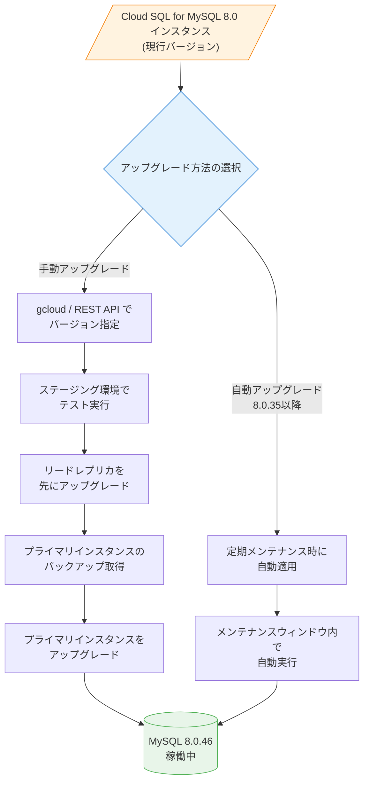

# Cloud SQL for MySQL: マイナーバージョン 8.0.46 サポート開始

**リリース日**: 2026-06-18

**サービス**: Cloud SQL for MySQL

**機能**: MySQL 8.0.46 マイナーバージョンサポート

**ステータス**: GA (一般提供)

📊 [このアップデートのインフォグラフィックを見る](https://takech9203.github.io/google-cloud-news-summary/20260618-cloud-sql-mysql-8-0-46.html)

## 概要

Cloud SQL for MySQL が MySQL 8.0.46 マイナーバージョンのサポートを開始した。MySQL 8.0.46 は MySQL コミュニティにより 2026 年 4 月 21 日にリリースされたバージョンであり、セキュリティ修正、バグ修正、パフォーマンス改善を含む。既存の Cloud SQL for MySQL 8.0 インスタンスを手動でアップグレードすることが可能になった。

Cloud SQL のマイナーバージョンサポートポリシーに基づき、データベースエンジン開発コミュニティによる一般提供リリースから 3 か月以内に新しいマイナーバージョンがサポートされる。MySQL 8.0.46 は 2026 年 4 月 21 日にリリースされ、Cloud SQL では 2026 年 6 月 18 日からサポートが開始された。

**アップデート前の課題**

- Cloud SQL for MySQL 8.0 インスタンスで 8.0.46 に含まれるバグ修正やセキュリティパッチを利用できなかった
- InnoDB の FTS インデックス構築時のメモリ使用量が最適化されていなかった
- OpenSSL 3.5.5 へのアップデートによるセキュリティ強化が適用されていなかった
- SQL パーサーが大きな IN 句を含むクエリで大量のメモリを消費する問題があった

**アップデート後の改善**

- MySQL 8.0.46 の全バグ修正とセキュリティパッチが利用可能になった
- InnoDB の大規模テーブルに対する FTS インデックス構築時のメモリ使用量が最適化された
- OpenSSL 3.5.5 へのアップデートにより最新のセキュリティ修正が適用された
- SQL パーサーのメモリ管理が改善され、大規模クエリの処理効率が向上した

## アーキテクチャ図



Cloud SQL for MySQL 8.0 インスタンスを 8.0.46 にアップグレードする際のフローを示す。手動アップグレードではステージング環境でのテストとレプリカの事前アップグレードが推奨され、自動アップグレード (8.0.35 以降) ではメンテナンスウィンドウ内で自動的に適用される。

## サービスアップデートの詳細

### 主要機能

1. **MySQL 8.0.46 で修正されたバグとセキュリティ改善**
   - 監査ログ: gzip ファイル処理の問題を修正し、通常の .gz ファイルを正しく処理可能に
   - コンパイル: 同梱 zlib ライブラリを 1.3.2 にアップグレード
   - パッケージング: OpenSSL ライブラリを 3.5.5 にアップデート

2. **InnoDB の改善**
   - 大規模テーブルの FTS (全文検索) インデックス構築時のメモリ使用量を最適化
   - マルチバリューインデックスの問題を修正
   - パラレルリーダーの問題を修正
   - undo テーブルスペースの truncate 操作に関する問題を修正
   - `CREATE INDEX` で `--innodb_parallel_read_threads` を高い値に設定した場合のディスク容量枯渇問題を修正

3. **オプティマイザの改善**
   - プリペアド DELETE/UPDATE ステートメントの最適化問題を修正
   - セミジョインのマテリアライゼーション使用時に不正な結果を返す問題を修正
   - const テーブルと先行結合テーブルの条件が範囲推定に一貫して反映されない問題を修正
   - EXPLAIN 拡張クエリでジョイン順序ヒントが正しい構文で出力されない問題を修正

4. **SQL パーサーの改善**
   - 大量の IN 句を含む非常に大きなクエリをパースする際のメモリ消費を改善

## 技術仕様

### サポートされるバージョン

| 項目 | 詳細 |
|------|------|
| 新規サポートバージョン | MySQL 8.0.46 |
| MySQL コミュニティリリース日 | 2026-04-21 |
| Cloud SQL サポート開始日 | 2026-06-18 |
| 現在のデフォルトバージョン | MySQL 8.0.44 |
| 自動アップグレード対象 | 8.0.35 以降のインスタンス |
| ダウングレード | 不可 (MySQL 8.0 はダウングレード非対応) |

### Cloud SQL エディションとダウンタイム

| エディション | マイナーバージョンアップグレード時のダウンタイム |
|------|------|
| Cloud SQL Enterprise | 再起動に伴うダウンタイムが発生 |
| Cloud SQL Enterprise Plus | ほぼゼロダウンタイム (サブ秒) |

## 設定方法

### 前提条件

1. Cloud SQL for MySQL 8.0 インスタンスが稼働していること
2. 対象バージョン (8.0.46) が現在のインストール済みバージョンより新しいこと
3. Cloud SQL Admin API が有効であること

### 手順

#### ステップ 1: アップグレード可能なバージョンの確認

```bash
gcloud sql instances describe INSTANCE_NAME
```

出力の `upgradableDatabaseVersions` セクションに `MYSQL_8_0_46` が含まれていることを確認する。

#### ステップ 2: ステージング環境でのテスト

```bash
# 本番インスタンスのクローンを作成
gcloud sql instances clone INSTANCE_NAME STAGING_INSTANCE_NAME

# ステージングインスタンスをアップグレード
gcloud sql instances patch STAGING_INSTANCE_NAME \
  --database-version=MYSQL_8_0_46
```

ワークロードテストを実行し、アプリケーションが期待通りに動作することを確認する。

#### ステップ 3: リードレプリカのアップグレード

```bash
# リードレプリカを先にアップグレード
gcloud sql instances patch REPLICA_INSTANCE_NAME \
  --database-version=MYSQL_8_0_46
```

#### ステップ 4: プライマリインスタンスのバックアップとアップグレード

```bash
# バックアップの作成
gcloud sql backups create --instance=INSTANCE_NAME

# プライマリインスタンスのアップグレード
gcloud sql instances patch INSTANCE_NAME \
  --database-version=MYSQL_8_0_46
```

#### 自動アップグレードの有効化 (8.0.35 以降)

```bash
# 自動マイナーバージョンアップグレードを有効化
gcloud sql instances patch INSTANCE_NAME \
  --enable-database-replication
```

注意: 一度有効化すると無効化はできない。

## メリット

### ビジネス面

- **セキュリティリスクの低減**: OpenSSL 3.5.5 および各種バグ修正により、既知の脆弱性に対する防御が強化される
- **運用の安定性向上**: InnoDB やオプティマイザのバグ修正により、予期しないエラーやパフォーマンス劣化のリスクが低減される

### 技術面

- **メモリ効率の改善**: FTS インデックス構築や SQL パーサーのメモリ管理が改善され、大規模ワークロードでのリソース使用量が最適化される
- **クエリ正確性の向上**: オプティマイザのセミジョインマテリアライゼーションの修正により、不正な結果が返される問題が解消される
- **Enterprise Plus でのほぼゼロダウンタイムアップグレード**: Enterprise Plus エディションを利用している場合、サブ秒のダウンタイムでアップグレードが完了する

## デメリット・制約事項

### 制限事項

- MySQL 8.0 はダウングレードに対応していないため、一度アップグレードすると以前のバージョンに戻すことはできない
- マイナーバージョンアップグレード中はディスクサイズやメモリの同時変更ができない
- 自動マイナーバージョンアップグレードは 8.0.35 以降のインスタンスでのみ有効化可能

### 考慮すべき点

- 本番環境でのアップグレード前に必ずステージング環境でワークロードテストを実施すること
- Cloud SQL Enterprise エディションではインスタンス再起動に伴うダウンタイムが発生する
- リードレプリカがある場合はプライマリインスタンスより先にアップグレードする必要がある
- アップグレード後にアプリケーションの動作確認を行うこと

## ユースケース

### ユースケース 1: 大量データの全文検索を行うアプリケーション

**シナリオ**: 大規模テーブルに対して FTS (全文検索) インデックスを構築・更新するアプリケーションで、インデックス構築時のメモリ消費が問題になっている場合。

**効果**: MySQL 8.0.46 の InnoDB FTS インデックス構築のメモリ最適化により、大規模テーブルのインデックス構築時のメモリ使用量が削減され、OOM (Out of Memory) のリスクが低減される。

### ユースケース 2: 複雑な分析クエリを実行するデータパイプライン

**シナリオ**: 大量の IN 句や複雑なサブクエリを含む分析クエリを定期実行しているバッチ処理で、メモリ消費やクエリ結果の正確性が懸念される場合。

**効果**: SQL パーサーのメモリ管理改善とオプティマイザのバグ修正により、大規模クエリの安定した実行と正確な結果取得が期待できる。

## 料金

マイナーバージョンアップグレード自体に追加料金は発生しない。Cloud SQL の料金はエディション、マシンタイプ、ストレージに基づいて算出される。

### 料金例

| 項目 | 料金 |
|------|------|
| Cloud SQL Enterprise (vCPU) | $0.0413/vCPU/時間〜 |
| Cloud SQL Enterprise Plus (vCPU) | $0.05369/vCPU/時間〜 |
| Cloud SQL Enterprise (メモリ) | $0.007/GB/時間〜 |
| Cloud SQL Enterprise Plus (メモリ) | $0.0091/GB/時間〜 |
| SSD ストレージ | $0.17/GB/月 |

## 利用可能リージョン

Cloud SQL for MySQL 8.0.46 は Cloud SQL がサポートする全リージョンで利用可能。

## 関連サービス・機能

- **Cloud SQL Enterprise Plus edition**: ほぼゼロダウンタイムでのマイナーバージョンアップグレードを提供
- **Cloud Monitoring**: アップグレード前後のインスタンスパフォーマンスの監視に活用
- **Cloud SQL Auth Proxy**: Enterprise Plus のほぼゼロダウンタイム機能を利用する場合、最新バージョンへの更新が必要
- **Database Migration Service (DMS)**: 大規模なバージョンアップグレードやマイグレーションシナリオで活用

## 参考リンク

- 📊 [インフォグラフィック](https://takech9203.github.io/google-cloud-news-summary/20260618-cloud-sql-mysql-8-0-46.html)
- [公式リリースノート](https://docs.cloud.google.com/release-notes#June_18_2026)
- [マイナーバージョンアップグレード手順](https://docs.cloud.google.com/sql/docs/mysql/upgrade-minor-db-version#manual-upgrade)
- [Cloud SQL for MySQL データベースバージョンポリシー](https://docs.cloud.google.com/sql/docs/mysql/db-versions)
- [MySQL 8.0.46 リリースノート](https://dev.mysql.com/doc/relnotes/mysql/8.0/en/news-8-0-46.html)
- [Cloud SQL 料金ページ](https://cloud.google.com/sql/pricing)
- [Cloud SQL Enterprise Plus edition](https://docs.cloud.google.com/sql/docs/mysql/editions-intro)

## まとめ

Cloud SQL for MySQL が MySQL 8.0.46 をサポート開始したことで、InnoDB のメモリ最適化、オプティマイザのバグ修正、OpenSSL 3.5.5 へのアップデートといった重要な改善が利用可能になった。本番環境への適用前にステージング環境でのテストを実施し、Enterprise Plus エディションを利用している場合はほぼゼロダウンタイムでのアップグレードが可能である点を活用すること。MySQL 8.0 はダウングレードに対応していないため、慎重なテスト計画を立てた上でアップグレードを実施することを推奨する。

---

**タグ**: #CloudSQL #MySQL #データベース #マイナーバージョンアップグレード #セキュリティ #InnoDB #パフォーマンス
